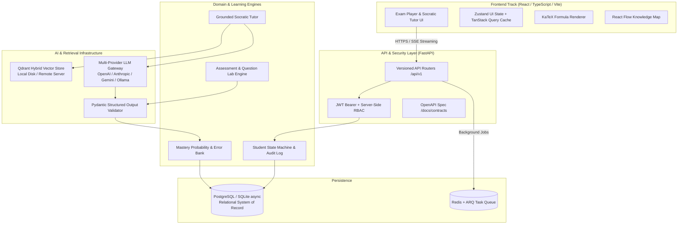
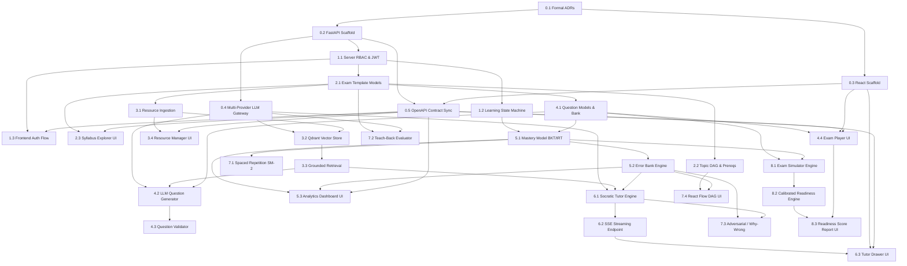

# Master Roadmap & Work Breakdown Structure (WBS)
## AI-Powered Adaptive Exam Learning Platform

**Document Version:** 1.0  
**Created Date:** 2026-08-20  
**Planning Status:** APPROVED FOR STAGE 1  
**Architecture:** FastAPI Modular Monolith (Python 3.11+) + React 18+ (TypeScript / Vite / Tailwind / Shadcn UI)

---

## 1. Planning Context

| Property | Value |
| :--- | :--- |
| **Project** | AI-Powered Adaptive Exam Learning Platform |
| **Primary Goal** | Transform exam preparation from passive LLM chat into a structured, measurable, personalized, adaptive learning process. |
| **Learning Focus** | Production-grade software architecture, AI/RAG systems, Item Response Theory, type-safe API contracts, and real-world student UX. |
| **Target Roles** | Student (Learner), Content / Exam Administrator, System Administrator |
| **Core Architecture** | FastAPI Backend + React/TS Frontend + PostgreSQL/SQLite Relational Store + Qdrant Vector Store + Redis/ARQ Async Queue + Multi-Provider LLM Gateway |
| **Execution Track** | Two-Developer Contract-First Track (Backend Lead & Frontend Developer) |

---

## 2. User Answers and Inferred Assumptions

### Confirmed by User
* **3-Phase Scope Strategy:** Approved. Phase 1 (Core MVP Slice) → Phase 2 (Adaptive Revision & Deep Modes) → Phase 3 (Readiness Simulation & Blueprint Reverse Engineering).
* **Multi-Provider LLM Gateway:** Mandatory multi-vendor abstraction (OpenAI, Anthropic, Gemini, Ollama) with dynamic fallbacks; zero vendor lock-in.
* **Vector Store & Windows Ergonomics:** Move away from Pinecone latency and avoid Windows C++ compilation friction with `pgvector` by using **Qdrant** (embedded local disk mode for dev/test, seamless remote URL for production).
* **Async Task Queue:** **Redis + ARQ / Taskiq** chosen over Celery to avoid Windows multiprocessing/fork crashes and ensure native `asyncio` compatibility.
* **Frontend Ecosystem:** React 18+ / Vite / TypeScript with Tailwind CSS, Shadcn UI, KaTeX math rendering, and React Flow knowledge maps.
* **Architecture Rigor:** Full CS Domain Learning deep-dives (Stage 3) for algorithmic and architectural epics.

### Verified from Codebase
* `AI_Adaptive_Exam_Learning_Platform_PRD_SRS.md` defines 20 product capabilities and 10 non-negotiable architectural constraints.
* Clean initial state in `backend/` and `frontend/` directories ready for scaffolding.
* Decision registers established in `docs/adr/`, `docs/frontend_design/`, and `docs/team/`.

---

## 3. Scope Decision (MoSCoW Prioritization)

```markdown
| Priority | Capability / Feature Area | PRD Ref | Phase |
| :--- | :--- | :--- | :--- |
| **Must Have** | Exam Template Engine & Curriculum DAG | Cap 2 | Phase 1 |
| **Must Have** | Student Mastery Model & Isolated State Machine | Cap 3, §13 | Phase 1 |
| **Must Have** | Question Laboratory & Strict Schema Assessment Engine | Cap 4, 15 | Phase 1 |
| **Must Have** | Resource / Past Paper Ingestion & Hybrid RAG Retrieval | Cap 5, 8 | Phase 1 |
| **Must Have** | Source-Grounded Socratic AI Tutor (SSE Streaming) | Cap 8, 10 | Phase 1 |
| **Must Have** | Error Bank & Misconception Log | Cap 6 | Phase 1 |
| **Must Have** | Distraction-Free Exam Player & KaTeX Math Rendering | §17, FDR-005 | Phase 1 |
| **Should Have** | Adaptive Spaced Repetition (SM-2 / FSRS) Revision | Cap 7 | Phase 2 |
| **Should Have** | Teach-Back Mode & Rubric Evaluator | Cap 17 | Phase 2 |
| **Should Have** | Adversarial Tutor & Why-You-Are-Wrong Diagnostic Modes | Cap 18, 19 | Phase 2 |
| **Should Have** | Dynamic Knowledge Map & Misconception DAG (React Flow) | Cap 12, 13 | Phase 2 |
| **Could Have** | Exam Readiness Simulator & Calibrated Probability Engine | Cap 9, 20 | Phase 3 |
| **Could Have** | Exam Blueprint Reverse Engineering from Past Papers | Cap 14 | Phase 3 |
| **Could Have** | Multimodal Generation (Audio/Visual Explanations) | Cap 16 | Phase 3 |
| **Could Have** | Personal Learning Twin & Predictive Analytics | Cap 11 | Phase 3 |
| **Won't Have** | WhatsApp / Third-Party Chatbot Integrations | §3.2 | Out of Scope |
| **Won't Have** | Direct unvalidated LLM state mutations | PRD Const #1 | Forbidden |
```

---

## 4. Platform Architecture & Data Flow



---

## 5. Master Roadmap Milestones

| Milestone | Epic | Target Outcome | Key Capabilities |
| :--- | :--- | :--- | :--- |
| **M0** | **Epic 0** | Architecture Foundation & Two-Track Setup | ADRs, FastAPI base, React base, Multi-Provider LLM Gateway |
| **M1** | **Epic 1** | Identity, RBAC & Student Learning State Machine | Auth, per-student isolated state, auditable state machine |
| **M2** | **Epic 2** | Exam Template & Curriculum DAG Engine | Exam definitions, topics, subtopics, prerequisites |
| **M3** | **Epic 3** | Resource Ingestion & Grounded Vector RAG | PDF/text chunking, Qdrant hybrid search, citations |
| **M4** | **Epic 4** | Question Laboratory & Assessment Engine | Multi-type question generation, validation, exam player UI |
| **M5** | **Epic 5** | Mastery Model & Error Bank Diagnostics | Mastery score calculation, misconception diagnosis, dashboard |
| **M6** | **Epic 6** | Source-Grounded Socratic Tutor | Real-time SSE streaming tutor, LaTeX math, grounding badges |
| **M7** | **Epic 7** | Adaptive Spaced Revision & Deep Learning Modes | Spaced repetition, Teach-Back, Adversarial, React Flow DAG |
| **M8** | **Epic 8** | Exam Readiness Simulator & Advanced Intelligence | Full blueprint simulation, calibrated readiness score |

---

## 6. Detailed Work Breakdown Structure (WBS)

### Epic 0: Project Architecture Foundations & Environment Setup

#### Task 0.1: Formal Decision Records Codification `[SHARED]`
* **Goal:** Formalize and accept `ADR-000` through `ADR-008` and `FDR-001` through `FDR-005` in accordance with `AGENTS.md`.
* **Main concept learned:** Architecture Decision Records (ADRs), non-functional requirement trade-offs, and governance.
* **Why this comes here:** Zero technology can be introduced without accepted ADRs.
* **Depends on:** None
* **Estimated time:** 45 mins | **Difficulty:** Beginner
* **Acceptance criteria:**
  - [ ] `docs/adr/ADR-000-mvp-capability-slice.md` created and accepted.
  - [ ] `docs/adr/ADR-001` through `ADR-008` generated and indexed.
  - [ ] `.agents/state/decisions.md` updated with accepted summaries.
* **Verification idea:** Inspect `docs/adr/ADR-INDEX.md` to ensure no active dependency remains in `PENDING`.
* **Next lifecycle skill:** `concept-to-code-bridge`

#### Task 0.2: FastAPI Modular Monolith Scaffold & Async Database Engine `[BACKEND]`
* **Goal:** Create clean FastAPI project structure with async SQLAlchemy/SQLModel database engine supporting dual-mode (PostgreSQL / SQLite).
* **Main concept learned:** Async database session lifecycles, dependency injection in FastAPI, and 12-factor application settings (`pydantic-settings`).
* **Why this comes here:** Backend foundation required for all domain models and endpoints.
* **Depends on:** Task 0.1
* **Estimated time:** 60 mins | **Difficulty:** Intermediate
* **Acceptance criteria:**
  - [ ] `backend/` directory structured into `core/`, `models/`, `api/`, `services/`, `repositories/`.
  - [ ] Async DB session dependency (`get_db`) working with connection pooling.
  - [ ] Health check endpoint (`/healthz` and `/api/v1/health`) returning DB status.
  - [ ] Pytest test harness configured with async SQLite in-memory fixtures.
* **Verification idea:** Run `pytest backend/tests/test_health.py` and verify HTTP 200 response.
* **Next lifecycle skill:** `concept-to-code-bridge`

#### Task 0.3: React + Vite + TypeScript + Tailwind + Shadcn UI Workspace Scaffold `[FRONTEND]`
* **Goal:** Initialize high-performance React 18+ TypeScript application with Tailwind CSS, typography design tokens, and base Shadcn UI components.
* **Main concept learned:** Modern Vite build pipeline, Tailwind semantic token configuration, and Radix UI accessible primitives.
* **Why this comes here:** Establishes the frontend canvas and visual foundations.
* **Depends on:** Task 0.1
* **Estimated time:** 60 mins | **Difficulty:** Intermediate
* **Acceptance criteria:**
  - [ ] `frontend/` initialized with Vite, TypeScript strict mode, Tailwind CSS.
  - [ ] Semantic typography and color tokens configured from `DESIGN_SYSTEM_TYPOGRAPHY.md`.
  - [ ] Core UI primitives installed (Button, Card, Badge, Dialog, Drawer, Tooltip).
  - [ ] KaTeX CSS imported and verified for equation rendering.
  - [ ] Clean build via `npm run build` with zero TypeScript errors.
* **Verification idea:** Execute `npm run build` and `npm run test` in `frontend/`.
* **Next lifecycle skill:** `concept-to-code-bridge`

#### Task 0.4: Multi-Provider LLM Gateway & Pydantic Validation Engine `[BACKEND]`
* **Goal:** Implement an async, multi-provider LLM gateway protocol supporting OpenAI, Anthropic, Gemini, and local Ollama with dynamic fallback and Pydantic schema validation.
* **Main concept learned:** Provider abstraction pattern, async streaming interfaces, structured output enforcement, and resilient retry/fallback mechanics.
* **Why this comes here:** Enforces PRD Constraint #10 (zero provider lock-in) before building tutor and question engines.
* **Depends on:** Task 0.2
* **Estimated time:** 90 mins | **Difficulty:** Advanced
* **Acceptance criteria:**
  - [ ] `LLMProviderBase` abstract protocol defined with `generate_text`, `generate_structured`, and `stream_text`.
  - [ ] Concrete adapters for Google Gemini, OpenAI, Anthropic, and Ollama.
  - [ ] Fallback orchestrator that retries on secondary providers upon rate-limit/failure.
  - [ ] Pydantic output validation ensuring 100% adherence before returning structured objects.
  - [ ] Unit tests with mocked provider responses verifying fallback routing.
* **Verification idea:** Run `pytest backend/tests/test_llm_gateway.py`.
* **Next lifecycle skill:** `concept-to-code-bridge`

#### Task 0.5: OpenAPI Contract Generation & TypeScript Sync Protocol `[SHARED]`
* **Goal:** Establish automated OpenAPI schema export from FastAPI and TypeScript type generation script for the frontend.
* **Main concept learned:** Contract-First API development, automated type generation (`openapi-typescript`), and schema drift prevention.
* **Why this comes here:** Enables seamless parallel development between Backend Lead and Frontend Developer.
* **Depends on:** Task 0.2, Task 0.3
* **Estimated time:** 45 mins | **Difficulty:** Beginner
* **Acceptance criteria:**
  - [ ] FastAPI script to export `openapi.json` into `docs/contracts/schemas/`.
  - [ ] Frontend npm script (`npm run codegen:api`) generating TypeScript types from `openapi.json`.
  - [ ] Mock Service Worker (MSW) base setup configured with generated types.
* **Verification idea:** Run backend export script, then run frontend codegen, and verify `frontend/src/api/schema.ts` is generated cleanly.
* **Next lifecycle skill:** `concept-to-code-bridge`

---

### Epic 1: Identity, RBAC & Student Learning State Machine

#### Task 1.1: Server-Side RBAC, User Models & JWT Auth Service `[BACKEND]`
* **Goal:** Implement secure user registration, login, JWT token issuance with Argon2 hashing, and role-based access control (Student, Content Admin, System Admin).
* **Main concept learned:** Password hashing security, JWT claim lifecycles, and FastAPI security dependencies (`Security(get_current_user)`).
* **Why this comes here:** Mandatory for student state isolation (PRD Constraint #2, #6).
* **Depends on:** Task 0.2
* **Estimated time:** 75 mins | **Difficulty:** Intermediate
* **Acceptance criteria:**
  - [ ] `User` and `Role` SQLModel entities.
  - [ ] `/api/v1/auth/register`, `/api/v1/auth/login`, and `/api/v1/auth/me` endpoints.
  - [ ] Server-side RBAC dependency `@require_role(["student", "content_admin", "sys_admin"])`.
  - [ ] Pytest test suite covering valid/invalid logins and unauthorized role access.
* **Verification idea:** Run `pytest backend/tests/test_auth.py`.
* **Next lifecycle skill:** `concept-to-code-bridge`

#### Task 1.2: Student Learning State Machine & Auditable Event Log `[BACKEND]`
* **Goal:** Implement the formal Student Learning State Machine (PRD §13, FR-001, FR-025) governing valid learning transitions with an immutable audit trail.
* **Main concept learned:** Finite State Machines (FSM), domain event logging, ACID consistency, and state transition validation.
* **Why this comes here:** Enforces PRD Constraint #3 (learning-state transitions must be valid, application-enforced, and auditable).
* **Depends on:** Task 1.1
* **Estimated time:** 90 mins | **Difficulty:** Advanced
* **Acceptance criteria:**
  - [ ] `StudentLearningState` and `StateTransitionLog` database models.
  - [ ] State Machine service enforcing legal transitions (`DIAGNOSING` → `TEACHING` → `PRACTICING` → `REPAIRING` → `EVALUATING` → `MASTERED`).
  - [ ] Automatic rejection and logging of illegal transitions.
  - [ ] Complete unit test suite verifying all valid and invalid state transitions.
* **Verification idea:** Run `pytest backend/tests/test_state_machine.py`.
* **Next lifecycle skill:** `concept-to-code-bridge`

#### Task 1.3: Auth Flow, Route Guards & User Profile State `[FRONTEND]`
* **Goal:** Build login/register screens, JWT session storage in memory/httpOnly cookies, and role-aware route guards in React.
* **Main concept learned:** Client-side route protection, session hydration, and auth state management with Zustand.
* **Why this comes here:** Connects frontend users to the backend authentication system.
* **Depends on:** Task 0.5, Task 1.1
* **Estimated time:** 60 mins | **Difficulty:** Intermediate
* **Acceptance criteria:**
  - [ ] Login and Register form components with client-side validation (`react-hook-form` + `zod`).
  - [ ] Protected route wrapper `<RequireAuth allowedRoles={['student']} />`.
  - [ ] Auth store maintaining token, current user profile, and logout cleanup.
* **Verification idea:** Test interactive login flow and verify unauthenticated redirects.
* **Next lifecycle skill:** `concept-to-code-bridge`

---

### Epic 2: Exam Template & Curriculum DAG Engine (PRD Cap 2)

#### Task 2.1: Exam Template Data Models & Syllabus Parser `[BACKEND]`
* **Goal:** Create SQLModel entities and schemas for Exam Templates, Subjects, Sections, Topics, Subtopics, and Learning Objectives (PRD §5.1, §8).
* **Main concept learned:** Hierarchical relational modeling, JSON schema validation, and syllabus taxonomy structures.
* **Why this comes here:** Curricular backbone required before assessment and tutoring engines can function.
* **Depends on:** Task 1.1
* **Estimated time:** 75 mins | **Difficulty:** Intermediate
* **Acceptance criteria:**
  - [ ] `ExamTemplate`, `Subject`, `Topic`, `Subtopic`, `LearningObjective` models.
  - [ ] CRUD endpoints for Exam Templates (`/api/v1/exam-templates`).
  - [ ] JSON/YAML syllabus import parser with schema validation.
  - [ ] Tests verifying template creation and hierarchical topic retrieval.
* **Verification idea:** Run `pytest backend/tests/test_exam_templates.py`.
* **Next lifecycle skill:** `concept-to-code-bridge`

#### Task 2.2: Topic DAG & Prerequisite Validation Engine `[BACKEND]`
* **Goal:** Implement Directed Acyclic Graph (DAG) validation to ensure topic prerequisite graphs contain zero circular dependencies and compute topological learning order.
* **Main concept learned:** Graph algorithms (Tarjan's/Kahn's Topological Sort, Cycle Detection) and prerequisite graph traversals.
* **Why this comes here:** Guarantees students learn foundational prerequisites before advanced topics.
* **Depends on:** Task 2.1
* **Estimated time:** 75 mins | **Difficulty:** Advanced
* **Acceptance criteria:**
  - [ ] Prerequisite edge relationship model `TopicPrerequisite`.
  - [ ] DAG validation service detecting circular dependency errors.
  - [ ] Service method computing next unlocked topics based on student mastery set.
  - [ ] Unit tests with complex diamond and cyclic graphs.
* **Verification idea:** Run `pytest backend/tests/test_topic_dag.py`.
* **Next lifecycle skill:** `concept-to-code-bridge`

#### Task 2.3: Exam Template Catalog & Syllabus Tree Explorer `[FRONTEND]`
* **Goal:** Build responsive UI for browsing exam templates, selecting active target exam, and exploring interactive topic/syllabus tree.
* **Main concept learned:** Recursive tree components, accessible accordions, and active exam context switching.
* **Why this comes here:** Allows students to select their exam and navigate their syllabus visually.
* **Depends on:** Task 0.5, Task 2.1
* **Estimated time:** 60 mins | **Difficulty:** Intermediate
* **Acceptance criteria:**
  - [ ] Exam catalog grid with search and difficulty filters.
  - [ ] Collapsible topic/subtopic tree explorer with prerequisite unlock badges.
  - [ ] TanStack Query hooks fetching exam templates and topics.
* **Verification idea:** Render syllabus tree and verify smooth expanding/collapsing.
* **Next lifecycle skill:** `concept-to-code-bridge`

---

### Epic 3: Resource Ingestion & Vector RAG Engine (PRD Cap 5, 8)

#### Task 3.1: Document Ingestion Pipeline & Text Chunking Engine `[BACKEND]`
* **Goal:** Implement secure document upload (PDF, Text, Markdown) with content extraction, sanitization, and syllabus-aligned semantic chunking (PRD FR-005, NFR-005).
* **Main concept learned:** Untrusted file processing, text chunking heuristics (sliding window with overlap), and metadata provenance tagging.
* **Why this comes here:** Prepares raw textbooks and notes for semantic indexing.
* **Depends on:** Task 2.1
* **Estimated time:** 90 mins | **Difficulty:** Intermediate
* **Acceptance criteria:**
  - [ ] File upload endpoint `/api/v1/resources/upload` with strict MIME/size validation.
  - [ ] PDF and Markdown text extraction service.
  - [ ] Semantic chunker producing `ResourceChunk` records with topic/page/paragraph metadata.
  - [ ] Unit tests verifying chunk size boundaries and metadata preservation.
* **Verification idea:** Run `pytest backend/tests/test_resource_ingestion.py`.
* **Next lifecycle skill:** `concept-to-code-bridge`

#### Task 3.2: Qdrant Vector Store Adapter & Hybrid Indexer `[BACKEND]`
* **Goal:** Build the Qdrant vector store adapter supporting dense embeddings and payload filtering (`exam_template_id`, `topic_id`, `is_authoritative`).
* **Main concept learned:** Vector embeddings, cosine similarity search, payload index filtering, and dual-mode (local disk vs remote) vector databases.
* **Why this comes here:** Powers semantic retrieval for grounded tutoring and question generation.
* **Depends on:** Task 0.4, Task 3.1
* **Estimated time:** 90 mins | **Difficulty:** Advanced
* **Acceptance criteria:**
  - [ ] `QdrantVectorStore` adapter implementing `VectorStoreBase`.
  - [ ] Local disk mode persistence in `./data/vector_db` for zero-friction local development.
  - [ ] Embedding generation integration with LiteLLM / provider gateway.
  - [ ] Upsert and similarity search methods with strict metadata payload filters.
  - [ ] Tests verifying vector search accuracy and payload filtering isolation.
* **Verification idea:** Run `pytest backend/tests/test_vector_store.py`.
* **Next lifecycle skill:** `concept-to-code-bridge`

#### Task 3.3: Grounded Retrieval & Source Provenance Formatter `[BACKEND]`
* **Goal:** Build the retrieval pipeline that fetches authoritative syllabus passages with strict provenance citations for prompt injection.
* **Main concept learned:** RAG prompt orchestration, context stuffing boundaries, citation tagging, and relevance threshold filtering.
* **Why this comes here:** Enforces PRD Constraint #5 (source-grounded answers must use retrieval before generation).
* **Depends on:** Task 3.2
* **Estimated time:** 60 mins | **Difficulty:** Intermediate
* **Acceptance criteria:**
  - [ ] Retrieval service taking query + topic context and returning top-K ranked chunks.
  - [ ] Provenance citation formatter (e.g. `[Doc: Physics Syllabus, §4.2, p. 12]`).
  - [ ] Confidence threshold filter rejecting out-of-domain / irrelevant retrieval.
* **Verification idea:** Run `pytest backend/tests/test_grounded_retrieval.py`.
* **Next lifecycle skill:** `concept-to-code-bridge`

#### Task 3.4: Resource Manager & Document Viewer `[FRONTEND]`
* **Goal:** Build Content Admin resource upload interface and student document reference viewer.
* **Main concept learned:** File upload dropzones with progress indicators and tabbed reference drawers.
* **Why this comes here:** Allows uploading authoritative textbooks and viewing citations in the UI.
* **Depends on:** Task 0.5, Task 3.1
* **Estimated time:** 60 mins | **Difficulty:** Intermediate
* **Acceptance criteria:**
  - [ ] Drag-and-drop file uploader with upload progress and status badges.
  - [ ] Resource list table with topic tagging and chunk status.
* **Verification idea:** Test file upload flow and status polling.
* **Next lifecycle skill:** `concept-to-code-bridge`

---

### Epic 4: Question Laboratory & High-Quality Assessment Engine (PRD Cap 4, 15)

#### Task 4.1: Question Bank Schema & Multi-Type Data Models `[BACKEND]`
* **Goal:** Create comprehensive data models for Questions (MCQ, Multi-Select, Numeric with Tolerance, Short Answer), Options, Distractor Rationales, and Hints (PRD §10).
* **Main concept learned:** Polymorphic question types, mathematical notation storage, and distractor misconception tagging.
* **Why this comes here:** Core assessment foundation needed before question generation and exam sessions.
* **Depends on:** Task 2.1
* **Estimated time:** 75 mins | **Difficulty:** Intermediate
* **Acceptance criteria:**
  - [ ] `Question`, `QuestionOption`, `QuestionExplanation`, `QuestionTag` models.
  - [ ] Strict scoring evaluation logic for each question type (exact match, numerical tolerance $\pm \epsilon$, multi-select subsets).
  - [ ] CRUD endpoints for questions with role checks (`content_admin` or automated generator).
* **Verification idea:** Run `pytest backend/tests/test_question_models.py`.
* **Next lifecycle skill:** `concept-to-code-bridge`

#### Task 4.2: LLM Question & Distractor Generator with Pydantic Validation `[BACKEND]`
* **Goal:** Implement AI-powered question generator creating high-quality exam questions with realistic distractors mapped to common misconceptions, validated via Pydantic V2 schemas (PRD FR-004, FR-010).
* **Main concept learned:** Few-shot prompt engineering, structured JSON output validation, distractor plausibility modeling, and deterministic temperature settings.
* **Why this comes here:** Powers the Question Laboratory (Cap 15) with strict quality guardrails.
* **Depends on:** Task 0.4, Task 3.3, Task 4.1
* **Estimated time:** 90 mins | **Difficulty:** Advanced
* **Acceptance criteria:**
  - [ ] Pydantic schema `GeneratedQuestionSchema` with stem, options, correct answer index, detailed explanation, and distractor misconceptions.
  - [ ] Generator service leveraging grounded RAG context for curriculum alignment.
  - [ ] Automatic retry logic if LLM output fails schema validation.
  - [ ] Tests verifying generated question structure and schema compliance.
* **Verification idea:** Run `pytest backend/tests/test_question_generator.py`.
* **Next lifecycle skill:** `concept-to-code-bridge`

#### Task 4.3: Question Quality, Solvability & Duplication Validator `[BACKEND]`
* **Goal:** Implement pre-deployment validation pipeline verifying generated questions for clarity, solvability, answer ambiguity, and duplicate detection (PRD Constraint #4, FR-015).
* **Main concept learned:** Multi-agent validation loops, semantic similarity deduplication, and automated quality scoring.
* **Why this comes here:** Enforces PRD Constraint #4 (generated questions must be validated before student use).
* **Depends on:** Task 4.2
* **Estimated time:** 90 mins | **Difficulty:** Advanced
* **Acceptance criteria:**
  - [ ] Multi-step validation pipeline (Solvability check, Single unambiguous answer verification, Semantic duplicate check).
  - [ ] Quality score threshold ($Q \ge 0.85$) required before question status changes to `APPROVED`.
  - [ ] Unapproved questions flagged for review or discarded automatically.
* **Verification idea:** Run `pytest backend/tests/test_question_validator.py`.
* **Next lifecycle skill:** `concept-to-code-bridge`

#### Task 4.4: Interactive Exam Taking Player with KaTeX & Timed Session `[FRONTEND]`
* **Goal:** Build the distraction-free Exam Taking Player with split-pane layout, countdown timer, keyboard shortcuts (A-D, 1-4), KaTeX math rendering, and question grid navigation.
* **Main concept learned:** Complex UI state management for timed exam sessions, keyboard accessibility, LaTeX formula rendering, and optimistic answer recording.
* **Why this comes here:** Primary student interface for practicing questions and taking assessments.
* **Depends on:** Task 0.3, Task 0.5, Task 4.1
* **Estimated time:** 90 mins | **Difficulty:** Advanced
* **Acceptance criteria:**
  - [ ] Split-pane layout matching `DESIGN_SYSTEM_TYPOGRAPHY.md` specifications.
  - [ ] Real-time countdown timer with Amber/Red warning alerts.
  - [ ] KaTeX math rendering in question stems, options, and explanations.
  - [ ] Keyboard navigation (`A/B/C/D`, `Arrow Left/Right`, `Flag for review`).
  - [ ] Collapsible question grid drawer showing answered, flagged, and unvisited states.
* **Verification idea:** Test interactive exam simulation with keyboard shortcuts and timer.
* **Next lifecycle skill:** `concept-to-code-bridge`

---

### Epic 5: Student Mastery Model & Error Bank (PRD Cap 3, 6)

#### Task 5.1: Mastery Probability & Difficulty Calibration Engine `[BACKEND]`
* **Goal:** Implement the Student Mastery calculation engine computing topic mastery probabilities and difficulty adaptations using Bayesian Knowledge Tracing (BKT) / Item Response Theory (IRT) principles (PRD Cap 3).
* **Main concept learned:** Mastery estimation algorithms, Bayesian belief updates ($P(L_t | \text{obs})$), slip/guess parameters, and topic mastery thresholds.
* **Why this comes here:** Core intelligence determining what the student knows and what to teach next.
* **Depends on:** Task 1.2, Task 4.1
* **Estimated time:** 90 mins | **Difficulty:** Advanced
* **Acceptance criteria:**
  - [ ] `StudentTopicMastery` SQLModel tracking mastery probability $\in [0.0, 1.0]$, attempt counts, and streak.
  - [ ] Mastery update service updating probability on each attempt using BKT/IRT formulas.
  - [ ] Mastery status transitions (`NOVICE`, `PRACTICING`, `PROFICIENT`, `MASTERED`).
  - [ ] Unit tests verifying mathematical correctness of mastery transitions across consecutive correct/incorrect answers.
* **Verification idea:** Run `pytest backend/tests/test_mastery_model.py`.
* **Next lifecycle skill:** `concept-to-code-bridge`

#### Task 5.2: Error Bank & Misconception Diagnosis Engine `[BACKEND]`
* **Goal:** Implement the Error Bank capturing student mistakes, classifying error types (Conceptual, Calculation, Misread), and mapping them to specific misconceptions (PRD Cap 6, §12).
* **Main concept learned:** Diagnostic classification, error taxonomy modeling, and mistake remediation tracking.
* **Why this comes here:** Ensures mistakes are converted into targeted learning opportunities.
* **Depends on:** Task 5.1
* **Estimated time:** 75 mins | **Difficulty:** Intermediate
* **Acceptance criteria:**
  - [ ] `StudentErrorLog` and `Misconception` models.
  - [ ] Automatic mistake logging upon incorrect question submission with distractor rationale capture.
  - [ ] Endpoint `/api/v1/student/error-bank` with filtering by topic, status (active/repaired), and frequency.
  - [ ] Error resolution tracker when student demonstrates subsequent mastery.
* **Verification idea:** Run `pytest backend/tests/test_error_bank.py`.
* **Next lifecycle skill:** `concept-to-code-bridge`

#### Task 5.3: Student Analytics Dashboard, Mastery Radar & Error Bank UI `[FRONTEND]`
* **Goal:** Build the student home analytics dashboard displaying overall syllabus progress, topic mastery cards with semantic color badges, and the interactive Error Bank review list.
* **Main concept learned:** Data visualization in React (charts, progress rings, radar maps), filtering, and review drawers.
* **Why this comes here:** Gives students instant visual feedback on strengths, weaknesses, and mistakes.
* **Depends on:** Task 0.5, Task 5.1, Task 5.2
* **Estimated time:** 75 mins | **Difficulty:** Intermediate
* **Acceptance criteria:**
  - [ ] Mastery overview cards with Emerald/Amber/Rose status indicators.
  - [ ] Error Bank table with "Retry Mistake" and "Ask Socratic Tutor" action triggers.
  - [ ] Topic filter dropdown and syllabus completion progress bar.
* **Verification idea:** Render dashboard with mock data and verify visual hierarchy and responsiveness.
* **Next lifecycle skill:** `concept-to-code-bridge`

---

### Epic 6: Source-Grounded Socratic AI Tutor (PRD Cap 8, 10)

#### Task 6.1: Socratic Tutor Orchestrator with Retrieval Augmentation `[BACKEND]`
* **Goal:** Implement the Socratic Tutor engine that guides students step-by-step through questions and misconceptions using curriculum-grounded retrieval without giving away answers directly (PRD Cap 8, §14).
* **Main concept learned:** Socratic pedagogical prompting, guardrails against direct solution leakage, dialogue state management, and source-grounded context injection.
* **Why this comes here:** Delivers the core grounded conversational tutoring experience.
* **Depends on:** Task 0.4, Task 3.3, Task 5.2
* **Estimated time:** 90 mins | **Difficulty:** Advanced
* **Acceptance criteria:**
  - [ ] Socratic prompt template enforcing inquiry-based guidance and syllabus constraints.
  - [ ] Dialogue orchestrator pulling current question, student's latest error, and retrieved textbook passages.
  - [ ] Guardrails preventing the LLM from outputting direct answers to uncompleted assessments.
  - [ ] Unit tests verifying grounding citations and pedagogical constraint adherence.
* **Verification idea:** Run `pytest backend/tests/test_socratic_tutor.py`.
* **Next lifecycle skill:** `concept-to-code-bridge`

#### Task 6.2: Server-Sent Events (SSE) Streaming Tutor Endpoint `[BACKEND]`
* **Goal:** Build real-time SSE streaming endpoint (`/api/v1/tutor/chat/stream`) delivering incremental tokens, formatted citations, and thought accordions to the client.
* **Main concept learned:** HTTP Server-Sent Events (SSE), async generators in FastAPI (`StreamingResponse`), and structured event streaming protocols.
* **Why this comes here:** Provides ultra-low latency interactive dialogue for students.
* **Depends on:** Task 6.1
* **Estimated time:** 75 mins | **Difficulty:** Intermediate
* **Acceptance criteria:**
  - [ ] FastAPI streaming endpoint yielding structured SSE frames (`event: token`, `event: citation`, `event: done`).
  - [ ] Proper error handling and connection teardown on client disconnect.
  - [ ] Async integration test verifying SSE stream delivery.
* **Verification idea:** Run `pytest backend/tests/test_tutor_streaming.py`.
* **Next lifecycle skill:** `concept-to-code-bridge`

#### Task 6.3: Socratic Tutor Slide-over Drawer with Live Math & Streaming `[FRONTEND]`
* **Goal:** Build the Socratic Tutor slide-over drawer in React with real-time SSE token streaming, markdown/LaTeX formatting, thought accordion, and clickable citation pills.
* **Main concept learned:** Streaming fetch / EventSource handling in React, auto-scrolling chat lists, and rendering live streaming LaTeX formulas without flickering.
* **Why this comes here:** Primary interactive tutoring interface accessible from anywhere in the application.
* **Depends on:** Task 0.3, Task 0.5, Task 6.2
* **Estimated time:** 90 mins | **Difficulty:** Advanced
* **Acceptance criteria:**
  - [ ] Slide-over drawer opening alongside active questions or Error Bank items.
  - [ ] Real-time token streaming with smooth rendering and auto-scroll.
  - [ ] KaTeX equations rendered cleanly inside tutor bubbles.
  - [ ] Clickable citation pills opening the authoritative textbook excerpt drawer.
* **Verification idea:** Simulate streaming dialogue and verify formula rendering and citation clicks.
* **Next lifecycle skill:** `concept-to-code-bridge`

---

### Epic 7: Adaptive Spaced Revision & Deep Learning Modes (Phase 2 - PRD Cap 7, 17, 18, 19)

#### Task 7.1: Spaced Repetition Scheduling Engine (SM-2 / FSRS) `[BACKEND]`
* **Goal:** Implement adaptive revision scheduling using spaced repetition algorithms (SuperMemo SM-2 / FSRS) based on student recall confidence and attempt history (PRD Cap 7).
* **Main concept learned:** Forgetting curve mathematics ($R = e^{-t/S}$), optimal review interval calculation, and background revision queues.
* **Why this comes here:** Automates memory consolidation and prevents syllabus decay before exams.
* **Depends on:** Task 5.1
* **Estimated time:** 75 mins | **Difficulty:** Intermediate
* **Acceptance criteria:**
  - [ ] `RevisionSchedule` model tracking stability, difficulty, repetitions, and next review date.
  - [ ] Algorithm computing next review interval based on quality response (0–5).
  - [ ] Endpoint `/api/v1/student/revision-queue` returning daily due items.
* **Verification idea:** Run `pytest backend/tests/test_spaced_repetition.py`.
* **Next lifecycle skill:** `concept-to-code-bridge`

#### Task 7.2: Teach-Back Mode & Rubric Evaluator Engine `[BACKEND]`
* **Goal:** Implement Teach-Back mode where the student explains a concept to the AI, and the engine evaluates explanation completeness, accuracy, and missing prerequisites against a rubric (PRD Cap 17).
* **Main concept learned:** Rubric-based LLM grading, factual completeness checking, and Feynman technique learning workflows.
* **Why this comes here:** Delivers active recall and deep conceptual verification.
* **Depends on:** Task 0.4, Task 2.1
* **Estimated time:** 90 mins | **Difficulty:** Advanced
* **Acceptance criteria:**
  - [ ] Teach-Back rubric evaluation prompt and Pydantic validation schema.
  - [ ] Rubric scoring engine returning strengths, misconceptions, and prerequisite gaps.
  - [ ] Endpoint `/api/v1/modes/teach-back/evaluate`.
* **Verification idea:** Run `pytest backend/tests/test_teach_back.py`.
* **Next lifecycle skill:** `concept-to-code-bridge`

#### Task 7.3: Adversarial Tutor & Why-You-Are-Wrong Modes `[BACKEND]`
* **Goal:** Implement Adversarial Tutor (challenging student reasoning with edge cases) and Why-You-Are-Wrong mode (breaking down precise logical fallacies in incorrect student answers) (PRD Cap 18, 19).
* **Main concept learned:** Counterfactual reasoning prompts, edge-case generation, and fallacy breakdown mechanisms.
* **Why this comes here:** Fortifies deep conceptual understanding and high-difficulty exam readiness.
* **Depends on:** Task 5.2, Task 6.1
* **Estimated time:** 90 mins | **Difficulty:** Advanced
* **Acceptance criteria:**
  - [ ] Adversarial counter-argument generator challenging student assumptions.
  - [ ] Why-You-Are-Wrong diagnostic service generating step-by-step flaw analysis.
  - [ ] Tests verifying diagnostic accuracy on standard textbook fallacy cases.
* **Verification idea:** Run `pytest backend/tests/test_advanced_modes.py`.
* **Next lifecycle skill:** `concept-to-code-bridge`

#### Task 7.4: Interactive Misconception DAG Visualizer (React Flow) `[FRONTEND]`
* **Goal:** Build interactive node-link graph using React Flow displaying topics, prerequisite links, and active misconception clusters with interactive diagnostic drill-downs.
* **Main concept learned:** Graph canvas rendering (`@xyflow/react`), custom node/edge styling, and force-directed/hierarchical graph layouts (Dagre/Elk).
* **Why this comes here:** Visually exposes the student's cognitive map and prerequisite blockers.
* **Depends on:** Task 0.3, Task 2.2, Task 5.2
* **Estimated time:** 90 mins | **Difficulty:** Advanced
* **Acceptance criteria:**
  - [ ] Interactive React Flow canvas rendering topic prerequisite graph.
  - [ ] Color-coded nodes (Green = Mastered, Amber = Learning, Red = Active Misconception).
  - [ ] Clicking a node opens topic details, related mistakes, and revision actions.
* **Verification idea:** Render complex DAG on canvas and test zoom, pan, and node click interactions.
* **Next lifecycle skill:** `concept-to-code-bridge`

---

### Epic 8: Exam Readiness Simulator & Predictive Analytics (Phase 3 - PRD Cap 9, 14, 20)

#### Task 8.1: Full Exam Simulation & Blueprint Weighting Engine `[BACKEND]`
* **Goal:** Implement full-length timed exam simulation matching exact exam blueprint weights, section timings, and question distribution (PRD Cap 14, 20).
* **Main concept learned:** Blueprint constraint satisfaction algorithms, timed session state machines, and randomized stratified question sampling.
* **Why this comes here:** Simulates authentic high-stakes examination conditions.
* **Depends on:** Task 4.1, Task 5.1
* **Estimated time:** 90 mins | **Difficulty:** Advanced
* **Acceptance criteria:**
  - [ ] Exam Blueprint configuration schema (Topic weightings, section limits, mandatory questions).
  - [ ] Simulation generator assembling full exam papers matching blueprint distribution.
  - [ ] Timed exam submission and auto-grading orchestrator.
* **Verification idea:** Run `pytest backend/tests/test_exam_simulation.py`.
* **Next lifecycle skill:** `concept-to-code-bridge`

#### Task 8.2: Calibrated Exam Readiness Score Engine `[BACKEND]`
* **Goal:** Calculate composite Exam Readiness Score based on topic coverage, mastery probability, revision recency, and simulated exam performance (PRD FR-020, NFR-008).
* **Main concept learned:** Composite score calibration, explainable readiness modeling, and confidence interval estimation.
* **Why this comes here:** Enforces PRD Constraint #9 (readiness calculations must be explainable and auditable).
* **Depends on:** Task 8.1
* **Estimated time:** 75 mins | **Difficulty:** Intermediate
* **Acceptance criteria:**
  - [ ] Multi-factor readiness formula weighting Mastery (40%), Syllabus Coverage (30%), Spaced Retention (15%), and Simulation Score (15%).
  - [ ] Factor breakdown report explaining exactly why a student received their readiness score.
  - [ ] Clear disclaimer adhering to PRD §3.2 (no absolute guarantee of external exam outcome).
* **Verification idea:** Run `pytest backend/tests/test_readiness_score.py`.
* **Next lifecycle skill:** `concept-to-code-bridge`

#### Task 8.3: Exam Readiness Simulation & Score Report UI `[FRONTEND]`
* **Goal:** Build full-screen Mock Exam simulation interface and post-exam comprehensive Readiness Report with topic breakdown charts.
* **Main concept learned:** Full-screen kiosk-style exam UI, section timers, and multi-dimensional result report views.
* **Why this comes here:** Final capstone user experience showing comprehensive student preparedness.
* **Depends on:** Task 4.4, Task 8.2
* **Estimated time:** 90 mins | **Difficulty:** Advanced
* **Acceptance criteria:**
  - [ ] Mock Exam interface with section navigation and timed auto-submission.
  - [ ] Comprehensive readiness score card with radar chart breakdown across subjects.
  - [ ] Actionable remediation recommendations list linked to Error Bank and Tutor.
* **Verification idea:** Complete a mock exam in the UI and verify generated readiness report.
* **Next lifecycle skill:** `concept-to-code-bridge`

---

## 7. Dependency Map



---

## 8. Task Readiness Matrix

| Task ID | Track | Task Title | Ready? | Blockers | Next Skill |
| :--- | :--- | :--- | :--- | :--- | :--- |
| **0.1** | **Shared** | Formal Decision Records Codification (ADR-000 to ADR-008) | **YES** | None | `adr-generator` |
| **0.2** | **Backend** | FastAPI Scaffold & Async Database Engine | **NO** | Needs 0.1 | `concept-to-code-bridge` |
| **0.3** | **Frontend** | React + Vite + TS + Tailwind + Shadcn Workspace Scaffold | **NO** | Needs 0.1 | `concept-to-code-bridge` |
| **0.4** | **Backend** | Multi-Provider LLM Gateway & Pydantic Validation Engine | **NO** | Needs 0.2 | `concept-to-code-bridge` |
| **0.5** | **Shared** | OpenAPI Contract Generation & TypeScript Sync Protocol | **NO** | Needs 0.2, 0.3 | `concept-to-code-bridge` |
| **1.1** | **Backend** | Server-Side RBAC, User Models & JWT Auth Service | **NO** | Needs 0.2 | `concept-to-code-bridge` |
| **1.2** | **Backend** | Student Learning State Machine & Auditable Event Log | **NO** | Needs 1.1 | `concept-to-code-bridge` |
| **1.3** | **Frontend** | Auth Flow, Route Guards & User Profile State | **NO** | Needs 0.5, 1.1 | `concept-to-code-bridge` |

---

## 9. Recommended First Task

**Start with:** **Task 0.1: Formal Decision Records Codification `[SHARED]`**  
* **Why:** In strict accordance with `AGENTS.md` (§1.2, §18), no code, package, or architecture pattern can be introduced without accepted formal ADRs in `docs/adr/`. Codifying ADR-000 through ADR-008 unlocks both Backend (Task 0.2) and Frontend (Task 0.3) tracks immediately.
* **What happens next:** Generate `ADR-000-mvp-capability-slice.md` through `ADR-008` in `docs/adr/` using `adr-generator`, present to user for formal acceptance, then proceed to Task 0.2 and 0.3 implementation.
