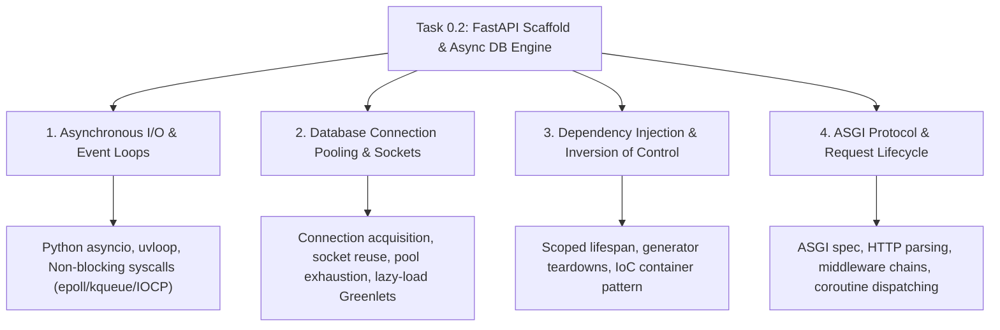

# Task 0.2 CS Domain Learning Artifact: First-Principles Architecture & Async Internals

**Document Version:** 1.0  
**WBS Task:** Task 0.2 — FastAPI Modular Monolith Scaffold & Async Database Engine (SQLModel + AsyncPG/SQLite)  
**Epic:** Epic 0 — Project Architecture Foundations & Environment Setup  
**Track:** Backend Track (Lead & Backend Developer)  
**Stage:** Stage 3 (CS Domain Extraction)  

---

## 1. Domain Discovery Map

Task 0.2 establishes the foundational application scaffold and persistence engine. This touches four primary Computer Science domains:



*Note: Visual concept map rendered above using Mermaid.*

---

## 2. Domain Deep Dives

### Domain 1: Asynchronous I/O & Event Loops (`asyncio`)

#### What Is It (Plain English)
In a traditional synchronous server, every time your code waits for the database to return data, the CPU thread sits idle doing nothing. In an asynchronous event loop architecture, whenever a coroutine pauses to wait for network I/O (like a database query or an LLM API response), it immediately yields control back to the central event loop. The single CPU thread can then process dozens or hundreds of other student requests while the database query is in transit.

#### Physical Analogy
* **Synchronous:** A chef cooks an omelet by standing completely still staring at the frying pan until the eggs are done, refusing to chop onions, pour juice, or take orders from other customers.
* **Asynchronous:** The chef puts the eggs in the pan, sets a timer on the countertop (subscribes to a socket event), immediately turns around to chop vegetables for another customer, and returns to the pan the millisecond the timer rings.

#### How It Works Under the Hood
At the OS level, `asyncio` uses non-blocking socket file descriptors and OS multiplexing system calls (`epoll` on Linux, `kqueue` on macOS, `IOCP` on Windows):

| Layer | What Happens Under the Hood | OS / Hardware Resource |
| :--- | :--- | :--- |
| **Application Coroutine** | `await db.exec(select(User))` executes | Python bytecode frame suspends |
| **Driver (`asyncpg` / `aiosqlite`)** | Writes SQL bytes to the OS socket buffer | TCP Send Buffer |
| **Event Loop (`uvloop` / `asyncio`)** | Registers socket FD with OS multiplexer | `epoll_ctl` / `IOCP` Completion Port |
| **OS Kernel** | Detects database response packet over TCP network | Network Interface Card (NIC) & Interrupt |
| **Event Loop Resumption** | Wakes up suspended coroutine and passes query result | Python Call Stack resumes |

#### Where It Manifests in This Codebase
* `backend/app/core/database.py`: `create_async_engine()`, `async def get_db() -> AsyncGenerator[AsyncSession, None]`
* `backend/app/api/v1/endpoints/health.py`: `async def get_health(...)`

#### Common Misconceptions
1. ❌ *"Async makes CPU-bound math calculations faster."*  
   ✅ **Reality:** Async only speeds up **I/O-bound** operations (waiting for network, disk, DB). Heavy CPU calculations block the single event loop thread unless offloaded to a thread pool or process worker.
2. ❌ *"Adding `async def` automatically makes any function non-blocking."*  
   ✅ **Reality:** If you call a synchronous library (like standard `requests.get()` or `time.sleep()`) inside an `async def` function, it will block the entire server! You must use async libraries (`httpx`, `asyncio.sleep`, `asyncpg`).
3. ❌ *"Async means multi-threading."*  
   ✅ **Reality:** Async in Python runs on a **single OS thread** cooperatively yielding execution via coroutines.

---

### Domain 2: Database Connection Pooling & Socket Lifecycles

#### What Is It (Plain English)
Establishing a new TCP and TLS connection to PostgreSQL requires a 3-way TCP handshake, authentication exchange, and memory allocation on the database server—which takes 20–50 milliseconds. A **Connection Pool** maintains a warm set of pre-opened database connections. When a request arrives, it borrows an existing connection from the pool, executes its query in 1 millisecond, and immediately returns the connection to the pool for another request to use.

#### Physical Analogy
* **No Pool:** Every time a student wants to read a book, the library builds a brand-new reading room from bricks and mortar, lets the student read, and demolishes the room when they leave.
* **Connection Pool:** The library has 20 permanent reading rooms. Students check into an open room, do their work, and leave the room clean for the next student.

#### The Numbers That Matter
| Metric / Parameter | Recommended Value | Why It Matters |
| :--- | :--- | :--- |
| `pool_size` | `20` | Base number of permanent connections kept open. |
| `max_overflow` | `10` | Maximum surge connections allowed under sudden traffic spikes. |
| `pool_timeout` | `30s` | Seconds a request will wait for an available connection before raising `TimeoutError`. |
| `pool_pre_ping` | `True` | Pings the socket before borrowing to discard stale/closed TCP connections. |
| `expire_on_commit` | `False` | Mandatory for SQLAlchemy async to prevent greenlet attribute load errors after commit. |

---

### Domain 3: Dependency Injection (DI) & Scoped Lifecycles

#### What Is It (Plain English)
Instead of having every API endpoint create its own database connections, read environment files, and initialize services internally, **Dependency Injection** inverts control. FastAPI inspects the parameters of your route function (`db: AsyncSession = Depends(get_db)`) and automatically provides the required resources, managing their initialization and cleanup.

#### Physical Analogy
A surgeon in an operating room does not leave the room to sanitize scalpels, manufacture anesthesia, or turn on the lights. Specialized surgical assistants (the DI container) hand the sanitized scalpel to the surgeon exactly when needed and safely dispose of it afterward.

#### Where It Manifests in This Codebase
```python
# FastAPI Dependency with automatic cleanup
async def get_db() -> AsyncGenerator[AsyncSession, None]:
    async with async_session_factory() as session:
        try:
            yield session  # Hand session to route
            await session.commit()
        except Exception:
            await session.rollback()
            raise
        finally:
            await session.close()  # Clean up connection
```

---

## 3. Cross-Domain Connections

| Concept A | Concept B | How They Connect in This Project |
| :--- | :--- | :--- |
| **Async Event Loop** | **Connection Pooling** | Connection pool must use async locks (`asyncio.Lock`) so waiting for an open connection does not block the thread. |
| **Dependency Injection** | **Transaction Management** | `get_db` generator dependency guarantees atomic `commit` on success and `rollback` on exceptions. |
| **12-Factor Settings** | **Lifespan Startup** | `Settings` validates required DB credentials before the `lifespan` hook attempts to connect to PostgreSQL. |
| **ASGI Middleware** | **CORS & Security** | CORS middleware intercepts pre-flight `OPTIONS` requests before they reach route handlers. |

---

## 4. Concept Evolution Timeline

| Stage | What You Might Think | Deeper Engineering Reality |
| :--- | :--- | :--- |
| **Beginner** | "I will just import `db` as a global variable and call `db.query()` in my route." | Global sessions cause race conditions across concurrent requests, corrupting transaction state. |
| **Intermediate** | "I should create a new database connection inside every route and close it at the end." | Creating new TCP sockets per request adds 30ms latency overhead and exhausts PostgreSQL socket limits. |
| **Advanced** | "I will use an async connection pool and yield sessions per request via FastAPI DI." | Proper session scoping with `expire_on_commit=False` and `pool_pre_ping=True` provides high-throughput safety. |
| **Principal** | "I design a modular monolith with abstracted async session boundaries, zero synchronous I/O, and in-memory test overrides." | Architecture is resilient, highly testable in sub-second CI, and decoupled for future scaling. |

---

## 5. Vocabulary Reference

| Term | Definition | Codebase Location |
| :--- | :--- | :--- |
| **ASGI** | Asynchronous Server Gateway Interface — standard Python interface between async web servers (Uvicorn) and web apps (FastAPI). | `backend/app/main.py` |
| **Coroutine** | A specialized Python function defined with `async def` that can pause execution via `await`. | All route handlers & async services |
| **SQLModel** | Modern ORM library combining Pydantic V2 schema validation and SQLAlchemy 2.0 database tables. | `backend/app/models/` |
| **Connection Pool** | A managed cache of active database connections ready for reuse. | `backend/app/core/database.py` |
| **Lifespan** | Modern context manager hook governing application startup and shutdown routines. | `backend/app/main.py` |

---

## 6. "What If" Scenarios

### Q1: What if a route throws an unhandled `ValueError` halfway through a database write?
* **A:** The `get_db()` generator catches the exception in its `except` block, triggers `await session.rollback()`, and closes the session. No partial, corrupted data is persisted, and the connection is returned safely to the pool.

### Q2: What if PostgreSQL crashes or restarts while the FastAPI server is running?
* **A:** Because `pool_pre_ping=True` is enabled, SQLAlchemy emits a lightweight ping (`SELECT 1`) before checking out a connection from the pool. Stale or severed TCP sockets are immediately discarded and reconnected transparently without throwing 500 errors to students.

### Q3: What if someone calls `time.sleep(5)` inside an `async def` endpoint?
* **A:** `time.sleep()` is a synchronous OS-blocking call. It halts the entire Python OS thread for 5 seconds. During those 5 seconds, **zero other requests can be processed** across the entire FastAPI server. (The fix: always use `await asyncio.sleep(5)`).

### Q4: Why do we need `expire_on_commit=False` in async SQLAlchemy?
* **A:** By default in synchronous SQLAlchemy, committing a transaction marks all model attributes as "expired". Accessing `user.email` afterward triggers a synchronous lazy-load database query. In an async context, this lazy-load fails with `MissingGreenlet: greenlet_spawn has not been called`. Setting `expire_on_commit=False` keeps the loaded attributes in memory after commit.
