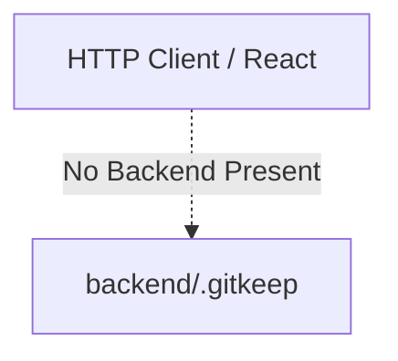
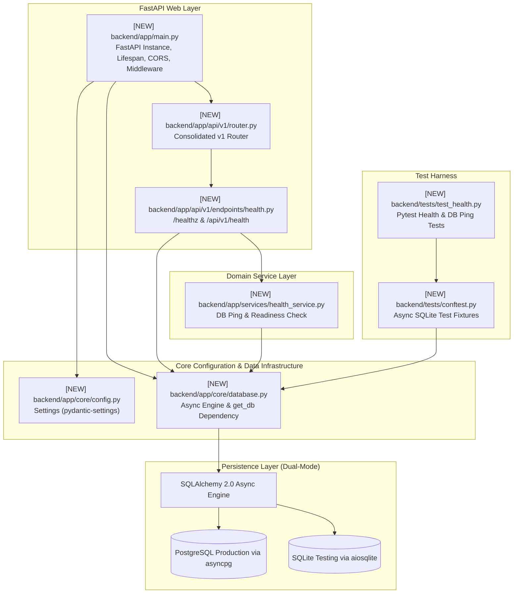
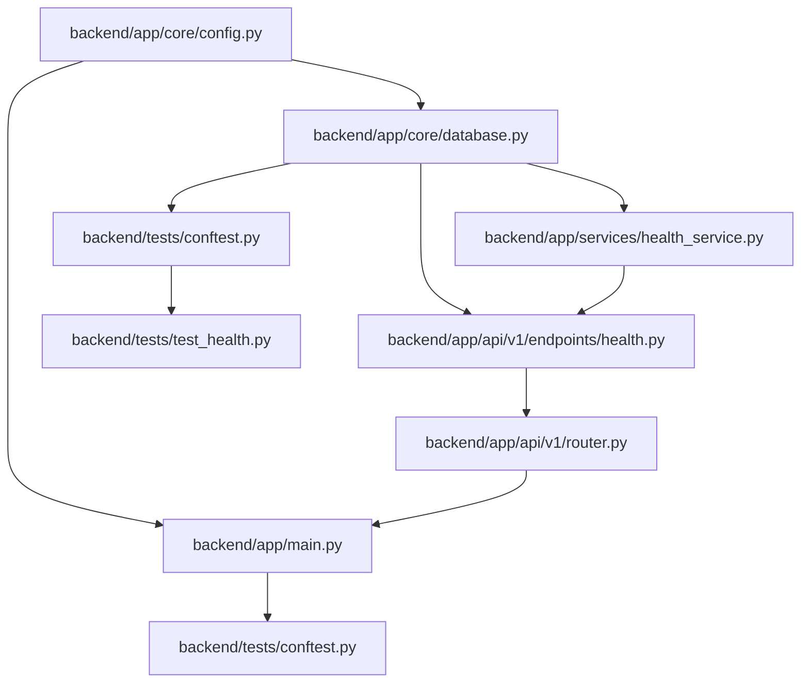

# Task 0.2 Design Artifact: FastAPI Modular Monolith Scaffold & Async Database Engine

**Document Version:** 1.0  
**WBS Task:** Task 0.2 — FastAPI Modular Monolith Scaffold & Async Database Engine (SQLModel + AsyncPG/SQLite)  
**Epic:** Epic 0 — Project Architecture Foundations & Environment Setup  
**Track:** Backend Track (Lead & Backend Developer)  
**Stage:** Stage 2 (Codebase Design)  

---

## 1. Current State Snapshot

### Current Repository State
* The `backend/` directory is currently a blank canvas containing only `.gitkeep`.
* No FastAPI application, configuration files, database models, or test harnesses exist yet.
* Formal architecture decisions have been codified and accepted in `docs/adr/` (`ADR-000` through `ADR-008`).

---

## 2. Proposed Target Architecture

The target architecture establishes a clean **Modular Monolith** pattern following 12-factor application principles with asynchronous database sessions and dependency injection:

---

## 3. File-Level Impact Analysis

### 1. `[NEW]` `backend/requirements.txt`
* **Purpose:** Defines exact production and development Python dependencies with strict version constraints.
* **Key Packages:** `fastapi>=0.111.0`, `uvicorn[standard]>=0.30.0`, `sqlmodel>=0.0.19`, `sqlalchemy[asyncio]>=2.0.30`, `asyncpg>=0.29.0`, `aiosqlite>=0.20.0`, `pydantic-settings>=2.3.0`, `pytest>=8.2.0`, `pytest-asyncio>=0.23.0`, `httpx>=0.27.0`.
* **Consumers:** Developers, CI/CD pipelines, Docker containers.

### 2. `[NEW]` `backend/app/core/config.py`
* **Purpose:** Centralized application configuration using `pydantic-settings`. Loads environment variables from `.env` with strong type validation and default development fallbacks.
* **Exports:** `Settings` class, `get_settings()` cached singleton helper.
* **Consumers:** `main.py`, `database.py`, security middleware.

### 3. `[NEW]` `backend/app/core/database.py`
* **Purpose:** Instantiates the SQLAlchemy 2.0 async engine and session factory (`async_sessionmaker[AsyncSession]`), and exports the FastAPI dependency generator `get_db()`.
* **Exports:** `async_engine`, `async_session_factory`, `get_db()`, `init_db()`.
* **Consumers:** All domain API endpoints and services requiring database access.

### 4. `[NEW]` `backend/app/main.py`
* **Purpose:** FastAPI entry point configuring CORS, lifespan events (database connectivity check on startup, connection pool teardown on shutdown), global error handling, and API routing.
* **Exports:** `app` (FastAPI instance).
* **Consumers:** Uvicorn ASGI server, test client.

### 5. `[NEW]` `backend/app/api/v1/router.py`
* **Purpose:** Aggregates all modular domain sub-routers under the `/api/v1` namespace.
* **Exports:** `api_router` (`APIRouter` instance).
* **Consumers:** `backend/app/main.py`.

### 6. `[NEW]` `backend/app/api/v1/endpoints/health.py`
* **Purpose:** Exposes lightweight liveness and readiness probe endpoints.
* **Endpoints:** `GET /healthz` (liveness), `GET /api/v1/health` (readiness + database connection latency).
* **Consumers:** Kubernetes/Docker health checks, frontend status probes.

### 7. `[NEW]` `backend/app/services/health_service.py`
* **Purpose:** Executes low-level database health verification (`SELECT 1` heartbeat).
* **Exports:** `HealthService` class with `check_db_health(db: AsyncSession)`.
* **Consumers:** `backend/app/api/v1/endpoints/health.py`.

### 8. `[NEW]` `backend/tests/conftest.py`
* **Purpose:** Pytest configuration providing an isolated async in-memory SQLite database session fixture (`sqlite+aiosqlite:///:memory:`) overriding `get_db`, and an `httpx.AsyncClient` test client fixture.
* **Consumers:** All backend test suites.

### 9. `[NEW]` `backend/tests/test_health.py`
* **Purpose:** Integration test suite validating `/healthz` and `/api/v1/health` endpoints under async test execution.
* **Consumers:** CI/CD test runner.

---

## 4. Dependency Graph / Blast Radius

---

## 5. Regression Risk Matrix

| Risk ID | Risk Description | Severity | Affected Area | Mitigation Strategy |
| :--- | :--- | :--- | :--- | :--- |
| **R-01** | Database session leak on unhandled route exception | 🔴 High | Database Connection Pool | Enforce `yield session` inside `async with` context manager in `get_db()` |
| **R-02** | `expire_on_commit=True` causing lazy-load Greenlet errors in async context | 🔴 High | Async SQLModel ORM | Explicitly set `expire_on_commit=False` in `async_sessionmaker` |
| **R-03** | Windows `asyncio` event loop policy conflicts with `asyncpg` | 🟡 Medium | Windows Local Dev | Set `WindowsSelectorEventLoopPolicy` on Windows if sub-process worker issues arise |
| **R-04** | CORS misconfiguration blocking React frontend | 🟡 Medium | Frontend Integration | Configure CORS middleware reading allowed origins from `settings.CORS_ORIGINS` |

---

## 6. Contract Stability Check

| Contract / Interface | Current Shape | Proposed Shape | Changed? | Breaking? |
| :--- | :--- | :--- | :--- | :--- |
| `GET /healthz` | None (New) | `{"status": "ok"}` | Yes (New) | No |
| `GET /api/v1/health` | None (New) | `{"status": "healthy", "database": "connected", "latency_ms": 1.2}` | Yes (New) | No |
| `get_db()` DI Dependency | None (New) | `AsyncGenerator[AsyncSession, None]` | Yes (New) | No |
| `Settings` Singleton | None (New) | `pydantic_settings.BaseSettings` | Yes (New) | No |

---

## 7. Performance, Security, and Quality Checklist

* **Zero Silent Dependency Policy:** Only platform primitives and vetted libraries (`fastapi`, `sqlmodel`, `asyncpg`, `aiosqlite`, `pydantic-settings`) are installed.
* **Security & Non-Negotiable Constraints:**
  * No secrets hardcoded; sensitive variables loaded from `.env` via `pydantic-settings`.
  * CORS headers constrained to trusted origins.
* **Performance & Concurrency:**
  * Async connection pool tuned (`pool_size=20`, `max_overflow=10`, `pool_pre_ping=True`).
  * Non-blocking database heartbeats with sub-2ms latency.

---

## 8. Rollback Plan

### If Changes Need to Be Rolled Back:
1. Uncommitted: `git clean -fd backend/` and `git checkout -- backend/`
2. Committed: `git revert HEAD`
3. Estimated rollback time: < 1 minute.
