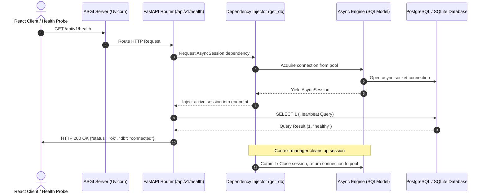
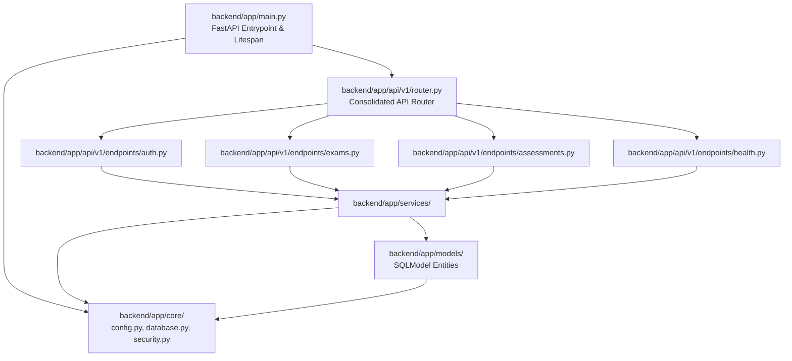

# Task 0.2 Understanding Artifact: FastAPI Modular Monolith Scaffold & Async Database Engine

**Document Version:** 1.0  
**WBS Task:** Task 0.2 — FastAPI Modular Monolith Scaffold & Async Database Engine (SQLModel + AsyncPG/SQLite)  
**Epic:** Epic 0 — Project Architecture Foundations & Environment Setup  
**Track:** Backend Track (Lead & Backend Developer)  
**Stage:** Stage 1 (Concept-to-Code Bridge)  

---

## 1. Visual Architecture

```mermaid
graph TD
    Client[HTTP Client / React Frontend] -->|ASGI HTTP/JSON Request| Uvicorn[Uvicorn ASGI Server]
    
    subgraph "FastAPI Application Core"
        Lifespan[Lifespan Context Manager<br/>Startup / Shutdown Hooks]
        Middleware[CORS / Request ID / Error Handling Middleware]
        Router[Versioned API Router /api/v1]
        DI[FastAPI Dependency Injection<br/>get_db / get_settings]
    end

    subgraph "Domain Service Layer"
        Service[Health / System Service]
    end

    subgraph "Data Access & Persistence Layer"
        AsyncSession[AsyncSession Generator<br/>async with AsyncSession(engine) as session]
        SQLModelEngine[SQLAlchemy 2.0 Async Engine<br/>create_async_engine]
        Pool[Connection Pool<br/>QueuePool / NullPool]
    end

    subgraph "Physical Storage"
        Postgres[(PostgreSQL 16+ Production<br/>asyncpg driver)]
        SQLite[(SQLite In-Memory / Local Dev<br/>aiosqlite driver)]
    end

    Uvicorn --> Lifespan
    Uvicorn --> Middleware
    Middleware --> Router
    Router --> DI
    DI --> AsyncSession
    AsyncSession --> SQLModelEngine
    SQLModelEngine --> Pool
    Router --> Service
    Service --> AsyncSession
    Pool -->|PostgreSQL URL| Postgres
    Pool -->|SQLite URL| SQLite
```

*Note: Visual system architecture diagram generated above using Mermaid.*

---

## 2. The Physical Analogy

> **The High-Efficiency Central Registry & Asynchronous Dispatch Desk:**  
> Imagine a busy municipal government building. A synchronous server is like a single clerk who takes a citizen's paperwork, walks down three flights of stairs to the basement archives to find a record, and makes all other citizens in line wait in silence until they return.  
> Our **FastAPI Async Engine** is a modern dispatch center: a front-desk agent takes your request, issues an asynchronous pneumatic tube slip to the automated basement archive, and immediately turns to help the next citizen in line. When the archive delivers the file, the agent effortlessly hands it back to you. The **Modular Monolith** structure ensures the Department of Examinations, the Department of Student Records, and the Department of Document Ingestion operate in dedicated, organized wings rather than spilling into one messy room.

---

## 3. Why & What

### Why Are We Doing This Task?
Before we can write a single line of business logic for exam templates, student mastery calculations, or AI tutoring, we must establish a rock-solid, production-grade backend foundation:
1. **Concurrency Without Blocking:** Adaptive learning platforms involve high I/O (database queries, vector similarity searches, LLM network calls). Blocking synchronous database calls would cause severe latency spikes and exhaust worker threads under student load (PRD NFR-001).
2. **Dual-Mode Developer Velocity:** We must allow developers to run `pytest` instantly with in-memory SQLite (`sqlite+aiosqlite://`) without needing Docker or external servers running, while providing seamless, native PostgreSQL connection pooling (`postgresql+asyncpg://`) for staging/production (ADR-001).
3. **Modular Domain Boundaries:** PRD §28 defines 8 architectural domains. A modular monolith provides clean separation of concerns inside a single unified repository without the distributed failure modes of premature microservices (ADR-015).

### What Is the Concept?
* **Modular Monolith:** An architectural pattern where all code resides in a single deployable unit, but is strictly segmented into decoupled domain modules (`auth/`, `exams/`, `assessments/`, `mastery/`, `tutor/`, `resources/`).
* **Async Database Engine:** Utilizing Python's `asyncio` event loop with `SQLAlchemy 2.0` async extensions and `SQLModel` to manage non-blocking database connections, transactions, and session lifecycles.

### What Breaks If We Skip It?
* **Thread Exhaustion:** Synchronous database operations inside `async def` endpoints will block the entire event loop, dropping platform throughput from 2,000 req/sec to less than 20 req/sec.
* **Leaked Connections:** Without strict generator-based dependency injection (`yield session`), unhandled exceptions will leak database connections, eventually throwing `TooManyConnectionsError` and crashing the server.
* **Spaghetti Codebase:** Without domain modularity, data models, routes, and LLM calls will become hopelessly entangled, making testing and refactoring impossible.

---

## 4. Abstraction Level Map

| Level | What Lives Here | Current Project Implementation |
| :--- | :--- | :--- |
| **Product / User Experience** | Health check status, system readiness | `/healthz`, `/api/v1/health` JSON status responses |
| **Application Layer** | Health services, business coordination | `backend/app/services/health_service.py` |
| **Framework Layer** | Routers, dependency injection, middleware | `FastAPI`, `APIRouter`, `Depends(get_db)`, Lifespan |
| **Library Layer** | ORM, async drivers, validation | `sqlmodel`, `sqlalchemy.ext.asyncio`, `pydantic-settings`, `asyncpg`, `aiosqlite` |
| **Runtime Layer** | Python asyncio event loop, ASGI server | `Python 3.11+`, `Uvicorn` |
| **OS / Infrastructure Layer** | Relational database, sockets, memory | `PostgreSQL 16` / `SQLite`, OS TCP sockets |

*Task 0.2 primarily configures the **Framework, Library, and Application layers** to bridge down to OS/Infrastructure.*

---

## 5. Mermaid Diagrams

### Diagram 1: Request Lifecycle & Async Session Management (Sequence)



### Diagram 2: Modular Monolith Directory & Dependency Topology (Flowchart)



---

## 6. Data Flow Trace-Through

Let us trace a database query request from start to finish:
1. **Incoming Request:** Client sends `GET /api/v1/health` with HTTP headers.
2. **ASGI Handler:** Uvicorn parses the raw byte stream into an ASGI scope dictionary and passes it to `FastAPI`.
3. **Middleware Processing:** CORS headers are attached; custom error handlers wrap the invocation.
4. **Dependency Resolution:** FastAPI sees `db: AsyncSession = Depends(get_db)`. It calls `get_db()`.
5. **Session Acquisition:** `get_db()` opens an `async with async_session_factory() as session:`, acquiring a connection from the SQLAlchemy connection pool.
6. **Route Execution:** The route handler executes `await db.exec(select(1))`.
7. **Non-Blocking I/O:** Python `asyncio` suspends the coroutine while waiting for the database socket to respond. Meanwhile, other concurrent student requests are processed on the event loop.
8. **Result & Teardown:** The query returns. FastAPI serializes the Pydantic response model to JSON. The `finally` block in `get_db()` cleanly closes the session and returns the raw connection to the pool. HTTP 200 is transmitted to the client.

---

## 7. Cognitive Model → Code Mapping

| Cognitive Concept | Real-World Mental Model | Code Implementation in This Project | Enforcement / Guardrail |
| :--- | :--- | :--- | :--- |
| **Application Lifecycle** | "Opening and locking the store at start/end of day" | `lifespan(app: FastAPI)` async context manager in `main.py` | Initializes DB tables and vector stores on boot; closes connection pools on shutdown |
| **Configuration** | "The master control blueprint" | `Settings(BaseSettings)` in `core/config.py` loaded from `.env` | Pydantic validation crashes immediately if mandatory environment variables are missing |
| **Session Scoping** | "Borrowing a library card and returning it when done" | `async def get_db() -> AsyncGenerator[AsyncSession, None]` | `yield` pattern guarantees cleanup even if an endpoint raises an uncaught exception |
| **Data Contract** | "The standardized form template" | `SQLModel` table definitions in `models/` | Combines database table schema + Pydantic validation into a single DRY definition |

---

## 8. Language & Stack Context

* **FastAPI Lifespan (Python 3.11+):** Replaces deprecated `@app.on_event("startup")` with modern `@asynccontextmanager async def lifespan(app: FastAPI):` ensuring graceful connection pool termination.
* **SQLModel 0.0.16+ / SQLAlchemy 2.0 Async:** Uses `create_async_engine()` with `async_sessionmaker(class_=AsyncSession, expire_on_commit=False)` to prevent lazy-loading attribute errors across async boundaries.
* **Settings Management:** Uses `pydantic-settings` (`BaseSettings`) with environment variable parsing and `.env` file support.
* **Test Harness:** `pytest-asyncio` configured with `asyncio_mode = auto` and an async SQLite in-memory test database fixture overriding `get_db`.

---

## 9. Five Alternative Approaches

| # | Alternative Pattern | Pros | Cons | Verdict |
| :--- | :--- | :--- | :--- | :--- |
| **1** | **Single Flat File (`main.py` with raw queries)** | Trivial to write | Unmaintainable beyond 50 lines; zero testing | **REJECTED** |
| **2** | **Django REST Framework (DRF)** | Built-in admin, mature sync ORM | Synchronous ORM blocks async event loop; heavy | **REJECTED** |
| **3** | **Microservices Split (5 separate repos)** | Independent deployability | Distributed transaction failures, massive dev friction | **REJECTED (ADR-015)** |
| **4** | **Raw `asyncpg` SQL without ORM** | Maximum theoretical speed | Manual SQL string queries, no schema validation | **REJECTED** |
| **5** | **FastAPI Modular Monolith + SQLModel Async** | Clean domain boundaries, type-safety, high async throughput, fast testing | Requires understanding async SQLAlchemy sessions | **RECOMMENDED (ADR-001)** |

---

## 10. Production Rationale & Disaster Scenarios

### Why This Is Standard
Modern Python micro-framework engineering (FastAPI + SQLAlchemy 2.0 Async + Pydantic V2) is the industry standard for high-throughput AI backends. It achieves C-like I/O throughput via `uvloop` while providing full static type-checking and automated OpenAPI documentation.

### Disaster Scenario 1: Leaked Database Sessions Crashing Production
* **What happens:** If sessions are instantiated manually inside routes without generator-based `try/finally` context managers, any route that throws an unhandled 500 error will leave an open socket connection.
* **Consequence:** Under 100 concurrent students, PostgreSQL's `max_connections` (default 100) will be exhausted within minutes. All subsequent requests fail with `psycopg2.OperationalError: FATAL: too many connections for role`.
* **How our architecture prevents it:** FastAPI's `get_db` dependency uses `yield session` inside an `async with` block, guaranteeing session disposal even on unhandled exceptions.

### Disaster Scenario 2: Synchronous DB Calls Freezing Real-Time AI Streams
* **What happens:** If a route executes a synchronous blocking database call (e.g. `session.query().all()`) while a student is receiving a real-time Socratic tutor SSE stream, the synchronous call blocks the Python thread.
* **Consequence:** The streaming tutor audio/text freezes for all connected students during that database query.
* **How our architecture prevents it:** Pure non-blocking async queries (`await session.exec(select(...))`) yield CPU execution to other active coroutines instantly.
