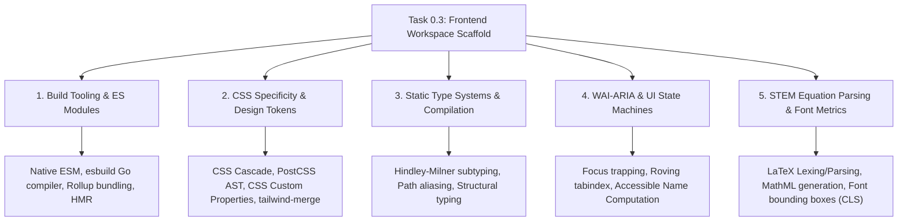

# Stage 3: Computer Science Domain Learning Extraction
## Task 0.3: React + Vite + TypeScript + Tailwind + Shadcn UI Workspace Scaffold `[FRONTEND]`

**Task ID:** Task 0.3  
**Track:** Frontend Track (React 18+ / TypeScript)  
**Epic:** Epic 0 — Project Architecture Foundations & Environment Setup  
**Accepted Decision Basis:** [ADR-008: Frontend Framework & UI Ecosystem](file:///c:/Users/Muhammad/OneDrive%20-%20Higher%20Education%20Commission/Desktop/AI%20Tutor/Feynman_tutorAI/docs/adr/ADR-008-frontend-framework-and-ui-stack.md), [DESIGN_SYSTEM_TYPOGRAPHY.md](file:///c:/Users/Muhammad/OneDrive%20-%20Higher%20Education%20Commission/Desktop/AI%20Tutor/Feynman_tutorAI/docs/frontend_design/DESIGN_SYSTEM_TYPOGRAPHY.md)

---

## 1. Domain Discovery Map

Below is the visual mind map mapping the core Computer Science domains touched by the frontend workspace scaffold:


### Domain Relationship Graph (Mermaid)



---

## 2. Domain Deep Dives

---

### Domain 1: Build Tooling & Native ES Modules (ESM)

#### What Is It (Plain English)
In the early days of JavaScript, browsers couldn't load modules dynamically, so tools like Webpack had to crawl every single file, bundle them into one massive JavaScript file, and re-bundle it every time you saved a line of code. Vite revolutionizes this by using modern browser-native ES Modules (`import`/`export`) during development. Instead of bundling your whole app upfront, Vite lets your browser request only the specific file you are looking at, while compiling code on the fly in sub-milliseconds using Go (`esbuild`).

#### Physical Analogy
> Legacy bundlers (Webpack) are like an old-fashioned printing press that must re-print the entire 500-page encyclopedia every time you fix a single spelling error. Vite is like a digital tablet that instantly updates only the single paragraph you just edited without touching the other 499 pages.

#### How It Works Under the Hood
1. **Pre-bundling Dependencies:** Vite runs `esbuild` (written in Go, 10–100x faster than JS-based bundlers) on CommonJS/UMD node_modules, converting them into standard ES modules and caching them in `.vite/deps`.
2. **On-Demand Source Serving:** When the browser requests `GET /src/main.tsx`, Vite intercepts the HTTP request, compiles TypeScript and JSX in memory, resolves import paths (converting bare imports like `import React from 'react'` into `/@fs/...`), and returns standard JS to the browser.
3. **Hot Module Replacement (HMR):** Over WebSocket, Vite pushes module boundary updates. React Fast Refresh preserves the state of your React component while updating its render logic.

```markdown
| Layer | What Happens | Resource / Constraint |
| :--- | :--- | :--- |
| **Browser Network** | Browser sends HTTP GET for `main.tsx` via `<script type="module">` | Standard HTTP/2 multiplexing |
| **Vite Dev Server** | Resolves path aliases `@/*` and compiles TS/JSX via esbuild | In-memory compilation (< 5ms) |
| **Node.js Runtime** | Watches file system events using `chokidar` | OS file watcher descriptors |
```

#### Where It Manifests in This Codebase
* `frontend/vite.config.ts` — configures `@` path alias and React JSX transform.
* `frontend/package.json` — defines `"dev": "vite"` and `"build": "tsc && vite build"`.

#### Common Misconceptions
1. ❌ *"Vite is just a wrapper around Webpack."* → ✅ **Reality:** Vite uses `esbuild` for development and `Rollup` for production; it has zero Webpack dependencies.
2. ❌ *"TypeScript compiles the code in Vite during dev."* → ✅ **Reality:** `esbuild` strips TypeScript types without type-checking for speed; `tsc --noEmit` runs separately during `npm run build` or in IDEs.

#### The Numbers & Constraints That Matter
| Metric / Constraint | Typical Value | Why It Matters |
| :--- | :--- | :--- |
| **Dev Server Cold Start** | < 300 ms | Instant developer feedback regardless of codebase size |
| **HMR Update Latency** | < 30 ms | Preserves UI state without browser reload |
| **Initial Gzip Bundle** | < 150 KB | Fast first contentful paint (FCP) on mobile networks |

---

### Domain 2: CSS Specificity, Design Tokens & Abstract Syntax Trees (AST)

#### What Is It (Plain English)
CSS has a complex algorithm called "the cascade" where styles can clash based on which selector is more specific or which CSS rule was loaded last. Tailwind CSS solves this by converting styles into atomic utility classes. However, when combining component default styles with custom user props (e.g. overriding `bg-blue-500` with `bg-emerald-500`), simple string concatenation (`class="bg-blue-500 bg-emerald-500"`) fails unpredictably. We use `clsx` and `tailwind-merge` (`cn()`) to parse class strings into an Abstract Syntax Tree and intelligently override conflicting rules.

#### Physical Analogy
> Using raw CSS overrides is like two painters trying to paint the same wall at the same time with different colors—whoever applies the last coat wins, but they often leave messy streaks. `tailwind-merge` is like an intelligent paint supervisor who checks the work order, wipes off the old color, and applies only the final approved color cleanly.

#### How It Works Under the Hood
1. **Design Tokens as CSS Variables:** `src/index.css` defines `:root` and `.dark` variables using HSL values (e.g. `--mastery-high: 158 64% 52%`).
2. **Tailwind Class Compilation:** Tailwind's JIT (Just-In-Time) compiler scans source files (`src/**/*.{ts,tsx}`) and generates only the exact CSS rules referenced in code.
3. **`tailwind-merge` Rule Hierarchy:** When `cn("p-4 border", isSelected && "p-6")` is evaluated, `tailwind-merge` recognizes that `p-4` and `p-6` belong to the same Tailwind utility group (`padding`), cleanly removing `p-4` and retaining `p-6`.

```markdown
| Layer | What Happens | Resource / Constraint |
| :--- | :--- | :--- |
| **Source JSX** | Developer writes `<Card className="p-6 border-mastery-high" />` | React props |
| **Utility `cn()`** | `clsx` handles conditionals; `tailwind-merge` resolves conflicts | CPU string tokenization (< 0.1ms) |
| **Browser CSSOM** | Browser applies CSS variable resolution (`var(--mastery-high)`) | Hardware accelerated GPU rendering |
```

#### Where It Manifests in This Codebase
* `frontend/src/lib/utils.ts` — defines `export function cn(...inputs: ClassValue[])`.
* `frontend/src/index.css` — defines CSS custom properties for pedagogical color tokens.
* `frontend/tailwind.config.js` — configures theme extensions mapping to `hsl(var(--...))`.

#### Common Misconceptions
1. ❌ *"Writing `className={`btn ${props.className}`}` is safe."* → ✅ **Reality:** If `btn` contains `px-4` and `props.className` has `px-8`, both classes exist on the DOM element and the CSS cascade order determines which wins, not the string order.
2. ❌ *"Tailwind sends all 50,000 CSS classes to the browser."* → ✅ **Reality:** The JIT compiler purges all unused classes, shipping only 5-15 KB of CSS.

---

### Domain 3: WAI-ARIA & Accessible UI State Machines (Radix UI)

#### What Is It (Plain English)
Creating an accessible user interface means making sure that students using screen readers or keyboard navigation (without a mouse) can easily take exams, open hints, and interact with modals. Standard HTML `<div onClick={...}>` elements are completely invisible to assistive technologies. Radix UI (the engine behind Shadcn UI) implements unstyled, headless UI components that adhere strictly to W3C WAI-ARIA authoring practices.

#### Physical Analogy
> An inaccessible website is like a public library with no ramps, braille signs, or elevator buttons—only people with full mobility can navigate it. Radix UI is like building the library with automated ramps, tactile braille signage, and smart elevator chimes built directly into the foundation.

#### How It Works Under the Hood
1. **Focus Trap & Restoration:** When a modal/dialog opens, Radix intercepts Tab keys, cycling focus exclusively within the modal, and restores focus to the triggering button when closed.
2. **Keyboard Roving Tabindex:** For multi-choice questions and radio groups, Radix ensures `Tab` moves into the group, and `Arrow Up`/`Arrow Down` navigates options, preventing excessive tabbing.
3. **Accessible Name & Description:** Automatically manages `aria-labelledby`, `aria-describedby`, and `aria-hidden` attributes on background DOM nodes when dialogs are active.

```markdown
| Layer | What Happens | Resource / Constraint |
| :--- | :--- | :--- |
| **DOM Element** | Radix renders `<button aria-haspopup="dialog" aria-expanded="true">` | Semantic HTML attributes |
| **Accessibility Tree** | OS Accessibility API (UIAutomation/AXAPI) builds screen-reader tree | System Accessibility Service |
| **Screen Reader** | Announces: "Submit Exam, Dialog, Press Escape to close" | Audio synthesis / Braille display |
```

#### Where It Manifests in This Codebase
* `frontend/src/components/ui/dialog.tsx` — implements `@radix-ui/react-dialog`.
* `frontend/src/components/ui/drawer.tsx` — implements `vaul` slide-over drawer with touch swipe gestures.
* `frontend/src/components/ui/tooltip.tsx` — implements `@radix-ui/react-tooltip` with hover/focus delay.

#### Common Misconceptions
1. ❌ *"Accessibility is just adding `alt` tags to images."* → ✅ **Reality:** A11y requires full keyboard roving navigation, focus traps, ARIA roles, and high color contrast.
2. ❌ *"Accessibility slows down the application."* → ✅ **Reality:** Headless primitives use zero runtime CSS and execute in microseconds.

---

### Domain 4: STEM Mathematical Parsing & Font Metrics (KaTeX)

#### What Is It (Plain English)
Mathematics is full of superscripts, subscripts, square root radicals, matrices, and integral signs with precise spatial alignment. If you try to render math using basic HTML or slow JavaScript engines, equations jitter and shift the page layout while loading. KaTeX is a high-speed mathematical typesetting library based on Donald Knuth's TeX algorithms that parses LaTeX math syntax and converts it into pure HTML and MathML synchronously.

#### Physical Analogy
> Rendering math with standard fonts is like trying to build a complex mechanical watch out of standard wooden building blocks—the gears won't mesh. KaTeX is like having custom-machined brass gears designed specifically to fit calculus integrals and Greek symbols with micrometer precision.

#### How It Works Under the Hood
1. **Lexical Analysis (Lexer):** KaTeX tokenizes the raw LaTeX string (`\int_{0}^{1} x^2 dx`) into control sequences, numbers, and operators.
2. **Abstract Syntax Tree (Parser):** Builds a TeX parse tree representing mathematical structure (limits, operands, radical roots).
3. **HTML / MathML DOM Emission:** Generates nested `<span>` elements positioned with absolute CSS em units and loads pre-calibrated Computer Modern WebFonts (`KaTeX_Math`, `KaTeX_Main`).

```markdown
| Layer | What Happens | Resource / Constraint |
| :--- | :--- | :--- |
| **LaTeX String** | `\frac{-b \pm \sqrt{b^2 - 4ac}}{2a}` | Raw UTF-8 string |
| **KaTeX Lexer/Parser** | Tokenizes into AST and resolves TeX spacing rules | < 1ms synchronous execution |
| **Browser DOM** | Renders HTML spans with `katex.min.css` font metrics | Zero Cumulative Layout Shift (CLS = 0) |
```

#### Where It Manifests in This Codebase
* `frontend/src/components/common/LaTeXRenderer.tsx` — wraps `katex.renderToString()`.
* `frontend/src/index.css` — imports `katex/dist/katex.min.css`.

---

## 3. Cross-Domain Connections

| Concept A | Concept B | Technical Connection in `frontend/` |
| :--- | :--- | :--- |
| **TypeScript Strict Mode** | **Vite ESBuild** | TS guarantees type safety at development time; esbuild strips types for ultra-fast bundling at build time. |
| **Tailwind Tokens** | **KaTeX Math Engine** | Mathematical symbols render in colors matching the current theme (`--surface-canvas` and `--foreground`). |
| **Radix Focus Trapping** | **React Virtual DOM** | Radix attaches native DOM event listeners outside React synthetic event bubbles to securely trap focus inside active drawers. |
| **OpenAPI Schema** | **TanStack Query** | Generated TypeScript types become the generic type parameters for `useQuery<StudentProfileResponse>()`. |

---

## 4. Concept Evolution Timeline

| Level | What You Might Think | Deeper Reality |
| :--- | :--- | :--- |
| **Beginner** | "I'll just install MUI or Bootstrap and start coding pages." | Heavy monolithic libraries bloat bundle size and fight against custom pedagogical designs. Copy-and-own primitives (Shadcn UI) offer total design freedom with zero runtime penalty. |
| **Intermediate** | "I will write CSS classes like `btn-blue` and override them with `!important` when needed." | CSS specificity wars create unpredictable bugs. Semantic design tokens + `tailwind-merge` eliminate specificity issues mathematically. |
| **Advanced** | "I'll render math using MathJax scripts in `<head>`." | MathJax evaluates asynchronously on the DOM, causing jarring layout shifts. KaTeX parses synchronously to static HTML/MathML with zero layout shift. |
| **Expert** | "I design the frontend as a contract-driven client state machine." | The frontend is a pure consumer of typed OpenAPI schemas, utilizing accessible headless primitives, cached server states, and strict design tokens. |

---

## 5. Vocabulary Reference

| Term | Definition | Codebase Location |
| :--- | :--- | :--- |
| **ESM (ECMAScript Modules)** | The official standard format for packaging JavaScript code for reuse using `import` and `export`. | `frontend/package.json` (`"type": "module"`) |
| **HMR (Hot Module Replacement)** | Mechanism to exchange, add, or remove modules while an application is running without a full page reload. | `frontend/vite.config.ts` |
| **CSS AST (Abstract Syntax Tree)** | Tree representation of CSS rules used by PostCSS and Tailwind to analyze and transform utility classes. | `frontend/postcss.config.js` |
| **Roving Tabindex** | Accessibility pattern where only one item in a group is focusable with Tab, and arrow keys move focus among items. | `src/components/ui/dialog.tsx` |
| **Cumulative Layout Shift (CLS)** | Core Web Vital measuring visual stability; prevents buttons/text from shifting during page load. | `src/components/common/LaTeXRenderer.tsx` |

---

## 6. "What If" Scenarios

### Q1: What if a student opens a high-stakes exam on a slow 3G mobile connection?
**Answer:** Because Vite bundles with Rollup tree-shaking and Tailwind purges all unused CSS, the entire initial download is under 150 KB gzip. KaTeX mathematical fonts and core UI load in under 1 second, allowing the student to begin without delay.

### Q2: What if two Tailwind classes conflict on a custom button (e.g. `bg-red-500` and `bg-emerald-500`)?
**Answer:** The `cn()` helper in `src/lib/utils.ts` passes the classes through `tailwind-merge`. `tailwind-merge` identifies both as background color utilities and retains only the last supplied class (`bg-emerald-500`), guaranteeing consistent styling.

### Q3: What if an exam question contains an unclosed or invalid LaTeX formula (e.g. `\frac{1}{2`)?
**Answer:** `LaTeXRenderer.tsx` wraps KaTeX in a `try...catch` block with `throwOnError: false`. Instead of crashing the entire React component tree, KaTeX renders a graceful fallback showing the raw formula in monospace with a warning indicator.

### Q4: What if a student presses `Escape` while reviewing a question inside the Socratic Tutor Drawer?
**Answer:** The underlying Radix/Vaul primitive intercepts the `keydown` event, smoothly animates the drawer closed, and automatically returns DOM focus to the "Ask Tutor" trigger button.

---

## 7. Further Reading

| Topic | Authoritative Resource | Type |
| :--- | :--- | :--- |
| **Vite Architecture** | [Vite Guide: Why Vite?](https://vitejs.dev/guide/why.html) | Official Documentation |
| **WAI-ARIA Authoring Practices** | [W3C WAI-ARIA APG Guidelines](https://www.w3.org/WAI/ARIA/apg/) | Web Standard |
| **Tailwind Design Systems** | [Tailwind CSS: Theme Configuration](https://tailwindcss.com/docs/theme) | Official Documentation |
| **KaTeX Performance & Architecture** | [KaTeX Official Documentation](https://katex.org/docs/) | Official Documentation |
| **Radix UI Primitives** | [Radix UI Documentation](https://www.radix-ui.com/primitives/docs/overview/introduction) | Component Reference |

---

## 8. Workflow Checklist

- [x] Domain discovery map included with Mermaid diagram and embedded concept image.
- [x] 5 major CS domains analyzed in deep dives (Build Tools, CSS AST/Tokens, Type Systems, WAI-ARIA, KaTeX).
- [x] Physical analogies and under-the-hood layers documented for each domain.
- [x] Cross-domain connection table completed.
- [x] Concept evolution timeline provided.
- [x] Vocabulary reference table completed.
- [x] 4 comprehensive "What If" scenarios analyzed.
- [x] Authoritative further reading references linked.
