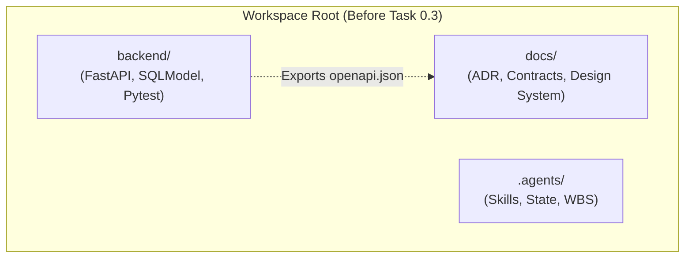
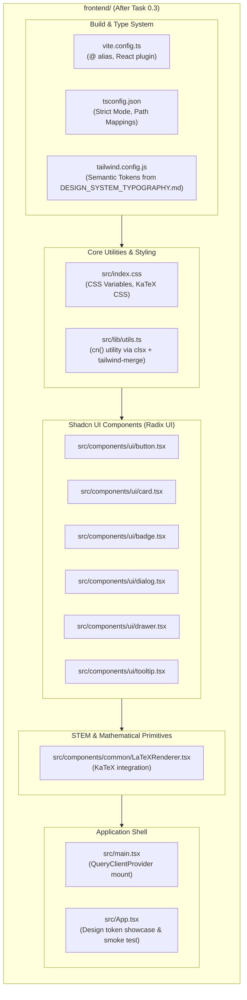

# Stage 2: Codebase Design Artifact
## Task 0.3: React + Vite + TypeScript + Tailwind + Shadcn UI Workspace Scaffold `[FRONTEND]`

**Task ID:** Task 0.3  
**Track:** Frontend Track (React 18+ / TypeScript)  
**Epic:** Epic 0 — Project Architecture Foundations & Environment Setup  
**Accepted Decision Basis:** [ADR-008: Frontend Framework & UI Ecosystem](file:///c:/Users/Muhammad/OneDrive%20-%20Higher%20Education%20Commission/Desktop/AI%20Tutor/Feynman_tutorAI/docs/adr/ADR-008-frontend-framework-and-ui-stack.md), [DESIGN_SYSTEM_TYPOGRAPHY.md](file:///c:/Users/Muhammad/OneDrive%20-%20Higher%20Education%20Commission/Desktop/AI%20Tutor/Feynman_tutorAI/docs/frontend_design/DESIGN_SYSTEM_TYPOGRAPHY.md)

---

## 1. Current State Snapshot

Currently, the workspace contains the completed backend scaffold (`backend/`), project documentation (`docs/`), and agent configurations (`.agents/`). The `frontend/` directory does not exist yet.



* **Verified Fact:** `frontend/` is absent.
* **Verified Fact:** `docs/contracts/CONTRACT-PROTOCOL.md` and `docs/frontend_design/DESIGN_SYSTEM_TYPOGRAPHY.md` specify design and contract constraints.
* **Verified Fact:** Git branch `feat/fe-task-0.3-react-scaffold` is active and isolated.

---

## 2. Proposed State

After Task 0.3 execution, the `frontend/` directory will be a fully functional, type-safe, accessible Single Page Application ready for downstream feature development (Auth UI, Exam Player, Socratic Drawer, Misconception Graph).



---

## 3. File-Level Impact Analysis

All files for Task 0.3 are `[NEW]` inside the `frontend/` directory, respecting strict Two-Developer Directory Isolation (Zero touches to `backend/`).

### 3.1 Build & Configuration Files
#### [NEW] `frontend/package.json`
* **Purpose:** Defines project metadata, build scripts (`dev`, `build`, `preview`, `test`, `typegen`), and production/development dependencies.
* **Key Dependencies:** `react@^18.3.1`, `react-dom@^18.3.1`, `@tanstack/react-query@^5.51.1`, `zustand@^4.5.4`, `clsx@^2.1.1`, `tailwind-merge@^2.4.0`, `lucide-react@^0.417.0`, `katex@^0.16.11`, `vaul@^0.9.1`, `@radix-ui/react-dialog@^1.1.1`, `@radix-ui/react-tooltip@^1.1.2`, `@radix-ui/react-slot@^1.1.0`.
* **Dev Dependencies:** `vite@^5.3.4`, `@vitejs/plugin-react@^4.3.1`, `typescript@^5.5.3`, `tailwindcss@^3.4.7`, `postcss@^8.4.40`, `autoprefixer@^10.4.19`, `vitest@^2.0.4`, `@testing-library/react@^16.0.0`, `@types/katex@^0.16.7`.

#### [NEW] `frontend/tsconfig.json` & `frontend/tsconfig.node.json`
* **Purpose:** TypeScript compiler configuration in strict mode with `@/*` path aliasing to `./src/*`.
* **Strict Flags:** `"strict": true`, `"noUnusedLocals": true`, `"noUnusedParameters": true`, `"noFallthroughCasesInSwitch": true`.

#### [NEW] `frontend/vite.config.ts`
* **Purpose:** Vite 5 configuration with React plugin, path alias resolver for `@`, and local dev server setup on port `5173`.

#### [NEW] `frontend/tailwind.config.js` & `frontend/postcss.config.js`
* **Purpose:** Tailwind CSS configuration embedding semantic color tokens and typography definitions from `DESIGN_SYSTEM_TYPOGRAPHY.md`.

#### [NEW] `frontend/index.html`
* **Purpose:** HTML entry point loading Google Inter/Geist fonts and mounting `<div id="root"></div>`.

---

### 3.2 Core Styles & Application Entry
#### [NEW] `frontend/src/index.css`
* **Purpose:** Global CSS defining CSS variables for light/dark modes (`--mastery-high`, `--mastery-medium`, `--mastery-low`, `--tutor-accent`, `--surface-canvas`, `--surface-card`, `--border-subtle`) and importing KaTeX styles.

#### [NEW] `frontend/src/lib/utils.ts`
* **Purpose:** Centralized `cn()` class merging utility combining `clsx` and `tailwind-merge`.

#### [NEW] `frontend/src/main.tsx`
* **Purpose:** React DOM root initialization wrapping the application in `QueryClientProvider`.

#### [NEW] `frontend/src/App.tsx`
* **Purpose:** Application root component featuring a design system verification gallery (testing buttons, cards, mastery badges, dialogs, drawers, and live KaTeX equation rendering).

---

### 3.3 UI Primitives & Common Components
#### [NEW] `frontend/src/components/ui/button.tsx`
* **Purpose:** Accessible button primitive with CVA variants (`default`, `destructive`, `outline`, `secondary`, `ghost`, `link`, `tutor`, `mastery`).

#### [NEW] `frontend/src/components/ui/card.tsx`
* **Purpose:** Compound card component (`Card`, `CardHeader`, `CardTitle`, `CardDescription`, `CardContent`, `CardFooter`).

#### [NEW] `frontend/src/components/ui/badge.tsx`
* **Purpose:** Pedagogical mastery badges (`masteryHigh`, `masteryMedium`, `masteryLow`, `socratic`).

#### [NEW] `frontend/src/components/ui/dialog.tsx`
* **Purpose:** Radix UI accessible modal dialog primitive with focus trap and keyboard `Escape` dismissal.

#### [NEW] `frontend/src/components/ui/drawer.tsx`
* **Purpose:** Slide-over drawer primitive powered by `vaul` for the Socratic Tutor drawer and Exam question palette.

#### [NEW] `frontend/src/components/ui/tooltip.tsx`
* **Purpose:** Accessible tooltip primitive for pedagogical guidance and icon labels.

#### [NEW] `frontend/src/components/common/LaTeXRenderer.tsx`
* **Purpose:** Safe, zero-CLS KaTeX formula renderer handling inline (`$...$`) and block (`$$...$$`) mathematical notation.

---

### 3.4 Smoke Tests & Placeholders
#### [NEW] `frontend/src/api/client.ts`
* **Purpose:** Typed API client foundation with base URL configuration (`http://localhost:8000`).

#### [NEW] `frontend/src/App.test.tsx`
* **Purpose:** Vitest + Testing Library test verifying the app mounts, renders design tokens, and formats KaTeX math without error.

---

## 4. Dependency Graph / Blast Radius

```mermaid
graph TD
    subgraph NewFrontendScaffold ["frontend/ Package (Isolated)"]
        Pkg[package.json] --> Vite[vite.config.ts]
        Pkg --> TS[tsconfig.json]
        Pkg --> TW[tailwind.config.js]
        TW --> CSS[src/index.css]
        CSS --> Main[src/main.tsx]
        Utils[src/lib/utils.ts] --> UI[src/components/ui/*]
        UI --> App[src/App.tsx]
        LaTeX[src/components/common/LaTeXRenderer.tsx] --> App
        Main --> App
        App --> Test[src/App.test.tsx]
    end

    subgraph ExternalWorkspace ["Workspace Cross-Track Impact"]
        Backend[backend/]
        Docs[docs/contracts/]
    end

    NewFrontendScaffold -.->|Zero Cross-Track Impact (Isolated)| Backend
    Docs -.->|Supplies Design Tokens & Schemas| NewFrontendScaffold
```

**Blast Radius Evaluation:**
* **`backend/` Directory:** ZERO impact (100% directory isolation).
* **`docs/` Directory:** Reads `DESIGN_SYSTEM_TYPOGRAPHY.md`. No modifications.
* **Git Repository:** Confined entirely to branch `feat/fe-task-0.3-react-scaffold`.

---

## 5. Regression Risk Matrix

| Risk ID | Risk Description | Severity | Affected Area | Mitigation Strategy |
| :--- | :--- | :---: | :--- | :--- |
| **R-01** | Port collision with backend or existing Vite instances | 🟢 Low | Local Dev Server | Explicitly bind Vite to port `5173` in `vite.config.ts`. |
| **R-02** | Path alias `@/*` mismatch between Vite and `tsc` | 🟡 Medium | Module Resolution | Configure identical path aliases in both `tsconfig.json` (`paths: {"@/*": ["./src/*"]}`) and `vite.config.ts`. |
| **R-03** | KaTeX stylesheet missing in production build | 🟡 Medium | LaTeX Formula Rendering | Explicitly import `"katex/dist/katex.min.css"` in `src/index.css` and verify in build output. |
| **R-04** | Tailwind class purge stripping dynamic mastery classes | 🟡 Medium | Design Tokens | Whitelist/safelist semantic mastery classes or construct full static class names in component variants. |
| **R-05** | npm install failures or security vulnerabilities | 🟢 Low | Package Dependencies | Pin exact dependency versions; audit all packages. |

---

## 6. Contract Stability Check

| Contract Boundary | Current Shape | Proposed Shape | Breaking? | Migration Path |
| :--- | :--- | :--- | :---: | :--- |
| **Directory Contract** | `frontend/` missing | `frontend/` workspace initialized | **No** | First-time scaffolding. |
| **UI Design Contract** | Defined in `DESIGN_SYSTEM_TYPOGRAPHY.md` | Implemented in `src/index.css` and `tailwind.config.js` | **No** | Exact 1:1 match with specification. |
| **API Contract** | `docs/contracts/CONTRACT-PROTOCOL.md` | `frontend/src/api/client.ts` placeholder | **No** | Prepares for Task 0.5 `npm run typegen`. |

---

## 7. Performance, Security, and Accessibility Impact

| Area | Before | After | Impact & Mitigation |
| :--- | :--- | :--- | :--- |
| **Client Performance** | None | Initial bundle < 150KB gzip | Vite tree-shaking + unbundled Radix primitives ensure zero bloated component overhead. |
| **Formula Render Latency** | None | Instantaneous math rendering (< 2ms per equation) | KaTeX synchronous string-to-HTML parser avoids slow MathJax DOM re-flows. |
| **Security & Untrusted Input** | None | Safe LaTeX parsing | KaTeX configured with `trust: false` by default, preventing raw HTML/XSS injection via student formula inputs. |
| **Accessibility (a11y)** | None | WAI-ARIA compliant dialogs and drawers | Radix UI primitives automatically manage `aria-modal`, `aria-describedby`, and keyboard focus trap. |
| **Developer Experience** | None | Hot Module Replacement < 50ms | esbuild + Vite HMR delivers near-instantaneous state updates on save. |

---

## 8. Rollback Plan

### If changes are uncommitted:
1. Inspect changes:
   ```powershell
   git status
   ```
2. Remove uncommitted frontend directory:
   ```powershell
   Remove-Item -Recurse -Force frontend/
   ```

### If changes are committed:
1. Revert commit on feature branch:
   ```powershell
   git revert HEAD
   ```
2. Return to `main` branch safely:
   ```powershell
   git checkout main
   ```

Estimated rollback time: < 1 minute.
