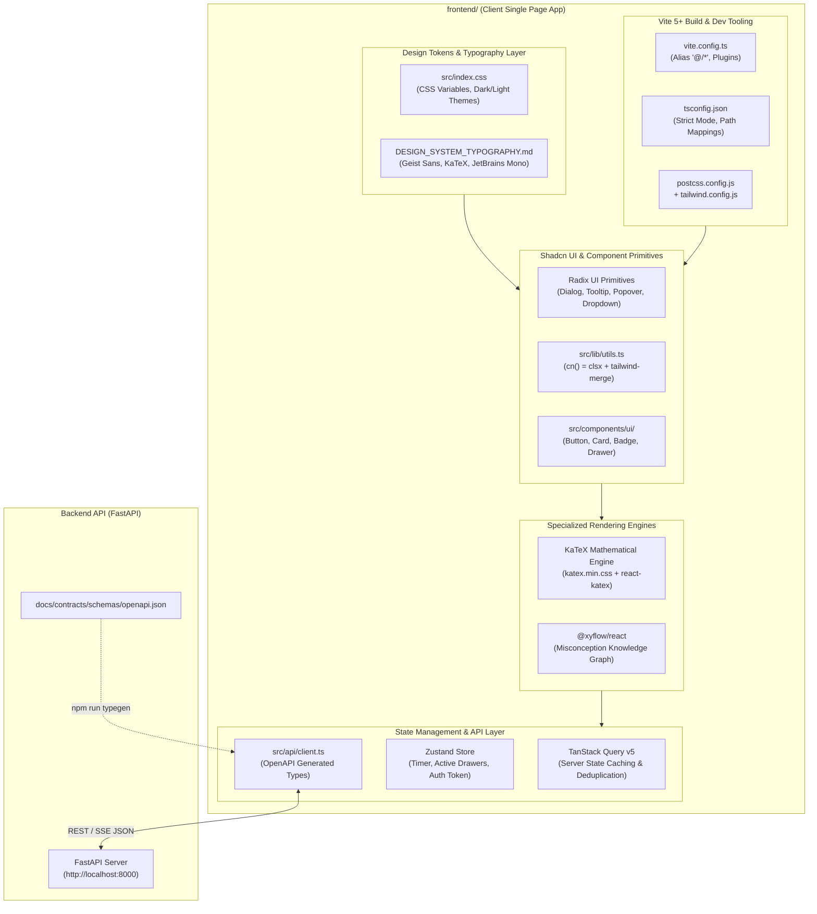
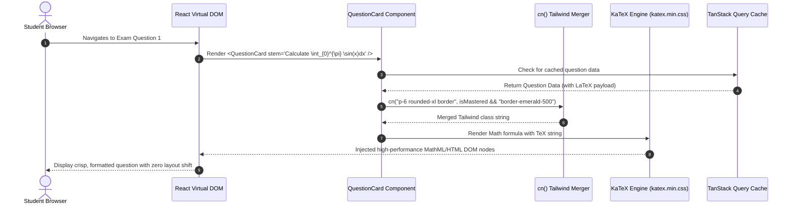
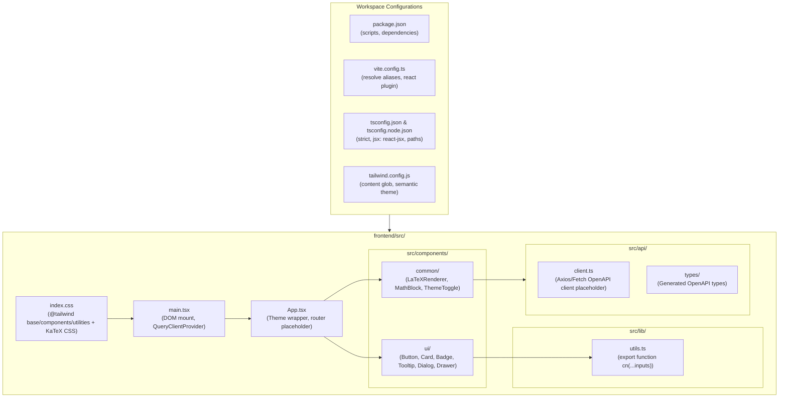

# Stage 1: Conceptual Understanding Artifact
## Task 0.3: React + Vite + TypeScript + Tailwind + Shadcn UI Workspace Scaffold `[FRONTEND]`

**Task ID:** Task 0.3  
**Track:** Frontend Track (React 18+ / TypeScript)  
**Epic:** Epic 0 — Project Architecture Foundations & Environment Setup  
**Accepted Decision Basis:** [ADR-008: Frontend Framework & UI Ecosystem](file:///c:/Users/Muhammad/OneDrive%20-%20Higher%20Education%20Commission/Desktop/AI%20Tutor/Feynman_tutorAI/docs/adr/ADR-008-frontend-framework-and-ui-stack.md), [DESIGN_SYSTEM_TYPOGRAPHY.md](file:///c:/Users/Muhammad/OneDrive%20-%20Higher%20Education%20Commission/Desktop/AI%20Tutor/Feynman_tutorAI/docs/frontend_design/DESIGN_SYSTEM_TYPOGRAPHY.md)

---

## 1. Visual Architecture

Below is the complete client-side architecture overview for the AI Adaptive Exam Learning Platform frontend, showing how the Vite build pipeline, strict TypeScript typing, Tailwind design tokens, Radix UI accessible primitives, KaTeX LaTeX engine, and TanStack Query state store work in harmony.


### System Component Overview (Mermaid)



---

## 2. The Physical Analogy

> Setting up the frontend scaffold is like constructing a **high-precision architectural drafting studio and modular laboratory bench** before starting any building experiments. 
>
> If you start drawing blueprints on a wobbly wooden folding table with mismatched colored markers and no straightedge, every line will be crooked, measurements will mismatch, and you will waste hours erasing mistakes. 
> 
> The Vite workspace, TypeScript strict config, Tailwind token dictionary, and Shadcn UI primitives act as the heavy-duty drafting table, laser alignment guides, calibrated rulers, and standardized drafting templates. With this bench in place, every future feature—from timed exam runners to interactive LaTeX equation calculators and Socratic tutor slide-over drawers—clicks seamlessly into a unified, rock-solid foundation.

---

## 3. Why & What

### 3.1 Why Are We Doing This Task?
* **Product Motivation:** The PRD (§17, §27) dictates an "invisible, distraction-free cognitive workspace" supporting rigorous STEM pedagogy (timed exams, dynamic LaTeX formulas, interactive knowledge graphs, and streaming AI dialogue).
* **Engineering Velocity:** Without a strict, standardized workspace foundation, frontend code quickly devolves into conflicting CSS styles, arbitrary hardcoded pixel values, runtime `undefined is not a function` errors, and uncontrolled bundle sizes.
* **Team Contract Fulfillment:** Establishes the isolated `frontend/` directory boundary required by the Two-Developer Collaboration Contract, preparing the ground for Task 0.5 (OpenAPI TypeScript typegen).

### 3.2 What Is the Concept?
A modern Single-Page Application (SPA) scaffold consisting of:
1. **Vite 5+:** An ES-module-native build tool that provides sub-millisecond Hot Module Replacement (HMR) and optimized Rollup-based production bundling.
2. **TypeScript Strict Mode:** Compile-time type verification ensuring zero implicit `any`, complete null safety, and 100% adherence to API contracts.
3. **Tailwind CSS + CSS Variables:** A semantic token design system defining colors (`mastery-high`, `tutor-accent`), spacing, and typography (`Geist Sans`, `KaTeX`, `JetBrains Mono`) without runtime stylesheet bloat.
4. **Shadcn UI (Radix UI):** Copy-and-own accessible primitives (WAI-ARIA compliant keyboard navigation and screen reader support) styled directly via Tailwind utility classes.
5. **KaTeX Integration:** Pre-compiled mathematical formula styling ensuring zero cumulative layout shift (CLS) during complex equation rendering.

### 3.3 What Breaks If We Skip It?
* **Silent Runtime Crashes:** Without TypeScript strict mode and path aliasing (`@/*`), broken relative import paths (`../../components/button`) and typos in prop names fail silently until user runtime.
* **UI/UX Fragmentation:** Without centralized Tailwind semantic tokens from `DESIGN_SYSTEM_TYPOGRAPHY.md`, different screens will display 10 different shades of green for "Correct" and inconsistent font sizes, creating visual fatigue for students.
* **Accessibility Violations:** Manually coded modals, dropdowns, and drawers often trap keyboard focus or fail screen readers, violating PRD NFR-006.
* **LaTeX Formula Layout Shifts:** Without bundled KaTeX CSS, formulas render as raw LaTeX code (`\int_{0}^{\infty} e^{-x^2} dx`) or cause severe jarring layout shifts as fonts asynchronously load.

---

## 4. Abstraction Level Map

| Level | What Lives Here | Current Project Example / Implementation | Touched in Task 0.3? |
| :--- | :--- | :--- | :---: |
| **Product / UX** | Design system tokens, color palettes, distraction-free exam themes | `DESIGN_SYSTEM_TYPOGRAPHY.md` semantic color classes (`mastery-high`, `tutor-accent`) | **YES** |
| **Application** | Root React entry point, App router container, Query Provider | `frontend/src/App.tsx`, `frontend/src/main.tsx` | **YES** |
| **Framework** | React 18 component tree, Vite build configuration, plugins | `frontend/vite.config.ts`, `frontend/index.html` | **YES** |
| **Library / Primitives** | Radix UI primitives, Tailwind merge utilities, Lucide icons, KaTeX | `frontend/src/lib/utils.ts`, `clsx`, `tailwind-merge`, `lucide-react`, `katex` | **YES** |
| **Runtime** | Browser V8 engine, DOM event loop, CSSOM parser | Browser rendering, Native ES Modules | **YES** |
| **OS / Infrastructure** | Node.js runtime, npm package resolution, file system | `frontend/package.json`, `frontend/tsconfig.json` | **YES** |

---

## 5. Mermaid Diagrams

### 5.1 End-to-End Client Rendering & LaTeX Flow (Sequence Diagram)



### 5.2 Frontend Directory & Dependency Topology (Flowchart)



---

## 6. Data Flow Trace-Through

Below is the step-by-step visual and technical data flow showing how a student request is processed through the frontend layers:


### Execution Trace:
1. **Developer / CI Trigger:** `npm run build` or `npm run dev` executes inside `frontend/`.
2. **Vite Pipeline Activation:** Vite reads `vite.config.ts`, resolves the path alias `@` -> `./src`, and spins up the lightning-fast esbuild dev server.
3. **TypeScript Compilation Check:** `tsc --noEmit` validates all types against `tsconfig.json` in strict mode (checking for zero implicit `any`, exact prop types, and non-nullable assertions).
4. **CSS & Token Processing:** PostCSS and Tailwind CSS process `src/index.css`, compiling the design system tokens (`--mastery-high`, `--tutor-accent`, typography scales) into lightweight utility classes.
5. **Component Mounting:** `src/main.tsx` mounts `<App />` into the HTML `#root` element wrapped inside `QueryClientProvider`.
6. **Shadcn Primitives Execution:** Components in `src/components/ui/` use `cn()` from `src/lib/utils.ts` to merge default Radix styles with caller-supplied Tailwind classes without style conflicts.
7. **KaTeX Formula Rendering:** Any mathematical string wrapped in LaTeX delimiters (e.g., `$$E=mc^2$$`) is parsed by KaTeX and styled via the bundled `katex.min.css`.

---

## 7. Cognitive Model → Code Mapping

| Cognitive Goal | Mental Model | Code Implementation in `frontend/` | Architectural Enforcement |
| :--- | :--- | :--- | :--- |
| **"Make imports clean & maintainable"** | "Use absolute home addresses instead of `../../..` maze" | Path alias in `tsconfig.json` & `vite.config.ts`: `@/*` -> `./src/*` | Compiler error if deep relative imports break during refactors |
| **"Prevent UI style clashing"** | "Intelligently override default styles when customized" | `src/lib/utils.ts`: `cn(...inputs: ClassValue[])` using `clsx` + `tailwind-merge` | Guarantees that `p-4` passed to `<Button className="p-2" />` correctly wins without CSS specificity wars |
| **"Ensure zero UI regressions across themes"** | "Single source of truth for pedagogical colors" | `src/index.css` CSS variables & `tailwind.config.js` theme extension | Changes to `mastery-high` automatically update across cards, badges, and progress bars |
| **"Render math cleanly with zero shift"** | "Preload math font stylesheets so equations don't flicker" | `import "katex/dist/katex.min.css";` in `src/main.tsx` | Eliminates Cumulative Layout Shift (CLS) on exam question render |
| **"Keep bundle size razor-thin"** | "Only ship code that is actually imported and used" | Tree-shakeable Radix primitives + Vite Rollup code splitting | Sub-150KB initial gzip bundle size |

---

## 8. Language/Stack Context

### 8.1 Vite 5 Configuration (`vite.config.ts`)
```typescript
import path from "path";
import react from "@vitejs/plugin-react";
import { defineConfig } from "vite";

export default defineConfig({
  plugins: [react()],
  resolve: {
    alias: {
      "@": path.resolve(__dirname, "./src"),
    },
  },
  server: {
    port: 5173,
    strictPort: true,
  },
});
```

### 8.2 Tailwind CSS Configuration (`tailwind.config.js`)
Configured to strictly support the semantic color tokens from `DESIGN_SYSTEM_TYPOGRAPHY.md`:
* **Pedagogical Colors:** `mastery-high` (`#059669` / `#34D399`), `mastery-medium` (`#D97706` / `#FBBF24`), `mastery-low` (`#E11D48` / `#FB7185`), `tutor-accent` (`#4F46E5` / `#818CF8`).
* **Surfaces & Borders:** `surface-canvas`, `surface-card`, `border-subtle`.
* **Typography:** `Geist Sans`, `Inter`, `JetBrains Mono`.

### 8.3 Class Merging Utility (`src/lib/utils.ts`)
```typescript
import { type ClassValue, clsx } from "clsx";
import { twMerge } from "tailwind-merge";

export function cn(...inputs: ClassValue[]): string {
  return twMerge(clsx(inputs));
}
```

---

## 9. Five Alternative Approaches Comparison

| # | Approach / Architecture | Pros | Cons | Why Rejected / When to Choose |
|---|---|---|---|---|
| **1** | **React 18 + Vite + Tailwind + Shadcn UI (Chosen)** | Blazing fast HMR, zero Node runtime in production, pure static SPA deployability, complete component ownership. | Client-side only (requires client auth token hydration). | **Selected (ADR-008).** Perfectly matches FastAPI modular monolith backend and OpenAPI contract sync. |
| **2** | **Next.js 14+ App Router (SSR)** | Built-in server rendering, automatic file-based routing. | Over-engineered; adds unnecessary Node.js server overhead when FastAPI handles business logic; conflicts with pure OpenAPI codegen. | Rejected. Introduces redundant backend server layer and higher operational complexity. |
| **3** | **Remix / React Router v7 Fullstack** | Built-in loaders/actions, excellent web standard forms. | Opinionated server runtime required; smaller UI ecosystem compared to Vite + Shadcn. | Rejected. We do not need dual Node.js + Python server backends. |
| **4** | **Create React App (CRA) / Webpack** | Historical standard, familiar to legacy teams. | Deprecated, slow build times (5-10x slower than Vite), massive bundle size. | Rejected. Unmaintained by React team. |
| **5** | **Vanilla React + Material UI (MUI Emotion)** | Large pre-made component suite out of the box. | Heavy runtime CSS-in-JS overhead; difficult to customize for distraction-free pedagogical exam modes; poor KaTeX alignment. | Rejected. High bundle weight and runtime style calculation overhead. |

---

## 10. Production Rationale & Consequences

### 10.1 Why This Is Standard
* **Single-Page Application Simplicity:** The AI Adaptive Exam Learning Platform is an authenticated, interactive cognitive web application. An SPA hosted on static CDN / object storage consuming a FastAPI REST + SSE backend is the gold standard for latency, reliability, and cost-efficiency.
* **Component Ownership (Shadcn UI):** Unlike monolithic npm libraries (e.g. MUI or AntD), Shadcn UI copies component code directly into `src/components/ui/`. This allows us to modify the accessible primitives directly for custom pedagogical UX (such as question option card focus states and live timer badges) without wrestling with library CSS overrides.

### 10.2 What Happens If We Skip This (Failure Scenarios)

#### Failure Scenario 1: The "Specificity War" UI Regression Disaster
* **What happens:** A developer builds the exam player question card and adds a custom red border for flagged questions. Without `tailwind-merge` and `clsx` in `cn()`, the default border utility in the base card overrides the flag border unpredictably depending on stylesheet bundling order.
* **Impact:** During high-stakes timed exams, students flag questions to review later, but the UI fails to show the flag badge. Students miss reviewing difficult questions, resulting in false failures and loss of trust in the platform.

#### Failure Scenario 2: Cumulative Layout Shift & LaTeX Math Glitches
* **What happens:** Mathematical questions are rendered without the pre-loaded KaTeX font engine. When a student opens a Physics exam, the question text loads first, and 800ms later the math formula snaps into place, shifting the answer buttons downward right as the student clicks.
* **Impact:** The student accidentally clicks the wrong answer due to sudden button displacement. Layout shifts degrade cognitive focus and induce exam anxiety.

---

## 11. Workflow Checklist

- [x] Visual architecture diagram included (image infographic + Mermaid system topology).
- [x] Data-flow diagram included (image flowchart + Mermaid sequence diagram).
- [x] Physical analogy included (Architect's drafting studio & laboratory bench).
- [x] Why, What, and What Breaks explained with PRD alignment.
- [x] Abstraction level table filled with current-project examples.
- [x] Data-flow trace-through completed step-by-step.
- [x] Cognitive model to code mapping table completed.
- [x] Stack-specific context detailed (Vite, TS strict, Tailwind, Shadcn, KaTeX).
- [x] 5 alternative approaches evaluated and compared.
- [x] 2 concrete production failure scenarios documented.
- [x] Verified zero implementation code committed in Stage 1.
