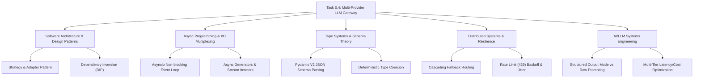

# Stage 3: CS Domain Learning Extraction Artifact
## Task 0.4: Multi-Provider LLM Gateway & Pydantic Validation Engine `[BACKEND]`

**Task ID:** Task 0.4  
**Track:** Backend Track (FastAPI / Python 3.11+)  
**Epic:** Epic 0 — Project Architecture Foundations & Environment Setup  
**Accepted Decision Basis:** [ADR-006: Multi-Provider LLM Gateway](file:///c:/Users/Abdul%20Jabbar%20Metlo/Feynman_tutorAI/docs/adr/ADR-006-llm-provider-abstraction.md), [ADR-017: Structured-Output Validation](file:///c:/Users/Abdul%20Jabbar%20Metlo/Feynman_tutorAI/docs/adr/ADR-006-llm-provider-abstraction.md)

---

## 1. Computer Science Domain Discovery Map



---

## 2. Domain Deep Dives

### Domain 1: Software Architecture — Adapter & Strategy Patterns

#### What Is It (Plain English):
The Strategy and Adapter patterns allow an application to interact with multiple external services through a single, consistent interface. Instead of hardcoding vendor-specific methods like `openai.chat.completions` or `genai.GenerativeModel`, your application calls a standard interface (`generate_text`), and interchangeable "adapter plugs" translate that call for each vendor behind the scenes.

#### Physical Analogy:
A universal power travel adapter. Your laptop charger plug doesn't care whether the wall outlet is in the US (Gemini), UK (Anthropic), Europe (OpenAI), or an off-grid solar generator (Ollama). The adapter bridges the physical pins while delivering standard electricity to your device.

#### How It Works Under the Hood:
```markdown
| Layer | What Happens | Resource / Constraint |
| :--- | :--- | :--- |
| **Application Layer** | Calls `gateway.generate_text()` | Vendor-agnostic Python call |
| **Interface / Protocol** | `LLMProviderBase(ABC)` defines contract | Abstract method enforcement at runtime |
| **Adapter Implementations** | `GeminiProvider`, `OpenAIProvider`, etc. | Serializes payload to vendor JSON format |
| **Transport Layer** | `httpx.AsyncClient` sends HTTP POST | Reuses TLS connection socket |
```

#### Where It Manifests in This Codebase:
- `backend/app/core/llm/base.py`: Declares `LLMProviderBase` with `@abstractmethod`.
- `backend/app/core/llm/providers/`: Encapsulates vendor-specific HTTP formatting.

---

### Domain 2: Concurrency & Async Programming — I/O Multiplexing & Async Generators

#### What Is It (Plain English):
Large language models take hundreds of milliseconds to several seconds to generate responses. If your web server used synchronous (blocking) code, a single LLM call would freeze the entire Python worker, preventing other students from taking tests. Asynchronous programming allows the server to put that request on pause while waiting for network packets, handling thousands of concurrent students on a single CPU thread.

#### Physical Analogy:
A short-order restaurant cook. While waiting for a pizza to bake in the oven (network I/O with an LLM API), the cook doesn't stare motionless at the oven door. They chop vegetables, assemble sandwiches, and take new orders, returning to the pizza only when the timer rings.

#### How It Works Under the Hood:
```python
# Async Iterator Protocol for Token Streaming
async def stream_text(self, prompt: str) -> AsyncIterator[StreamChunk]:
    async with httpx.AsyncClient() as client:
        async with client.stream("POST", self.endpoint, json=payload) as response:
            async for line in response.aiter_lines():
                if line.startswith("data: "):
                    token = parse_sse_line(line)
                    yield StreamChunk(text=token, is_final=False)
```

#### Where It Manifests in This Codebase:
- `backend/app/core/llm/gateway.py`: All public methods are `async def`.
- `backend/app/core/llm/base.py`: `stream_text()` returns `AsyncIterator[StreamChunk]`.

---

### Domain 3: Type Systems & Schema Theory — Pydantic V2 & Structured Output Validation

#### What Is It (Plain English):
LLMs generate probabilistic natural language text, which is inherently unstructured. To build reliable software (e.g. grading exams, calculating mastery scores), the output must conform to an exact, strict data structure with required fields and valid types. Pydantic V2 uses compiled Rust (`pydantic-core`) to validate raw JSON strings directly into strongly typed Python objects with zero runtime guesswork.

#### Physical Analogy:
A shape sorter toy. A wooden cube only fits through the square hole; a sphere only fits through the round hole. If an LLM attempts to pass a malformed object (e.g. missing `correct_answer_index`), the Pydantic validator immediately rejects it before it can corrupt downstream database tables.

#### How It Works Under the Hood:
1. `GeneratedQuestionSchema.model_json_schema()` converts the Python Pydantic class into standard JSON Schema Draft-07.
2. The schema is sent to the LLM as a system instruction / `response_format`.
3. The LLM generates a JSON string.
4. `PydanticOutputValidator` strips any accidental markdown wrapper (````json ... ````) using regular expressions.
5. `GeneratedQuestionSchema.model_validate_json(raw_json)` parses and validates the fields, raising a `ValidationError` if any constraint is violated.

#### Where It Manifests in This Codebase:
- `backend/app/core/llm/validator.py`: `PydanticOutputValidator.validate()`.

---

### Domain 4: Distributed Systems Resilience — Cascading Fallbacks & Backoff

#### What Is It (Plain English):
Cloud AI APIs frequently hit rate limits (HTTP 429: Too Many Requests) or experience temporary downtime (HTTP 503: Service Unavailable). A resilient system defines a priority chain of backup providers. If provider #1 fails, the system catches the exception and immediately retries the request with provider #2 with zero downtime experienced by the user.

#### Physical Analogy:
An emergency backup generator at a hospital. If the primary city power grid fails, the automatic transfer switch instantly detects the voltage drop and starts the diesel generator in under 500 milliseconds.

#### Common Misconceptions:
1. ❌ *"We should just use `try/except Exception: pass` and retry the same API 10 times."*  
   $\rightarrow$ ✅ **Reality:** Retrying a rate-limited API in a tight loop exacerbates server congestion (thundering herd problem). A multi-provider fallback or exponential backoff with jitter is mandatory.
2. ❌ *"If an LLM returns JSON mode, it is guaranteed to have valid fields."*  
   $\rightarrow$ ✅ **Reality:** JSON mode only guarantees valid JSON syntax (brackets and quotes), NOT valid schema semantics or correct field names. Pydantic schema validation is always required.
3. ❌ *"Vendor SDKs are always better than lightweight HTTP clients."*  
   $\rightarrow$ ✅ **Reality:** Heavy vendor SDKs introduce dependency conflicts, version pinning issues, and opaque connection pooling. Clean HTTP clients (`httpx`) provide full transparency and async efficiency.

---

## 3. The Numbers & Constraints That Matter

| Metric / Parameter | Target Value | Architectural Rationale |
| :--- | :--- | :--- |
| **HTTP Connect Timeout** | `5.0s` | Avoid hung sockets if a cloud gateway drops packets |
| **HTTP Read Timeout** | `60.0s` | Allow sufficient time for long reasoning chains (Claude Sonnet / GPT-4o) |
| **Structured Output Temperature** | `0.1 – 0.2` | Minimizes hallucination and maximizes JSON schema adherence |
| **Socratic Chat Temperature** | `0.7` | Enables creative, pedagogically varied Socratic dialogue |
| **Maximum Fallback Hops** | `3` | Prevents infinite loops across misconfigured providers |
