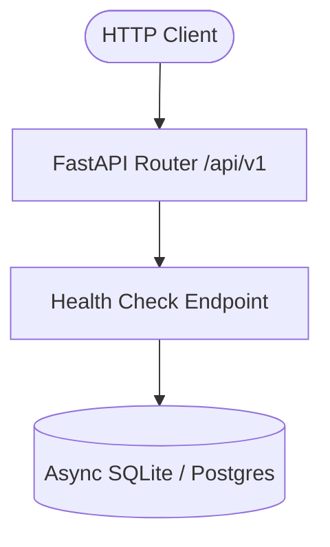
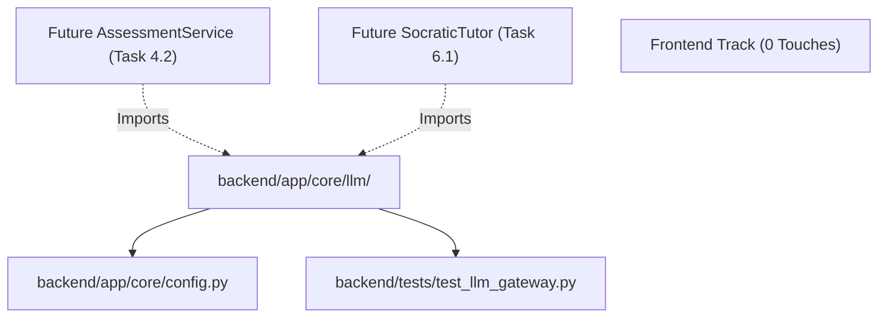

# Stage 2: Codebase Design Artifact
## Task 0.4: Multi-Provider LLM Gateway & Pydantic Validation Engine `[BACKEND]`

**Task ID:** Task 0.4  
**Track:** Backend Track (FastAPI / Python 3.11+)  
**Epic:** Epic 0 — Project Architecture Foundations & Environment Setup  
**Accepted Decision Basis:** [ADR-006: Multi-Provider LLM Gateway](file:///c:/Users/Abdul%20Jabbar%20Metlo/Feynman_tutorAI/docs/adr/ADR-006-llm-provider-abstraction.md), [ADR-017: Structured-Output Validation](file:///c:/Users/Abdul%20Jabbar%20Metlo/Feynman_tutorAI/docs/adr/ADR-006-llm-provider-abstraction.md), PRD §14, §27, FR-023, Constraint #1, #10.

---

## 1. Current State Snapshot

Currently, the backend has the foundational FastAPI modular monolith scaffold with the async database engine:
- `backend/app/core/config.py`: Declares `Settings` with keys (`OPENAI_API_KEY`, `ANTHROPIC_API_KEY`, `GEMINI_API_KEY`, `OLLAMA_BASE_URL`).
- `backend/app/api/v1/endpoints/health.py`: Healthcheck verifying DB connectivity.
- Zero LLM abstraction or provider integration exists yet.



---

## 2. Proposed Target Architecture

```mermaid
graph TD
    subgraph DomainServices ["Downstream Services (Future Tasks)"]
        Assess[AssessmentService / Task 4.2]
        Tutor[SocraticTutorService / Task 6.1]
    end

    subgraph LLMGatewayPackage ["backend/app/core/llm/"]
        Gateway["[NEW] LLMGateway (`gateway.py`)"]
        Validator["[NEW] PydanticOutputValidator (`validator.py`)"]
        Base["[NEW] LLMProviderBase Protocol (`base.py`)"]
        Schemas["[NEW] Models & Errors (`schemas.py`)"]
        
        subgraph Providers ["backend/app/core/llm/providers/"]
            Gemini["[NEW] GeminiProvider (`gemini.py`)"]
            OpenAI["[NEW] OpenAIProvider (`openai.py`)"]
            Anthropic["[NEW] AnthropicProvider (`anthropic.py`)"]
            Ollama["[NEW] OllamaProvider (`ollama.py`)"]
            Mock["[NEW] MockLLMProvider (`mock.py`)"]
        end
    end

    Assess -->|generate_structured()| Gateway
    Tutor -->|stream_text()| Gateway
    Gateway --> Base
    Gateway --> Validator
    Base --> Gemini
    Base --> OpenAI
    Base --> Anthropic
    Base --> Ollama
    Base --> Mock
```

---

## 3. File-Level Impact Analysis

### `[NEW]` `backend/app/core/llm/schemas.py`
- **Purpose**: Defines strongly-typed enums, messages, request/response wrappers, and exception hierarchy.
- **Exports**: `ModelTier` (`REASONING`, `FAST`, `LOCAL`), `LLMMessage`, `LLMResponse`, `StreamChunk`, `LLMProviderError`, `ProviderRateLimitError`, `ProviderAuthError`, `SchemaValidationError`.
- **Consumers**: `base.py`, `gateway.py`, `validator.py`, provider adapters, and domain services.

### `[NEW]` `backend/app/core/llm/base.py`
- **Purpose**: Declares the abstract base protocol `LLMProviderBase(ABC)` that all provider adapters must implement.
- **Methods**:
  - `async def generate_text(prompt: str, system_prompt: str | None, temperature: float, **kwargs) -> LLMResponse`
  - `async def generate_json(prompt: str, json_schema: dict, system_prompt: str | None, **kwargs) -> str`
  - `async def stream_text(prompt: str, system_prompt: str | None, **kwargs) -> AsyncIterator[StreamChunk]`
- **Consumers**: `gateway.py`, provider adapters.

### `[NEW]` `backend/app/core/llm/validator.py`
- **Purpose**: Strict Pydantic V2 schema validation, markdown codeblock stripping (````json ... ````), JSON parsing, and schema error formatting.
- **Exports**: `PydanticOutputValidator.validate(raw_text: str, response_model: Type[T]) -> T`.
- **Consumers**: `gateway.py`.

### `[NEW]` `backend/app/core/llm/providers/gemini.py`
- **Purpose**: Native async HTTP adapter for Google Gemini 1.5 Pro & Flash via REST and SSE.
- **Consumers**: `gateway.py`.

### `[NEW]` `backend/app/core/llm/providers/openai.py`
- **Purpose**: Native async HTTP adapter for OpenAI (GPT-4o, GPT-4o-mini) and OpenRouter compatible endpoints with `response_format={"type": "json_object"}`.
- **Consumers**: `gateway.py`.

### `[NEW]` `backend/app/core/llm/providers/anthropic.py`
- **Purpose**: Native async HTTP adapter for Anthropic Claude 3.5 Sonnet & Haiku messages API.
- **Consumers**: `gateway.py`.

### `[NEW]` `backend/app/core/llm/providers/ollama.py`
- **Purpose**: Local Ollama HTTP adapter (`http://localhost:11434/api/chat`) for offline development.
- **Consumers**: `gateway.py`.

### `[NEW]` `backend/app/core/llm/providers/mock.py`
- **Purpose**: Deterministic, zero-network mock provider with configurable responses and error simulation (e.g. simulating HTTP 429 to test fallback).
- **Consumers**: Pytest test suite (`backend/tests/test_llm_gateway.py`).

### `[NEW]` `backend/app/core/llm/gateway.py`
- **Purpose**: Central routing orchestrator. Resolves default and fallback provider chains based on `ModelTier`, executes retry with exponential backoff on transient errors, passes raw text through `PydanticOutputValidator`, and exposes dependency injection helper `get_llm_gateway()`.
- **Consumers**: FastAPI endpoints and future domain services.

### `[NEW]` `backend/app/core/llm/__init__.py`
- **Purpose**: Clean public package exports for `backend/app/core/llm`.

### `[NEW]` `backend/tests/test_llm_gateway.py`
- **Purpose**: Automated test suite testing text generation, structured Pydantic extraction, streaming token generator, multi-provider fallback on rate-limit errors, and mock provider verification.

---

## 4. Blast Radius & Dependency Graph



- **Blast Radius**: 🟢 **LOW / ISOLATED**
- Strictly confined to `backend/app/core/llm/` and `backend/tests/`. Zero breaking changes to existing endpoints (`/healthz`). Zero touches to `frontend/`.

---

## 5. Regression Risk Matrix

| Risk ID | Risk Description | Severity | Affected Area | Mitigation Strategy |
| :--- | :--- | :---: | :--- | :--- |
| **R-01** | Missing API keys in local development environment | 🟡 Medium | Developer local run | Graceful fallback to `MockLLMProvider` or `OllamaProvider` when keys are empty |
| **R-02** | LLM outputs markdown fences (````json ... ````) breaking `json.loads` | 🟡 Medium | Structured output | Regex sanitizer stripping markdown fences in `validator.py` |
| **R-03** | Transient HTTP 429/503 during live student exam | 🔴 High | Live exam session | Multi-provider fallback chain immediately tries secondary provider |
| **R-04** | Infinite fallback loop on fatal configuration error | 🟡 Medium | Gateway router | Maximum hop limit (max 3 provider attempts) before raising `LLMProviderError` |

---

## 6. Contract Stability Check

| Contract / Interface | Current Shape | Proposed Shape | Changed? | Breaking? |
| :--- | :--- | :--- | :---: | :---: |
| `GET /api/v1/health` | Health response JSON | Unchanged | No | No |
| `LLMProviderBase` | None (New) | Protocol with `generate_text`, `generate_json`, `stream_text` | New | No |
| `LLMGateway` | None (New) | Service with fallback routing & Pydantic validation | New | No |

---

## 7. Performance & Security Considerations

- **Async Concurrency**: All network calls use non-blocking `httpx.AsyncClient` with reusable connection pools.
- **Credential Protection**: API keys are loaded exclusively through `pydantic-settings` from environment variables, never hardcoded or logged in plaintext.
- **Prompt Injection Defense**: Base prompt schemas enforce strict system instructions and structured Pydantic output schemas.
