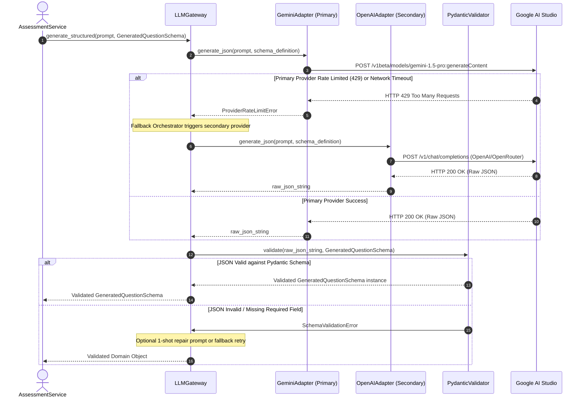

# Stage 1: Conceptual Understanding Artifact
## Task 0.4: Multi-Provider LLM Gateway & Pydantic Validation Engine `[BACKEND]`

**Task ID:** Task 0.4  
**Track:** Backend Track (FastAPI / Python 3.11+)  
**Epic:** Epic 0 — Project Architecture Foundations & Environment Setup  
**Accepted Decision Basis:** [ADR-006: Multi-Provider LLM Gateway](file:///c:/Users/Abdul%20Jabbar%20Metlo/Feynman_tutorAI/docs/adr/ADR-006-llm-provider-abstraction.md), [ADR-017: Structured-Output Validation Framework](file:///c:/Users/Abdul%20Jabbar%20Metlo/Feynman_tutorAI/docs/adr/ADR-006-llm-provider-abstraction.md), PRD §14, §27, FR-023, Constraint #1, #10.

---

## 1. Visual Architecture

```mermaid
flowchart TB
    subgraph ClientLayers ["Client & Domain Services"]
        AssessSvc["Assessment & Question Generator<br/>(Task 4.2 / High Reasoning Tier)"]
        TutorSvc["Socratic Tutor SSE Streamer<br/>(Task 6.1 / Fast Interactive Tier)"]
        DiagnosticSvc["Misconception Classifier<br/>(Task 5.2 / Structured Tier)"]
    end

    subgraph LLMGatewayCore ["Core LLM Gateway Layer (`backend/app/core/llm/`)"]
        Gateway["LLMGateway Router & Fallback Orchestrator<br/>(`gateway.py`)"]
        PydanticGuard["Pydantic V2 Schema Validator & Repair Loop<br/>(`validator.py`)"]
        BaseProtocol["LLMProviderBase Abstract Protocol<br/>(`base.py`)"]
    end

    subgraph ProviderAdapters ["Concrete Async Adapters (`backend/app/core/llm/providers/`)"]
        GeminiAdapter["Google Gemini Adapter<br/>(`gemini.py` / Gemini 1.5 Pro & Flash)"]
        OpenAIAdapter["OpenAI / OpenRouter Adapter<br/>(`openai.py` / GPT-4o & GPT-4o-mini)"]
        AnthropicAdapter["Anthropic Adapter<br/>(`anthropic.py` / Claude 3.5 Sonnet & Haiku)"]
        OllamaAdapter["Local Ollama Adapter<br/>(`ollama.py` / Llama 3.1 & Qwen 2.5)"]
    end

    subgraph ExternalAPIs ["External LLM Endpoints & Local Runtime"]
        GoogleCloud["Google AI Studio API"]
        OpenAIEndpoint["OpenAI / OpenRouter API"]
        AnthropicAPI["Anthropic Claude API"]
        LocalDaemon["Localhost:11434 (Ollama)"]
    end

    AssessSvc -->|generate_structured(schema)| Gateway
    TutorSvc -->|stream_text(prompt)| Gateway
    DiagnosticSvc -->|generate_structured(schema)| Gateway

    Gateway --> BaseProtocol
    Gateway --> PydanticGuard

    BaseProtocol --> GeminiAdapter
    BaseProtocol --> OpenAIAdapter
    BaseProtocol --> AnthropicAdapter
    BaseProtocol --> OllamaAdapter

    GeminiAdapter -->|HTTPS REST / SSE| GoogleCloud
    OpenAIAdapter -->|HTTPS REST / SSE| OpenAIEndpoint
    AnthropicAdapter -->|HTTPS REST / SSE| AnthropicAPI
    OllamaAdapter -->|HTTP localhost| LocalDaemon

    GeminiAdapter -.->|Raw JSON| PydanticGuard
    OpenAIAdapter -.->|Raw JSON| PydanticGuard
    PydanticGuard -->|Validated Domain Object| AssessSvc
```

---

## 2. The Physical Analogy

> Think of the **Multi-Provider LLM Gateway** like an **International Diplomatic Translation Agency with a Strict Quality Inspector**:
> 
> 1. **The Client (Domain Service)** needs an essay translated into a certified legal deed with strict standard clauses (a structured Pydantic model).
> 2. **The Agency Desk (LLMGateway)** doesn't do the raw translation itself. It knows 4 distinct translation desks: Google Desk, Anthropic Desk, OpenAI Desk, and an in-house Local Desk.
> 3. If the primary desk is closed due to a sudden strike or quota limit (HTTP 429 / 503), the Agency Desk instantly routes the job to the next backup desk without the client ever knowing or needing to rewrite their request.
> 4. Before handing the translated document back to the client, the **Quality Inspector (Pydantic Validator)** verifies every single field and stamp against the official law book. If a clause is missing or malformed, the document is rejected or sent back for immediate correction. Raw, uncertified drafts are **never** permitted to enter the official court records.

---

## 3. Why & What

### Why are we doing this task?
1. **Zero Vendor Lock-in (PRD Constraint #10 & FR-023)**: No provider SDK or vendor-specific API structures may ever contaminate our domain logic (`AssessmentService`, `SocraticTutorService`, `MasteryService`).
2. **AI Safety & Integrity (PRD Constraint #1 & FR-001)**: Raw, untyped LLM text outputs must never mutate student learning state directly. Every structured response must be validated against a Pydantic schema before entering domain boundaries.
3. **High Availability & Fault Tolerance**: Public LLM APIs experience transient rate limits, token exhaustion, and cloud outages. Dynamic multi-provider fallback guarantees 99.9% uptime for active student exam sessions.
4. **Zero-Setup Local Dev & Fast CI**: Developers without paid API keys and automated CI pipelines can execute unit tests offline against local Ollama or lightweight deterministic mock adapters.

### What is the concept?
An async multi-provider gateway that provides a unified, vendor-agnostic Python interface (`generate_text`, `generate_structured`, `stream_text`) backed by interchangeable adapters (Gemini, OpenAI, Anthropic, Ollama), integrated retry/fallback logic, and strict Pydantic V2 schema validation.

### What breaks if we skip it?
- A service calling `openai.chat.completions.create()` directly binds the entire product to OpenAI. If OpenAI experiences downtime or price hikes, the entire platform goes down.
- If an LLM returns JSON missing `correct_answer_index` or with invalid option counts, downstream assessment scoring crashes at runtime in front of students.
- Mocking and unit testing downstream services becomes complex and brittle.

---

## 4. Abstraction Level Map

| Level | What Lives Here | Current Project Implementation |
| :--- | :--- | :--- |
| **Product / UX** | Student Socratic chat, Question generation | Distraction-free exam player, Socratic drawer |
| **Application Layer** | Question Lab, Tutor Orchestrator, Error Bank | `services/assessment_service.py`, `services/tutor_service.py` |
| **Gateway Layer (Touches This Task)** | Multi-provider router, fallback policies, Pydantic guard | `backend/app/core/llm/gateway.py`, `backend/app/core/llm/validator.py` |
| **Adapter Layer (Touches This Task)** | Provider protocols, HTTP serialization, streaming generators | `backend/app/core/llm/providers/` (`gemini.py`, `openai.py`, `anthropic.py`, `ollama.py`) |
| **Network / Transport** | Async HTTP/2 connection pooling, SSE streaming | `httpx.AsyncClient` |
| **OS / Runtime** | Python 3.11+ `asyncio` event loop, environment variables | `pydantic-settings`, `.env` |

---

## 5. Sequence & Flow Diagrams

### Sequence Diagram: Structured Question Generation with Fallback & Validation



---

## 6. Data Flow Trace-Through

1. **Invocation**: `AssessmentService` calls `llm_gateway.generate_structured(prompt, response_model=GeneratedQuestionSchema, tier=ModelTier.REASONING)`.
2. **Model & Route Selection**: `LLMGateway` checks configuration; resolves primary provider (e.g. `Gemini`) and fallback chain (`[Gemini -> OpenAI -> Anthropic -> Ollama]`).
3. **Payload Construction**: The adapter formats system instructions, user prompts, JSON schema constraints, and temperature (e.g. `0.2` for deterministic structure).
4. **Async Execution**: `httpx.AsyncClient` executes the HTTP POST request to the provider endpoint with connection timeout guards.
5. **Resilience Interception**: If an HTTP 429/5xx occurs, `LLMGateway` logs a warning and retries against the next provider in the fallback chain.
6. **Schema Validation**: `PydanticValidator.validate_and_parse(response_text, response_model)` parses the JSON and constructs the strongly typed Pydantic instance.
7. **Return**: The clean, validated Pydantic model is returned to `AssessmentService` with 100% type safety.

---

## 7. Cognitive Model $\to$ Code Mapping

| Cognitive Stage | Mental Model | Code Concept in This Project | Enforcement / Guardrail |
| :--- | :--- | :--- | :--- |
| **1. Contract** | "Every provider must know how to generate text, JSON, and stream tokens" | `LLMProviderBase(ABC)` in `backend/app/core/llm/base.py` | Python `abc.abstractmethod` enforcement |
| **2. Routing & Fallback** | "If desk A is busy, call desk B immediately" | `LLMGateway.generate_with_fallback()` in `gateway.py` | Provider catch block on `ProviderAPIError` |
| **3. Quality Gate** | "Never accept a malformed document" | `PydanticValidator.parse_json()` in `validator.py` | `pydantic.ValidationError` trapping |
| **4. Token Streaming** | "Deliver words one by one as they arrive" | `AsyncIterator[str]` in `base.py` & `gateway.py` | `yield` async generator protocol |

---

## 8. Five Alternative Approaches Comparison

| # | Alternative | Pros | Cons | Decision |
|---|---|---|---|---|
| **1** | **Custom Async Gateway + Pydantic V2 (Our Choice)** | 100% vendor independence, zero framework bloat, strict typing, native `httpx` async performance. | Requires writing 4 concise adapters (~80 lines each). | ✅ **SELECTED (ADR-006)** |
| **2** | **LiteLLM / Instructor Wrapper** | Unified proxy syntax. | Adds third-party dependency, potential async Windows conflicts, opaque error wrapping. | ❌ Rejected (Custom provides cleaner control) |
| **3** | **LangChain / LangGraph** | Huge prebuilt toolset. | Heavyweight, frequent breaking changes, difficult streaming SSE internals, violates PRD Const #1. | ❌ Rejected |
| **4** | **LlamaIndex** | Good RAG abstractions. | High abstraction overhead, opinionated query engines that clash with custom IRT/BKT state machines. | ❌ Rejected |
| **5** | **Hardcoded Single Provider SDK (OpenAI only)** | Fastest initial prototype. | Vendor lock-in, crashes on rate limits, directly violates PRD Constraint #10. | ❌ **FORBIDDEN (Gate 10)** |

---

## 9. Production Rationale & Consequences

### Why This Is Standard:
- **Portability**: Switching from Gemini to OpenAI or local Ollama requires updating a single `.env` setting (`DEFAULT_LLM_PROVIDER="gemini"`) with zero changes to business logic.
- **Cost Optimization**: Fast classifications and simple hints can use cheap models (Gemini Flash / GPT-4o-mini), while question generation uses frontier reasoning models (Sonnet / GPT-4o).
- **Zero Hallucinated Schema Drift**: By using Pydantic V2 models as the single source of truth for both schema generation and response validation, frontend contracts and backend database models never drift.

### What Happens If We Skip This:
- Direct vendor imports throughout `backend/app/services/` will make migrating providers an expensive multi-week refactor.
- Unvalidated LLM outputs will cause runtime `KeyError` exceptions when parsing responses during live student exams.
