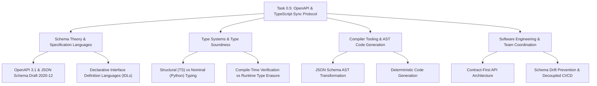

# Stage 3: CS Domain Learning Extraction Artifact
## Task 0.5: OpenAPI Contract Generation & TypeScript Sync Protocol `[SHARED]`

**Task ID:** Task 0.5  
**Track:** Shared Track (Backend Lead & Frontend Developer)  
**Epic:** Epic 0 — Project Architecture Foundations & Environment Setup  
**Accepted Decision Basis:** [ADR-008: Frontend Framework & UI Stack](file:///c:/Users/Abdul%20Jabbar%20Metlo/Feynman_tutorAI/docs/adr/ADR-008-frontend-framework-and-ui-stack.md), [CONTRACT-PROTOCOL.md](file:///c:/Users/Abdul%20Jabbar%20Metlo/Feynman_tutorAI/docs/contracts/CONTRACT-PROTOCOL.md)

---

## 1. Computer Science Domain Discovery Map



---

## 2. Domain Deep Dives

### Domain 1: Schema Theory — Declarative Interface Definition Languages (IDLs)

#### What Is It (Plain English):
An Interface Definition Language (IDL) is a standardized, language-agnostic format used to describe how software programs communicate with each other. OpenAPI (formerly Swagger) is the world's most widely adopted REST IDL. It describes every URL path, HTTP method, required query parameter, and JSON response structure in a machine-readable JSON/YAML format.

#### Physical Analogy:
A universal shipping container specification. Ports, cargo ships, cranes, and trucks across 100 different countries all agree on the exact dimensions and locking pins of standard shipping containers. No matter what company makes the crane or the ship, the containers always lock securely into place without custom adapters.

#### How It Works Under the Hood:
FastAPI reflects upon Python type annotations and Pydantic schemas using Python's `inspect` and `pydantic.model_json_schema()` to dynamically assemble the OpenAPI 3.1.0 dictionary (`app.openapi()`).

```markdown
| Layer | Representation | Example |
| :--- | :--- | :--- |
| **Backend Definition** | Python Pydantic Model | `class HealthResponse(BaseModel): status: str` |
| **Contract (IDL)** | OpenAPI 3.1 JSON Schema | `{"type": "object", "properties": {"status": {"type": "string"}}}` |
| **Frontend Consumption** | TypeScript Type Interface | `export interface HealthResponse { status: string; }` |
```

---

### Domain 2: Type Systems — Structural vs Nominal Typing

#### What Is It (Plain English):
Different programming languages check types differently. Python with Pydantic uses **Nominal Typing** (an object is only an instance of `User` if it was explicitly constructed as a `User` class). TypeScript uses **Structural Typing** (often called "duck typing at compile time": if an object has the required properties and types of a `User`, TypeScript considers it a valid `User` regardless of how it was created).

#### Physical Analogy:
- **Nominal Typing (Python):** An official passport. You can only enter if you present a document that is explicitly stamped as a passport.
- **Structural Typing (TypeScript):** A height marker at a roller coaster. As long as you are at least 48 inches tall (matching the shape), you are allowed on the ride, regardless of your age or name.

#### Why This Matters for OpenAPI Generation:
`openapi-typescript` translates Pydantic's nominal models into TypeScript's structural interfaces, guaranteeing that any plain JavaScript object returned from `fetch()` or `axios` matches the compile-time expectations of React components.

---

### Domain 3: Compiler Tooling — Abstract Syntax Tree (AST) Code Generation

#### What Is It (Plain English):
`openapi-typescript` does not use simple "string concatenation" or templates to write TypeScript files. It parses `openapi.json` into an **Abstract Syntax Tree (AST)** — a hierarchical tree representation of programming language syntax — and transforms the JSON Schema AST into a TypeScript AST before emitting formatted code.

#### Physical Analogy:
A translator reading a sentence in Japanese, building a mental diagram of the grammatical subjects and verbs (the AST), and then constructing an accurate English sentence, rather than looking up words one by one in a pocket dictionary.

#### Common Misconceptions:
1. ❌ *"Frontend TypeScript types protect our app from runtime API crashes."*  
   $\rightarrow$ ✅ **Reality:** TypeScript types are completely erased at runtime (`type erasure`). If the backend changes without updating the contract, TypeScript cannot stop a mismatch in the browser. Automated schema sync in CI is the only guarantee.
2. ❌ *"We should generate runtime Axios API client classes automatically."*  
   $\rightarrow$ ✅ **Reality:** Full SDK generators (`openapi-generator-cli`) produce thousands of lines of bloated, opinionated boilerplate that breaks custom caching and auth interceptors. Generating **pure types only** (`openapi-typescript`) gives 100% type safety with zero runtime bloat.

---

## 3. The Numbers & Constraints That Matter

| Metric / Parameter | Target Value | Architectural Rationale |
| :--- | :--- | :--- |
| **Schema Generation Time** | `< 100ms` | Instant local export via Python CLI |
| **TypeScript Codegen Time** | `< 1.0s` | Instant compilation via `openapi-typescript` |
| **Runtime Bundle Overhead** | `0 bytes` | Pure TypeScript interfaces are completely erased during Vite build |
| **OpenAPI Specification Version** | `3.1.0` | Native support for JSON Schema Draft 2020-12 |
