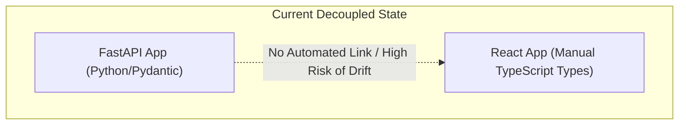
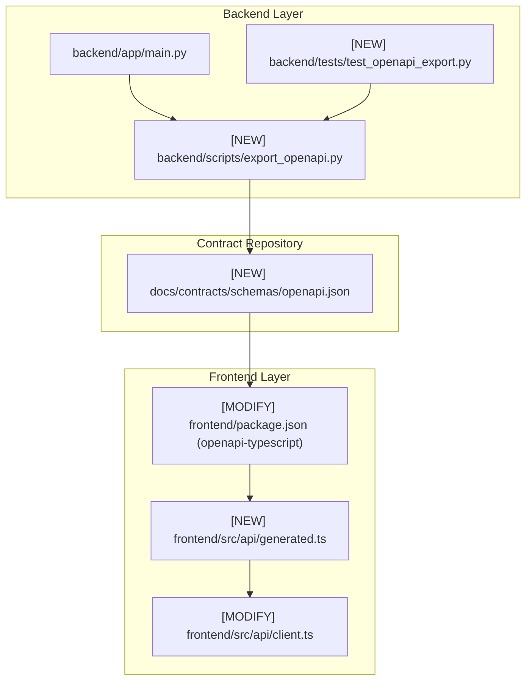
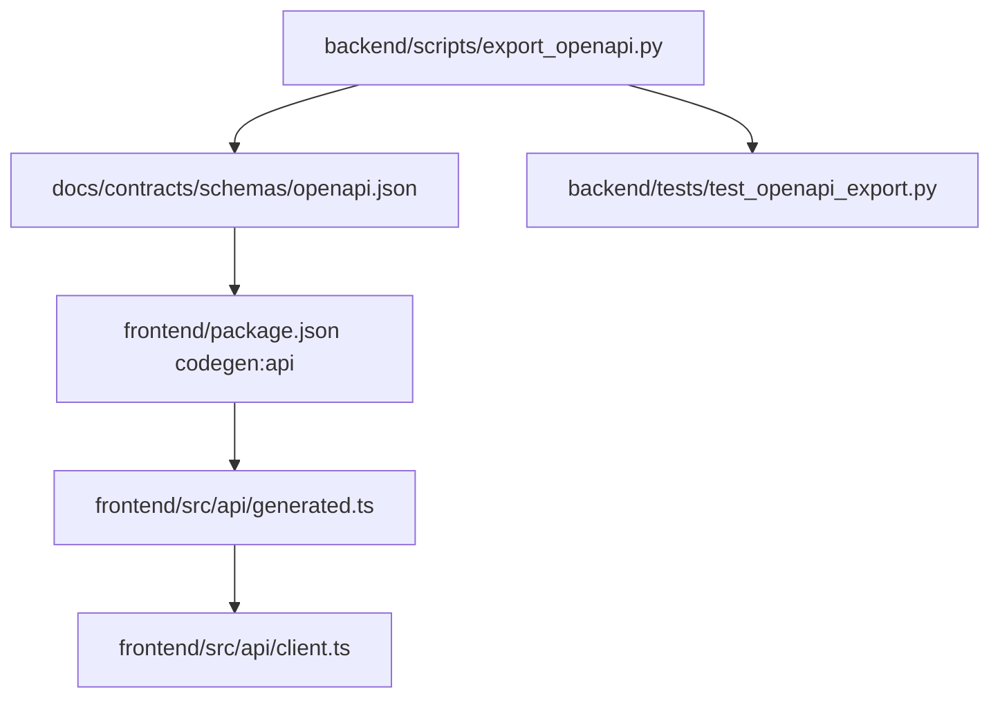

# Stage 2: Codebase Design Artifact
## Task 0.5: OpenAPI Contract Generation & TypeScript Sync Protocol `[SHARED]`

**Task ID:** Task 0.5  
**Track:** Shared Track (Backend Lead & Frontend Developer)  
**Epic:** Epic 0 — Project Architecture Foundations & Environment Setup  
**Accepted Decision Basis:** [ADR-008: Frontend Framework & UI Stack](file:///c:/Users/Abdul%20Jabbar%20Metlo/Feynman_tutorAI/docs/adr/ADR-008-frontend-framework-and-ui-stack.md), [CONTRACT-PROTOCOL.md](file:///c:/Users/Abdul%20Jabbar%20Metlo/Feynman_tutorAI/docs/contracts/CONTRACT-PROTOCOL.md), PRD §27, §28.

---

## 1. Current State Snapshot

- **Backend**: FastAPI app initialized in `backend/app/main.py` with versioned routers `/api/v1/` and health endpoints.
- **Frontend**: React + Vite + TypeScript workspace in `frontend/` with manual type definitions in `src/types/`.
- **Contract Layer**: `docs/contracts/CONTRACT-PROTOCOL.md` exists, but `docs/contracts/schemas/openapi.json` and automated codegen pipelines are not yet established.

---

## 2. Proposed Target Architecture

---

## 3. File-Level Impact Analysis

### `[NEW]` `backend/scripts/export_openapi.py`
- **Purpose**: Standalone CLI script to export the current FastAPI application's OpenAPI schema into `docs/contracts/schemas/openapi.json`.
- **Key Functions**: `export_schema(output_path: Path = Path("docs/contracts/schemas/openapi.json")) -> None`.
- **Dependencies**: Imports `app` from `backend.app.main`.

### `[NEW]` `docs/contracts/schemas/openapi.json`
- **Purpose**: The canonical OpenAPI 3.1.0 specification representing all active backend endpoints, request parameters, response models, and security schemes.
- **Consumers**: Frontend `openapi-typescript` generator, API documentation, API testing tools.

### `[MODIFY]` `frontend/package.json`
- **What changes**:
  - Add `devDependencies`: `"openapi-typescript": "^7.6.1"`.
  - Add `scripts`:
    - `"codegen:api": "openapi-typescript ../docs/contracts/schemas/openapi.json -o src/api/generated.ts"`.
    - `"verify:contract": "npm run codegen:api && tsc -b"`.
- **Why**: Provides automated npm scripts for frontend type generation.

### `[NEW]` `frontend/src/api/generated.ts`
- **Purpose**: Auto-generated TypeScript definitions matching the exact OpenAPI schema components and path operations.
- **Consumers**: `frontend/src/api/client.ts`, domain API modules, and UI stores.

### `[MODIFY]` `frontend/src/api/client.ts`
- **What changes**: Export type helpers referencing `paths` and `components` from `@/api/generated`.

### `[NEW]` `backend/tests/test_openapi_export.py`
- **Purpose**: Automated test verifying the export script runs without error, generates valid JSON schema, and contains all expected endpoints.

---

## 4. Blast Radius & Dependency Graph

- **Blast Radius**: 🟢 **LOW / ADDITIVE**
- Purely additive tooling. Zero breaking changes to existing endpoints or frontend UI components.

---

## 5. Regression Risk Matrix

| Risk ID | Risk Description | Severity | Affected Area | Mitigation Strategy |
| :--- | :--- | :---: | :--- | :--- |
| **R-01** | Relative path mismatch between OS platforms (Windows vs Linux) | 🟡 Medium | Schema file export | Use `pathlib.Path` with workspace root resolution |
| **R-02** | Stale schema in git repository | 🟡 Medium | Contract sync | Automated test `test_openapi_export.py` verifying generated schema is up to date |
| **R-03** | `openapi-typescript` version compatibility | 🟢 Low | Frontend build | Pin exact version `^7.6.1` in `package.json` |

---

## 6. Contract Stability Check

| Interface | Current State | Proposed State | Changed? | Breaking? |
| :--- | :--- | :--- | :---: | :---: |
| `docs/contracts/schemas/openapi.json` | None (New) | OpenAPI 3.1.0 JSON Specification | New | No |
| `npm run codegen:api` | None (New) | Generates `src/api/generated.ts` | New | No |

---

## 7. Performance & Security Considerations

- **Build-Time Execution**: Type generation runs exclusively at build/dev time; zero runtime overhead on client or server.
- **Zero Secret Exposure**: OpenAPI specification contains only route shapes and schema structures; zero secrets or tokens are ever exported.
