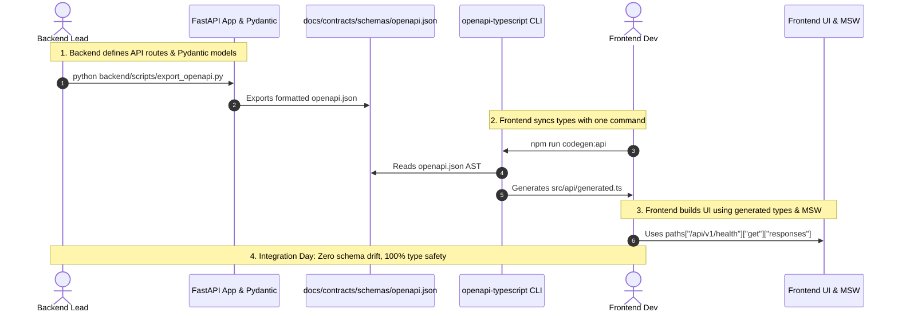

# Stage 1: Conceptual Understanding Artifact
## Task 0.5: OpenAPI Contract Generation & TypeScript Sync Protocol `[SHARED]`

**Task ID:** Task 0.5  
**Track:** Shared Track (Backend Lead & Frontend Developer)  
**Epic:** Epic 0 — Project Architecture Foundations & Environment Setup  
**Accepted Decision Basis:** [ADR-008: Frontend Framework & UI Stack](file:///c:/Users/Abdul%20Jabbar%20Metlo/Feynman_tutorAI/docs/adr/ADR-008-frontend-framework-and-ui-stack.md), [CONTRACT-PROTOCOL.md](file:///c:/Users/Abdul%20Jabbar%20Metlo/Feynman_tutorAI/docs/contracts/CONTRACT-PROTOCOL.md), PRD §27, §28.

---

## 1. Visual Architecture

```mermaid
flowchart TB
    subgraph BackendTrack ["Backend Track (FastAPI / Python)"]
        FastAPIRouter["FastAPI Endpoints & Routers<br/>(`/api/v1/...`)"]
        PydanticSchemas["Pydantic V2 Request & Response Models"]
        ExportScript["`backend/scripts/export_openapi.py`<br/>(Extracts `app.openapi()`)"]
    end

    subgraph SingleSourceOfTruth ["Shared Contract Layer (`docs/contracts/`)"]
        OpenAPISpec["`docs/contracts/schemas/openapi.json`<br/>(Standard OpenAPI 3.1.0 Specification)"]
    end

    subgraph FrontendTrack ["Frontend Track (React / TypeScript)"]
        CodegenTool["`openapi-typescript` CLI Engine<br/>(`npm run codegen:api`)"]
        GeneratedTypes["`frontend/src/api/generated.ts`<br/>(Strict TypeScript Interfaces)"]
        TypedClient["Type-Safe API Client / TanStack Query<br/>(`frontend/src/api/client.ts`)"]
        MSWMocks["Mock Service Worker & Test Fixtures<br/>(`frontend/src/mocks/`)"]
    end

    FastAPIRouter --> PydanticSchemas
    PydanticSchemas --> ExportScript
    ExportScript -->|Automated Export| OpenAPISpec

    OpenAPISpec -->|Type Generation| CodegenTool
    CodegenTool --> GeneratedTypes
    GeneratedTypes --> TypedClient
    GeneratedTypes --> MSWMocks

    TypedClient -.->|Zero Contract Mismatch| FastAPIRouter
```

---

## 2. The Physical Analogy

> Think of the **Contract-First OpenAPI Sync Protocol** like **Architectural Blueprints for a Modular Building Project**:
> 
> 1. **The Structural Engineer (Backend Lead)** designs the exact dimensions, load-bearing columns, and plumbing pipe connectors (FastAPI Pydantic models).
> 2. Rather than shouting verbal instructions or sending informal messages, the engineer stamps an **Official Blueprint Standard (`openapi.json`)** into the central site trailer (`docs/contracts/schemas/`).
> 3. **The Interior Prefabrication Team (Frontend Developer)** immediately feeds the digital blueprint into their automated laser cutter (`openapi-typescript`), which instantly manufactures exact matching wall panels and pipe sockets (`generated.ts`).
> 4. While the foundation is being poured, the interior team can build out the entire kitchen and living room using replica simulator pipes (MSW Mocks) with 100% certainty that on installation day, every single valve and socket will click together with **zero manual adjustments and zero leaks**.

---

## 3. Why & What

### Why are we doing this task?
1. **Zero Blocking Bottlenecks in 2-Person Teams**: In a two-developer project, the frontend developer should never be blocked waiting for backend endpoints to be deployed, nor should the backend developer build endpoints that don't match frontend UI data needs.
2. **Elimination of Schema Drift**: Manual duplicate typing (e.g. writing a Pydantic model in Python and manually retyping an interface in TypeScript) always drifts over time, resulting in runtime `TypeError: undefined is not an object` in production.
3. **Compile-Time Contract Guarantees**: If the backend renames a field (e.g. `is_active` $\rightarrow$ `status`), running the sync script immediately triggers TypeScript compiler errors at every frontend call site before code is ever merged.

### What is the concept?
An automated two-way synchronization bridge between FastAPI's self-documenting Pydantic schema engine and TypeScript's compile-time type system, using `docs/contracts/schemas/openapi.json` as the immutable single source of truth.

### What breaks if we skip it?
- Frontend developers manually guess backend response shapes from memory.
- Small backend changes (e.g. converting an integer timestamp to an ISO-8601 string or optional field) go undetected until a student's exam crashes in production.
- Integration testing between tracks becomes a painful, manual debugging session.

---

## 4. Abstraction Level Map

| Level | What Lives Here | Current Project Implementation |
| :--- | :--- | :--- |
| **Contract (Touches Task)** | OpenAPI 3.1.0 JSON Schema | `docs/contracts/schemas/openapi.json` |
| **Backend Export (Touches Task)** | Python CLI Schema Generator | `backend/scripts/export_openapi.py` |
| **Frontend Codegen (Touches Task)** | AST TypeScript Type Compiler | `openapi-typescript` $\rightarrow$ `frontend/src/api/generated.ts` |
| **API Client (Touches Task)** | Type-safe fetch / Axios client | `frontend/src/api/client.ts` |
| **Mocking / Test Harness** | Mock Service Worker / fixtures | `frontend/src/mocks/` |

---

## 5. Sequence Diagram: Contract-First Development Lifecycle



---

## 6. Data Flow Trace-Through

1. **Backend Export**: Developer runs `py backend/scripts/export_openapi.py`. The script imports `app` from `backend.app.main`, calls `app.openapi()`, sorts keys deterministically, and writes `docs/contracts/schemas/openapi.json`.
2. **Frontend Type Generation**: Developer runs `npm --prefix frontend run codegen:api`. The `openapi-typescript` binary reads `openapi.json`, transforms JSON schemas into strict TypeScript `paths`, `components`, and `operations` interfaces, and writes `frontend/src/api/generated.ts`.
3. **Usage in Frontend Code**:
   ```typescript
   import type { paths, components } from "@/api/generated";
   type HealthResponse = components["schemas"]["HealthResponse"];
   ```
4. **Compile-Time Validation**: If any API route or field is changed on the backend, running `npm run build` or `npx tsc -b` immediately flags the exact component lines requiring updates.

---

## 7. Cognitive Model $\to$ Code Mapping

| Cognitive Stage | Mental Model | Code Concept in This Project | Enforcement / Guardrail |
| :--- | :--- | :--- | :--- |
| **1. Specification** | "The contract is the single source of truth" | `docs/contracts/schemas/openapi.json` | Git versioned in repo |
| **2. Generation** | "Never write TypeScript interfaces by hand" | `openapi-typescript` script | Automated CI check |
| **3. Consumption** | "Type every API call with the contract" | `src/api/client.ts` with generic path types | TypeScript strict mode compiler |
| **4. Parallel Dev** | "Simulate the backend before it's deployed" | Mock Service Worker (MSW) | Handlers typed to contract |

---

## 8. Five Alternative Approaches Comparison

| # | Alternative | Pros | Cons | Decision |
|---|---|---|---|---|
| **1** | **`openapi-typescript` from exported `openapi.json` (Our Choice)** | 0 runtime overhead, pure compile-time types, works offline, zero server requirement for frontend. | Requires running export script on schema change. | ✅ **SELECTED (ADR-008)** |
| **2** | **Runtime Type Checkers (e.g. tRPC)** | End-to-end type safety. | Requires Node.js backend (cannot use FastAPI/Python), tightly couples client and server runtimes. | ❌ Rejected |
| **3** | **`orval` / `openapi-generator-cli` full client generation** | Generates full React Query hooks. | Generates heavy boilerplate code, opinionated client wrappers that clash with custom fetch logic. | ❌ Rejected |
| **4** | **Manual TypeScript typing** | No tooling required. | Guaranteed schema drift, silent runtime crashes, high human maintenance cost. | ❌ **FORBIDDEN** |
| **5** | **GraphQL / Apollo** | Self-documenting schema. | Unnecessary complexity for REST/SSE architecture, heavy caching overhead. | ❌ Rejected |

---

## 9. Production Rationale & Consequences

### Why This Is Standard:
- **Contract-First Industry Standard**: Used by leading engineering teams (Stripe, GitHub, Datadog) to decouple frontend and backend release cadences.
- **Offline & CI Friendly**: Because `openapi.json` is checked into git, frontend developers and CI test runners do not need the Python backend running to generate types or run UI unit tests.

### What Happens If We Skip This:
- The Frontend and Backend tracks will constantly desynchronize as new epics (Curriculum, Assessment, Mastery, Tutor) are built.
- Integration bugs will only be discovered late during manual browser testing rather than instantly at compile time.
