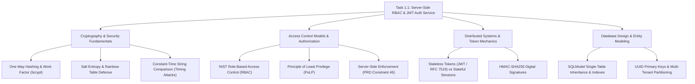

# Stage 3: CS Domain Learning Extraction Artifact
## Task 1.1: Server-Side RBAC, User Models & JWT Auth Service `[BACKEND]`

**Task ID:** Task 1.1  
**Track:** Backend Track (Backend Lead)  
**Epic:** Epic 1 — Authentication, Multi-Tenant Isolation & Learning State  
**Accepted Decision Basis:** [ADR-011: Server-Side Authentication & RBAC](file:///c:/Users/Abdul%20Jabbar%20Metlo/Feynman_tutorAI/docs/adr/ADR-011-auth-and-rbac.md), PRD §5.2, FR-021, NFR-005, Non-Negotiable Constraint #6.

---

## 1. Computer Science Domain Discovery Map

---

## 2. Domain Deep Dives

### Domain 1: Cryptography — One-Way Hashing, Salts & bcrypt Work Factors

#### What Is It (Plain English):
A password hash is a mathematical one-way street: it is easy to calculate $H = \text{hash}(\text{password})$, but mathematically impossible to reverse $H \rightarrow \text{password}$. 

#### Why Standard Fast Hashes (MD5, SHA-256) Fail for Passwords:
Standard cryptographic hashes (like SHA-256) were designed to be **fast** (millions of hashes per second for file verification). However, speed is disastrous for password security because modern GPUs can compute over $100,000,000,000$ SHA-256 hashes per second, allowing an attacker to crack an 8-character password in seconds.

#### The `bcrypt` Defense Mechanism:
1. **Adaptive Work Factor (Cost $N$)**: `bcrypt` uses an expensive key-derivation algorithm (Eksblowfish) that executes $2^{\text{cost}}$ iterations. Setting $\text{cost} = 12$ means $2^{12} = 4,096$ rounds of key expansion, taking $\approx 250\text{ms}$ per calculation. This makes massive offline GPU brute-force attacks computationally infeasible.
2. **Salt Entropy**: Every password is concatenated with 128 bits of cryptographically secure random noise (the salt) before hashing:
   $$\text{Hash} = \$2b\$12\$\underbrace{\text{salt (22 chars)}}_{\text{Prevents Rainbow Tables}}\underbrace{\text{checksum (31 chars)}}_{\text{Computed Digest}}$$
   Even if 1,000 users share the identical password `"Password123!"`, every single stored hash in the database is completely unique.

---

### Domain 2: Access Control — NIST Role-Based Access Control (RBAC)

#### What Is It (Plain English):
Rather than assigning individual permissions to each user, permissions are grouped into **Roles** (`Student`, `Instructor`, `Admin`), and users are assigned to roles.

#### Why Server-Side Enforcement is Non-Negotiable (PRD Constraint #6):
In web applications, the client (browser/mobile app) is completely under the user's control. A malicious student can easily open browser DevTools, edit local JavaScript variables, or send raw HTTP requests via `curl` or Postman.
- **Client-Side "Role Guards"**: Solely a User Experience (UX) feature to hide buttons or redirect pages.
- **Server-Side Route Guards (`require_role`)**: The **Security Boundary**. The server inspects the cryptographically signed token and rejects unauthorized requests with HTTP 403 Forbidden before any domain business logic is executed.

---

### Domain 3: Token Architecture — Stateless JSON Web Tokens (JWT)

#### What Is It (Plain English):
A JWT is a compact, URL-safe JSON container consisting of three Base64URL-encoded parts separated by dots:
$$\text{JWT} = \underbrace{\text{Header}}_{\text{Algorithm (HS256)}}.\underbrace{\text{Payload}}_{\text{Claims (user\_id, role, exp)}}.\underbrace{\text{Signature}}_{\text{HMAC-SHA256(Header + Payload, SECRET\_KEY)}}$$

#### Why HMAC-SHA256 Signatures Prevent Tampering:
When the client sends the token in the `Authorization: Bearer <token>` header:
1. FastAPI computes:
   $$\text{Expected Signature} = \text{HMAC-SHA256}(\text{Header} + "." + \text{Payload}, \text{SECRET\_KEY})$$
2. It compares the expected signature with the token's attached signature using **constant-time comparison** (`hmac.compare_digest`) to prevent timing side-channel attacks.
3. If a student modified their role from `"student"` to `"admin"`, the mathematical signature would not match, and the request is immediately rejected (`401 Unauthorized`).

---

## 3. The Numbers & Constraints That Matter

| Parameter / Metric | Target Value | Architectural Rationale |
| :--- | :--- | :--- |
| **`bcrypt` Salt Cost Factor** | `12` ($4,096$ rounds) | Balances sub-second login response with strong GPU brute-force resistance |
| **JWT Access Token Expiration** | `24 Hours` (Dev) / `15 Mins` (Prod) | Limits blast radius if an access token is intercepted |
| **JWT Signing Algorithm** | `HS256` (HMAC-SHA256) | 256-bit symmetric signature verified at microsecond speed |
| **Minimum Password Length** | `8 Characters` | Rejects trivially weak passwords at Pydantic validation stage |
| **Server-Side Role Enforcement** | `100% Server Enforced` | PRD Constraint #6 & NFR-005 compliance |
