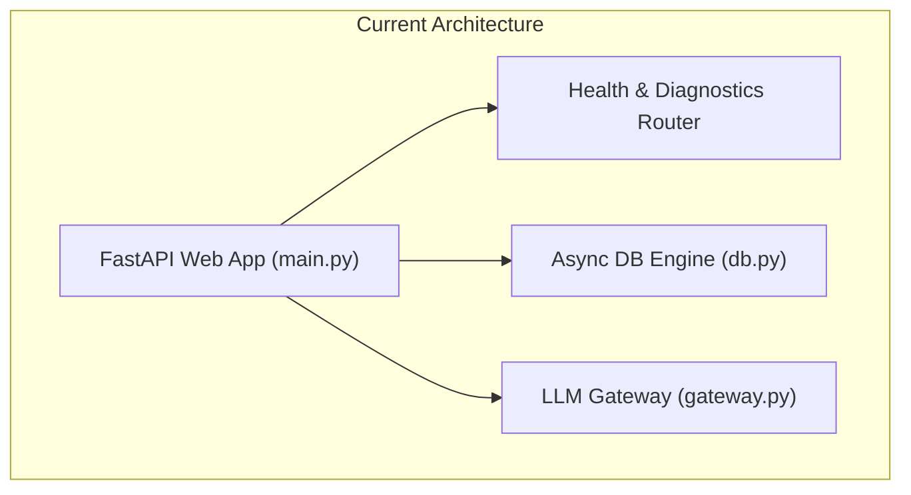
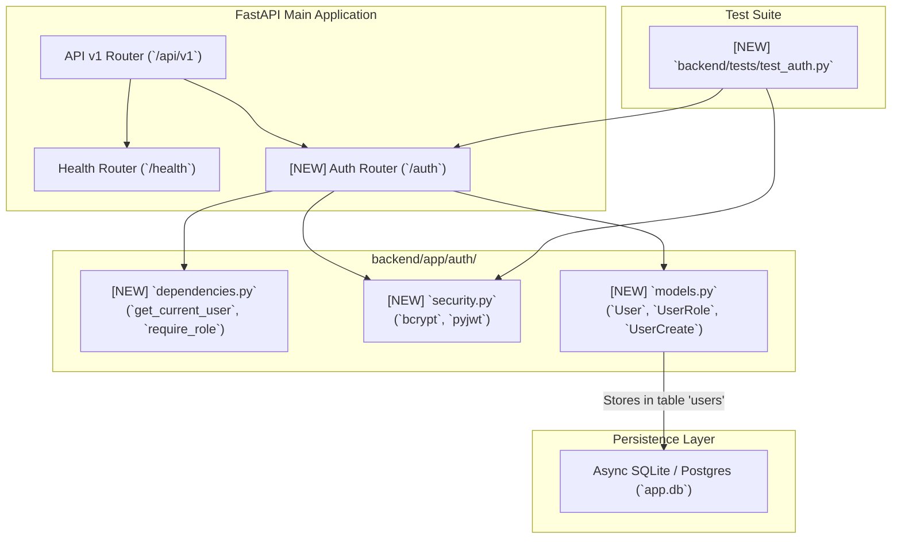

# Stage 2: Codebase Design Artifact
## Task 1.1: Server-Side RBAC, User Models & JWT Auth Service `[BACKEND]`

**Task ID:** Task 1.1  
**Track:** Backend Track (Backend Lead)  
**Epic:** Epic 1 — Authentication, Multi-Tenant Isolation & Learning State  
**Accepted Decision Basis:** [ADR-011: Server-Side Authentication & RBAC](file:///c:/Users/Abdul%20Jabbar%20Metlo/Feynman_tutorAI/docs/adr/ADR-011-auth-and-rbac.md), PRD §5.2, FR-021, NFR-005, Non-Negotiable Constraint #6.

---

## 1. Current State Snapshot

- **Backend**: FastAPI modular monolith running on `backend/app/main.py` with `/healthz` and `/api/v1/health` diagnostics.
- **Database**: Async SQLModel engine configured in `backend/app/core/db.py`.
- **LLM Gateway**: Multi-provider fallback gateway initialized in `backend/app/core/llm/`.
- **Contract Layer**: `docs/contracts/schemas/openapi.json` exported.
- **Auth Layer**: No user models or authentication routers exist yet in `backend/app/`.



---

## 2. Proposed Target Architecture



---

## 3. File-Level Impact Analysis

### `[MODIFY]` `backend/requirements.txt`
- **What changes**: Add `pyjwt>=2.8.0,<3.0.0` and `bcrypt>=4.1.0,<5.0.0`.
- **Why**: Cryptographic standards for RFC 7519 JWT generation and salted password hashing (ADR-011).

### `[MODIFY]` `backend/app/core/config.py`
- **What changes**: Add security settings:
  ```python
  JWT_SECRET_KEY: str = "dev-insecure-secret-key-change-in-production-1234567890"
  JWT_ALGORITHM: str = "HS256"
  ACCESS_TOKEN_EXPIRE_MINUTES: int = 60 * 24  # 24 hours for dev convenience
  ```

### `[NEW]` `backend/app/auth/models.py`
- **Key Entities**:
  - `UserRole(str, Enum)`: `STUDENT = "student"`, `INSTRUCTOR = "instructor"`, `ADMIN = "admin"`.
  - `UserBase(SQLModel)`: `email` (Indexed, Unique), `full_name`, `role`, `is_active`.
  - `User(UserBase, table=True)`: `id` (UUID string, PK), `hashed_password` (str), `created_at`, `updated_at`.
  - `UserCreate(SQLModel)`: `email`, `password` (min 8 chars), `full_name`, `role`.
  - `UserLogin(SQLModel)`: `email`, `password`.
  - `UserResponse(UserBase)`: `id`, `created_at`.
  - `TokenResponse(SQLModel)`: `access_token`, `token_type`, `user: UserResponse`.
  - `TokenPayload(SQLModel)`: `sub: str`, `role: str`, `exp: int`.

### `[NEW]` `backend/app/auth/security.py`
- **Key Functions**:
  - `hash_password(password: str) -> str`: Uses `bcrypt.hashpw` with salt.
  - `verify_password(plain_password: str, hashed_password: str) -> bool`: Uses `bcrypt.checkpw`.
  - `create_access_token(user_id: str, role: str, expires_delta: Optional[timedelta] = None) -> str`: Signs JWT via `jwt.encode`.
  - `decode_token(token: str) -> TokenPayload`: Verifies JWT signature and returns typed payload.

### `[NEW]` `backend/app/auth/dependencies.py`
- **Key Injections**:
  - `oauth2_scheme = OAuth2PasswordBearer(tokenUrl="/api/v1/auth/login")`
  - `async def get_current_user(token: str = Depends(oauth2_scheme), session: AsyncSession = Depends(get_db_session)) -> User`: Intercepts Authorization header, decodes token, validates user in database.
  - `def require_role(allowed_roles: List[UserRole]) -> Callable`: Dependency factory verifying `current_user.role in allowed_roles`, raising HTTP 403 Forbidden if mismatched (PRD Constraint #6).

### `[NEW]` `backend/app/auth/router.py`
- **Endpoints**:
  - `POST /api/v1/auth/register` (Status 201 Created $\rightarrow$ `UserResponse`)
  - `POST /api/v1/auth/login` (Status 200 OK $\rightarrow$ `TokenResponse`)
  - `GET /api/v1/auth/me` (Status 200 OK $\rightarrow$ `UserResponse`)
  - `GET /api/v1/auth/instructor-only` (Diagnostic endpoint to verify `require_role([INSTRUCTOR])`)

### `[MODIFY]` `backend/app/main.py`
- **What changes**: Register `auth_router` in FastAPI application under `/api/v1/auth`.

### `[NEW]` `backend/tests/test_auth.py`
- **Test Matrix**:
  - Registration success & duplicate email rejection (409 Conflict).
  - Password hashing verification (stored password is not plain text).
  - Valid login & token generation.
  - Invalid password rejection (401 Unauthorized).
  - Protected `/me` endpoint with valid and invalid JWT.
  - Role-based route guard: Student accessing Instructor route receives 403 Forbidden.

---

## 4. Blast Radius & Dependency Impact

- **Semver Classification**: MINOR (Additive endpoints and models).
- **Breaking Change Risk**: 🟢 **LOW / ZERO BREAKING CHANGES** (Existing `/healthz` endpoints remain 100% untouched).
- **Database Churn**: Automatically creates `users` table upon async database initialization.

---

## 5. Security & Privacy Audit

- **OWASP Password Storage**: `bcrypt` salt generation executed per user.
- **Stateless Tokens**: JWT signed with HS256 and expiration timestamp.
- **Server-Side Enforcement**: Zero reliance on client-side role claims (PRD Constraint #6).
