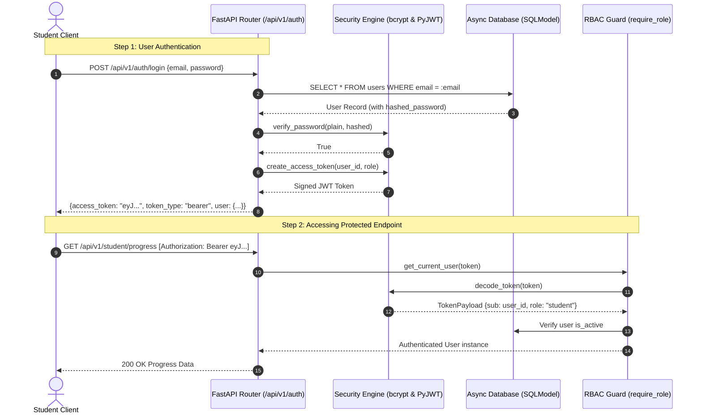

# Stage 1: Conceptual Understanding Artifact
## Task 1.1: Server-Side RBAC, User Models & JWT Auth Service `[BACKEND]`

**Task ID:** Task 1.1  
**Track:** Backend Track (Backend Lead)  
**Epic:** Epic 1 — Authentication, Multi-Tenant Isolation & Learning State  
**Accepted Decision Basis:** [ADR-011: Server-Side Authentication & RBAC](file:///c:/Users/Abdul%20Jabbar%20Metlo/Feynman_tutorAI/docs/adr/ADR-011-auth-and-rbac.md), PRD §5.2, FR-021, NFR-005, Non-Negotiable Constraint #6.

---

## 1. Visual Architecture

```mermaid
flowchart TB
    subgraph Client ["Frontend / Mobile Client"]
        LoginForm["Login / Register Form"]
        AuthHeader["HTTP Header: `Authorization: Bearer <JWT>`"]
    end

    subgraph FastAPIGateway ["FastAPI Security & Routing Layer"]
        OAuth2Scheme["`OAuth2PasswordBearer(tokenUrl='/api/v1/auth/login')`"]
        TokenDecoder["`security.decode_token(token)`<br/>(Verifies Signature & Expiry)"]
        UserDep["`get_current_user()` Dependency<br/>(Fetches User from DB Session)"]
        RoleGuard["`require_role([INSTRUCTOR, ADMIN])`<br/>(PRD Constraint #6)"]
    end

    subgraph DatabaseLayer ["Persistence (SQLModel / Async Engine)"]
        UserTable["`users` Table<br/>(`id`, `email`, `hashed_password`, `role`, `is_active`)"]
    end

    LoginForm -->|`POST /api/v1/auth/login`| FastAPIGateway
    FastAPIGateway -->|Verifies `bcrypt.checkpw()`| UserTable
    FastAPIGateway -->|Returns JWT `{access_token, role}`| Client

    Client --> AuthHeader
    AuthHeader --> OAuth2Scheme
    OAuth2Scheme --> TokenDecoder
    TokenDecoder --> UserDep
    UserDep --> UserTable
    UserDep --> RoleGuard
    RoleGuard -->|Authorized 200 OK| ProtectedEndpoint["Protected Domain Endpoints<br/>(`/api/v1/student/...`, `/api/v1/admin/...`)"]
```

---

## 2. The Physical Analogy

> Think of **Server-Side RBAC & JWT Authentication** like an **Airport Security & Boarding Pass System**:
> 
> 1. **Check-In Desk (Registration / Login)**: You present your government ID and passport (email and password). The agent verifies your credentials in the official manifest (`users` database table) and stamps an official, tamper-proof **Boarding Pass (Signed JWT Token)**.
> 2. **The Cryptographic Stamp (HMAC-SHA256 Signature)**: The boarding pass contains your Passenger ID (`sub`), Flight Class (`role`: Economy Student vs Flight Captain Admin), and Expiration Time (`exp`). It is signed with the airline's private embossed seal (`SECRET_KEY`). If you try to pencil in "Captain" on your ticket, the seal breaks instantly.
> 3. **Gate Agent (FastAPI `require_role` Guard)**: When you try to enter the Cockpit (Instructor / Admin exam authoring routes), the guard at the door inspects the seal. Even if you wear a pilot's uniform (a modified frontend UI), the door will remain deadlocked (`403 Forbidden`) unless the official stamped seal confirms you have Captain authorization.

---

## 3. Why & What

### Why are we doing this task?
1. **Non-Negotiable Constraint #6 (PRD FR-021, NFR-005)**: In educational and examination platforms, students must never be allowed to access question authoring, answer keys, or other students' exam attempts. All role permissions must be enforced strictly on the backend server.
2. **Student State Multi-Tenant Isolation (PRD §5.2, FR-022, Constraint #2)**: Every mastery calculation, error bank entry, and Socratic dialogue must be partitioned by the authentic `student_id` extracted from the cryptographically verified JWT token, never from unauthenticated client request parameters.
3. **Password Security (OWASP Compliance)**: Passwords must never be stored in plain text. Using `bcrypt` with adaptive salt cost ($\ge 12$) guarantees resistance against GPU and rainbow table dictionary attacks.

### What is the concept?
A stateless, token-based authentication service built with SQLModel and FastAPI dependency injection, providing endpoints for registration, login, profile retrieval, and role-based route protection.

---

## 4. Abstraction Level Map

| Level | What Lives Here | Current Project Implementation |
| :--- | :--- | :--- |
| **Domain Models** | User Entity & Roles | `backend/app/auth/models.py` (`User`, `UserRole`, `UserCreate`, `UserResponse`) |
| **Cryptography Layer** | Password Hashing & JWT | `backend/app/auth/security.py` (`bcrypt`, `pyjwt`) |
| **Dependency Guards** | RBAC & Session Injectors | `backend/app/auth/dependencies.py` (`get_current_user`, `require_role`) |
| **API Endpoints** | Auth Router | `backend/app/auth/router.py` (`/register`, `/login`, `/me`) |
| **Database Storage** | Async SQLModel Table | `backend/app/core/db.py` (`data/app.db`) |

---

## 5. Sequence Diagram: Login & Protected Request Flow



---

## 6. Data Flow Trace-Through

1. **User Registration (`POST /api/v1/auth/register`)**:
   - Client sends `{ email: "alex@example.com", password: "SecurePassword123!", full_name: "Alex Rivera", role: "student" }`.
   - FastAPI validates inputs against Pydantic `UserCreate` schema.
   - Password is sent to `hash_password()`, generating a salted bcrypt hash `$2b$12$...`.
   - User record is committed to database. Returns `UserResponse` (excluding `hashed_password`).
2. **User Login (`POST /api/v1/auth/login`)**:
   - Client sends `{ email, password }`.
   - Service looks up user by email.
   - `verify_password()` compares password with stored hash.
   - On success: issues a JWT access token with 15-minute expiration and returns user profile.
3. **Protected Endpoint Access**:
   - Client includes `Authorization: Bearer <token>` in HTTP headers.
   - `get_current_user` dependency intercepts request, validates JWT signature and expiration, queries DB for active user, and injects `current_user: User` into endpoint function.

---

## 7. Cognitive Model $\to$ Code Mapping

| Cognitive Concept | Code Implementation | Guardrail / Rule |
| :--- | :--- | :--- |
| **"Identity"** | `User` model in `backend/app/auth/models.py` | Unique indexed email, UUID primary key |
| **"Role / Privilege"** | `UserRole` Enum (`STUDENT`, `INSTRUCTOR`, `ADMIN`) | Server-enforced via `require_role()` |
| **"Credential Storage"** | `hashed_password` column | Plain password is never saved or returned |
| **"Passport / Ticket"** | `access_token` JWT string | RFC 7519 HMAC-SHA256 signed with `SECRET_KEY` |
| **"Gate Guard"** | `Depends(require_role([UserRole.INSTRUCTOR]))` | Returns 403 Forbidden if role mismatched |
