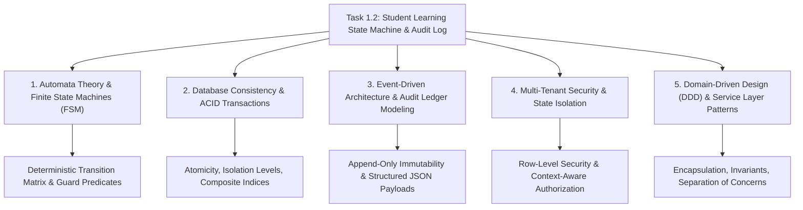

# Task 1.2: Student Learning State Machine & Auditable Event Log — CS Domain Learning (Stage 3)

## 1. Domain Discovery Map

Task 1.2 touches five core Computer Science and Software Engineering domains:



---

## 2. Domain Deep Dives

### Domain 1: Automata Theory & Finite State Machines (FSM)

**What Is It (Plain English):**  
A Finite State Machine (FSM) is a mathematical abstraction of computation. It consists of a finite set of discrete states, an initial starting state, an alphabet of input events/triggers, and a transition function that maps the current state and trigger to a resulting state. An FSM guarantees that a system can only exist in one valid configuration at a time and strictly prevents impossible or forbidden state transitions.

**Physical Analogy:**  
An automatic subway turnstile: It has two states — `LOCKED` and `UNLOCKED`. If you push the bar while it is `LOCKED`, nothing happens (transition rejected). When you tap a valid metro card (`PAYMENT_ACCEPTED`), it transitions to `UNLOCKED`. When you walk through (`BAR_ROTATED`), it transitions back to `LOCKED`. You cannot jump from `LOCKED` to `BAR_ROTATED` without paying.

**How It Works Under the Hood:**

| Layer | What Happens | Resource / Constraint |
|:---|:---|:---|
| **Mathematical Definition** | Formally defined as a 5-tuple: $(Q, \Sigma, \delta, q_0, F)$ | Finite state space $Q$, transition function $\delta: Q \times \Sigma \to Q$ |
| **Application Layer** | Python `Enum` representation + `VALID_TRANSITIONS` lookup table | $O(1)$ constant time lookup per transition evaluation |
| **Validation Hook** | Guard predicates check business invariants (e.g. `score >= 0.85`) | Prevents state transition if prerequisites are unmet |
| **Persistence Layer** | Relational state field updated atomically | Database lock acquired on state row |

**Where It Manifests in This Codebase:**
- `backend/app/learning_state/models.py`: `LearningState` enum defining all 8 PRD §13 states.
- `backend/app/learning_state/service.py`: `VALID_TRANSITIONS` dictionary mapping each state to its allowed targets.

**Common Misconceptions:**
1. ❌ *"A state machine is just a bunch of `if/else` checks scattered across API controllers."*  
   ✅ **Reality:** Ad-hoc `if/else` checks lead to state explosion and race conditions. A formal FSM centralizes all transition rules in a single declarative matrix.
2. ❌ *"The frontend can manage the state machine and tell the backend what state to save."*  
   ✅ **Reality:** Client-side state machines cannot be trusted; malicious actors or network glitches can bypass transition rules. The backend must be the single authoritative state validator.
3. ❌ *"LLMs can decide the next state based on conversational context."*  
   ✅ **Reality:** PRD Constraint #1 explicitly forbids LLMs from directly mutating official learning state. State transitions must be governed by deterministic code and verified metrics.

**The Numbers or Constraints That Matter:**
| Constraint | Value | Why It Matters |
|:---|:---|:---|
| **State Space Size** | 9 discrete states | Kept deliberately finite to prevent combinatoric explosion |
| **Transition Complexity** | $O(1)$ | Dictionary lookup executes in $<0.01\text{ ms}$ |
| **Determinism** | 100% | Given state $S$ and event $E$, the next state is unambiguous |

---

### Domain 2: Relational Database Consistency & ACID Transactions

**What Is It (Plain English):**  
ACID (Atomicity, Consistency, Isolation, Durability) is the foundational standard for reliable database transactions. In learning state management, modifying a student's current state and inserting an audit log record must happen as an indivisible unit: either both succeed completely, or neither occurs at all, leaving the database clean.

**Physical Analogy:**  
Buying a house with escrow: The buyer transfers the money, and the seller signs the deed. The escrow officer will never give the money to the seller while failing to record the deed, nor record the deed without transferring the funds. Both operations occur simultaneously inside the escrow closing transaction.

**How It Works Under the Hood:**

| Layer | What Happens | Resource / Constraint |
|:---|:---|:---|
| **Application** | `session.add_all([state_record, audit_log_record])` | ORM stages changes in memory session |
| **Transaction Boundary** | `async with session.begin():` | Issues `BEGIN` command to database server |
| **Engine / Driver** | `asyncpg` / `aiosqlite` streams binary SQL statements | Sockets transmit queries over connection pool |
| **Database Engine** | PostgreSQL writes changes to Write-Ahead Log (WAL) before updating table pages | Guaranteed durability across server crashes |

**Where It Manifests in This Codebase:**
- `backend/app/core/database.py`: Async engine and session factory (`get_db`).
- `backend/app/learning_state/service.py`: Atomic session commit encapsulating state update and audit log insertion.

**Common Misconceptions:**
1. ❌ *"Writing the audit log in a background task after the API response is sent is fine."*  
   ✅ **Reality:** If the server crashes or the queue fails between the state update and the background job, the audit trail is permanently lost, causing a compliance violation.
2. ❌ *"SQLite does not support ACID transactions."*  
   ✅ **Reality:** SQLite is fully ACID-compliant; using `aiosqlite` with transactional sessions guarantees consistency in local dev and tests.

---

### Domain 3: Event-Driven Audit Ledger Modeling

**What Is It (Plain English):**  
An audit ledger is an append-only, immutable database table where records are never updated or deleted (`INSERT`-only). Each entry represents a domain event—a historical fact that occurred at a specific point in time—capturing what happened, why it happened, who initiated it, and the supporting evidence.

**Physical Analogy:**  
A bank account statement: If you deposit \$100 and then spend \$40, the bank does not erase the \$100 entry and write \$60. It records two distinct, immutable transactions. Your balance is simply the current state derived from those historical events.

**How It Works Under the Hood:**

```json
{
  "log_id": "9f7b1e4c-1234-5678-9abc-def012345678",
  "student_id": "4a2c3d4e-...",
  "exam_template_id": "7b8c9d0e-...",
  "topic_id": "1a2b3c4d-...",
  "from_state": "ASSESSMENT",
  "to_state": "DIAGNOSIS",
  "trigger": "ASSESSMENT_FAILED",
  "evidence_payload": {
    "score": 0.54,
    "threshold": 0.80,
    "failed_questions": ["Q-104", "Q-108"],
    "misconception_tags": ["FORCE_NORMAL_CANCEL"]
  },
  "actor_id": "4a2c3d4e-...",
  "created_at": "2026-08-23T01:15:30.123456Z"
}
```

**Where It Manifests in This Codebase:**
- `backend/app/learning_state/models.py`: `StateTransitionLog` table with `Column(JSON)` for structured evidence.

---

### Domain 4: Multi-Tenant Security & State Isolation

**What Is It (Plain English):**  
Multi-tenant data isolation ensures that each student's learning progress is strictly private, segregated, and immune from accidental or malicious cross-contamination. Even if a student attempts to tamper with request parameters to modify another student's progress or access another exam's state, server-side authorization blocks the request.

**Physical Analogy:**  
Hotel room keycards: Even though thousands of guests sleep in the same hotel building, your keycard only unlocks your specific room (Room 402). Swiping your card on Room 403 will be rejected by the electronic lock.

**Where It Manifests in This Codebase:**
- `backend/app/auth/dependencies.py`: `get_current_user` extracting student identity from cryptographically verified JWT claims.
- `backend/app/learning_state/router.py`: Enforcing `student_id = current_user.id` on all student endpoints.

---

## 3. Cross-Domain Connections

| Concept A | Concept B | Architectural Connection |
|:---|:---|:---|
| **FSM Transition Function** | **ACID Transaction** | The FSM validates the logic in memory; the ACID transaction guarantees the state mutation and audit log persist simultaneously. |
| **Audit Log Payload** | **Explainable AI (NFR-008)** | The structured JSON evidence captured in audit logs provides the factual grounding for explainable readiness scores in Phase 3. |
| **Composite Unique Index** | **Tenant Isolation** | Database unique constraint `(student_id, exam_template_id, topic_id)` physically prevents state collisions between students or exams. |
| **FastAPI Dependency Injection** | **FSM Service Layer** | Injects the authenticated user and scoped database session into the domain service with zero global state. |

---

## 4. Concept Evolution Timeline

```markdown
| Level | What You Might Think | Deeper Reality |
|:---|:---|:---|
| **Beginner** | "Learning state is just an integer or string in the user's database row." | Progress must be tracked per topic and exam, with strict state machine validation and an immutable audit trail. |
| **Intermediate** | "I'll write an `update_state` endpoint and check if the new state is valid using an `if` condition." | State transitions require atomic ACID pairing with immutable event logs, typed evidence payloads, and guard predicates. |
| **Advanced** | "We should use a full event sourcing architecture with Kafka and Temporal workflows." | Event sourcing adds extreme operational complexity for MVP scale; an explicit relational FSM with atomic append-only audit tables delivers 100% of the integrity with $0$ extra ops overhead. |
| **Expert** | "Design domain state machines as pure, deterministic software functions isolated from I/O, wrapped by transactional application services." | Decoupling state transition validation from database I/O allows exhaustive, sub-millisecond unit testing of all edge cases without mocking database engines. |
```

---

## 5. Vocabulary Reference

| Term | Definition | Codebase Example |
|:---|:---|:---|
| **FSM (Finite State Machine)** | A mathematical model of computation consisting of a set of states and transitions. | `LearningStateMachineService` |
| **Guard Predicate** | A boolean condition that must evaluate to true before a transition is allowed. | `check_assessment_score_guard()` |
| **Audit Ledger** | An append-only historical record of all state transitions and their causes. | `StateTransitionLog` |
| **Tenant Isolation** | Architectural guarantees that student data cannot leak across user boundaries. | `where(StudentLearningState.student_id == user.id)` |
| **Idempotence** | An operation that produces the same result when executed multiple times. | `get_or_create_state()` |

---

## 6. "What If" Thought Experiments

### Q1: What if two concurrent requests attempt to transition the same student's topic state simultaneously?
> **Answer:** The database composite unique index on `(student_id, exam_template_id, topic_id)` and row-level locking during `UPDATE` ensure that the first transaction commits cleanly while the second transaction evaluates the freshly committed state. If the second transition is no longer valid from the new state, the FSM safely rejects it with HTTP 400.

### Q2: What if the database crashes while writing the audit log after updating the state table?
> **Answer:** Because both operations execute inside a single async ACID transaction (`async with session.begin():`), the database rolls back the state update entirely upon failure. No orphan state update or missing audit record can ever exist.

### Q3: What if an admin needs to manually reset a student's topic state due to an accommodation?
> **Answer:** The admin uses `POST /api/v1/learning-state/transition` with `actor_id = admin_uuid`, `trigger = "ADMIN_ACCOMMODATION_RESET"`, and `evidence_payload = {"reason": "Medical accommodation granted"}`. The audit log permanently records that an administrator initiated the reset, preserving full compliance and explainability.

### Q4: What if an unauthenticated user attempts to view a student's learning history?
> **Answer:** FastAPI's `Security(get_current_user)` intercepts the request at the gateway layer before any service code executes, immediately returning `HTTP 401 Unauthorized`.

---

## 7. Further Reading & Authoritative Standards

| Topic | Resource | Type |
|:---|:---|:---|
| **Automata Theory** | *Introduction to Automata Theory, Languages, and Computation* (Hopcroft, Motwani, Ullman) | Academic Reference |
| **Database Transactions & ACID** | *Designing Data-Intensive Applications* (Martin Kleppmann, Chapter 7) | Industry Standard Book |
| **FastAPI Security & Scopes** | [FastAPI Official Docs: Security and OAuth2](https://fastapi.tiangolo.com/tutorial/security/) | Official Documentation |
| **SQLModel Async Architecture** | [SQLModel Official Documentation](https://sqlmodel.tiangolo.com/) | Official Documentation |
| **Student Privacy & Auditing** | US Department of Education: Family Educational Rights and Privacy Act (FERPA) | Regulatory Standard |

---

## Workflow Checklist
- [x] Domain discovery map and Mermaid concept map included.
- [x] Deep dives for 5 key CS domains with analogies, layer tables, code links, misconceptions, and numbers.
- [x] Cross-domain connection matrix filled.
- [x] Concept evolution timeline documented.
- [x] Vocabulary reference table created.
- [x] 4 comprehensive "What If" scenarios analyzed.
- [x] Authoritative reference links provided.
