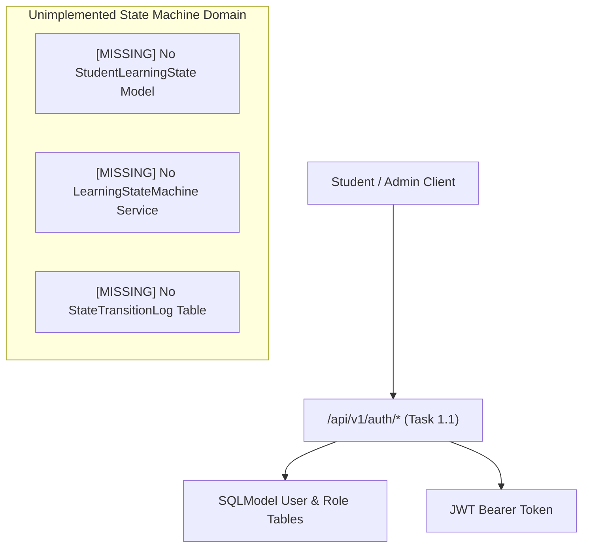
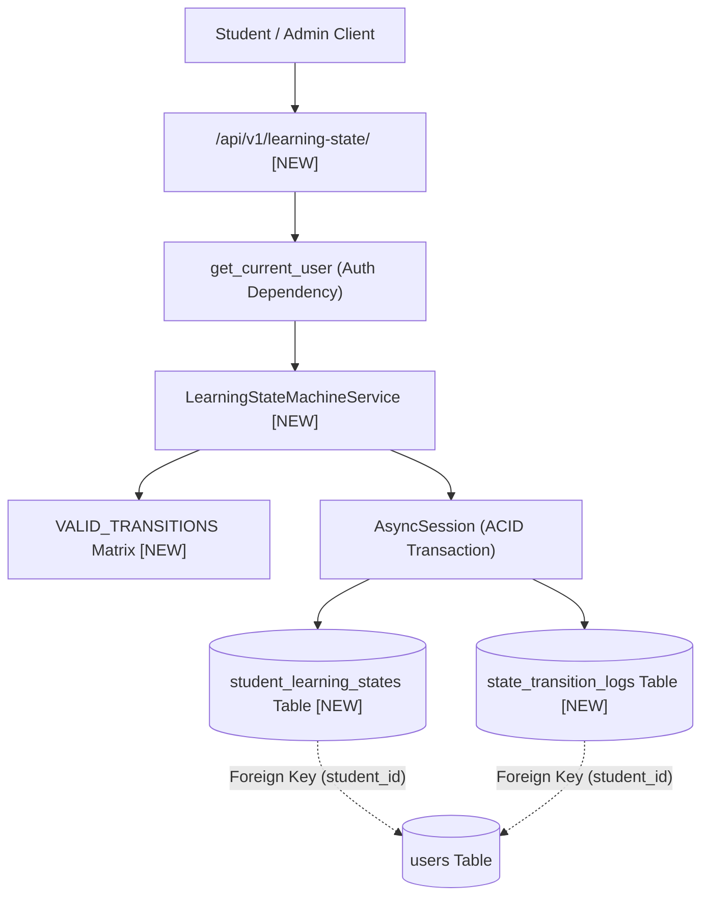
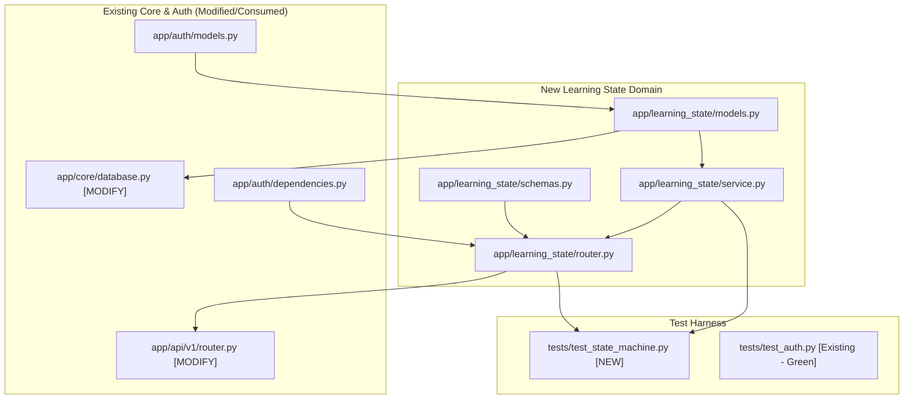

# Task 1.2: Student Learning State Machine & Auditable Event Log — Codebase Design (Stage 2)

## 1. Current State Snapshot

Prior to Task 1.2, the platform has completed:
- **Task 0.2:** Async SQLModel database engine (`backend/app/core/database.py`) supporting async SQLite and PostgreSQL.
- **Task 0.4:** Multi-Provider LLM Gateway (`backend/app/core/llm/`).
- **Task 0.5:** OpenAPI contract export and TypeScript sync pipeline.
- **Task 1.1:** Server-side RBAC, SQLModel user/role tables, password hashing, and JWT auth service (`backend/app/auth/`).

Currently, there is no domain concept or database schema for tracking student learning progression across exam topics. If an assessment is taken, there is no state machine or audit ledger to record the outcome or determine the next pedagogical stage.

### Before Architecture Diagram

---

## 2. Proposed State

Task 1.2 creates the `app/learning_state` domain module inside the FastAPI backend. It provides:
1. `app/learning_state/models.py`: SQLModel definitions for `LearningState` enum, `StudentLearningState`, and `StateTransitionLog`.
2. `app/learning_state/schemas.py`: Pydantic V2 request/response schemas (`StateTransitionRequest`, `StudentLearningStateResponse`, `StateTransitionLogResponse`, `BatchStateQueryRequest`).
3. `app/learning_state/service.py`: `LearningStateMachineService` providing legal state validation, precondition evaluation, and atomic state + audit log mutations.
4. `app/learning_state/router.py`: FastAPI router exposing `/api/v1/learning-state/` endpoints with server-side RBAC and student tenant isolation.
5. Registration in `app/main.py` and `app/api/v1/router.py`.

### After Architecture Diagram

---

## 3. File-Level Impact Analysis

### [NEW] `backend/app/learning_state/__init__.py`
- **Purpose:** Package marker for the learning state domain.
- **Exports:** `LearningState`, `StudentLearningState`, `StateTransitionLog`, `LearningStateMachineService`.
- **Consumers:** `app/api/v1/router.py`, `app/main.py`, test suites.

### [NEW] `backend/app/learning_state/models.py`
- **Purpose:** Relational database models and state enumerations.
- **Exports:**
  - `LearningState(str, Enum)`: 8 core PRD §13 states (`NOT_STARTED`, `CALIBRATION`, `FOUNDATION`, `PRACTICING`, `ASSESSMENT`, `DIAGNOSIS`, `REPAIR`, `MASTERY`, `REVISION`).
  - `StudentLearningState(SQLModel, table=True)`: Tracks active topic state per student and exam.
  - `StateTransitionLog(SQLModel, table=True)`: Immutable append-only audit trail with JSON evidence payloads.
- **Consumers:** `service.py`, `router.py`, `app/core/database.py`, Alembic/SQLModel table registry.

### [NEW] `backend/app/learning_state/schemas.py`
- **Purpose:** Pydantic V2 schemas for API validation and type-safe serialization.
- **Exports:**
  - `StateTransitionRequest`: Input payload validating `exam_template_id`, `topic_id`, `target_state`, `trigger`, and `evidence_payload`.
  - `StudentLearningStateResponse`: Output schema for student topic state.
  - `StateTransitionLogResponse`: Output schema for audit log entries.
  - `BatchStateQueryRequest`: Query filter for fetching student state across multiple topics.
- **Consumers:** `router.py`, frontend API client via OpenAPI generator.

### [NEW] `backend/app/learning_state/service.py`
- **Purpose:** Core state machine domain engine enforcing transition rules, guards, and atomic database persistence.
- **Exports:**
  - `VALID_TRANSITIONS`: Deterministic dictionary mapping `LearningState -> Set[LearningState]`.
  - `InvalidStateTransitionException`: Domain exception for illegal transitions.
  - `LearningStateMachineService`: Service class with methods:
    - `get_or_create_state(session, student_id, exam_template_id, topic_id)`
    - `transition_state(session, student_id, exam_template_id, topic_id, target_state, trigger, evidence_payload, actor_id)`
    - `get_student_topic_history(session, student_id, topic_id)`
    - `get_exam_summary(session, student_id, exam_template_id)`
- **Consumers:** `router.py`, future assessment and tutor orchestrators.

### [NEW] `backend/app/learning_state/router.py`
- **Purpose:** FastAPI router exposing versioned `/api/v1/learning-state` endpoints.
- **Exports:** `router: APIRouter`
  - `POST /api/v1/learning-state/transition`: Execute a validated state transition.
  - `GET /api/v1/learning-state/topic/{topic_id}`: Fetch current student state for a topic.
  - `GET /api/v1/learning-state/topic/{topic_id}/history`: Fetch audit log trail for a topic.
  - `GET /api/v1/learning-state/exam/{exam_template_id}`: Fetch all topic states for an exam.
- **Consumers:** `app/api/v1/router.py`.

### [MODIFY] `backend/app/api/v1/router.py`
- **What changes:** Include `learning_state.router` with prefix `/learning-state` and tags `["Learning State Machine"]`.
- **Why:** Expose learning state endpoints on the main API router.
- **Upstream:** `app/learning_state/router.py`.
- **Downstream:** `app/main.py`.

### [MODIFY] `backend/app/core/database.py`
- **What changes:** Import `StudentLearningState` and `StateTransitionLog` so SQLModel metadata registers the tables during `init_db`.
- **Why:** Ensure database tables are created automatically in dev/test SQLite and PostgreSQL engines.

### [NEW] `backend/tests/test_state_machine.py`
- **Purpose:** Exhaustive unit and integration test suite verifying:
  - All valid state transitions (`CALIBRATION -> FOUNDATION -> PRACTICING -> ASSESSMENT -> MASTERY`).
  - All invalid transitions throw HTTP 400 (`DIAGNOSIS -> MASTERY`, `NOT_STARTED -> MASTERY`).
  - Immutable audit logs are created on every valid transition with correct actor and evidence payloads.
  - Student state isolation (Student A cannot read or mutate Student B's state).
  - Rollback behavior if database commit fails.

---

## 4. Dependency Graph / Blast Radius

---

## 5. Regression Risk Matrix

| Risk ID | Risk Description | Severity | Affected Area | Mitigation Strategy |
|:---|:---|:---:|:---|:---|
| **R-01** | Database initialization fails to register new SQLModel tables | 🟡 Medium | Database setup | Explicitly import `StudentLearningState` and `StateTransitionLog` in `app/core/database.py` before `SQLModel.metadata.create_all`. |
| **R-02** | Student tenant boundary leak where student modifies another student's state | 🔴 High | Security & Privacy | Enforce `student_id = current_user.id` for regular student role; only allow explicit `student_id` parameter override if `current_user.role in [Role.CONTENT_ADMIN, Role.SYS_ADMIN]`. |
| **R-03** | Race condition on concurrent rapid state transitions for the same topic | 🟡 Medium | State Concurrency | Rely on DB row updates and unique index on `(student_id, exam_template_id, topic_id)` with optimistic updated_at check. |
| **R-04** | Invalid transition payload causes database transaction to stay open or lock | 🟢 Low | API Reliability | Use `async with session.begin():` context manager to ensure automatic rollback on any uncaught exception. |

---

## 6. Contract Stability Check

| Contract / Endpoint | Current Shape | Proposed Shape | Changed? | Breaking? |
|:---|:---|:---|:---:|:---:|
| `POST /api/v1/learning-state/transition` | Non-existent | `{ exam_template_id, topic_id, target_state, trigger, evidence_payload }` -> Returns `StudentLearningStateResponse` | **NEW** | No |
| `GET /api/v1/learning-state/topic/{topic_id}` | Non-existent | Query: `?exam_template_id=UUID` -> Returns `StudentLearningStateResponse` | **NEW** | No |
| `GET /api/v1/learning-state/topic/{topic_id}/history` | Non-existent | Query: `?exam_template_id=UUID` -> Returns `List[StateTransitionLogResponse]` | **NEW** | No |
| `GET /api/v1/learning-state/exam/{exam_template_id}` | Non-existent | Returns `List[StudentLearningStateResponse]` | **NEW** | No |
| Existing `/api/v1/auth/*` | Preserved | Preserved | No | No |

---

## 7. Performance, Security, and Quality Impact

| Area | Before | After | Impact & Mitigation |
|:---|:---|:---|:---|
| **Performance** | N/A | Sub-5ms state lookup & atomic transition | Composite B-Tree index on `(student_id, exam_template_id, topic_id)` ensures $O(1)$ index seeks. |
| **Security** | Auth in place | Server-side verified state transitions | Zero client-side state mutation; all actions gated by JWT and RBAC. |
| **Auditability** | No logs | Append-only immutable log | Every state mutation permanently recorded with evidence JSON and actor ID. |
| **Data Integrity** | N/A | Strict Foreign Keys & Unique Constraints | Composite unique key on `(student_id, exam_template_id, topic_id)` prevents duplicate state records. |

---

## 8. Rollback Plan

### If Changes Are Uncommitted
1. `git status`
2. `git restore backend/app/api/v1/router.py backend/app/core/database.py`
3. Remove new directory: `Remove-Item -Recurse -Force backend/app/learning_state`

### If Changes Are Committed
1. Revert commit: `git revert HEAD`
2. Run pytest suite: `pytest backend/tests/`
3. Verify all existing tests pass.

---

## Workflow Checklist
- [x] Current-state snapshot documented.
- [x] Before architecture diagram included.
- [x] Proposed-state description and After architecture diagram included.
- [x] Every affected file listed with impact analysis.
- [x] Blast-radius graph included.
- [x] Regression risks scored as 🔴 / 🟡 / 🟢.
- [x] Contract stability checked.
- [x] Rollback plan provided.
- [x] No code written.
