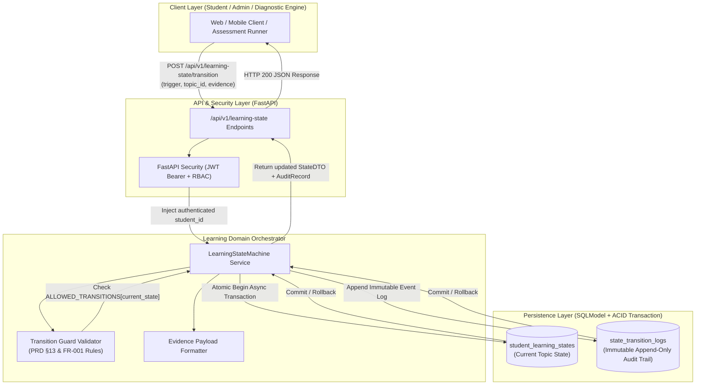
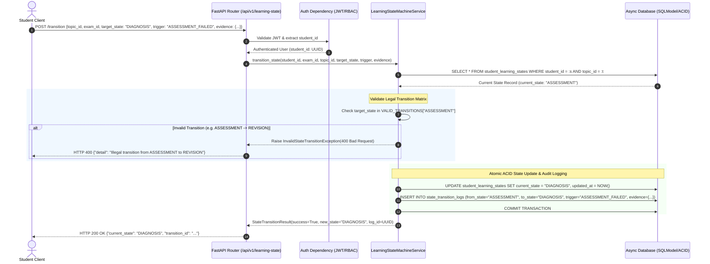
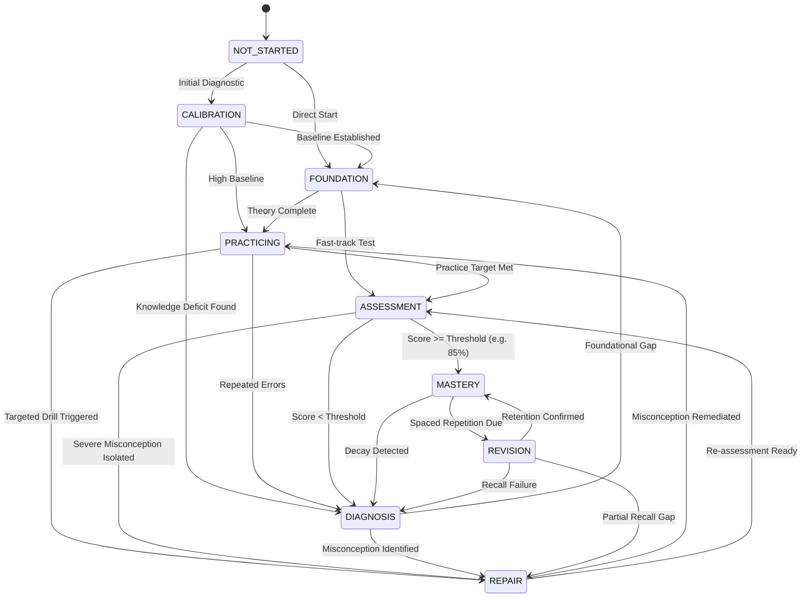

# Task 1.2: Student Learning State Machine & Auditable Event Log — Conceptual Understanding (Stage 1)

## 1. Visual Architecture



---

## 2. The Physical Analogy

The Student Learning State Machine is like an **official pilot certification logbook and flight simulator gatekeeper**:
> When a student pilot trains, they cannot simply claim they know how to land a Boeing 777 or jump directly from basic classroom theory to solo night flying in a storm. They must progress through strictly verified phases: *Pre-Flight Ground School (Foundation)* → *Dual Cockpit Practice (Practicing)* → *Formal Checkride (Assessment)*. If the pilot fails a stall recovery checkride, the flight examiner does not silently pass them or let them guess again; they are immediately routed to *Remedial Debrief (Diagnosis)* and *Targeted Stall Simulators (Repair)* before being allowed to re-test. Crucially, every flight, failure reason, instructor debrief, and stage transition is permanently stamped in the physical *Logbook (Auditable Event Log)* with indelible ink, timestamps, and flight instructor signatures.

---

## 3. Why & What

### Why Are We Doing This Task?
In typical AI chatbot tutors, learning progress is an illusion: a student chats with an LLM, the model gives encouraging praise, but the platform has no structured, verifiable model of what the student actually knows, where they are struggling, or whether they have satisfied curriculum prerequisites. 
PRD Non-Negotiable Constraint #1 and Constraint #3 mandate that **LLM output must never directly become official learning state**, and that **all state transitions must be valid, application-enforced, and auditable**. This task establishes the authoritative, uncheatable backbone of adaptive education.

### What Is the Concept?
A **Finite State Machine (FSM)** is a mathematical computational model that can be in exactly one of a finite number of states at any given time. In this platform, each topic in an exam curriculum has an isolated FSM per student (`CALIBRATION` → `FOUNDATION` → `PRACTICING` → `ASSESSMENT` → `DIAGNOSIS` → `REPAIR` → `MASTERY` → `REVISION`).
Coupled with this FSM is an **Auditable Event Log**: an append-only ledger that records every state change, the specific trigger event (e.g., `QUIZ_FAILED`, `SOCRATIC_REPAIR_COMPLETED`), the exact numerical/conceptual evidence payload, the actor UUID, and high-precision UTC timestamps.

### What Breaks If We Skip It?
1. **Silent Progression Catastrophe:** Without an FSM, an LLM might tell a struggling student "Great job!" after a completely hallucinated or incorrect answer, silently marking a critical physics or medicine topic as "mastered". When the student sits the real exam, they fail completely.
2. **Audit & Explainability Void (FERPA/Accreditation Failure):** If an institution or parent asks *“Why was this student given remedial revision instead of advancing to calculus?”*, without an auditable event log, the system can only answer *“The AI felt like it.”* This violates PRD FR-025 and NFR-008.

---

## 4. Abstraction Level Map

| Level | What Lives Here | Current Project Implementation |
|:---|:---|:---|
| **Product / UX** | Student Learning Journey, Stage indicators, Diagnostic alerts | UI Mastery Badges (`MASTERED`, `REPAIR`), Topic Progress Bars |
| **Application** | Business rules, FSM validation, Transition rules, Audit logging | `LearningStateMachineService`, `VALID_TRANSITIONS` mapping, `TransitionGuard` |
| **Framework** | HTTP routing, Auth dependency injection, Schema validation | FastAPI `APIRouter`, `Security(get_current_user)`, Pydantic V2 Schemas |
| **Library** | Relational ORM / Data modeling, Async database engine | SQLModel, SQLAlchemy 2.0 Async, `asyncpg` / `aiosqlite` |
| **Runtime** | Event loop, async concurrency, memory model | Python 3.11+ `asyncio`, non-blocking I/O |
| **OS / Infrastructure** | Transaction logs, disk persistence, connection pool | PostgreSQL ACID WAL / SQLite database engine |

*This task directly implements the **Application**, **Framework**, and **Library** layers.*

---

## 5. Mermaid Diagrams

### 5.1 Request / Transition Sequence Diagram



### 5.2 State Machine Flowchart & Legal Edge Transitions



---

## 6. Data Flow Trace-Through

1. **Trigger Origin:** A student submits an assessment or an automated diagnostic engine finishes grading a topic quiz with a score of $54\%$ (below the $80\%$ mastery threshold).
2. **Endpoint Ingestion:** Client / Assessment worker calls `POST /api/v1/learning-state/transition` with payload:
   ```json
   {
     "exam_template_id": "c3b93478-8386-4f4c-bf6b-568ea46cb891",
     "topic_id": "87c4f447-08ab-4ec7-a6a8-f5424564c781",
     "target_state": "DIAGNOSIS",
     "trigger": "ASSESSMENT_FAILED",
     "evidence_payload": {
       "score": 0.54,
       "passing_threshold": 0.80,
       "failed_learning_objectives": ["LO-PHY-042", "LO-PHY-043"],
       "detected_misconceptions": ["NEWTON_THIRD_LAW_PAIR_CONFUSION"]
     }
   }
   ```
3. **Authentication & Tenant Isolation:** FastAPI `Security(get_current_user)` extracts `student_id = "user_uuid"`. If an admin makes the call on behalf of a student, RBAC verifies permission.
4. **State Fetch & Locking:** The `LearningStateMachineService` executes an async query to fetch `StudentLearningState` for the tuple `(student_id, exam_template_id, topic_id)`.
5. **Transition Matrix Verification:** The service verifies that `DIAGNOSIS` is in `VALID_TRANSITIONS["ASSESSMENT"]` (Valid!). If the target had been `MASTERY`, the check would reject it immediately with an `InvalidTransitionError`.
6. **Atomic Persistence:**
   - Updates `StudentLearningState.current_state = "diagnosis"`, `consecutive_failures += 1`, `last_transition_at = utcnow()`.
   - Inserts `StateTransitionLog` with `from_state = "assessment"`, `to_state = "diagnosis"`, `trigger = "ASSESSMENT_FAILED"`, `evidence_payload = evidence`, `actor_id = current_user.id`.
   - Commits the session. Both tables update simultaneously; if the audit insert fails, the state change rolls back.
7. **Response & Downstream Dispatch:** The service returns the updated state model, and FastAPI serializes it to JSON HTTP 200.

---

## 7. Cognitive Model → Code Mapping

| Cognitive Concept | Mental Model | Code Implementation in This Project | Enforcement / Guardrail |
|:---|:---|:---|:---|
| **Student Level** | "Where is the student right now in this topic?" | `StudentLearningState.current_state` (SQLModel table) | Single authoritative enum value per `(student, exam, topic)` |
| **Legal Step** | "Can a student go from diagnosis straight to mastery?" | `VALID_TRANSITIONS[current_state]` set lookup | Throws `HTTP 400 InvalidStateTransitionException` if target $\notin$ allowed set |
| **Evidence** | "Prove why the student was sent to repair" | `StateTransitionLog.evidence_payload` (JSON Column) | Required JSON schema containing test scores, error IDs, timestamps |
| **Audit Ledger** | "Immutable history of all student progress" | `StateTransitionLog` table with append-only semantics | No `UPDATE` or `DELETE` endpoints exposed; immutable write path |
| **Tenant Isolation** | "A student's MCAT progress cannot leak to their SAT progress" | Composite unique constraint on `(student_id, exam_template_id, topic_id)` | Database unique index + FastAPI session filtering |

---

## 8. Language/Stack Context (Python 3.11+, FastAPI, SQLModel)

- **SQLModel / SQLAlchemy 2.0 Async:** Uses `select(StudentLearningState).where(...)` with `await session.exec()` within an async context manager (`async with get_db() as session:`).
- **Enums & Typing:** `LearningState(str, Enum)` ensures type safety in both Pydantic schema validation and relational database string storage.
- **Transactional Atomicity:** `session.add_all([state_record, log_record])` followed by `await session.commit()` ensures no partial updates can ever exist.
- **FastAPI Router Integration:** Placed under `app/learning_state/router.py` with versioned prefix `/api/v1/learning-state`.

---

## 9. Five Alternative Approaches Compared

| # | Approach | Pros | Cons | Why Option 1 Was Chosen |
|:---|:---|:---|:---|:---|
| **1** | **Explicit Async Python FSM Service (Chosen)** | Zero external dependencies, pure async, 100% testable, ACID consistency | Manual transition dictionary | Perfect fit for MVP and long-term modular monolith |
| **2** | `python-statemachine` Library | Declarative syntax | Clunky async DB session callbacks, extra library | Custom service is simpler and cleaner |
| **3** | Full Event Sourcing & CQRS | Complete temporal replayability | Extreme complexity, slow reads without projections | Overkill for MVP scale (<2,000 students) |
| **4** | Temporal / Workflow Engine | Durable execution across crashes | Heavy ops overhead, separate cluster needed | Incompatible with zero-setup Windows dev |
| **5** | Client-Driven Transitions | Instant frontend responsiveness | Zero security, vulnerable to tampering | Disqualified (Violates PRD Constraints #1, #3, #6) |

---

## 10. Production Rationale & Consequences

### Why This Is Industry Standard
State machines are the cornerstone of high-integrity domain logic across aviation, medical devices, banking, and accredited educational software. By isolating state mutation behind an explicit state machine and pairing every transition with an immutable audit log, the system satisfies compliance standards (FERPA, ISO 27001), guarantees data integrity, and enables predictive analytics.

### Disaster Scenarios If Skipped

#### Disaster 1: The Hallucinated Graduation Leak
> An ungrounded LLM tutor in chat mode says: *"Congratulations! You have mastered Organic Chemistry Reactions! You are now ready for the exam."* The student's UI updates to "Mastered". The student skips studying reactions and takes the MCAT, failing because they never actually passed the underlying prerequisite assessments. With Task 1.2 FSM in place, the LLM has zero capability to mutate state; only the deterministic grading engine submitting an assessment pass to `/transition` can unlock `MASTERY`.

#### Disaster 2: The Untraceable Grade Dispute
> A school administrator receives a complaint from a student claiming their mastery score was reset from 95% to 0% due to a platform glitch. Without an auditable event log, developers cannot determine whether it was a bug, an administrative override, a spaced repetition decay trigger, or an unauthenticated session overwrite. With Task 1.2 `StateTransitionLog`, the admin queries the log and sees an exact timestamped record showing: `Trigger: SPACED_REPETITION_DECAY, Evidence: { inactivity_days: 45, confidence_decay: 0.95 -> 0.40 }`.

---

## Workflow Checklist
- [x] At least 2 Mermaid diagrams included (Architecture, Sequence, Stateflow).
- [x] Physical analogy included (Pilot logbook & flight checkride).
- [x] Why/what/what-breaks explained thoroughly.
- [x] Abstraction level table filled with current project stack.
- [x] Data-flow trace-through completed step-by-step.
- [x] Cognitive model to code mapping table completed.
- [x] Stack-specific context (FastAPI, SQLModel, asyncpg/aiosqlite) detailed.
- [x] 5 alternatives compared.
- [x] 2 concrete disaster scenarios described.
