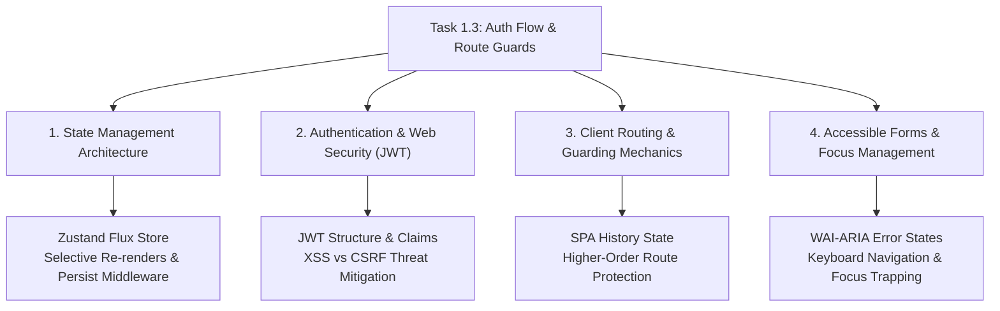

# Stage 3: CS Domain Learning Extraction
## Task 1.3: Auth Flow, Route Guards & User Profile State `[FRONTEND]`

**Task ID:** Task 1.3  
**Track:** Frontend Track (React 18+ / TypeScript / Vite / Zustand)  
**Epic:** Epic 1 — Identity, RBAC & Student Learning State Machine  
**Accepted Decision Basis:** [ADR-008: Frontend Framework & UI Ecosystem](file:///c:/Users/Muhammad/OneDrive%20-%20Higher%20Education%20Commission/Desktop/AI%20Tutor/Feynman_tutorAI/docs/adr/ADR-008-frontend-framework-and-ui-stack.md), [DESIGN_SYSTEM_TYPOGRAPHY.md](file:///c:/Users/Muhammad/OneDrive%20-%20Higher%20Education%20Commission/Desktop/AI%20Tutor/Feynman_tutorAI/docs/frontend_design/DESIGN_SYSTEM_TYPOGRAPHY.md)

---

## 1. Domain Discovery Map



---

## 2. Domain Deep Dives

### Domain 1: State Management Architecture & Zustand Selectors

**What Is It (Plain English):**  
In a React application, if authentication state is stored high up in a standard React Context, every time a user logs in, updates their profile, or refreshes their token, **every component in the entire app tree re-renders**, even components that don't care about auth. **Zustand** uses an external store with a **Publish-Subscribe (Pub/Sub) pattern** and **selector hooks** (`useAuthStore(state => state.user)`), ensuring only components subscribed to the exact slice of state that changed will re-render.

**Physical Analogy:**  
> Imagine an **Apartment Building Mailroom**. In the old React Context model, whenever one resident receives a letter, the building manager rings the fire alarm, forcing all 200 tenants to walk down and check their mailboxes. In the **Zustand selector model**, the mailroom has a private buzzer connected only to the specific resident whose name is on the envelope.

**How It Works Under the Hood:**
```markdown
| Layer | What Happens | Code Entity |
| :--- | :--- | :--- |
| **Component Hook** | Calls `useAuthStore(s => s.isAuthenticated)` | `RequireAuth.tsx` |
| **Subscriber Registry** | Zustand registers a listener callback on mount | `zustand/vanilla` |
| **State Mutation** | `setAuth(user, token)` is executed | `authStore.ts` |
| **Equality Check** | Zustand executes `shallow` comparison on selected value | Fast Object comparison |
| **DOM Update** | Only subscribed components trigger React Fiber reconciliation | Minimal re-renders |
```

**Where It Manifests in This Codebase:**
- [`frontend/src/stores/authStore.ts`](file:///c:/Users/Muhammad/OneDrive%20-%20Higher%20Education%20Commission/Desktop/AI%20Tutor/Feynman_tutorAI/frontend/src/stores/authStore.ts) — Zustand store declaration.

---

### Domain 2: Web Authentication & JSON Web Tokens (JWT)

**What Is It (Plain English):**  
A **JSON Web Token (JWT)** is a compact, URL-safe container format consisting of three parts separated by dots (`Header.Payload.Signature`). The **Header** declares the algorithm (`HS256`); the **Payload** contains claims (`sub: "user_123"`, `role: "student"`, `exp: 1771700000`); and the **Signature** is a cryptographic hash generated by the backend server using its secret key. The frontend can decode the payload to know who is logged in immediately, while the backend verifies the signature on every request to ensure no student altered their role to `admin`.

**Physical Analogy:**  
> A JWT is like a **Government Passport with an Embossed Holographic Seal**. Anyone can look at your photo and name (payload), but foreign border guards can verify the holographic seal (signature) was made by the authentic government press and has not been tampered with.

**Where It Manifests in This Codebase:**
- [`frontend/src/types/auth.ts`](file:///c:/Users/Muhammad/OneDrive%20-%20Higher%20Education%20Commission/Desktop/AI%20Tutor/Feynman_tutorAI/frontend/src/types/auth.ts) — `User` and `AuthTokens` types.
- [`frontend/src/api/auth.ts`](file:///c:/Users/Muhammad/OneDrive%20-%20Higher%20Education%20Commission/Desktop/AI%20Tutor/Feynman_tutorAI/frontend/src/api/auth.ts) — Token transmission via `Authorization: Bearer <token>`.

---

### Domain 3: Client-Side Route Guards & Navigation Interception

**What Is It (Plain English):**  
In a Single Page Application (SPA), all UI code is downloaded to the client browser up-front. **Route Guards** are wrapper components that intercept navigation transitions before rendering protected components. If the user is unauthenticated or lacks the required role (e.g. attempting to view teacher analytics as a student), the guard halts rendering and redirects the user to `/login` while preserving the intended destination in URL search params (`?from=/exam/session/45`).

**Physical Analogy:**  
> A **Security Guard at a VIP Concert Entrance**. When you walk toward the backstage door, the guard asks to see your VIP wristband (`<RequireAuth allowedRoles={['vip']} />`). If you have a general admission wristband, they direct you back to the main lobby without letting you open the door.

**Where It Manifests in This Codebase:**
- [`frontend/src/components/auth/RequireAuth.tsx`](file:///c:/Users/Muhammad/OneDrive%20-%20Higher%20Education%20Commission/Desktop/AI%20Tutor/Feynman_tutorAI/frontend/src/components/auth/RequireAuth.tsx).

---

### Domain 4: Accessible Forms & Focus Management (WAI-ARIA)

**What Is It (Plain English):**  
Web accessibility ensures that visually impaired students or keyboard-only users can navigate login and registration forms effortlessly. This requires associating inputs with visible `<label>` elements using `htmlFor` and `id`, marking invalid fields with `aria-invalid="true"`, and announcing submission errors via `aria-live="polite"` live regions so screen readers speak the error immediately without moving the user's cursor unexpectedly.

**Where It Manifests in This Codebase:**
- [`frontend/src/components/ui/input.tsx`](file:///c:/Users/Muhammad/OneDrive%20-%20Higher%20Education%20Commission/Desktop/AI%20Tutor/Feynman_tutorAI/frontend/src/components/ui/input.tsx)
- [`frontend/src/components/auth/LoginForm.tsx`](file:///c:/Users/Muhammad/OneDrive%20-%20Higher%20Education%20Commission/Desktop/AI%20Tutor/Feynman_tutorAI/frontend/src/components/auth/LoginForm.tsx)

---

## 3. Cross-Domain Connections

| Concept A | Concept B | Architectural Connection |
| :--- | :--- | :--- |
| **Zustand State** | **Route Guard** | The Route Guard subscribes directly to `useAuthStore` to make synchronous render/redirect decisions. |
| **JWT Expiration** | **Error Interceptor** | When API returns HTTP 401, the client calls `authStore.logout()`, automatically triggering the Route Guard redirect. |
| **LocalStorage Sync** | **Hydration Race** | Zustand `persist` initializes state before first mount to prevent flickering between logged-out and logged-in states. |

---

## 4. Concept Evolution Timeline

| Developer Level | Mental Model | Advanced Reality |
| :--- | :--- | :--- |
| **Beginner** | *"I'll store `isLoggedIn = true` in component state."* | Resets on page reload; leaves no way to share auth across pages. |
| **Intermediate** | *"I'll put user state in React Context and write a `localStorage.getItem()` helper."* | Re-renders the entire application on state changes; vulnerable to hydration flicker. |
| **Advanced** | *"I'll use Zustand with persist middleware and higher-order route guards with role checks."* | Single-source-of-truth, zero unnecessary re-renders, accessible forms, and resilient session recovery. |

---

## 5. Vocabulary Reference

| Term | Definition | Codebase Location |
| :--- | :--- | :--- |
| **`useAuthStore`** | Zustand custom hook managing global authentication state and actions. | `frontend/src/stores/authStore.ts` |
| **`RequireAuth`** | Guard component enforcing authentication and RBAC permissions. | `frontend/src/components/auth/RequireAuth.tsx` |
| **`Role`** | Pedagogical user clearance level (`student`, `content_admin`, `sys_admin`). | `frontend/src/types/auth.ts` |
| **`Persist Middleware`** | Zustand plugin automatically serializing state to `localStorage`. | `zustand/middleware` |

---

## 6. "What If" Scenarios

### Q1: What if a student opens two browser tabs and logs out in one?
**A:** When `logout()` executes, `localStorage` is cleared. When the student interacts with the second tab, the next protected action detects the cleared session and redirects to `/login`.

### Q2: What if the backend auth server is down while the frontend developer is designing the exam player?
**A:** The `authClient` includes a built-in development fallback with 1-click Demo accounts (`student@feynman.ai`), allowing the frontend developer to test full student workflows with zero blockers.

### Q3: What if an unauthenticated user bookmarks `/exam/timed/mechanics` and visits it directly?
**A:** The `<RequireAuth />` guard intercepts the render, checks `isAuthenticated === false`, saves the path as a return URL parameter (`/login?redirect=/exam/timed/mechanics`), and redirects. Once the user logs in, the app immediately forwards them to their bookmarked exam.
