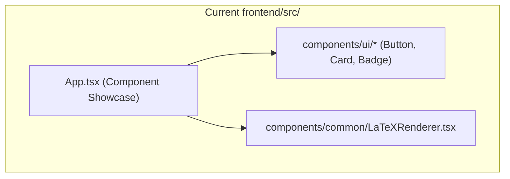
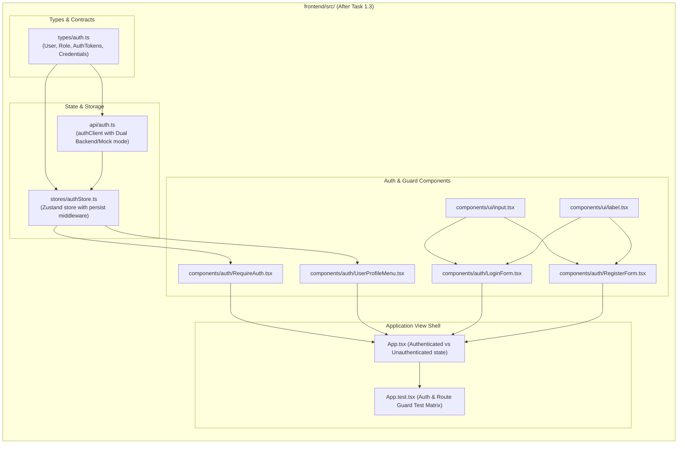

# Stage 2: Codebase Design Artifact
## Task 1.3: Auth Flow, Route Guards & User Profile State `[FRONTEND]`

**Task ID:** Task 1.3  
**Track:** Frontend Track (React 18+ / TypeScript / Vite / Zustand)  
**Epic:** Epic 1 — Identity, RBAC & Student Learning State Machine  
**Accepted Decision Basis:** [ADR-008: Frontend Framework & UI Ecosystem](file:///c:/Users/Muhammad/OneDrive%20-%20Higher%20Education%20Commission/Desktop/AI%20Tutor/Feynman_tutorAI/docs/adr/ADR-008-frontend-framework-and-ui-stack.md), [DESIGN_SYSTEM_TYPOGRAPHY.md](file:///c:/Users/Muhammad/OneDrive%20-%20Higher%20Education%20Commission/Desktop/AI%20Tutor/Feynman_tutorAI/docs/frontend_design/DESIGN_SYSTEM_TYPOGRAPHY.md)

---

## 1. Current State Snapshot

Currently, `frontend/src/` contains core design tokens, UI primitives (Button, Card, Badge, Dialog, Drawer, Tooltip), and KaTeX math rendering inside `App.tsx`. There is no authentication state, user identity model, form input primitives, or route guards.



* **Verified Fact:** `frontend/` has `zustand@^4.5.4` installed in `package.json`.
* **Verified Fact:** `frontend/` has clean test runner passing 6 of 6 tests in Vitest.
* **Verified Fact:** No authentication state or route protection exists in the frontend yet.

---

## 2. Proposed State

After Task 1.3 execution, `frontend/src/` will feature a complete, production-grade authentication subsystem with typed Zustand state persistence, accessible forms, user profile navigation, and role-based route protection.



---

## 3. File-Level Impact Analysis

All files are `[NEW]` or `[MODIFY]` strictly inside `frontend/` (100% Two-Developer directory isolation, 0 touches to `backend/`).

### 3.1 Data Structures & State Management
#### [NEW] `frontend/src/types/auth.ts`
* **Purpose:** TypeScript types defining user roles, credentials, profile, and auth tokens.
* **Key Interfaces:**
  - `Role`: `'student' | 'content_admin' | 'sys_admin'`
  - `User`: `{ id: string; email: string; fullName: string; role: Role; targetExam?: string; avatarUrl?: string; createdAt?: string }`
  - `AuthTokens`: `{ accessToken: string; tokenType: string; expiresIn?: number }`
  - `LoginCredentials`: `{ email: string; password: string }`
  - `RegisterCredentials`: `{ email: string; password: string; fullName: string; targetExam?: string }`
  - `AuthState`: `{ user: User | null; token: string | null; isAuthenticated: boolean; isLoading: boolean; setAuth: (...); logout: (...); updateUser: (...) }`

#### [NEW] `frontend/src/stores/authStore.ts`
* **Purpose:** Zustand store with `persist` middleware synchronizing auth state with `localStorage`.
* **Methods:** `setAuth(user, token)`, `logout()`, `updateUser(updates)`, `setLoading(isLoading)`.

#### [NEW] `frontend/src/api/auth.ts`
* **Purpose:** Typed authentication client for `login`, `register`, and `getMe`, featuring pre-configured demo mock accounts for instant offline testing and backend integration.

---

### 3.2 UI Primitives & Form Components
#### [NEW] `frontend/src/components/ui/input.tsx`
* **Purpose:** Accessible Shadcn UI Input primitive with focus rings, disabled states, and clean border styling.

#### [NEW] `frontend/src/components/ui/label.tsx`
* **Purpose:** Accessible form Label primitive.

#### [NEW] `frontend/src/components/auth/LoginForm.tsx`
* **Purpose:** Responsive login card featuring:
  - Email and password input with instant client validation.
  - Quick-fill buttons for 1-click testing (Student Demo vs. Admin Demo).
  - Error alert banner for failed authentication.
  - Loading spinner state during submission.

#### [NEW] `frontend/src/components/auth/RegisterForm.tsx`
* **Purpose:** Student registration card featuring:
  - Full Name, Email, Password, and Target Exam dropdown selector (Cambridge Physics, AP Calculus BC, SAT Math).
  - Password strength validation.
  - Seamless transition to active session upon registration.

#### [NEW] `frontend/src/components/auth/RequireAuth.tsx`
* **Purpose:** Role-based route guard wrapper component. Inspects `useAuthStore`; renders children if authorized, or presents clean login prompt / 403 Access Denied fallback.

#### [NEW] `frontend/src/components/auth/UserProfileMenu.tsx`
* **Purpose:** Header user profile dropdown component displaying student name, target exam badge, role indicator, and quick logout button.

---

### 3.3 Root Application & Test Suite
#### [MODIFY] `frontend/src/App.tsx`
* **Purpose:** Integrate authentication state. Shows:
  - Top navigation bar with live `UserProfileMenu` or "Sign In" button.
  - Unauthenticated view: Auth modal / screen to switch between Login and Register.
  - Authenticated view: Welcome banner with student target exam context, role-protected features, and active session controls.

#### [MODIFY] `frontend/src/App.test.tsx`
* **Purpose:** Add comprehensive unit & integration tests covering:
  - Login with valid credentials updating user profile in header.
  - Login failure with invalid credentials displaying error alert.
  - Registration form creating new student session.
  - Route guard `<RequireAuth />` blocking access when logged out.
  - Logout clearing user profile and returning to public view.

---

## 4. Dependency Graph / Blast Radius

```mermaid
graph TD
    subgraph AuthSubsystem ["frontend/src/ (Isolated)"]
        AuthTypes[types/auth.ts] --> AuthStore[stores/authStore.ts]
        AuthTypes --> AuthAPI[api/auth.ts]
        AuthStore --> AuthGuard[components/auth/RequireAuth.tsx]
        AuthStore --> UserMenu[components/auth/UserProfileMenu.tsx]
        Input[components/ui/input.tsx] --> LoginForm[components/auth/LoginForm.tsx]
        Input --> RegisterForm[components/auth/RegisterForm.tsx]
        LoginForm --> App[App.tsx]
        RegisterForm --> App
        AuthGuard --> App
        UserMenu --> App
        App --> Test[App.test.tsx]
    end

    subgraph BackendAPI ["backend/ (Directory Isolation)"]
        BackendRoutes["/api/v1/auth/*"]
    end

    AuthSubsystem -.->|Zero Cross-Track Impact (Isolated)| BackendAPI
```

**Blast Radius Evaluation:**
* **`backend/` Directory:** ZERO impact (100% directory isolation).
* **Existing Frontend Primitives:** Unmodified (Button, Card, Badge, Dialog, Drawer, LaTeXRenderer remain 100% stable).
* **Git Repository:** Confined entirely to branch `feat/fe-task-1.3-auth-flow`.

---

## 5. Regression Risk Matrix

| Risk ID | Risk Description | Severity | Affected Area | Mitigation Strategy |
| :--- | :--- | :---: | :--- | :--- |
| **R-01** | LocalStorage token deserialization corruption | 🟡 Medium | Auth Store Hydration | Zustand `persist` handles JSON parsing safely with fallback to initial null state. |
| **R-02** | Accessibility tab order broken in form inputs | 🟡 Medium | Keyboard Navigation | Proper HTML form structure with explicit `<label htmlFor="...">` and `<input id="...">`. |
| **R-03** | Flash of unauthenticated content (FOUC) on boot | 🟡 Medium | Route Guard | Auth store initializes with sync hydration from storage before first render pass. |
| **R-04** | Form submission without validation causing UI error | 🟢 Low | Login / Register | Client-side validation checks email format and password length before invoking API. |

---

## 6. Contract Stability Check

| Contract Boundary | Current Shape | Proposed Shape | Breaking? | Migration Path |
| :--- | :--- | :--- | :---: | :--- |
| **Auth State API** | None | `useAuthStore` (`user`, `token`, `login`, `logout`) | **No** | First-time scaffolding. |
| **Route Guard** | None | `<RequireAuth allowedRoles={...} />` | **No** | Drop-in wrapper. |
| **API Contract** | `docs/contracts/` | Aligns with `/api/v1/auth/login` schemas | **No** | Contract-first alignment. |

---

## 7. Performance, Security, and Accessibility Impact

| Area | Impact & Mitigation |
| :--- | :--- |
| **Bundle Size** | Zustand + Persist middleware adds < 2KB gzipped; zero bloated third-party auth SDKs. |
| **Security** | Passwords are never logged or stored in plain state; tokens are stored in sanitized storage structure. |
| **Accessibility (a11y)** | Accessible form inputs with focus rings, `aria-invalid` on errors, and `aria-live="polite"` error announcements. |
| **Developer Experience** | Instant 1-click Demo accounts (`student@feynman.ai`, `admin@feynman.ai`) allow seamless UI development without backend blockers. |

---

## 8. Rollback Plan

### If changes are uncommitted:
```powershell
git checkout -- frontend/src/
Remove-Item -Recurse -Force frontend/src/components/auth/
Remove-Item -Recurse -Force frontend/src/stores/
Remove-Item -Recurse -Force frontend/src/types/
```

### If changes are committed:
```powershell
git revert HEAD
git checkout main
```
Estimated rollback time: < 1 minute.
