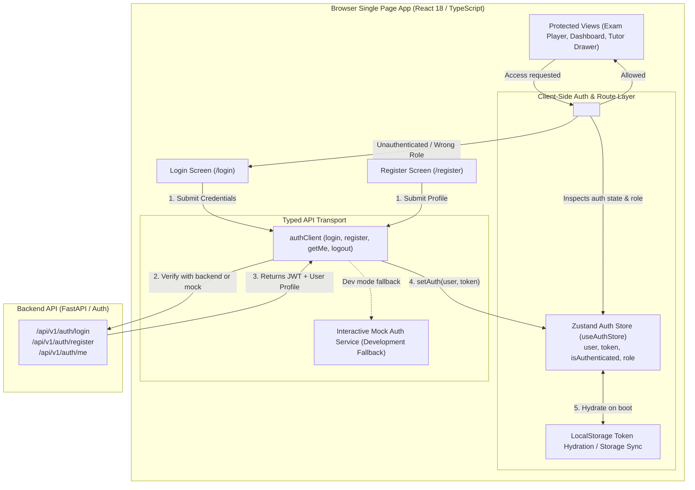
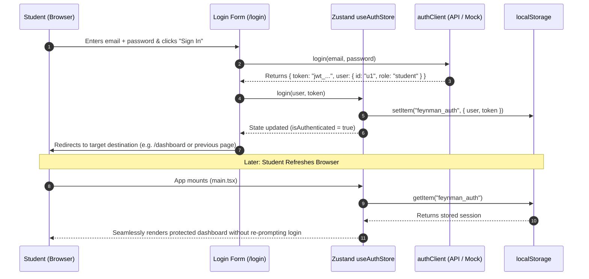
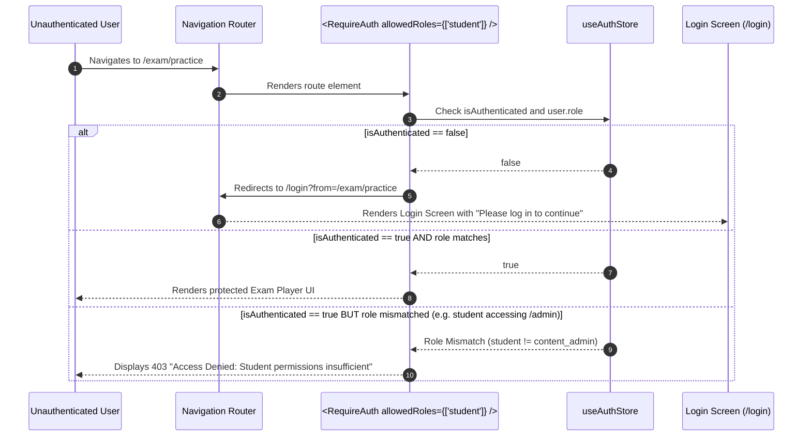

# Stage 1: Conceptual Understanding Artifact
## Task 1.3: Auth Flow, Route Guards & User Profile State `[FRONTEND]`

**Task ID:** Task 1.3  
**Track:** Frontend Track (React 18+ / TypeScript / Vite / Zustand)  
**Epic:** Epic 1 — Identity, RBAC & Student Learning State Machine  
**Accepted Decision Basis:** [ADR-008: Frontend Framework & UI Ecosystem](file:///c:/Users/Muhammad/OneDrive%20-%20Higher%20Education%20Commission/Desktop/AI%20Tutor/Feynman_tutorAI/docs/adr/ADR-008-frontend-framework-and-ui-stack.md), [DESIGN_SYSTEM_TYPOGRAPHY.md](file:///c:/Users/Muhammad/OneDrive%20-%20Higher%20Education%20Commission/Desktop/AI%20Tutor/Feynman_tutorAI/docs/frontend_design/DESIGN_SYSTEM_TYPOGRAPHY.md)

---

## 1. Visual Architecture

---

## 2. The Physical Analogy

> Think of client-side authentication like a **Smart University Campus RFID Keycard & Access Turnstiles**. 
> When you enroll at the admissions desk (Registration/Login), you receive a personal RFID smart card (JWT token) with your photo, student ID, and clearance level printed on it. When you attempt to enter the Physics Examination Hall or Student Analytics Lounge, you tap your card at the electronic turnstile (`<RequireAuth />`). The turnstile instantly verifies your badge is valid and unexpired; if it is, the gate swings open. If you don't have a badge or try to enter the Faculty Admin Archives without admin clearance, the turnstile beeps and directs you back to the front desk. Even if you walk away and return tomorrow (browser refresh), your smart card remains in your wallet (LocalStorage hydration), allowing you to swipe right back in.

---

## 3. Why & What

### Why are we doing this task?
1. **Student State Isolation (PRD Constraint #2):** Adaptive learning platforms must guarantee that mastery scores, mistake logs, and exam histories belong exclusively to the authenticated student and are never cross-pollinated or viewable anonymously.
2. **Client-Side Route Protection (PRD Constraint #6):** Prevents unauthenticated visitors from accessing high-stakes timed exam players or submitting incomplete assessment runs.
3. **Smooth UX & Instant State Hydration:** When a student refreshes their browser during an active study session, they must not be abruptly kicked back to the login screen.

### What is the concept?
A centralized **Zustand Authentication Store (`useAuthStore`)** paired with accessible **Login/Register form components**, client-side token persistence, and a higher-order **`<RequireAuth />` Route Guard** that protects private routes and enforces Role-Based Access Control (Student vs. Content Admin vs. Sys Admin).

### What breaks if we skip this?
- Any visitor could navigate directly to `/exam/session/123` and trigger unauthenticated API errors or corrupt session state.
- Refreshing the browser would wipe the user profile from memory, forcing students to re-login repeatedly.
- The UI would lack role awareness, showing teacher/admin controls to students and confusing the learning workflow.

---

## 4. Abstraction Level Map

| Level | What Lives Here | Current Project Example | Touched by Task 1.3? |
| :--- | :--- | :--- | :---: |
| **Product / UX** | Login & Register pages, User profile dropdown, Navigation auth button | `/login`, `/register`, Navbar profile avatar | 🔵 **PRIMARY FOCUS** |
| **Application** | Zustand Auth Store, Route Guards, Login/Register handlers | `src/stores/authStore.ts`, `src/components/auth/` | 🔵 **PRIMARY FOCUS** |
| **Framework** | Route Switcher, Protected Route Outlet, Form State | `react-router-dom` / route wrappers, `useState` | 🔵 **PRIMARY FOCUS** |
| **Library** | `clsx`, `tailwind-merge`, `lucide-react`, `zustand` | `@/lib/utils`, `zustand/middleware` | 🔵 Used heavily |
| **Runtime** | Browser LocalStorage, Memory heap, Navigation history | `window.localStorage`, `history.pushState` | 🔵 Local storage sync |
| **Infrastructure** | Backend JWT Token Issuance & Verification | `/api/v1/auth/login` | ⚪ Backend Contract |

---

## 5. Sequence Diagrams

### Diagram 1: User Login & Session Hydration Flow

### Diagram 2: Route Guard Access Control & Redirect

---

## 6. Data Flow Trace-Through

1. **User Action:** Student visits `/login`, types email and password into the clean Shadcn-styled form, and submits.
2. **Form Validation:** Client-side validation verifies email format and minimum password length (preventing unnecessary network roundtrips).
3. **API Dispatch:** `authClient.login()` dispatches HTTP request to FastAPI `/api/v1/auth/login` (with automatic fallback to dev mock service if backend is offline).
4. **State Mutation:** On success, `useAuthStore.getState().setAuth(user, token)` updates the reactive Zustand state.
5. **Persistence:** The `persist` middleware automatically saves the session payload into `localStorage`.
6. **Route Transition:** The login component detects successful authentication and navigates the student to the dashboard or their previous target URL.
7. **Guard Inspection:** Every protected screen wrapped with `<RequireAuth />` subscribes to `useAuthStore`. If the user logs out or the token expires, the guard immediately dismounts the protected tree and redirects.

---

## 7. Cognitive Model → Code Mapping

| Cognitive Stage | Mental Model | Code Concept in Feynman Frontend | Concrete Guardrail |
| :--- | :--- | :--- | :--- |
| **1. Digital Identity** | "My student identity card" | `User` interface (`id`, `email`, `fullName`, `role`) | Strict TypeScript types |
| **2. Active Memory** | "Remembering who is logged in right now" | `useAuthStore` (Zustand state hook) | Single source of truth |
| **3. Persistent Wallet** | "Keeping my badge in my pocket across reloads" | `zustand/middleware` `persist` | Survives page refreshes |
| **4. Campus Security** | "Checking ID at the entrance of private rooms" | `<RequireAuth allowedRoles={...} />` | Blocks unauthenticated access |
| **5. Clean Exit** | "Handing in my badge when leaving" | `logout()` action | Clears memory & storage completely |

---

## 8. Language & Stack Context (React 18 / TypeScript / Zustand / Tailwind)

- **Zustand Lightweight Store:** Zero boilerplate compared to Redux, native TypeScript type inference, and built-in `persist` middleware.
- **Accessible Forms:** Input fields with floating labels, error messages with `role="alert"`, and visible `:focus-visible` outlines.
- **Dual-Mode Auth Client:** Integrated with backend REST contracts while providing built-in mock credentials (`student@feynman.ai`, `admin@feynman.ai`) for instant local development without backend dependency.

---

## 9. Five Alternative Approaches Evaluated

| # | Approach | Pros | Cons | Verdict |
|:---|:---|:---|:---|:---|
| **1** | **Zustand + Persist Middleware + Route Guard (Approved)** | Ultra-lightweight (< 2KB), clean hooks API, zero boilerplate, reactive re-renders | None for this scale | ✅ **RECOMMENDED (ADR-008)** |
| **2** | **React Context API Alone** | Built into React | Causes unnecessary whole-app re-renders on token update; cumbersome persistence logic | ❌ Rejected |
| **3** | **Redux Toolkit (RTK)** | Powerful devtools | 15x more boilerplate, heavy bundle weight | ❌ Overkill |
| **4** | **NextAuth / Auth0 SDK** | Managed third-party auth | Introduces vendor lock-in and paid external dependencies | ❌ Rejected |
| **5** | **Direct LocalStorage reads in components** | No state library | Stale UI state across tabs, race conditions, zero reactivity | ❌ Anti-pattern |

---

## 10. Production Rationale & Disaster Scenarios

### Why This Is Standard:
Decoupling authentication state into a typed Zustand store with an explicit route guard wrapper ensures single-source-of-truth authorization, prevents route hijacking, and guarantees seamless session recovery across page reloads.

### Disaster Scenario 1: State Loss on Page Refresh During Active Exam
* *Without Persist Guard:* A student accidentally presses F5 during Question 25 of an exam. The app forgets they are logged in, ejects them to the login screen, and loses their local session context.
* *With Persist Guard:* Zustand hydrates the session from `localStorage` before the first frame renders; the student remains safely inside their active exam.

### Disaster Scenario 2: Student Accessing Content Administration Tools
* *Without Role Guards:* A student guesses the URL `/admin/questions` and accesses administrative question-publishing tools.
* *With Role Guards:* `<RequireAuth allowedRoles={['content_admin', 'sys_admin']} />` checks the student's role token and renders a 403 Forbidden alert, completely preventing unauthorized component mounting.
