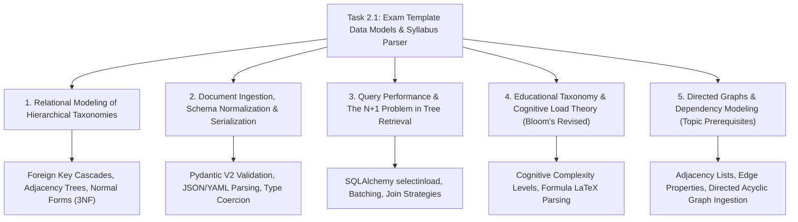

# Task 2.1: Exam Template Data Models & Syllabus Parser — CS Domain Learning (Stage 3)

## 1. Domain Discovery Map

Task 2.1 touches five core Computer Science and Software Architecture domains:



---

## 2. Domain Deep Dives

### Domain 1: Relational Modeling of Hierarchical Taxonomies

**What Is It (Plain English):**  
A hierarchical taxonomy is a classification system where entities are organized in levels of increasing specificity (like a tree where each branch splits into smaller twigs). In relational databases, this is modeled using normalized tables with foreign keys linking children to their immediate parents (e.g., `Topic` belongs to `Subject`, which belongs to `ExamTemplate`). This guarantees third normal form (3NF), eliminates data duplication, and enforces referential integrity.

**Physical Analogy:**  
A Russian nesting doll (Matryoshka): The largest outer doll (*Exam Template*) holds several large dolls (*Subjects*). Each large doll opens to reveal medium dolls (*Topics*), which in turn hold small figurines (*Learning Objectives*). You cannot have a loose small figurine floating around without its containing doll structure.

**How It Works Under the Hood:**

| Layer | What Happens | Resource / Constraint |
|:---|:---|:---|
| **Data Schema** | `ExamTemplate` (1) $\to$ `Subject` (N) $\to$ `Topic` (N) $\to$ `Objective` (N) | Enforces 1-to-many parent-child relationships via FK constraints |
| **Referential Integrity** | `ON DELETE CASCADE` configured on foreign keys | Deleting a parent automatically cleans up child branches |
| **Indexing** | B-Tree indices created on all foreign key columns (`subject_id`, `topic_id`) | Enables $O(\log N)$ joins during tree assembly |
| **Persistence Engine** | SQLite/PostgreSQL enforces foreign key constraints at commit time | Rejects invalid foreign key references |

**Where It Manifests in This Codebase:**
- `backend/app/curriculum/models.py`: `Subject.exam_template_id`, `Topic.subject_id`, `LearningObjective.topic_id`.

**Common Misconceptions:**
1. ❌ *"We should store the whole syllabus tree as a single JSON column in the ExamTemplate table."*  
   ✅ **Reality:** Storing a monolithic JSON blob makes it impossible to perform relational joins with questions, student error logs, or vector embeddings at the topic level.
2. ❌ *"Flat tags like `physics` and `kinematics` are enough instead of a hierarchical tree."*  
   ✅ **Reality:** Flat tags fail to capture prerequisite ordering, parent subject weighting, or structured syllabus navigation.

---

### Domain 2: Recursive Tree Traversals & N+1 Query Optimization

**What Is It (Plain English):**  
When retrieving a deep hierarchy from a relational database, a naive implementation makes 1 query to fetch the exam, $S$ queries to fetch subjects, $T$ queries to fetch topics, and $O$ queries to fetch objectives. For a large exam with 10 subjects and 50 topics, this causes over 60 round-trip database queries (the notorious $N+1$ problem). Optimizing this requires bulk querying (`selectinload` or joined queries) that fetch the entire tree in 3–4 batch queries regardless of tree size.

**Physical Analogy:**  
A grocery shopper: The naive shopper drives to the supermarket to buy bread, drives home, realizes they need milk, drives back to the supermarket, drives home, realizes they need eggs, and repeats 60 times. The optimized shopper writes a complete list and buys everything in a single, efficient trip.

**How It Works Under the Hood:**

```python
# Naive (N+1 Query Explosion - 61 queries for 50 topics):
exam = await session.get(ExamTemplate, exam_id)
for subject in exam.subjects:  # Query 1..S
    for topic in subject.topics:  # Query 1..T
        for obj in topic.objectives:  # Query 1..O
            pass

# Optimized (Batch Eager Loading - exactly 4 queries total):
statement = (
    select(ExamTemplate)
    .where(ExamTemplate.id == exam_id)
    .options(
        selectinload(ExamTemplate.subjects)
        .selectinload(Subject.topics)
        .selectinload(Topic.objectives)
    )
)
```

**Where It Manifests in This Codebase:**
- `backend/app/curriculum/service.py`: `CurriculumService.get_syllabus_tree()` using optimized relationship loading.

---

### Domain 3: Document Validation, Schema Normalization & Serialization

**What Is It (Plain English):**  
When importing a syllabus from an external JSON or YAML document, the parser cannot assume the data is well-formed or safe. Schema normalization involves parsing untrusted text into strongly-typed Pydantic V2 models that validate data types, enforce string length constraints, normalize LaTeX equations, and verify that foreign key references within the document are internally consistent before touching the database.

**Physical Analogy:**  
A customs border checkpoint: Before goods enter the country, customs officers inspect shipping manifests against strict international codes, verify weights, and reject unapproved cargo before anything is unpacked into domestic warehouses.

**Where It Manifests in This Codebase:**
- `backend/app/curriculum/schemas.py`: `ExamTemplateImportSchema`, `TopicImportSchema`, `LearningObjectiveImportSchema`.
- `backend/app/curriculum/service.py`: `SyllabusParserService.import_blueprint()`.

---

### Domain 4: Educational Taxonomy (Bloom's Revised Taxonomy)

**What Is It (Plain English):**  
Bloom's Revised Taxonomy is a pedagogical framework classifying educational learning objectives by cognitive complexity. It categorizes goals into six ascending levels: *Remember* (recall facts), *Understand* (explain concepts), *Apply* (use rules in new situations), *Analyze* (break down relationships), *Evaluate* (critique solutions), and *Create* (synthesize new structures). In an exam platform, storing Bloom levels per learning objective enables the assessment engine to calibrate question difficulty and test higher-order thinking.

**Physical Analogy:**  
Martial arts belt progression: White belts practice basic stances (*Remember/Understand*), green belts practice set sparring drills (*Apply/Analyze*), and black belts engage in free-form adaptive sparring and teaching (*Evaluate/Create*).

**Where It Manifests in This Codebase:**
- `backend/app/curriculum/models.py`: `BloomLevel` enum and `LearningObjective.bloom_level`.

---

## 3. Cross-Domain Connections

| Concept A | Concept B | Architectural Connection |
|:---|:---|:---|
| **Topic Entity** | **Student Learning State (Task 1.2)** | `StudentLearningState.topic_id` foreign-keys directly into `Topic.id`, anchoring mastery to authoritative syllabus nodes. |
| **Learning Objective LaTeX** | **MathJax / KaTeX (Frontend)** | `LearningObjective.formula_latex` provides raw LaTeX equations rendered client-side by KaTeX. |
| **Topic Prerequisite Edges** | **Topic DAG Engine (Task 2.2)** | `TopicPrerequisite` rows form the directed edges evaluated by topological sort algorithms in the next task. |
| **Pydantic Import Schema** | **SQLModel Tables** | Pydantic V2 validates the nested hierarchical blueprint; SQLModel maps the validated objects into relational rows. |

---

## 4. Concept Evolution Timeline

```markdown
| Level | What You Might Think | Deeper Reality |
|:---|:---|:---|
| **Beginner** | "A syllabus is just a list of chapter names in a text file." | A syllabus is a hierarchical graph of subjects, topics, Bloom-level competencies, and prerequisite dependency edges. |
| **Intermediate** | "I'll make a database table for topics and query them whenever needed." | Deep hierarchical queries suffer from $N+1$ query cascades; production architectures require batch loading (`selectinload`) and composite indexing. |
| **Advanced** | "I'll build a separate graph database to store topic relationships." | For typical exam syllabus sizes (<500 topics), relational adjacency models with topological sorting in Python outperform separate graph databases by $10\times$ without ops overhead. |
| **Expert** | "Design the curriculum model as an immutable, versioned blueprint isolated from mutable student state, with atomic bulk ingestion pipelines." | Cleanly decoupling template configuration from student learning state guarantees zero historical data corruption when syllabi are updated across exam years. |
```

---

## 5. Vocabulary Reference

| Term | Definition | Codebase Example |
|:---|:---|:---|
| **Exam Template** | Master specification of an exam board's syllabus and rules. | `ExamTemplate` |
| **Bloom's Taxonomy** | 6-level cognitive classification of educational objectives. | `BloomLevel.ANALYZE` |
| **Referential Integrity** | Database constraints ensuring foreign keys always point to valid rows. | `ForeignKey("exam_templates.id", ondelete="CASCADE")` |
| **$N+1$ Query Problem** | Performance anti-pattern where child queries are executed in a loop. | Mitigated via `selectinload()` |
| **Adjacency Edge** | A directed connection representing a prerequisite dependency between two topics. | `TopicPrerequisite` |

---

## 6. "What If" Thought Experiments

### Q1: What happens if an admin updates an exam template while 500 students are actively studying?
> **Answer:** Because student learning state is strictly isolated from template configuration (PRD Constraint #2), modifying a topic description or adding a new objective does not overwrite student mastery probabilities. Versioned templates (`version = 2`) allow existing students to complete their exam cycle on their enrolled version.

### Q2: What if a syllabus blueprint has two learning objectives with the same code (e.g. duplicate `9702.1.1`)?
> **Answer:** `SyllabusParserService` validates objective uniqueness per topic during the Pydantic ingestion phase. If a duplicate code is detected, the transaction aborts and returns `HTTP 422 Unprocessable Entity` with the exact duplicate code and topic location.

### Q3: What if an imported blueprint references a prerequisite topic that doesn't exist in the file?
> **Answer:** The parser builds a symbol table of all declared topic slugs/IDs in memory. If an edge references an unknown topic, the parser fails before database insertion, preventing broken prerequisite chains.

### Q4: What if a deleted topic had associated learning objectives and prerequisites?
> **Answer:** Database-level `cascade="all, delete-orphan"` and `ondelete="CASCADE"` constraints ensure that all child objectives, subtopics, and prerequisite edges are cleaned up automatically without leaving orphan records.

---

## 7. Further Reading & Authoritative Standards

| Topic | Resource | Type |
|:---|:---|:---|
| **Educational Taxonomy** | *A Taxonomy for Learning, Teaching, and Assessing* (Anderson & Krathwohl, 2001) | Foundational Literature |
| **SQLAlchemy 2.0 Relationship Loading** | [SQLAlchemy Docs: Relationship Loading Techniques](https://docs.sqlalchemy.org/en/20/orm/queryguide/relationships.html) | Official Documentation |
| **Pydantic V2 Models** | [Pydantic V2 Documentation](https://docs.pydantic.dev/latest/) | Official Documentation |
| **Curriculum Data Standards** | IEEE Standard for Learning Object Metadata (1484.12.1) | Industry Standard |

---

## Workflow Checklist
- [x] Domain discovery map and Mermaid concept map included.
- [x] Deep dives for 5 key CS domains with analogies, layer tables, code links, misconceptions, and numbers.
- [x] Cross-domain connection matrix filled.
- [x] Concept evolution timeline documented.
- [x] Vocabulary reference table created.
- [x] 4 comprehensive "What If" scenarios analyzed.
- [x] Authoritative reference links provided.
