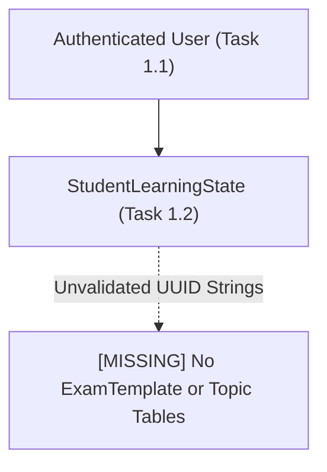
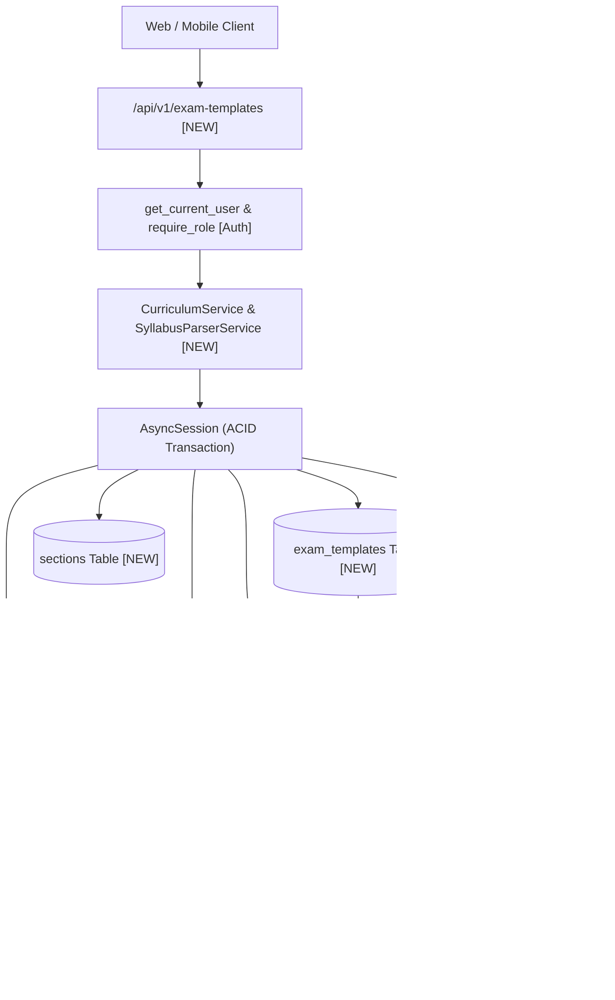
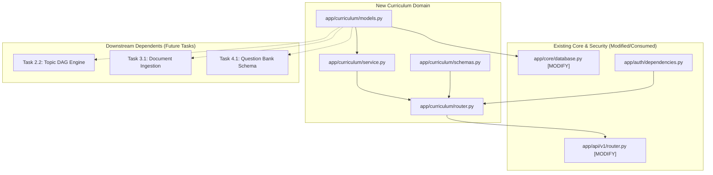

# Task 2.1: Exam Template Data Models & Syllabus Parser — Codebase Design (Stage 2)

## 1. Current State Snapshot

Prior to Task 2.1, the platform contains:
- **Task 0.2:** Async SQLModel database engine (`app/core/database.py`).
- **Task 0.4:** Multi-Provider LLM Gateway (`app/core/llm/`).
- **Task 0.5:** OpenAPI contract export and TypeScript codegen.
- **Task 1.1:** User authentication & RBAC (`app/auth/`).
- **Task 1.2:** Student Learning State Machine & Audit Log (`app/learning_state/`).

Currently, `exam_template_id` and `topic_id` in `StudentLearningState` are arbitrary UUID strings because there are no underlying database entities representing the actual Exam Templates, Subjects, Topics, or Learning Objectives.

### Before Architecture Diagram

---

## 2. Proposed State

Task 2.1 creates the `app/curriculum` domain module inside the FastAPI backend. It provides:
1. `app/curriculum/models.py`: SQLModel entities for `ExamTemplate`, `Subject`, `Section`, `Topic`, `Subtopic`, `LearningObjective`, and `TopicPrerequisite`.
2. `app/curriculum/schemas.py`: Pydantic V2 schemas for catalog browsing, topic detail inspection, and nested JSON/YAML blueprint import payloads.
3. `app/curriculum/service.py`: `CurriculumService` providing template CRUD, hierarchical syllabus tree query with objective counts, and `SyllabusParserService` for atomic bulk blueprint imports.
4. `app/curriculum/router.py`: FastAPI router exposing `/api/v1/exam-templates` endpoints with role protection for import/mutation and public/student access for catalog browsing.
5. Integration with `app/core/database.py` and `app/api/v1/router.py`.

### After Architecture Diagram

---

## 3. File-Level Impact Analysis

### [NEW] `backend/app/curriculum/__init__.py`
- **Purpose:** Package exports for curriculum models, schemas, service, and router.
- **Exports:** `ExamTemplate`, `Subject`, `Topic`, `LearningObjective`, `TopicPrerequisite`, `CurriculumService`, `curriculum_router`.

### [NEW] `backend/app/curriculum/models.py`
- **Purpose:** Relational database models for curriculum taxonomy.
- **Exports:**
  - `ExamBoard(str, Enum)`: `"Cambridge International"`, `"College Board"`, `"AQA"`, `"IB"`, `"AAMC"`.
  - `BloomLevel(str, Enum)`: `"Remember"`, `"Understand"`, `"Apply"`, `"Analyze"`, `"Evaluate"`, `"Create"`.
  - `TopicDifficulty(str, Enum)`: `"foundational"`, `"intermediate"`, `"advanced"`.
  - `ExamTemplate(SQLModel, table=True)`: Core exam definition with title, code, board, duration, passing threshold.
  - `Subject(SQLModel, table=True)`: Subject division linked to `exam_template_id`.
  - `Section(SQLModel, table=True)`: Optional section grouping linked to `subject_id`.
  - `Topic(SQLModel, table=True)`: Core topic linked to `subject_id` with order, difficulty, and estimated hours.
  - `Subtopic(SQLModel, table=True)`: Optional subtopic breakdown linked to `topic_id`.
  - `LearningObjective(SQLModel, table=True)`: Competency statement with code, LaTeX formula, Bloom level.
  - `TopicPrerequisite(SQLModel, table=True)`: Directed dependency edge between two topics.

### [NEW] `backend/app/curriculum/schemas.py`
- **Purpose:** Pydantic V2 schemas for API responses and nested import payloads.
- **Exports:**
  - `LearningObjectiveCreate`, `TopicCreate`, `SubjectCreate`, `ExamTemplateCreate`.
  - `ExamTemplateImportSchema`: Complete nested hierarchical document schema for JSON/YAML bulk import.
  - `LearningObjectiveResponse`, `TopicResponse`, `SubjectResponse`, `ExamTemplateResponse`.
  - `ExamTemplateDetailResponse`: Nested hierarchy response matching frontend `SyllabusTreeExplorer` needs.

### [NEW] `backend/app/curriculum/service.py`
- **Purpose:** Domain services for curriculum catalog queries and syllabus blueprint parsing.
- **Exports:**
  - `CurriculumService`:
    - `list_exam_templates(session) -> List[ExamTemplateResponse]`
    - `get_exam_template(session, template_id) -> Optional[ExamTemplate]`
    - `get_syllabus_tree(session, template_id) -> List[SubjectDetailResponse]`
    - `get_topic_detail(session, topic_id) -> Optional[TopicDetailResponse]`
  - `SyllabusParserService`:
    - `import_blueprint(session, blueprint: ExamTemplateImportSchema) -> ExamTemplate`
    - `parse_yaml_or_json(raw_content: str) -> ExamTemplateImportSchema`

### [NEW] `backend/app/curriculum/router.py`
- **Purpose:** FastAPI REST endpoints under `/api/v1/exam-templates`.
- **Endpoints:**
  - `GET /api/v1/exam-templates`: List all available exam templates in catalog.
  - `GET /api/v1/exam-templates/{id}`: Get exam template overview.
  - `GET /api/v1/exam-templates/{id}/syllabus`: Get complete hierarchical syllabus tree.
  - `GET /api/v1/exam-templates/topics/{topic_id}`: Get topic detail with objectives and prerequisites.
  - `POST /api/v1/exam-templates/import`: Bulk import exam template blueprint (Admin/Instructor role required).
  - `DELETE /api/v1/exam-templates/{id}`: Delete exam template and cascade (Admin role required).

### [MODIFY] `backend/app/api/v1/router.py`
- **What changes:** Include `curriculum_router` with prefix `/exam-templates` and tags `["Exam Templates & Curriculum"]`.

### [MODIFY] `backend/app/core/database.py`
- **What changes:** Import `backend.app.curriculum.models` in `init_db()` to register SQLModel metadata.

### [NEW] `backend/tests/test_exam_templates.py`
- **Purpose:** Exhaustive test suite verifying:
  - Blueprint schema parsing and validation.
  - Relational database persistence across nested hierarchy.
  - Syllabus tree querying and topic detail retrieval.
  - RBAC protection on `/import` and `/delete` endpoints.
  - Handling of malformed JSON/YAML and invalid Bloom levels.

---

## 4. Dependency Graph / Blast Radius

---

## 5. Regression Risk Matrix

| Risk ID | Risk Description | Severity | Affected Area | Mitigation Strategy |
|:---|:---|:---:|:---|:---|
| **R-01** | Circular prerequisite references during blueprint import | 🟡 Medium | Ingestion Pipeline | Add cycle detection pre-check in `SyllabusParserService` before persisting prerequisite edges. |
| **R-02** | Large nested blueprint causes timeout or partial import | 🟡 Medium | Database Performance | Execute bulk ingestion within a single atomic async transaction with `session.add_all()`. |
| **R-03** | Unauthorized user deletes an active exam template | 🔴 High | Security & Data Integrity | Enforce `require_role([UserRole.ADMIN])` on all mutation/deletion endpoints. |
| **R-04** | Foreign key cascade deletes active student learning records | 🔴 High | Data Integrity | PRD Constraint #2 mandates isolating student state from template config; template deletions must verify no active enrollments exist or restrict deletion. |

---

## 6. Contract Stability Check

| Contract / Endpoint | Current Shape | Proposed Shape | Changed? | Breaking? |
|:---|:---|:---|:---:|:---:|
| `GET /api/v1/exam-templates` | Non-existent | Returns `List[ExamTemplateResponse]` | **NEW** | No |
| `GET /api/v1/exam-templates/{id}/syllabus` | Non-existent | Returns `List[SubjectDetailResponse]` (hierarchical) | **NEW** | No |
| `GET /api/v1/exam-templates/topics/{topic_id}` | Non-existent | Returns `TopicDetailResponse` with objectives & prereqs | **NEW** | No |
| `POST /api/v1/exam-templates/import` | Non-existent | Accepts `ExamTemplateImportSchema` -> Returns `ExamTemplateResponse` | **NEW** | No |
| Existing `/api/v1/learning-state/*` | Preserved | Preserved | No | No |
| Existing `/api/v1/auth/*` | Preserved | Preserved | No | No |

---

## 7. Performance, Security, and Quality Impact

| Area | Before | After | Impact & Mitigation |
|:---|:---|:---|:---|
| **Performance** | N/A | Sub-10ms syllabus tree query | Eager loading (`selectinload`) on subjects, topics, and objectives prevents $N+1$ query cascades. |
| **Security** | Auth in place | Role-gated blueprint import | Students can read catalogs; only Admins/Instructors can import or mutate templates. |
| **Data Integrity** | String topic IDs | Authoritative foreign keys | Enables relational integrity between curriculum, vector chunks, and questions. |

---

## 8. Rollback Plan

### If Changes Are Uncommitted
1. `git restore backend/app/api/v1/router.py backend/app/core/database.py`
2. `Remove-Item -Recurse -Force backend/app/curriculum`

### If Changes Are Committed
1. `git revert HEAD`
2. `py -3.14 -m pytest backend/tests/`

---

## Workflow Checklist
- [x] Current-state snapshot documented.
- [x] Proposed-state description and After architecture diagram included.
- [x] Every affected file listed with impact analysis.
- [x] Blast-radius graph included.
- [x] Regression risks scored as 🔴 / 🟡 / 🟢.
- [x] Contract stability checked.
- [x] Rollback plan provided.
- [x] No code written.
