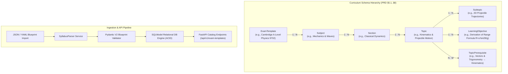
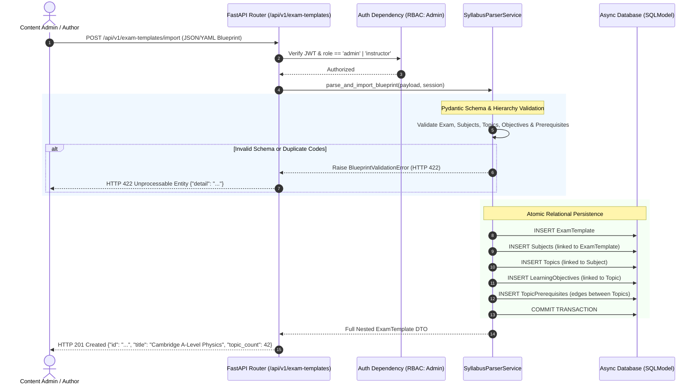
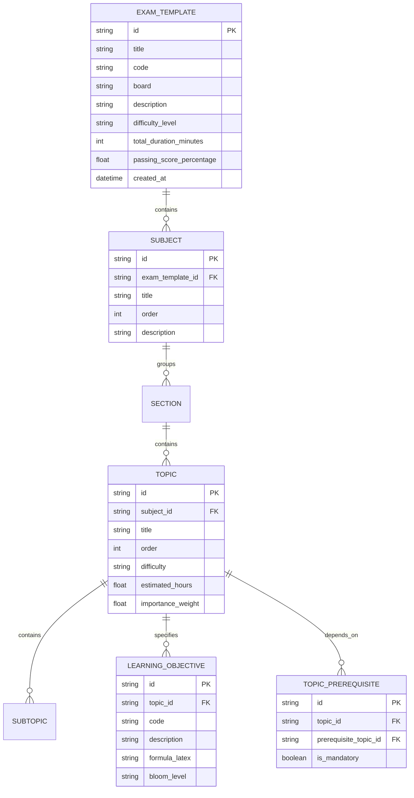

# Task 2.1: Exam Template Data Models & Syllabus Parser — Conceptual Understanding (Stage 1)

## 1. Visual Architecture

---

## 2. The Physical Analogy

The Exam Template and Syllabus Taxonomy is like an **architectural engineering master blueprint for an aircraft carrier**:
> You cannot construct an aircraft carrier by simply throwing steel plates and jet engines onto an open dock. You require an authoritative master blueprint that specifies every compartment, deck, electrical subsystem, and bolt specification in a strict hierarchy: *Vessel Class (Exam Template)* → *Major Divisions (Subjects: Propulsion, Avionics, Flight Deck)* → *Compartments (Topics)* → *Standard Operating Checklists (Learning Objectives)*. Furthermore, the blueprint specifies strict construction dependencies (*Prerequisites*): you cannot install the radar dish before the main tower mast is erected. When hundreds of flight crews train (*Students*), they all study against this shared, immutable master blueprint without altering the structural blueprints themselves.

---

## 3. Why & What

### Why Are We Doing This Task?
In unstructured LLM study apps, topics are flat, arbitrary, and disconnected text strings. There is no understanding of what constitutes an exam syllabus, what order concepts must be mastered in, or what specific mathematical equations define an objective.
PRD Capability 2 (§5.1, §8, FR-002) mandates an **Exam Template Engine** that allows reusable exam definitions supporting multiple concurrent students, versioning, hierarchical subjects/topics, and explicit learning objectives. This task builds the curricular skeleton upon which all assessment, RAG retrieval, vector search, and mastery tracking rely.

### What Is the Concept?
An **Exam Template** is a structured, versioned data model representing the official curriculum of a high-stakes exam (e.g., Cambridge A-Levels, AP Calculus, MCAT, USMLE, SAT).
The hierarchy is strictly modeled as:
1. **ExamTemplate:** High-level exam identity, exam board, difficulty tier, target duration, and passing score rules.
2. **Subject:** Major division within the exam (e.g., Pure Mathematics, Mechanics, Organic Chemistry).
3. **Section:** Conceptual grouping within a subject.
4. **Topic:** Atomic pedagogical unit where learning state and mastery probabilities are calculated.
5. **Subtopic & LearningObjective:** Fine-grained Bloom-level competencies and LaTeX formulas.
6. **TopicPrerequisite:** Directed dependency edges establishing prerequisite chains.
7. **Syllabus Parser:** A resilient ingestion engine that parses complex nested JSON/YAML blueprints into validated relational database entities.

### What Breaks If We Skip It?
1. **Vector RAG & Assessment Disconnect:** Without explicit `topic_id` and `learning_objective_id` foreign keys, RAG chunks and generated questions cannot be grounded or filtered by topic, leading to cross-topic leakage.
2. **Curriculum Prerequisite Blindness:** Without structured topic prerequisite models, the adaptive engine cannot detect when a student is struggling in Kinematics because they lack foundational Trigonometry skills.

---

## 4. Abstraction Level Map

| Level | What Lives Here | Current Project Implementation |
|:---|:---|:---|
| **Product / UX** | Exam Catalog, Syllabus Tree, Prerequisite Badges | Frontend `ExamCatalogGrid.tsx`, `SyllabusTreeExplorer.tsx` |
| **Application** | Blueprint parsing, Taxonomy validation, CRUD services | `ExamTemplateService`, `SyllabusParserService` |
| **Framework** | HTTP routes, Multipart file/JSON upload handlers | FastAPI `APIRouter`, Pydantic V2 Blueprint Schemas |
| **Library** | Relational mapping, Foreign keys, Cascade deletes | SQLModel, SQLAlchemy 2.0 Async, `PyYAML` / standard `json` |
| **Runtime** | Async execution, In-memory parsing | Python 3.11+ async event loop |
| **OS / Infrastructure** | Relational tables, Foreign key indices | PostgreSQL / SQLite relational engine |

---

## 5. Mermaid Diagrams

### 5.1 Syllabus Blueprint Import Sequence Diagram

### 5.2 Relational Entity Relationship Diagram (ERD)

---

## 6. Data Flow Trace-Through

1. **Blueprint Assembly:** A content administrator prepares a curriculum blueprint file (`cambridge_physics_9702.json` or YAML) defining the exam structure, subjects, topics with LaTeX formulas, and prerequisite relationships.
2. **Import Submission:** Admin issues `POST /api/v1/exam-templates/import` containing the nested blueprint.
3. **RBAC Verification:** `require_role([UserRole.ADMIN, UserRole.INSTRUCTOR])` verifies authorization; regular students attempting to import receive HTTP 403.
4. **Validation & Normalization:** `SyllabusParserService` parses the document using Pydantic V2 models, ensuring all required fields, valid Bloom levels (`Remember`, `Understand`, `Apply`, `Analyze`, `Evaluate`, `Create`), and unique objective codes are present.
5. **Database Transaction:** In a single atomic session:
   - Persists `ExamTemplate`.
   - Iterates through `subjects` generating UUIDs and linking foreign keys.
   - Iterates through `topics`, generating topic IDs.
   - Persists `LearningObjective` records.
   - Maps topic prerequisite references into `TopicPrerequisite` edge records.
6. **Query & Display:** Students call `GET /api/v1/exam-templates` to browse the catalog and `GET /api/v1/exam-templates/{id}/syllabus` to fetch the complete nested curriculum tree for display in the `SyllabusTreeExplorer` UI.

---

## 7. Cognitive Model → Code Mapping

| Cognitive Concept | Mental Model | Code Implementation in This Project | Enforcement / Guardrail |
|:---|:---|:---|:---|
| **Exam Identity** | "The syllabus specification" | `ExamTemplate` (SQLModel table) | Unique code constraint (e.g. `code = "9702"`), version tracking |
| **Syllabus Hierarchy** | "Chapters and modules" | `Subject`, `Section`, `Topic`, `Subtopic` | Cascading foreign keys maintaining relational integrity |
| **Atomic Competency** | "Specific formula or fact to learn" | `LearningObjective` with `formula_latex` | Pydantic schema validation for Bloom taxonomy & LaTeX strings |
| **Curriculum Prerequisite** | "Topic A must precede Topic B" | `TopicPrerequisite` join table | Enforces prerequisite references exist in syllabus |
| **Blueprint Importer** | "Load complete curriculum in one click" | `SyllabusParserService.import_blueprint()` | Atomic database transaction + validation rollback |

---

## 8. Language/Stack Context (Python 3.11+, FastAPI, SQLModel)

- **Hierarchical Relational Models:** SQLModel definitions with explicit `foreign_key="exam_templates.id"` and indexed lookup columns.
- **Nested Pydantic V2 Import Schemas:** `ExamTemplateImportSchema`, `SubjectImportSchema`, `TopicImportSchema`, `LearningObjectiveImportSchema` enable deep structured validation with clear error messages.
- **YAML & JSON Dual Support:** Ingestion parser supports both standard JSON and YAML formats for human-friendly curriculum authoring.

---

## 9. Five Alternative Approaches Compared

| # | Approach | Pros | Cons | Why Option 1 Was Chosen |
|:---|:---|:---|:---|:---|
| **1** | **Hierarchical SQLModel Entities + Nested Importer (Chosen)** | Normalized relational queries, fast indexed joins, full typing, atomic imports | Multiple join tables | Directly models PRD §5.1 & enables precise topic-level RAG filtering |
| **2** | Single JSONB Blob per Exam | Very simple initial database schema | Cannot perform relational joins with questions, logs, or mastery state | Disqualified: Breaches relational model requirements |
| **3** | Graph Database (Neo4j) for Syllabus | Native graph traversals for prerequisites | Heavy separate infrastructure, violates zero-setup Windows dev | Disqualified: Unnecessary infrastructure overhead |
| **4** | Flat Topic List (No Subjects/Objectives) | Minimal code | Incompatible with authentic exam blueprints and Bloom taxonomy | Disqualified: Fails PRD §5.1 requirements |
| **5** | Hardcoded Python Dictionary Blueprints | Zero database writes needed for templates | Cannot allow admin uploads or dynamic curriculum updates | Disqualified: Violates FR-002 admin capabilities |

---

## 10. Production Rationale & Consequences

### Why This Is Industry Standard
Every modern learning management and adaptive testing system (e.g., Khan Academy, Coursera, College Board) organizes content hierarchically. Normalizing templates, subjects, topics, and objectives into relational tables allows sub-millisecond querying, granular progress tracking, and precision RAG retrieval.

### Disaster Scenarios If Skipped

#### Disaster 1: The Cross-Topic Question Leak
> If exam curricula are stored as unstructured text or flat tags, generating a quiz on "Newton's Laws" pulls in questions from "Special Relativity" because there are no strict subject/topic boundaries. With structured SQLModel topics and learning objectives, questions are strictly mapped to `topic_id = UUID`, guaranteeing zero topic contamination.

#### Disaster 2: The Silent Prerequisite Blocker
> A student fails 10 consecutive calculus integration quizzes because they never mastered algebraic substitution. Without explicit `TopicPrerequisite` models, the platform cannot detect the foundational blocker and keeps serving futile integration questions. Structured prerequisite edges enable the DAG engine (Task 2.2) to guide the student to the exact prerequisite topic.

---

## Workflow Checklist
- [x] Hierarchical visual architecture and ERD diagrams included.
- [x] Physical analogy included (Aircraft carrier master blueprint).
- [x] Why/what/what-breaks explained thoroughly.
- [x] Abstraction level table filled with current project stack.
- [x] Data-flow trace-through completed step-by-step.
- [x] Cognitive model to code mapping table completed.
- [x] Stack-specific context detailed.
- [x] 5 alternatives compared.
- [x] 2 concrete disaster scenarios described.
