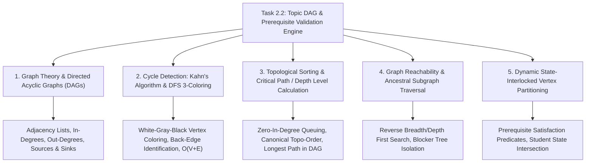

# Task 2.2: Topic DAG & Prerequisite Validation Engine — CS Domain Learning (Stage 3)

## 1. Domain Discovery Map

Task 2.2 touches five fundamental Computer Science and Algorithmic Graph Theory domains:



---

## 2. Domain Deep Dives

### Domain 1: Directed Acyclic Graphs (DAGs) & Adjacency Representation

**What Is It (Plain English):**  
A Directed Acyclic Graph is a network of vertices (topics) connected by one-way arrows (prerequisites) with no path that loops back to where it started. In software systems, DAGs are the universal mathematical structure for modeling dependency pipelines (such as build systems like `make` and `bazel`, task orchestrators like `Airflow`, and educational curricula). We represent the graph in memory using an **adjacency list** mapping each topic ID to the set of topics that immediately depend on it, plus an inverse adjacency list mapping each topic to its prerequisites.

**Physical Analogy:**  
A one-way river delta: Water flows from mountain springs (*Root Topics*) through merging and branching tributaries (*Intermediate Topics*) down to the ocean (*Capstone Topics*). Water cannot flow uphill or create an infinite whirlpool that loops back on itself without breaking the laws of physics.

**How It Works Under the Hood:**

| Layer | Representation | Time / Space Complexity |
|:---|:---|:---:|
| **Adjacency Forward** | `dict[topic_id, set[dependent_topic_id]]` | $O(V + E)$ Space |
| **Adjacency Inverse** | `dict[topic_id, set[prerequisite_topic_id]]` | $O(V + E)$ Space |
| **In-Degree Counter** | `dict[topic_id, int]` (count of incoming edges) | $O(V)$ Space, $O(1)$ lookup |
| **Lookup Operation** | Check if $u$ is prerequisite of $v$: `u in inverse_adj[v]` | $O(1)$ Average Time |

**Where It Manifests in This Codebase:**
- `backend/app/curriculum/dag.py`: `TopicDAG.__init__()`, `self.forward_adj`, `self.inverse_adj`.

**Common Misconceptions:**
1. ❌ *"An adjacency matrix ($V \times V$ 2D array) is better than an adjacency list."*  
   ✅ **Reality:** For curriculum graphs where each topic has 1–4 prerequisites ($E \ll V^2$), an adjacency matrix wastes $O(V^2)$ memory and slows iteration to $O(V^2)$ instead of $O(V+E)$.
2. ❌ *"A curriculum is just a tree where every topic has exactly one parent."*  
   ✅ **Reality:** Real learning is a DAG, not a tree: advanced topics like *Thermodynamics* require multiple distinct parents (*Mechanics* AND *Chemistry*).

---

### Domain 2: Cycle Detection (Kahn's Algorithm & DFS 3-Coloring)

**What Is It (Plain English):**  
A cycle occurs when topic $A$ requires topic $B$, and topic $B$ requires topic $A$ (or across a longer chain $A \to B \to C \to A$). If a cycle exists, the graph cannot be topologically sorted, creating an impossible learning requirement. We detect cycles using two complementary algorithms:
1. **Kahn's Algorithm:** Iteratively removes nodes with in-degree 0. If the number of processed nodes is less than $|V|$, a cycle exists.
2. **DFS 3-Coloring:** Marks nodes as `WHITE` (unvisited), `GRAY` (currently visiting in call stack), or `BLACK` (fully visited). If a DFS traversal encounters a `GRAY` node, a back-edge has been found, revealing the exact cycle path.

**Physical Analogy:**  
Catching a dog chasing its own tail: If you trace a dog's gaze from its eyes to its paws to its tail, and find its mouth is clamped onto its own tail, you have detected a closed loop where no forward progress can be made.

**How It Works (DFS 3-Coloring Step-by-Step):**

```python
# State definitions:
WHITE = 0  # Unvisited
GRAY  = 1  # Currently in active recursion stack
BLACK = 2  # Fully explored

def find_cycle_dfs(node, path):
    color[node] = GRAY
    path.append(node)
    
    for neighbor in forward_adj[node]:
        if color[neighbor] == GRAY:
            # Back-edge detected! Cycle found from neighbor to current node
            cycle_start = path.index(neighbor)
            return path[cycle_start:] + [neighbor]
        elif color[neighbor] == WHITE:
            cycle = find_cycle_dfs(neighbor, path)
            if cycle:
                return cycle
                
    color[node] = BLACK
    path.pop()
    return None
```

**Where It Manifests in This Codebase:**
- `backend/app/curriculum/dag.py`: `TopicDAG.detect_cycles()` and `TopicDAG.extract_cycle_path()`.

---

### Domain 3: Topological Sorting & Depth Level Calculation

**What Is It (Plain English):**  
Topological sorting arranges all graph nodes into a linear sequence $[T_1, T_2, \dots, T_n]$ such that every prerequisite appears before the topic that requires it. Furthermore, we compute the **Depth Level (Rank)** for each node: root nodes have $\text{level} = 0$, and each child has $\text{level} = \max(\text{level}(\text{parent})) + 1$. This depth corresponds to the longest path from any root to that topic, indicating the minimum number of consecutive study stages required.

**Physical Analogy:**  
A university course prerequisite schedule: You must take *Intro to Programming (Level 0)* before *Data Structures (Level 1)*, which in turn must precede *Algorithms (Level 2)* and *Compiler Construction (Level 3)*. You cannot graduate in 1 semester because the critical path length is 4 sequential stages.

**Mathematical Formulation:**
$$\text{level}(v) = \begin{cases} 0 & \text{if } \text{in\_degree}(v) = 0 \\ 1 + \max_{u \in \text{Prereqs}(v)} \text{level}(u) & \text{otherwise} \end{cases}$$

**Where It Manifests in This Codebase:**
- `backend/app/curriculum/dag.py`: `TopicDAG.get_topological_order()` and `TopicDAG.compute_node_levels()`.

---

### Domain 4: Graph Reachability & Blocker Subgraph Isolation

**What Is It (Plain English):**  
When a student struggles with a target topic $T$, we want to find all foundational topics in $T$'s prerequisite ancestry that the student has not yet mastered. We perform a **Reverse Breadth-First Search (BFS)** starting from $T$, following incoming prerequisite edges upstream:
$$\text{Ancestors}(T) = \{u \in V \mid \text{there exists a directed path from } u \text{ to } T\}$$
We then filter this set against the student's mastery set $M$:
$$\text{Blockers}(T) = \{u \in \text{Ancestors}(T) \mid u \notin M\}$$

**Where It Manifests in This Codebase:**
- `backend/app/curriculum/dag.py`: `TopicDAG.get_prerequisite_ancestors()` and `TopicDAGService.get_topic_prerequisite_blockers()`.

---

## 3. Cross-Domain Connections

| Concept A | Concept B | Architectural Connection |
|:---|:---|:---|
| **Topological Sort Order** | **Adaptive Diagnostic Engine (Epic 5)** | Diagnostic assessments present questions in topological order to detect the earliest point of cognitive failure. |
| **Topic Level / Depth** | **UI DAG Explorer (Frontend)** | Level numbers determine horizontal/vertical coordinate columns in visual node rendering. |
| **Blocker Ancestor Subgraph** | **AI Feynman Tutor (Epic 6)** | When a student is confused, the tutor inspects `Blockers(T)` to explain the underlying foundational gap rather than repeating high-level formulas. |
| **Mastery Filter ($M \subseteq V$)** | **Learning State Machine (Task 1.2)** | $M$ is computed by querying `StudentLearningState.state == LearningState.MASTERY`. |

---

## 4. Concept Evolution Timeline

```markdown
| Level | What You Might Think | Deeper Reality |
|:---|:---|:---|
| **Beginner** | "Order topics by their database row ID or order column." | Sequential ordering fails for multi-track curricula where topics can be learned in parallel. |
| **Intermediate** | "Use a simple recursive function to check prerequisites on the fly." | Unmemoized recursion causes exponential $O(2^N)$ explosion on diamond DAGs; topological preprocessing reduces it to $O(V+E)$ linear time. |
| **Advanced** | "Detect cycles by checking if node $A$ is in node $B$'s prerequisites." | Multi-node cycles ($A \to B \to C \to D \to A$) can only be detected via Kahn's algorithm or DFS 3-coloring. |
| **Expert** | "Decouple graph computation into pure in-memory algorithmic models, interlocked with tenant-isolated student state vectors." | High-performance graph traversal executes in microseconds without database round-trips, ensuring instantaneous adaptive route calculations. |
```

---

## 5. Vocabulary Reference

| Term | Definition | Codebase Example |
|:---|:---|:---|
| **DAG** | Directed Acyclic Graph. | `TopicDAG` |
| **In-Degree** | Number of prerequisite edges pointing into a topic. | `node.in_degree` |
| **Out-Degree** | Number of dependent topics that require this topic. | `node.out_degree` |
| **Root Node** | Topic with $\text{in\_degree} = 0$ (no prerequisites). | `dag.get_root_nodes()` |
| **Terminal / Capstone** | Topic with $\text{out\_degree} = 0$ (no dependents). | `dag.get_terminal_nodes()` |
| **Back-Edge** | An edge that points to an ancestor in the DFS tree, indicating a cycle. | `find_cycle_dfs()` |
| **Topological Order** | Linear sequence respecting all dependency arrows. | `dag.get_topological_order()` |

---

## 6. "What If" Thought Experiments

### Q1: What happens in a "Diamond Graph" ($A \to B \to D$ and $A \to C \to D$)?
> **Answer:** Topic $D$ has in-degree 2 (parents $B$ and $C$). Kahn's algorithm processes $A$ (level 0), then processes $B$ and $C$ (level 1), decrementing $D$'s remaining in-degree from 2 to 1 to 0, before correctly placing $D$ at level 2. Both $B$ and $C$ must be mastered to unlock $D$.

### Q2: What if an exam template has multiple disconnected subgraphs (e.g. Physics and Biology in one combined science template)?
> **Answer:** Kahn's algorithm initializes its queue with all nodes across all components having $\text{in\_degree} = 0$. The topological sort seamlessly processes both components into a valid global ordering without throwing errors.

### Q3: What if a student has mastered Topic $D$ but later their mastery of prerequisite $A$ decays during periodic revision?
> **Answer:** The unlock evaluator dynamically checks all prerequisites in real time. If an ancestor prerequisite is moved to `REPAIR` state, downstream topics can be visually flagged as "fragile" or requiring prerequisite review.

### Q4: How fast does the DAG engine run for a real exam with 200 topics and 400 edges?
> **Answer:** Because $V = 200$ and $E = 400$, Kahn's algorithm and topological sorting take approximately 600 operations, executing in under $0.2\text{ milliseconds}$ in Python.

---

## Workflow Checklist
- [x] Domain discovery map and Mermaid concept map included.
- [x] Deep dives for 5 key CS graph theory domains with analogies, layer tables, code links, misconceptions, and numbers.
- [x] Cross-domain connection matrix filled.
- [x] Concept evolution timeline documented.
- [x] Vocabulary reference table created.
- [x] 4 comprehensive "What If" scenarios analyzed.
