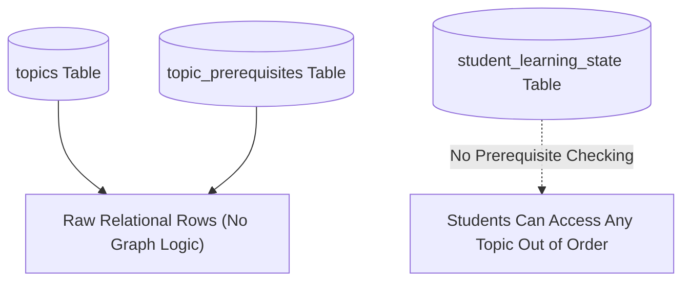
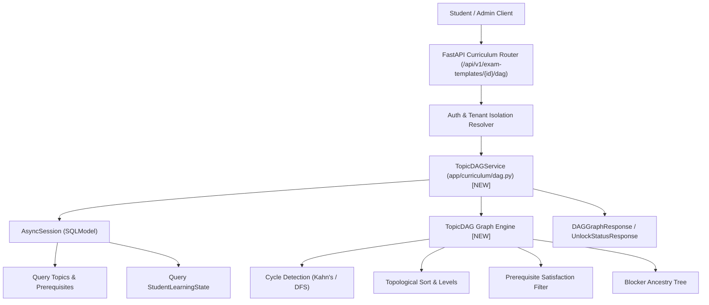
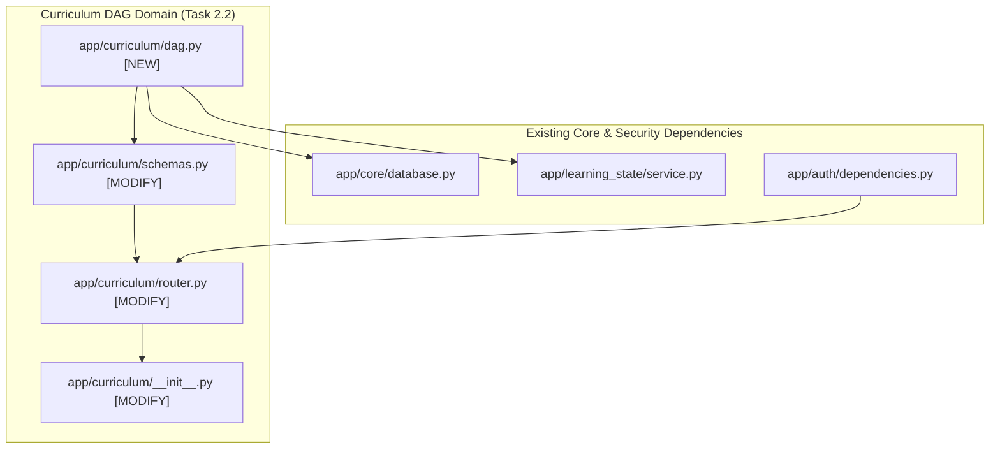

# Task 2.2: Topic DAG & Prerequisite Validation Engine — Codebase Design (Stage 2)

## 1. Current State Snapshot

Prior to Task 2.2:
- **Task 2.1:** Implemented relational curriculum models (`ExamTemplate`, `Subject`, `Topic`, `LearningObjective`, `TopicPrerequisite`) and syllabus ingestion parser.
- **Task 1.2:** Implemented `StudentLearningState` and `LearningStateMachineService`.

Currently, topic prerequisite edges are stored in the database as pairs of `(topic_id, prerequisite_topic_id)`, but there is no engine to validate acyclicity, compute topological learning orders, evaluate student prerequisite satisfaction, or isolate blocker subgraphs.

### Before Architecture Diagram

---

## 2. Proposed State

Task 2.2 implements the **Topic DAG & Prerequisite Validation Engine** in `backend/app/curriculum/dag.py`. It provides:
1. `TopicDAG`: Pure-Python graph data structure constructed from database topics and prerequisite edges.
2. Graph algorithms:
   - **Kahn's Algorithm & DFS 3-Coloring**: Cycle detection, cycle path tracing, and graph validity verification.
   - **Topological Sorting**: Canonical, deterministic learning sequence computation.
   - **Level & In-Degree Calculation**: Ranks topics by depth from root foundational concepts.
   - **Student Unlock Evaluator**: Cross-references a student's `StudentLearningState` to partition topics into `LOCKED`, `UNLOCKED`, and `MASTERED`.
   - **Prerequisite Blocker Analysis**: Traverses prerequisite ancestry to find all unmastered blockers for any target topic.
3. REST API endpoints in `backend/app/curriculum/router.py`:
   - `GET /api/v1/exam-templates/{id}/dag`
   - `GET /api/v1/exam-templates/{id}/learning-path`
   - `GET /api/v1/exam-templates/{id}/unlocked-topics`
   - `GET /api/v1/exam-templates/{id}/topics/{topic_id}/blockers`
   - `POST /api/v1/exam-templates/{id}/validate-dag`

### After Architecture Diagram

---

## 3. File-Level Impact Analysis

### [NEW] `backend/app/curriculum/dag.py`
- **Purpose:** Pure standard-library Python graph algorithms and DAG domain service.
- **Classes & Functions:**
  - `TopicDAGNode`: Dataclass holding topic metadata, in-degree, out-degree, rank level, and immediate prerequisite/dependent IDs.
  - `TopicDAG`: Graph class managing adjacency lists, cycle detection via Kahn's algorithm, DFS 3-coloring cycle path extractor, topological sorting, and ancestor reachability.
  - `TopicDAGService`:
    - `build_dag_for_exam(session, exam_template_id) -> TopicDAG`
    - `get_dag_graph_response(session, exam_template_id) -> DAGGraphResponse`
    - `get_topological_learning_path(session, exam_template_id) -> LearningPathResponse`
    - `get_student_unlocked_topics(session, exam_template_id, student_id) -> List[TopicUnlockStatusResponse]`
    - `get_topic_prerequisite_blockers(session, exam_template_id, topic_id, student_id) -> TopicBlockerReportResponse`
    - `validate_exam_dag(session, exam_template_id) -> DAGValidationResponse`

### [MODIFY] `backend/app/curriculum/schemas.py`
- **What changes:** Add Pydantic V2 schemas for DAG endpoints:
  - `DAGNodeResponse`: Node payload with topic ID, title, difficulty, level, in-degree, out-degree.
  - `DAGEdgeResponse`: Edge payload with `source_topic_id`, `target_topic_id`, `is_mandatory`.
  - `DAGGraphResponse`: Full graph DTO (`nodes`, `edges`, `is_acyclic`, `root_topic_ids`, `terminal_topic_ids`).
  - `DAGValidationResponse`: Validation DTO (`is_valid`, `has_cycles`, `cycle_path`, `total_nodes`, `total_edges`).
  - `LearningPathResponse`: Topologically ordered list of topics with suggested sequence numbers.
  - `TopicUnlockStatusResponse`: Topic ID, title, unlock status (`locked` | `unlocked` | `mastered`), and list of blocking prerequisite IDs.
  - `TopicBlockerReportResponse`: Target topic ID, title, is_unlocked, and hierarchical tree of missing prerequisite blockers.

### [MODIFY] `backend/app/curriculum/router.py`
- **What changes:** Add 5 new endpoints under `/api/v1/exam-templates`:
  - `GET /{template_id}/dag`: Returns visual DAG payload.
  - `GET /{template_id}/learning-path`: Returns topologically sorted study path.
  - `GET /{template_id}/unlocked-topics`: Returns student's unlocked vs locked topic statuses.
  - `GET /{template_id}/topics/{topic_id}/blockers`: Returns blocker analysis for a specific topic.
  - `POST /{template_id}/validate-dag`: Validates graph structure and detects cycles (Admin/Instructor).

### [MODIFY] `backend/app/curriculum/__init__.py`
- **What changes:** Export `TopicDAG`, `TopicDAGService`, and new DAG response schemas.

### [NEW] `backend/tests/test_curriculum_dag.py`
- **Purpose:** Comprehensive test suite verifying:
  - Linear, diamond, branching, and disconnected DAG topological sorting.
  - Cycle detection on simple 2-node cycles, multi-node loops, and self-referencing loops.
  - Calculation of graph ranks and depth levels.
  - Student prerequisite unlock evaluation across multiple learning state transitions.
  - Root-cause blocker ancestry tracing for failing topics.
  - FastAPI endpoint responses and tenant isolation.

---

## 4. Dependency Graph & Blast Radius

---

## 5. Regression Risk Matrix

| Risk ID | Risk Description | Severity | Affected Area | Mitigation Strategy |
|:---|:---|:---:|:---|:---|
| **R-01** | Infinite recursion during cycle path extraction | 🟡 Medium | Cycle Detector | Use DFS 3-coloring (`WHITE`, `GRAY`, `BLACK`) with explicit depth limits. |
| **R-02** | Disconnected subgraphs cause incomplete topological sorts | 🟡 Medium | Topological Sort | Kahn's algorithm initializes from all nodes with $\text{in\_degree} == 0$, naturally handling multiple connected components. |
| **R-03** | Large syllabus graph slows down unlock checks | 🟢 Low | Performance | In-memory adjacency list executes in $< 1\text{ms}$ for $N \le 1000$ topics. |
| **R-04** | Cross-student data leak when checking topic unlock statuses | 🔴 High | Security & Tenant Isolation | Enforce `resolve_student_id(current_user, requested_student_id)` on all unlock endpoints. |

---

## 6. Contract Stability Check

| Contract / Endpoint | Status | Request Body | Response Shape | Breaking? |
|:---|:---:|:---:|:---|:---:|
| `GET /api/v1/exam-templates/{id}/dag` | **NEW** | None | `DAGGraphResponse` | No |
| `GET /api/v1/exam-templates/{id}/learning-path` | **NEW** | None | `LearningPathResponse` | No |
| `GET /api/v1/exam-templates/{id}/unlocked-topics` | **NEW** | Query: `student_id` (optional) | `List[TopicUnlockStatusResponse]` | No |
| `GET /api/v1/exam-templates/{id}/topics/{topic_id}/blockers` | **NEW** | Query: `student_id` (optional) | `TopicBlockerReportResponse` | No |
| `POST /api/v1/exam-templates/{id}/validate-dag` | **NEW** | None | `DAGValidationResponse` | No |
| Existing `/api/v1/exam-templates/*` | Preserved | Preserved | Preserved | No |

---

## 7. Rollback Plan

### If Changes Are Uncommitted
1. `git restore backend/app/curriculum/`
2. `Remove-Item backend/app/curriculum/dag.py backend/tests/test_curriculum_dag.py`

### If Changes Are Committed
1. `git revert HEAD`
2. `py -3.14 -m pytest backend/tests/`

---

## Workflow Checklist
- [x] Current-state snapshot documented.
- [x] Proposed-state description and After architecture diagram included.
- [x] Every affected file listed with impact analysis.
- [x] Blast-radius graph included.
- [x] Regression risks scored as 🔴 / 🟡 / 🟢.
- [x] Contract stability checked.
- [x] Rollback plan provided.
- [x] No code written.
