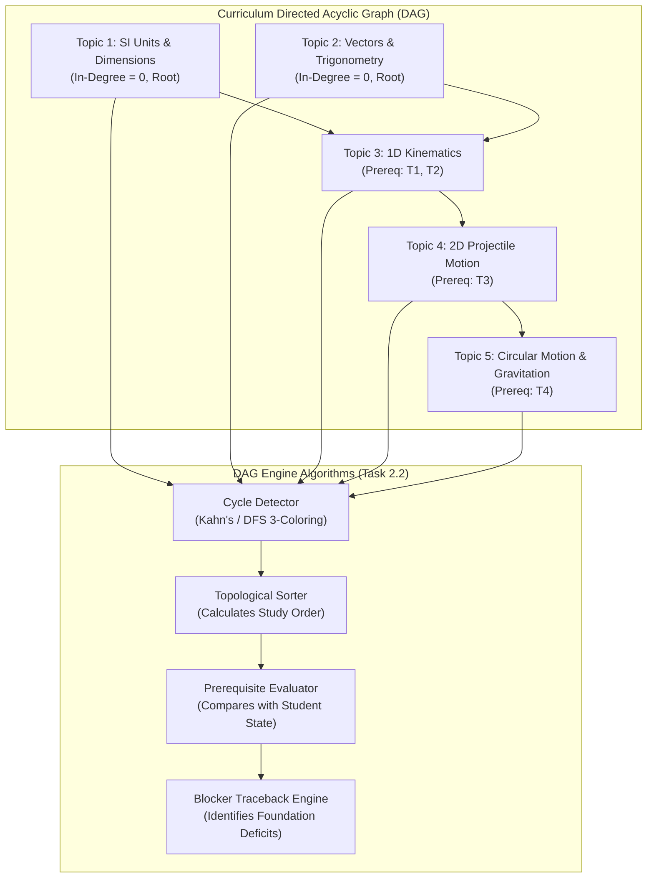
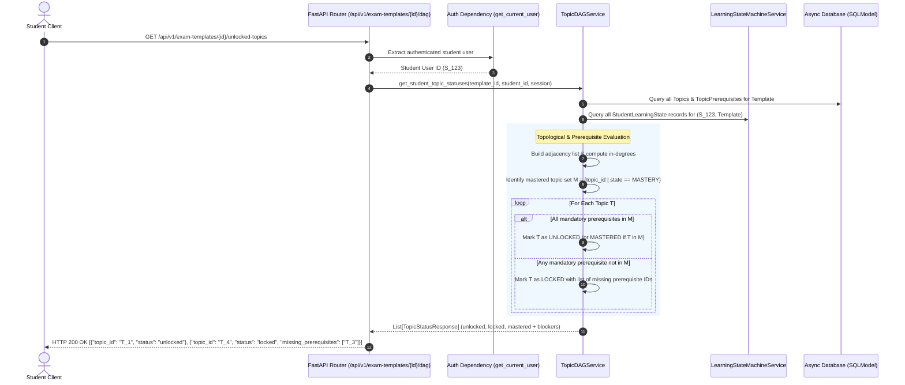

# Task 2.2: Topic DAG & Prerequisite Validation Engine — Conceptual Understanding (Stage 1)

## 1. Visual Architecture

---

## 2. The Physical Analogy

The Topic DAG Engine is like a **Civil Engineering Subway Map & Signal Interlocking System**:
> In a complex subway network, train lines (*Study Paths*) cannot run in arbitrary loops (*Cycles*) without causing catastrophic gridlock. A train cannot enter Track 4 (*Advanced 2D Projectiles*) until the electronic interlocking signals confirm that Tracks 1, 2, and 3 (*Foundational Units, Vectors, and 1D Kinematics*) have been cleared and safely passed (*Mastered*). If a train stalls (*Student Failure*), the automated dispatcher traces back the track ancestry to find the exact electrical switch (*Prerequisite Deficit*) that prevented the green signal from activating.

---

## 3. Why & What

### Why Are We Doing This Task?
Linear textbooks present chapters sequentially (1, 2, 3... N), but authentic human learning is a **directed dependency graph**. For example, in Calculus, you can study *Integration by Parts* only after mastering both *Product Rule* and *Indefinite Integrals*, but *Matrices* can be studied concurrently.
PRD Capability 2 (§5.1, §8, FR-003, NFR-004) requires an automated **Topic DAG & Prerequisite Engine** that:
1. Validates that no circular dependencies exist in any curriculum blueprint.
2. Computes the optimal topological learning sequence.
3. Computes dynamic "unlocked" vs "locked" topic states for individual students by cross-referencing their `StudentLearningState` records.
4. Identifies the root-cause prerequisite blockers when a student fails diagnostics or repair sessions.

### What Is the Concept?
- **DAG (Directed Acyclic Graph):** A finite graph with directed edges and no directed cycles.
- **Topological Sorting:** A linear ordering of vertices such that for every directed edge $(u, v)$, vertex $u$ comes before $v$ in the ordering.
- **Prerequisite Interlocking:** A topic $T$ is unlocked for student $S$ if and only if every mandatory prerequisite topic $P \in \text{Prereqs}(T)$ has state $\text{MASTERY}$ in $S$'s learning record.
- **Blocker Subgraph:** The sub-tree of ancestral topics rooted at $T$ where the student has not yet achieved mastery.

### What Breaks If We Skip It?
1. **Curricular Deadlocks:** A circular prerequisite (e.g., $A \to B \to C \to A$) makes it mathematically impossible for any student to ever unlock topic $A$, bricking the entire curriculum.
2. **Premature Exposure to Advanced Concepts:** Students are served difficult quantum mechanics problems before they understand basic wave equations, causing frustration and artificial test failure.
3. **Unexplainable Adaptive Remediation:** When a student fails an exam, the platform cannot explain *which* specific foundational concept is the blocker.

---

## 4. Abstraction Level Map

| Level | What Lives Here | Current Project Implementation |
|:---|:---|:---|
| **Product / UX** | Interactive DAG visualizer, Locked topic badges, Blocker popups | Frontend `CurriculumDAGExplorer.tsx` |
| **Application** | Cycle detection, Topological sort, Blocker tree traversal | `TopicDAGService` |
| **Framework** | FastAPI routes for DAG queries, locked/unlocked checks | `/api/v1/exam-templates/{id}/dag` endpoints |
| **Library** | Graph algorithms, In-memory adjacency representation | Pure Python `collections.defaultdict`, `deque`, `Set` |
| **Runtime** | Graph computation in microsecond timescale | Python 3.11+ async service |
| **OS / DB** | `topics` and `topic_prerequisites` relational tables | SQLModel SQLite / PostgreSQL |

---

## 5. Mermaid Sequence Diagram

---

## 6. Data Flow Trace-Through

1. **DAG Graph Assembly:** When `/api/v1/exam-templates/{id}/dag` is requested, `TopicDAGService` loads all topics and prerequisite edges for the exam template and builds an adjacency list:
   $$\text{adj}[u] = \{v \mid (u, v) \in E\}$$
2. **Cycle Validation:** Kahn's algorithm computes in-degrees for all nodes:
   - If $\text{count}(\text{processed}) < \text{total\_nodes}$, a directed cycle exists.
   - The engine flags the cycle and identifies the offending cycle path.
3. **Topological Sequence Generation:** A zero-in-degree priority queue processes nodes level-by-level, producing an optimal canonical study order.
4. **Student State Interlocking:** For a specific student, `TopicDAGService` checks their `StudentLearningState` records:
   - Topics with zero prerequisites are immediately unlocked.
   - Topics with prerequisites are unlocked if and only if all prerequisite topics have reached `LearningState.MASTERY`.
5. **Root-Cause Blocker Analysis:** If a student asks "Why can't I study Topic 5?", the engine performs a reverse depth-first traversal on the prerequisite graph, isolating all unmastered ancestors.

---

## 7. Cognitive Model → Code Mapping

| Cognitive Concept | Mental Model | Code Implementation in This Project | Guardrail / Rule |
|:---|:---|:---|:---|
| **Curriculum Graph** | "The concept map" | `TopicDAG` class with adjacency matrices | Strict immutability during graph evaluations |
| **Cycle Prevention** | "No time-travel prerequisites" | `TopicDAGService.validate_dag()` | Fails import / rejects invalid edges with HTTP 422 |
| **Recommended Path** | "Best sequence to study" | `TopicDAGService.get_topological_order()` | Guaranteed valid dependency order |
| **Prerequisite Gate** | "Unlock topic only when ready" | `TopicDAGService.evaluate_topic_unlocks()` | Checked against `StudentLearningState.state == MASTERY` |
| **Deficit Blocker** | "What do I need to fix first?" | `TopicDAGService.get_prerequisite_blockers()` | Reverse DFS isolating unmastered foundational topics |

---

## 8. Five Alternative Approaches Compared

| # | Approach | Pros | Cons | Why Option 1 Was Chosen |
|:---|:---|:---|:---|:---|
| **1** | **In-Memory Pure-Python DAG Service (Chosen)** | Fast ($<1\text{ms}$ for 500 topics), zero external dependencies, easily testable | Requires loading template's topics into memory | Syllabi are $< 1000$ topics; memory footprint is tiny ($< 100\text{KB}$) |
| **2** | Recursive SQL CTEs (`WITH RECURSIVE`) | Runs entirely inside relational DB | High SQL dialect variance between SQLite and PostgreSQL, complex cycle debugging | Disqualified: Fragile cross-engine compatibility |
| **3** | Graph Database (Neo4j / Memgraph) | Native Cypher traversals | Heavyweight separate server, violates zero-setup Windows dev | Disqualified: Excessive operational complexity |
| **4** | Flat Sequential Order (`order` integer only) | Trivial code | Cannot express multi-parent prerequisites (branching DAGs) | Disqualified: Fails PRD FR-003 requirements |
| **5** | NetworkX Third-Party Library | Pre-built graph algorithms | Adds large external dependency for simple Kahn's/DFS algorithms | Disqualified: Violates Zero Silent Library Ingestion Policy |

---

## 9. Production Rationale & Consequences

### Why This Is Industry Standard
Modern adaptive learning systems (Khan Academy Knowledge Graph, Coursera Learning Paths, Duolingo Skill Trees) model content as DAGs. Using pure standard-library Python graph algorithms with clear typing guarantees deterministic behavior, instant test execution, and zero third-party dependency vulnerabilities.

### Disaster Scenarios If Skipped

#### Disaster 1: The Circular Prerequisite Black Hole
> An instructor accidentally adds a prerequisite edge from "Topic A" to "Topic C" while "Topic C" already requires "Topic A". Without automated cycle validation, both topics become permanently locked for all students, locking out entire branches of the curriculum.

#### Disaster 2: The Remediation Guesswork Failure
> A student repeatedly fails high-level electromagnetic induction tests. Without the DAG blocker analysis engine, the AI tutor blindly generates more electromagnetic induction problems. With the DAG engine, the system traces the unmastered blocker to "Magnetic Flux Definition" and automatically switches the student to the repair loop on the exact foundational gap.

---

## Workflow Checklist
- [x] Hierarchical DAG visual architecture and flowchart included.
- [x] Subway signal interlocking physical analogy included.
- [x] Why/what/what-breaks explained thoroughly.
- [x] Abstraction level table filled with current project stack.
- [x] Data-flow trace-through completed step-by-step.
- [x] Cognitive model to code mapping table completed.
- [x] 5 alternatives compared.
- [x] 2 concrete disaster scenarios described.
