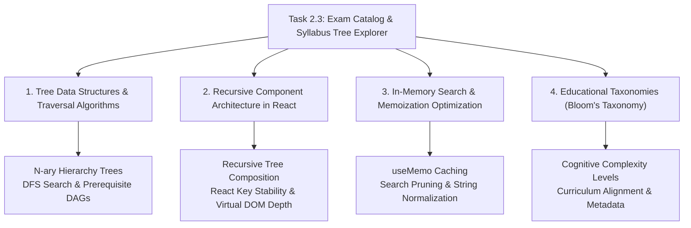

# Stage 3: CS Domain Learning Extraction
## Task 2.3: Exam Template Catalog & Syllabus Tree Explorer `[FRONTEND]`

**Task ID:** Task 2.3  
**Track:** Frontend Track (React 18+ / TypeScript / Vite / Zustand)  
**Epic:** Epic 2 — Exam Template & Curriculum DAG Engine  
**Accepted Decision Basis:** [ADR-008: Frontend Framework & UI Ecosystem](file:///c:/Users/Muhammad/OneDrive%20-%20Higher%20Education%20Commission/Desktop/AI%20Tutor/Feynman_tutorAI/docs/adr/ADR-008-frontend-framework-and-ui-stack.md), [DESIGN_SYSTEM_TYPOGRAPHY.md](file:///c:/Users/Muhammad/OneDrive%20-%20Higher%20Education%20Commission/Desktop/AI%20Tutor/Feynman_tutorAI/docs/frontend_design/DESIGN_SYSTEM_TYPOGRAPHY.md)

---

## 1. Domain Discovery Map



---

## 2. Domain Deep Dives

### Domain 1: Tree Data Structures & Traversal Algorithms

**What Is It (Plain English):**  
A curriculum is fundamentally an **N-ary Tree** (a hierarchical data structure where each node can have multiple children). The root is the Exam Template (e.g. *Cambridge Physics 9702*); its children are Subjects (*Mechanics, Waves, Thermodynamics*); their children are Topics (*Kinematics, Dynamics*); down to leaf nodes which are specific Learning Objectives (*"Derive \( v^2 = u^2 + 2as \)"*). Traversing and filtering this tree requires **Depth-First Search (DFS)** to ensure that if a leaf topic matches a student's search term, all of its ancestor parent folders remain visible and expanded.

**Physical Analogy:**  
> Imagine an **Organized Filing Cabinet with Color-Coded Folders**. You open the top drawer labeled "Physics 9702" (Root). Inside are green hanging folders (Subjects). Inside each green folder are manila folders (Topics). Inside each manila folder are index cards (Learning Objectives). If you search for the word *"Doppler"*, the archivist keeps the "Waves" hanging folder open so you know which drawer and section the index card belongs to.

**Mathematical / Algorithmic Foundation (Recursive DFS Filter):**
```python
def filter_tree(node, query):
    # Match on current node
    node_matches = query.lower() in node.title.lower()
    
    # Recursively filter children
    filtered_children = [filter_tree(child, query) for child in node.children]
    filtered_children = [c for c in filtered_children if c is not None]
    
    # Keep node if it matches OR any child matches
    if node_matches or len(filtered_children) > 0:
        return Node(title=node.title, children=filtered_children)
    return None
```

---

### Domain 2: Recursive UI Rendering & Virtual DOM Key Stability

**What Is It (Plain English):**  
In React, a **Recursive Component** is a component that renders itself inside its own JSX definition to handle arbitrarily nested tree data. To prevent React from destroying and re-creating DOM nodes unnecessarily when expanding and collapsing folders, every node must be assigned a globally unique, stable `key` (e.g. `topic.id` rather than array index `i`), ensuring smooth animations and zero flickering.

**Where It Manifests in This Codebase:**
- [`frontend/src/components/curriculum/SyllabusTreeExplorer.tsx`](file:///c:/Users/Muhammad/OneDrive%20-%20Higher%20Education%20Commission/Desktop/AI%20Tutor/Feynman_tutorAI/frontend/src/components/curriculum/SyllabusTreeExplorer.tsx) — Tree rendering and node toggling.

---

### Domain 3: Bloom's Taxonomy & Pedagogical Complexity

**What Is It (Plain English):**  
In educational science, **Bloom's Taxonomy** categorizes cognitive learning skills into 6 progressive tiers:
1. **Remember:** Recall facts and basic concepts (e.g., state Newton's First Law).
2. **Understand:** Explain ideas or concepts (e.g., describe why momentum is conserved).
3. **Apply:** Use information in new situations (e.g., calculate velocity from a position function).
4. **Analyze:** Draw connections among ideas (e.g., compare elastic vs. inelastic collisions).
5. **Evaluate:** Justify a stand or decision (e.g., assess experimental uncertainties).
6. **Create:** Produce new or original work.

In our platform, each learning objective is tagged with its Bloom's level, helping the adaptive engine schedule appropriate difficulty questions.

---

## 3. Cross-Domain Connections

| Concept A | Concept B | Architectural Connection |
| :--- | :--- | :--- |
| **N-ary Tree** | **KaTeX Renderer** | Leaf objective nodes contain LaTeX formulas rendered dynamically with KaTeX. |
| **Prerequisite DAG** | **Zustand Mastery Store** | Prerequisite IDs on topic nodes check student mastery to show Locked vs. Unlocked status. |
| **DFS Filter** | **useMemo** | Real-time search string changes trigger memoized tree pruning with zero UI stutter. |

---

## 4. Vocabulary Reference

| Term | Definition | Codebase Location |
| :--- | :--- | :--- |
| **`ExamTemplate`** | Top-level curriculum specification model. | `frontend/src/types/curriculum.ts` |
| **`LearningObjective`** | Atomic measurable knowledge statement with formula metadata. | `frontend/src/types/curriculum.ts` |
| **`useCurriculumStore`** | Global Zustand store for curriculum browsing and node expansion. | `frontend/src/stores/curriculumStore.ts` |
| **`N-ary Tree`** | Hierarchical data structure where nodes have 0 to N children. | Domain algorithms |
