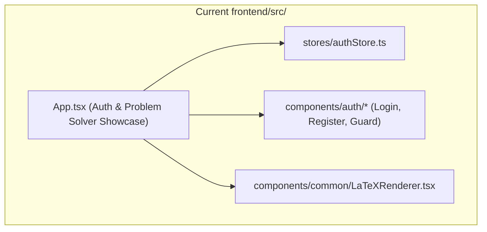
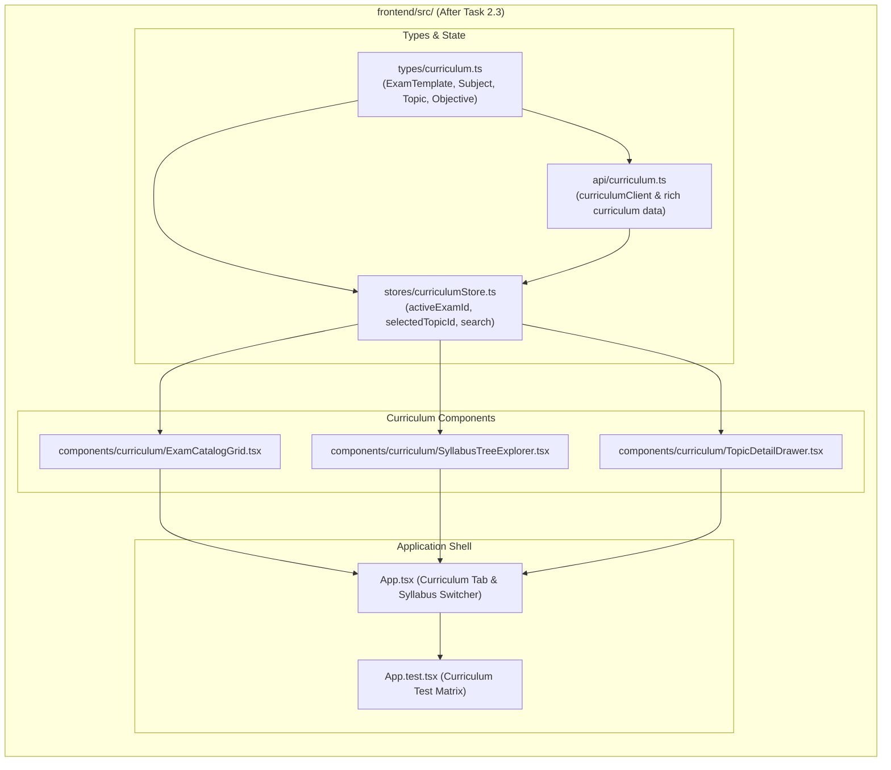

# Stage 2: Codebase Design Artifact
## Task 2.3: Exam Template Catalog & Syllabus Tree Explorer `[FRONTEND]`

**Task ID:** Task 2.3  
**Track:** Frontend Track (React 18+ / TypeScript / Vite / Zustand)  
**Epic:** Epic 2 — Exam Template & Curriculum DAG Engine  
**Accepted Decision Basis:** [ADR-008: Frontend Framework & UI Ecosystem](file:///c:/Users/Muhammad/OneDrive%20-%20Higher%20Education%20Commission/Desktop/AI%20Tutor/Feynman_tutorAI/docs/adr/ADR-008-frontend-framework-and-ui-stack.md), [DESIGN_SYSTEM_TYPOGRAPHY.md](file:///c:/Users/Muhammad/OneDrive%20-%20Higher%20Education%20Commission/Desktop/AI%20Tutor/Feynman_tutorAI/docs/frontend_design/DESIGN_SYSTEM_TYPOGRAPHY.md)

---

## 1. Current State Snapshot

Currently, `frontend/src/` has core UI primitives, authentication store/forms, route guards, and KaTeX math rendering. There is no curriculum catalog or hierarchical syllabus explorer.



* **Verified Fact:** `frontend/` has passing Vitest suite (10 of 10 passed).
* **Verified Fact:** `frontend/` is directory-isolated from `backend/`.

---

## 2. Proposed State

After Task 2.3 execution, `frontend/src/` will feature an interactive **Curriculum Exploration Subsystem** with searchable exam blueprints, nested syllabus trees, prerequisite badges, and KaTeX-rendered learning objectives.



---

## 3. File-Level Impact Analysis

All files are `[NEW]` or `[MODIFY]` strictly inside `frontend/` (zero touches to `backend/`).

### 3.1 Data Structures & State Management
#### [NEW] `frontend/src/types/curriculum.ts`
* **Purpose:** Defines hierarchical curriculum taxonomy models:
  - `ExamTemplate`: `{ id, title, code, board, description, subjectCount, topicCount, difficultyLevel, icon }`
  - `Subject`: `{ id, examTemplateId, title, order, description, topics }`
  - `Topic`: `{ id, subjectId, title, order, difficulty, estimatedHours, prerequisites, objectives }`
  - `LearningObjective`: `{ id, topicId, code, description, formulaLatex?, BloomLevel }`
  - `TopicPrerequisite`: `{ topicId, prerequisiteTopicId, prerequisiteTopicTitle, isMandatory }`

#### [NEW] `frontend/src/stores/curriculumStore.ts`
* **Purpose:** Zustand store managing active exam context, search queries, expanded accordion nodes, and active topic selection.
* **Actions:** `setActiveExam(id)`, `setSelectedTopic(topic)`, `toggleNode(nodeId)`, `setSearchQuery(q)`, `expandAll()`, `collapseAll()`.

#### [NEW] `frontend/src/api/curriculum.ts`
* **Purpose:** API client providing curriculum retrieval with rich datasets for:
  1. **Cambridge A-Level Physics (9702)** — Kinematics, Dynamics, Work/Energy, Waves, Superposition, Circular Motion, Gravitational Fields.
  2. **AP Calculus BC** — Limits, Derivatives, Integration Techniques, Polar/Parametric, Taylor & Maclaurin Series.
  3. **SAT Mathematics** — Heart of Algebra, Problem Solving & Data Analysis, Passport to Advanced Math.

---

### 3.2 UI Components
#### [NEW] `frontend/src/components/curriculum/ExamCatalogGrid.tsx`
* **Purpose:** Visual cards for browsing available target exams with board badges, topic metrics, and selection triggers.

#### [NEW] `frontend/src/components/curriculum/SyllabusTreeExplorer.tsx`
* **Purpose:** Searchable, collapsible accordion tree rendering subjects, topics, and subtopics with prerequisite badges and KaTeX formulas.

#### [NEW] `frontend/src/components/curriculum/TopicDetailDrawer.tsx`
* **Purpose:** Slide-over detail drawer for a selected topic displaying formula breakdowns, prerequisites, syllabus codes, and diagnostic launch actions.

---

### 3.3 Root App & Tests
#### [MODIFY] `frontend/src/App.tsx`
* **Purpose:** Add curriculum navigation tabs (Exam Catalog, Syllabus Tree, Diagnostic Solver) to explore target exams smoothly.

#### [MODIFY] `frontend/src/App.test.tsx`
* **Purpose:** Vitest test suite verifying:
  - Exam catalog rendering.
  - Active exam switching and tree population.
  - Live search filtering across syllabus topics.
  - Prerequisite badge indicators.

---

## 4. Dependency Graph / Blast Radius

```mermaid
graph TD
    subgraph NewCurriculumSubsystem ["frontend/src/components/curriculum/ (Isolated)"]
        Types[types/curriculum.ts] --> Store[stores/curriculumStore.ts]
        Types --> API[api/curriculum.ts]
        Store --> Catalog[ExamCatalogGrid.tsx]
        Store --> Tree[SyllabusTreeExplorer.tsx]
        Store --> Drawer[TopicDetailDrawer.tsx]
        Catalog --> App[App.tsx]
        Tree --> App
        Drawer --> App
        App --> Test[App.test.tsx]
    end

    subgraph BackendAPI ["backend/ (Directory Isolation)"]
        BackendTemplates["/api/v1/exam-templates/*"]
    end

    NewCurriculumSubsystem -.->|Zero Cross-Track Impact (Isolated)| BackendAPI
```

---

## 5. Regression Risk Matrix

| Risk ID | Risk Description | Severity | Affected Area | Mitigation Strategy |
| :--- | :--- | :---: | :--- | :--- |
| **R-01** | Deeply nested tree causing slow re-renders during search | 🟡 Medium | Syllabus Tree | Filter tree in-memory with memoized depth-first search (`useMemo`). |
| **R-02** | Missing KaTeX formula rendering in learning objectives | 🟡 Medium | Formulas | Integrate `LaTeXRenderer` directly inside objective list items. |
| **R-03** | Layout break on mobile screens | 🟢 Low | Responsive Grid | Responsive Tailwind grid classes (`grid-cols-1 sm:grid-cols-2 lg:grid-cols-3`). |

---

## 6. Rollback Plan

```powershell
git checkout -- frontend/src/
Remove-Item -Recurse -Force frontend/src/components/curriculum/
Remove-Item -Force frontend/src/stores/curriculumStore.ts
Remove-Item -Force frontend/src/types/curriculum.ts
Remove-Item -Force frontend/src/api/curriculum.ts
```
Estimated rollback time: < 1 minute.
