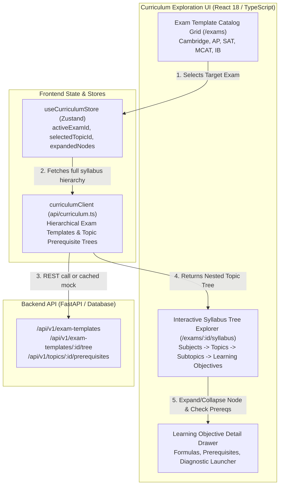
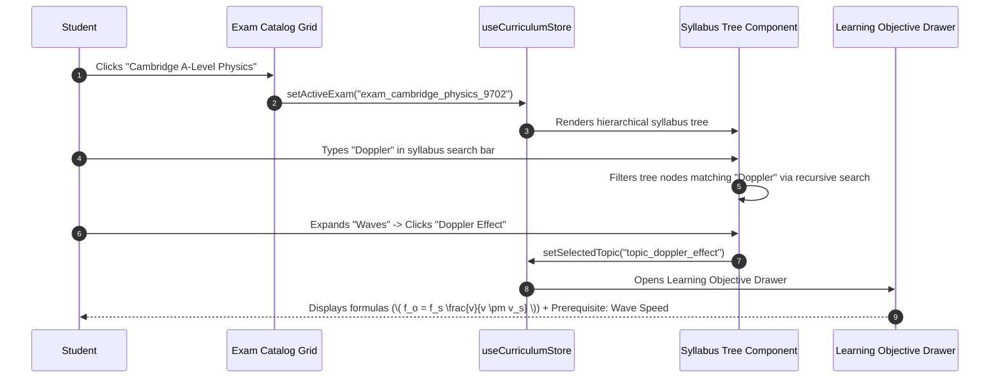

# Stage 1: Conceptual Understanding Artifact
## Task 2.3: Exam Template Catalog & Syllabus Tree Explorer `[FRONTEND]`

**Task ID:** Task 2.3  
**Track:** Frontend Track (React 18+ / TypeScript / Vite / Tailwind)  
**Epic:** Epic 2 — Exam Template & Curriculum DAG Engine  
**Accepted Decision Basis:** [ADR-008: Frontend Framework & UI Ecosystem](file:///c:/Users/Muhammad/OneDrive%20-%20Higher%20Education%20Commission/Desktop/AI%20Tutor/Feynman_tutorAI/docs/adr/ADR-008-frontend-framework-and-ui-stack.md), [DESIGN_SYSTEM_TYPOGRAPHY.md](file:///c:/Users/Muhammad/OneDrive%20-%20Higher%20Education%20Commission/Desktop/AI%20Tutor/Feynman_tutorAI/docs/frontend_design/DESIGN_SYSTEM_TYPOGRAPHY.md)

---

## 1. Visual Architecture

---

## 2. The Physical Analogy

> Think of the **Exam Template Catalog & Syllabus Tree** like an **Interactive Museum Atlas & Academic Skill Tree** (similar to a video game RPG skill map). 
> When you enter the academy, you browse the **Exhibition Catalog** to choose your quest (e.g. *Cambridge A-Level Physics 9702*). Opening the book reveals a structured table of contents: major galleries (Subjects), wings (Topics like *Mechanics*, *Electromagnetism*), and individual rooms (Subtopics like *Kinematics Equations*). At the entrance of each advanced room, a glowing plaque shows the **Prerequisites Required** (e.g. *"Requires: Basic Calculus & Vectors"*). You can zoom into any room to inspect the exact formulas on the wall and launch a direct diagnostic challenge to test your understanding.

---

## 3. Why & What

### Why are we doing this task?
1. **Curriculum-Grounded Learning (PRD Cap 2, FR-002, FR-003):** High-stakes exams are strictly governed by formal syllabus specifications. Students need complete transparency into what is on the exam, how topics are weighted, and what specific learning objectives they must master.
2. **Prerequisite Awareness:** Students frequently fail advanced topics because of hidden gaps in foundational concepts. The Syllabus Tree highlights prerequisite relationships before a student attempts difficult questions.
3. **Structured Navigation:** Replaces unstructured chatbot conversation with an organized, visual curriculum roadmap.

### What is the concept?
An interactive **Exam Catalog & Recursive Syllabus Tree Explorer** that renders multi-level hierarchical curricula (Exam → Subject → Topic → Subtopic → Learning Objectives) with search filtering, prerequisite badges (Unlocked/Locked), mastery indicators, and one-click diagnostic launchers.

### What breaks if we skip this?
- Students cannot browse or switch between different target exams.
- The platform feels like a generic disorganized question bank rather than an authoritative syllabus-guided tutor.
- Students jump into advanced topics without understanding prerequisite dependencies, leading to frustration and cognitive overload.

---

## 4. Abstraction Level Map

| Level | What Lives Here | Current Project Example | Touched by Task 2.3? |
| :--- | :--- | :--- | :---: |
| **Product / UX** | Exam Catalog Cards, Syllabus Tree Accordion, Prerequisite Tags | `/exams`, `/syllabus`, Topic Tree | 🔵 **PRIMARY FOCUS** |
| **Application** | Curriculum Store, Tree Search Filter, Topic selection handlers | `src/stores/curriculumStore.ts`, `src/components/curriculum/` | 🔵 **PRIMARY FOCUS** |
| **Framework** | Recursive Tree Nodes, Accordions, KaTeX formula renderers | `SyllabusTreeNode.tsx`, `LaTeXRenderer.tsx` | 🔵 **PRIMARY FOCUS** |
| **Library** | `lucide-react`, `clsx`, `tailwind-merge`, `zustand` | `@/lib/utils`, Lucide icons | 🔵 Used heavily |
| **Runtime** | React Virtual DOM & Tree Traversal algorithms | Depth-First Search for search filtering | 🔵 In-memory filtering |
| **Infrastructure** | Backend Exam Template & Topic DAG models | `/api/v1/exam-templates` | ⚪ Backend Contract |

---

## 5. Sequence Diagrams

### Diagram 1: Exam Selection & Recursive Syllabus Tree Exploration

---

## 6. Data Flow Trace-Through

1. **Catalog Load:** `ExamCatalogGrid` loads all available exam blueprints (*Cambridge A-Level Physics, AP Calculus BC, SAT Mathematics, MCAT Physical Sciences*).
2. **Exam Activation:** Student selects an exam; `useCurriculumStore.getState().setActiveExam(examId)` updates global context.
3. **Hierarchy Parsing:** The nested tree structure (`subjects -> topics -> subtopics -> learningObjectives`) is parsed into recursive `SyllabusTreeNode` components.
4. **Prerequisite Evaluation:** Each topic node checks its prerequisite IDs against the student's mastery profile to display appropriate status badges:
   - 🟢 **Unlocked & Mastered (≥ 85%)**
   - 🟡 **Unlocked & In Progress**
   - 🔒 **Prerequisite Needed** (with clickable link to the prerequisite topic)
5. **Detail Drawer:** Clicking an objective expands formulas rendered crisply with `LaTeXRenderer`, syllabus reference codes (e.g. `9702.4.1`), and a "Practice This Topic" action button.

---

## 7. Cognitive Model → Code Mapping

| Cognitive Stage | Mental Model | Code Concept in Feynman Frontend | Concrete Guardrail |
| :--- | :--- | :--- | :--- |
| **1. Target Choice** | "Which exam am I preparing for?" | `ExamTemplate` interface & `ExamCatalogGrid` | Visual difficulty & topic count badges |
| **2. Syllabus Roadmap** | "What chapters and topics are on this exam?" | `SyllabusTreeExplorer` & recursive nodes | Collapsible accordion levels |
| **3. Learning Dependency** | "Do I have the foundational tools for this topic?" | `TopicPrerequisite` & Lock/Unlock Badge | Direct link to missing prerequisite |
| **4. Deep Objective** | "What exact formula and concept must I master?" | `LearningObjective` with `LaTeXRenderer` | Clear KaTeX formula display |

---

## 8. Five Alternative Approaches Evaluated

| # | Approach | Pros | Cons | Verdict |
|:---|:---|:---|:---|:---|
| **1** | **Recursive Tree Component + Zustand Store (Approved)** | Scalable to any hierarchy depth, instant search filtering, zero layout shifts, type-safe | Requires clean recursive component pattern | ✅ **RECOMMENDED (ADR-008)** |
| **2** | **Flat List with Breadcrumbs** | Simpler to render | Loses visual hierarchy; difficult to grasp cross-topic relationships | ❌ Rejected |
| **3** | **Third-party Heavy Treeview Plugin** | Fast drop-in | Inflexible styling, doesn't match Shadcn UI, bundle bloat | ❌ Rejected |
| **4** | **Static JSON hardcoded in components** | Zero API layer | Cannot sync with backend database or dynamic syllabus updates | ❌ Anti-pattern |
| **5** | **Graph Canvas only (React Flow)** | Great for DAGs | Overkill for simple reading/browsing; tree list is superior for structured reading | ❌ Tree + Graph dual mode |

---

## 9. Production Rationale & Disaster Scenarios

### Why This Is Standard:
Educational platforms (Khan Academy, MIT OpenCourseWare, Cambridge International) structure their learning materials into hierarchical taxonomies. Presenting this clearly empowers students to track syllabus completion percentage and prioritize revision efficiently.

### Disaster Scenario: Student Studying Advanced Optics Without Wave Basics
* *Without Syllabus Prerequisite Tree:* A student attempts complex diffraction grating calculations, fails repeatedly, gets frustrated, and assumes they are "bad at physics."
* *With Syllabus Prerequisite Tree:* The node displays **"Prerequisite: Wave Interference & Superposition"** with a direct 1-click review launcher, diagnosing and fixing the root knowledge gap.
