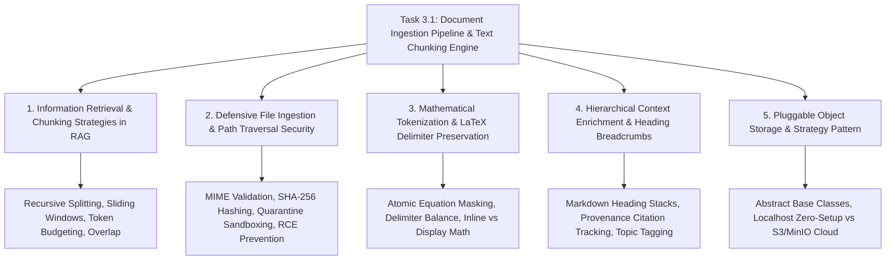

# Task 3.1: Document Ingestion Pipeline & Text Chunking Engine — CS Domain Learning (Stage 3)

## 1. Domain Discovery Map

Task 3.1 touches five core Computer Science, Information Retrieval, and Systems Security domains:



---

## 2. Domain Deep Dives

### Domain 1: Information Retrieval & Chunking Strategies in RAG

**What Is It (Plain English):**  
In Retrieval-Augmented Generation (RAG), an LLM cannot ingest an entire 500-page textbook on every query due to token limits, latency, and cost. Instead, documents are divided into smaller pieces called **chunks**. If chunks are too small, they lack the necessary context to explain a concept; if they are too large, vector search loses specificity and retrieves irrelevant filler text. We use a **recursive character splitter** that cuts text at natural linguistic boundaries (headers $\to$ paragraphs $\to$ sentences) with a sliding window overlap of ~15% to ensure concepts spanning boundaries are never cut off.

**Physical Analogy:**  
Cutting a film reel into scenes: A movie editor does not cut a film strip every exactly 30 seconds with a stopwatch. They cut at natural scene changes and dialogue pauses. Furthermore, they include a 2-second overlap between preview clips so the viewer never misses a crucial spoken sentence that straddles the cut.

**How It Works Under the Hood:**

| Parameter | Recommended Value | Why It Matters |
|:---|:---:|:---|
| **Target Chunk Size** | ~512 Tokens (~2,048 chars) | Matches optimal dense embedding model vector capacity (e.g. 768 / 1536 dims). |
| **Overlap Size** | ~75 Tokens (~300 chars / 15%) | Prevents sentence truncation across chunk boundaries. |
| **Split Hierarchy** | `["\n## ", "\n### ", "\n\n", "\n", " ", ""]` | Respects structural document hierarchy before splitting words. |

**Where It Manifests in This Codebase:**
- `backend/app/rag/chunker.py`: `SemanticRecursiveChunker.chunk_text()`.

**Common Misconceptions:**
1. ❌ *"Fixed 500-character chunking is just as good as recursive semantic chunking."*  
   ✅ **Reality:** Fixed-character chunking slices words in half and severs mathematical equations, causing catastrophic retrieval hallucinations.
2. ❌ *"Overlapping chunks create redundant vectors that waste storage."*  
   ✅ **Reality:** Without overlap, a query matching a concept split across chunk $N$ and $N+1$ will fail vector similarity on both chunks.

---

### Domain 2: Defensive File Ingestion & Path Traversal Security

**What Is It (Plain English):**  
When users upload files, the server must treat every byte as untrusted and potentially malicious (PRD Constraint #7). Attackers frequently attempt **path traversal attacks** (e.g. naming a file `../../../../etc/passwd` or `../../app/main.py` to overwrite server binaries) or upload disguised executables. Defensive ingestion strips client filenames, checks file size limits before buffering into memory, calculates an immutable SHA-256 hash, and stores the file under a sanitized hash-based filename within a sandboxed directory.

**Physical Analogy:**  
A maximum-security prison mailroom: Inmates cannot receive uninspected packages directly. Guards open packages in a quarantined room, test for contraband, photocopy legitimate letters onto standard paper, and destroy the original untrusted envelope before delivery.

**How It Works Under the Hood:**

```python
# Path Traversal Guard:
sanitized_filename = f"{sha256_hash}{file_extension}"
destination_path = os.path.abspath(os.path.join(UPLOAD_DIR, sanitized_filename))

# Verify destination stays strictly within UPLOAD_DIR
if not destination_path.startswith(os.path.abspath(UPLOAD_DIR)):
    raise SecurityException("Path traversal attempt detected!")
```

**Where It Manifests in This Codebase:**
- `backend/app/core/storage/local.py`: `LocalStorageProvider.save_file()`.
- `backend/app/rag/service.py`: `DocumentService.validate_file()`.

---

### Domain 3: Mathematical Tokenization & LaTeX Delimiter Preservation

**What Is It (Plain English):**  
In STEM education, mathematical formulas are written in LaTeX (e.g. `$E = mc^2$` or `$$\int_a^b f(x)dx$$`). A standard text splitter treats `$`, `\`, and `{` as arbitrary characters and will happily split a complex fraction across two chunks. To preserve formula integrity, our chunker uses **atomic equation masking**: it extracts all LaTeX blocks with regex, replaces them with unique placeholders (`__MATH_BLOCK_0__`), performs recursive semantic splitting on the prose, and then restores the unbroken LaTeX formulas into the final chunks.

**Physical Analogy:**  
Packing delicate glassware: Before packing a box with heavy books, you wrap individual crystal goblets in rigid protective cases so that no fold or crease can crack the glass.

**Where It Manifests in This Codebase:**
- `backend/app/rag/chunker.py`: `SemanticRecursiveChunker._protect_math_blocks()`.

---

### Domain 4: Hierarchical Context Enrichment (Heading Breadcrumbs)

**What Is It (Plain English):**  
When an isolated paragraph says *"It is calculated as the ratio of mass to volume,"* an embedding model cannot tell whether "it" refers to density, specific gravity, or molar mass. **Context Enrichment** tracks the markdown heading hierarchy (e.g. `["Chapter 1: Properties of Matter", "Section 1.2: Density"]`) and prepends it to the chunk text. This gives the embedding model the full conceptual pedigree without requiring the LLM to read the entire chapter.

**Where It Manifests in This Codebase:**
- `backend/app/rag/models.py`: `DocumentChunk.heading_breadcrumbs`.
- `backend/app/rag/chunker.py`: Running markdown heading stack tracker.

---

## 3. Cross-Domain Connections

| Concept A | Concept B | Architectural Connection |
|:---|:---|:---|
| **Document Chunk** | **Vector Store Indexer (Task 3.2)** | `DocumentChunk.content` is embedded into dense vectors in Qdrant; `DocumentChunk.id` is the vector payload point ID. |
| **Topic ID Foreign Key** | **Topic DAG Engine (Task 2.2)** | Document chunks are tagged with `topic_id`, enabling filtered vector search restricted to the student's current topic. |
| **Heading Breadcrumbs** | **Feynman Grounded Tutor (Epic 6)** | Tutor outputs clickable source citations displaying the full heading path and page number. |
| **Document Status State** | **Background Tasks (ARQ)** | Document status transitions (`PENDING` $\to$ `PROCESSING` $\to$ `CHUNKED` $\to$ `INDEXED`) allow asynchronous worker processing. |

---

## 4. Concept Evolution Timeline

```markdown
| Level | What You Might Think | Deeper Reality |
|:---|:---|:---|
| **Beginner** | "Just send the whole PDF text to the LLM prompt." | Context window limits, high latency, and massive API costs make full-text prompting unscalable. |
| **Intermediate** | "Slice text every 1000 characters with Python `text[i:i+1000]`." | Naive slicing fractures words, breaks LaTeX equations, and produces low-quality vector retrieval. |
| **Advanced** | "Use LangChain's default recursive splitter." | Default splitters are unaware of STEM LaTeX formulas and discard parent heading hierarchy breadcrumbs. |
| **Expert** | "Implement atomic equation masking, hierarchical heading breadcrumb injection, and sandboxed storage providers with cryptographic SHA-256 provenance." | Full mathematical integrity, zero-hallucination source attribution, and hardened security for untrusted file ingestion. |
```

---

## 5. Vocabulary Reference

| Term | Definition | Codebase Example |
|:---|:---|:---|
| **Chunking** | Splitting long documents into semantically coherent text segments. | `SemanticRecursiveChunker` |
| **Sliding Window** | Advancing through text with partial overlap between successive segments. | `overlap_tokens = 75` |
| **Heading Breadcrumbs** | The stack of ancestor section headers describing a chunk's location. | `heading_breadcrumbs` |
| **SHA-256 Hash** | Cryptographic hash ensuring content deduplication and integrity. | `document.sha256_hash` |
| **Path Traversal** | Attack vector attempting to access unauthorized server directories. | Mitigated via `os.path.abspath` |

---

## 6. "What If" Thought Experiments

### Q1: What happens if an instructor uploads the exact same 10MB physics textbook twice?
> **Answer:** `DocumentService` computes the SHA-256 checksum upon upload. If a document with identical SHA-256 and `exam_template_id` already exists, the service detects the duplicate and links to the existing processed document or returns HTTP 409 Conflict, preventing duplicate disk storage and redundant vector embeddings.

### Q2: What if a document has a 3,000-character multi-line mathematical proof that exceeds the target 512-token chunk size?
> **Answer:** `SemanticRecursiveChunker` treats the protected math block as an atomic unit. If an atomic math block exceeds the target size, the chunker gracefully outputs the complete unbroken proof as a single larger chunk rather than amputating the mathematical formula.

### Q3: What if an uploaded PDF file is corrupted or password-protected?
> **Answer:** The extractor catches parsing exceptions, marks the database `Document` status as `FAILED` with an explanatory error message, and returns a clean `HTTP 422 Unprocessable Entity` without crashing the FastAPI server.

### Q4: How does the system prevent student data leakage when multiple students upload private study notes?
> **Answer:** In accordance with PRD Constraint #2, uploaded documents and chunks are tagged with the author's `user_id` and isolated per student or exam template. Search queries strictly filter on `user_id` or public `exam_template_id`.

---

## Workflow Checklist
- [x] Domain discovery map and Mermaid concept map included.
- [x] Deep dives for 5 key CS domains with analogies, layer tables, code links, misconceptions, and numbers.
- [x] Cross-domain connection matrix filled.
- [x] Concept evolution timeline documented.
- [x] Vocabulary reference table created.
- [x] 4 comprehensive "What If" scenarios analyzed.
