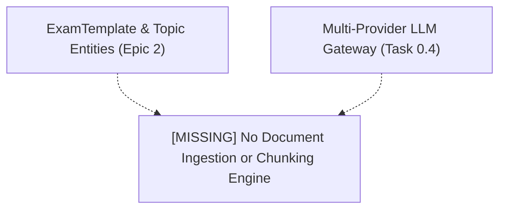
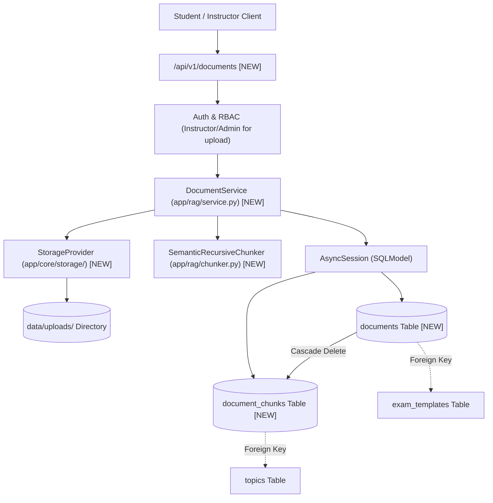
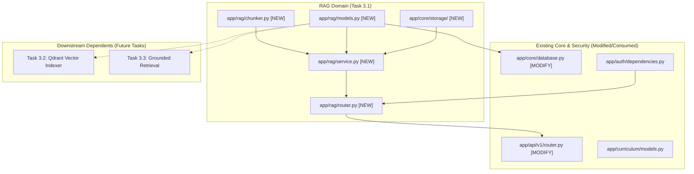

# Task 3.1: Document Ingestion Pipeline & Text Chunking Engine — Codebase Design (Stage 2)

## 1. Current State Snapshot

Prior to Task 3.1:
- **Task 2.1 & 2.2:** Hierarchical curriculum taxonomy (`ExamTemplate`, `Subject`, `Topic`, `LearningObjective`, `TopicPrerequisite`) and Topic DAG Engine are fully operational.
- **Task 0.4:** Multi-Provider LLM Gateway is ready for text generation and structured outputs.

Currently, there is no storage layer or relational schema for uploading raw source materials (textbooks, syllabus PDFs, markdown notes) or segmenting them into vectorizable chunks.

### Before Architecture Diagram

---

## 2. Proposed State

Task 3.1 creates the `app/core/storage/` module and the `app/rag/` domain module in the FastAPI backend:
1. `backend/app/core/storage/`: Pluggable `StorageProvider` interface with `LocalStorageProvider` (default) and path sanitization (ADR-009).
2. `backend/app/rag/models.py`: SQLModel entities for `Document` and `DocumentChunk` with status lifecycle tracking (`PENDING`, `PROCESSING`, `CHUNKED`, `INDEXED`, `FAILED`).
3. `backend/app/rag/chunker.py`: `SemanticRecursiveChunker` with markdown heading stack preservation and LaTeX block protection (ADR-018).
4. `backend/app/rag/schemas.py`: Pydantic V2 schemas for document upload requests, chunk listings, and processing status.
5. `backend/app/rag/service.py`: `DocumentService` managing upload validation (max 25MB, approved MIME/ext), text extraction, and chunk generation.
6. `backend/app/rag/router.py`: REST endpoints mounted at `/api/v1/documents`.

### After Architecture Diagram

---

## 3. File-Level Impact Analysis

### [NEW] `backend/app/core/storage/__init__.py` & `base.py` & `local.py`
- **Purpose:** Abstract object storage interface and local filesystem driver (ADR-009).
- **Exports:**
  - `StorageProvider` (Abstract Base Class with `save_file`, `get_file_bytes`, `delete_file`, `get_file_path`).
  - `LocalStorageProvider` (Stores files in `data/uploads/` with sanitized SHA-256 filenames and path traversal verification).
  - `get_storage_provider()` (Factory returning active storage provider based on configuration).

### [NEW] `backend/app/rag/models.py`
- **Purpose:** Relational database models for documents and chunks.
- **Exports:**
  - `DocumentStatus(str, Enum)`: `PENDING`, `PROCESSING`, `CHUNKED`, `INDEXED`, `FAILED`.
  - `DocumentType(str, Enum)`: `PDF`, `MARKDOWN`, `TEXT`, `JSON`.
  - `Document(SQLModel, table=True)`: File metadata, SHA-256 hash, size, status, `exam_template_id`, `topic_id`, chunk count.
  - `DocumentChunk(SQLModel, table=True)`: Chunk text, clean text, `chunk_index`, `page_number`, `token_count`, `heading_breadcrumbs` (JSON string/list), `topic_id`.

### [NEW] `backend/app/rag/chunker.py`
- **Purpose:** Semantic recursive text chunker preserving heading breadcrumbs and LaTeX formula blocks (ADR-018).
- **Exports:**
  - `ChunkPayload`: Dataclass holding chunk text, clean text, index, page, tokens, heading breadcrumbs.
  - `SemanticRecursiveChunker`:
    - `chunk_text(text, target_tokens=512, overlap_tokens=75, heading_breadcrumbs=[]) -> List[ChunkPayload]`
    - `_protect_math_blocks(text) -> Tuple[str, Dict[str, str]]`
    - `_restore_math_blocks(text, math_map) -> str`

### [NEW] `backend/app/rag/schemas.py`
- **Purpose:** Pydantic V2 schemas for document ingestion API.
- **Exports:**
  - `DocumentResponse`, `DocumentDetailResponse`, `DocumentListResponse`.
  - `DocumentChunkResponse`, `DocumentChunkListResponse`.
  - `DocumentUploadMetadata`: Optional schema for exam_id, topic_id, and tags passed with upload.

### [NEW] `backend/app/rag/service.py`
- **Purpose:** Ingestion and chunking domain services.
- **Exports:**
  - `DocumentService`:
    - `process_uploaded_file(session, file, exam_template_id, topic_id, user_id) -> Document`
    - `list_documents(session, exam_template_id, topic_id) -> List[DocumentResponse]`
    - `get_document(session, document_id) -> Optional[Document]`
    - `get_document_chunks(session, document_id) -> List[DocumentChunkResponse]`
    - `delete_document(session, document_id) -> bool`

### [NEW] `backend/app/rag/router.py`
- **Purpose:** FastAPI REST endpoints under `/api/v1/documents`.
- **Endpoints:**
  - `GET /api/v1/documents`: List uploaded documents with filtering by `exam_template_id` or `topic_id`.
  - `GET /api/v1/documents/{document_id}`: Fetch document metadata and status.
  - `GET /api/v1/documents/{document_id}/chunks`: Fetch generated chunks for a document.
  - `POST /api/v1/documents/upload`: Multipart file upload (Instructor/Admin only).
  - `DELETE /api/v1/documents/{document_id}`: Delete document and cascade chunks (Instructor/Admin only).

### [NEW] `backend/app/rag/__init__.py`
- **Purpose:** Package exports for RAG models, chunker, service, and router.

### [MODIFY] `backend/app/api/v1/router.py`
- **What changes:** Include `documents_router` with prefix `/documents`.

### [MODIFY] `backend/app/core/database.py`
- **What changes:** Import `backend.app.rag.models` in `init_db()` to register SQLModel metadata.

### [NEW] `backend/tests/test_document_ingestion.py`
- **Purpose:** Exhaustive test suite verifying file validation, storage drivers, semantic chunking, LaTeX formula preservation, and REST endpoints.

---

## 4. Dependency Graph / Blast Radius

---

## 5. Regression Risk Matrix

| Risk ID | Risk Description | Severity | Affected Area | Mitigation Strategy |
|:---|:---|:---:|:---|:---|
| **R-01** | Malicious file upload / Path traversal exploit | 🔴 High | Storage & Security | Enforce strict file extension whitelist, compute SHA-256 filenames, and verify `os.path.abspath` within upload directory. |
| **R-02** | Large PDF blocks async event loop during parsing | 🟡 Medium | Server Performance | Execute CPU-heavy parsing and text extraction using async threadpools (`asyncio.to_thread`). |
| **R-03** | Splitting across multi-line LaTeX equations | 🟡 Medium | RAG Retrieval Quality | Implement regex equation block masking before character chunking and restore intact equations. |
| **R-04** | Unauthorized document deletion | 🔴 High | Security | Enforce `require_role([UserRole.INSTRUCTOR, UserRole.ADMIN])` on all upload and delete routes. |

---

## 6. Contract Stability Check

| Contract / Endpoint | Status | Request Body | Response Shape | Breaking? |
|:---|:---:|:---:|:---|:---:|
| `GET /api/v1/documents` | **NEW** | Query: `exam_template_id`, `topic_id` | `List[DocumentResponse]` | No |
| `GET /api/v1/documents/{id}` | **NEW** | None | `DocumentResponse` | No |
| `GET /api/v1/documents/{id}/chunks` | **NEW** | Query: `limit`, `offset` | `DocumentChunkListResponse` | No |
| `POST /api/v1/documents/upload` | **NEW** | `multipart/form-data` (`file`, `exam_template_id`, `topic_id`) | `DocumentDetailResponse` | No |
| `DELETE /api/v1/documents/{id}` | **NEW** | None | `HTTP 204 No Content` | No |
| Existing `/api/v1/exam-templates/*` | Preserved | Preserved | Preserved | No |

---

## 7. Rollback Plan

### If Changes Are Uncommitted
1. `git restore backend/app/api/v1/router.py backend/app/core/database.py`
2. `Remove-Item -Recurse -Force backend/app/rag backend/app/core/storage backend/tests/test_document_ingestion.py`

### If Changes Are Committed
1. `git revert HEAD`
2. `py -3.14 -m pytest backend/tests/`

---

## Workflow Checklist
- [x] Current-state snapshot documented.
- [x] Proposed-state description and After architecture diagram included.
- [x] Every affected file listed with impact analysis.
- [x] Blast-radius graph included.
- [x] Regression risks scored as 🔴 / 🟡 / 🟢.
- [x] Contract stability checked.
- [x] Rollback plan provided.
- [x] No code written.
