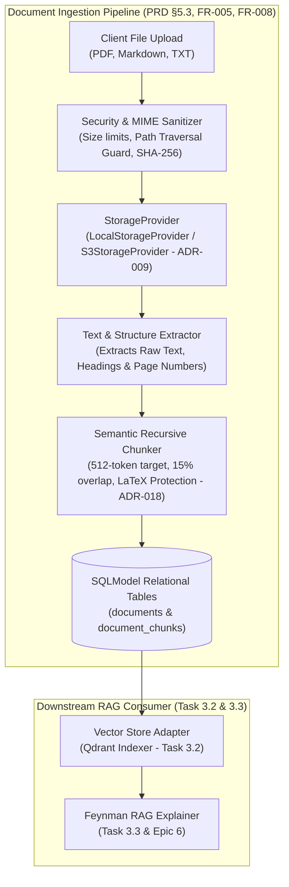
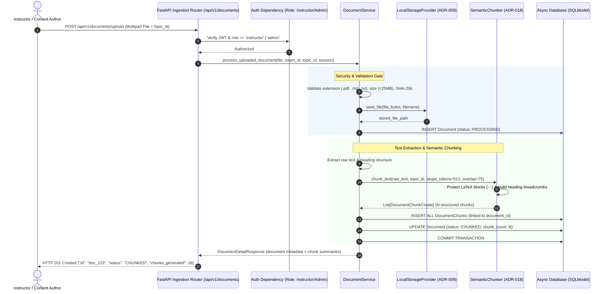

# Task 3.1: Document Ingestion Pipeline & Text Chunking Engine — Conceptual Understanding (Stage 1)

## 1. Visual Architecture

---

## 2. The Physical Analogy

The Document Ingestion and Chunking Engine is like a **High-Security Specialized Research Library Archivist**:
> When a researcher brings a 1,000-page physics textbook (*Raw Document*) into an archive, the archivist does not simply dump the entire heavy tome onto a student's study desk. First, they inspect the volume for contraband or damage (*Security Validation*), stamp it with an immutable accession number (*SHA-256 Hash*), and store the master copy in a secure vault (*Object Storage*). Then, the archivist meticulously divides the textbook into manageable, self-contained study index cards (*Semantic Chunks*). Crucially, the archivist never cuts a mathematical equation in half, writes the Chapter and Section header (*Breadcrumbs*) at the top of every single card, and notes the exact page number so that any student can cite the original source with 100% provenance.

---

## 3. Why & What

### Why Are We Doing This Task?
Large Language Models hallucinate when answering advanced STEM questions without authoritative source material. PRD Capability 3 (§5.3, §14.3, FR-005, FR-008) requires a **Source-Grounded Retrieval Engine** where AI explanations and question generation are strictly grounded in uploaded curriculum documents.
PRD Constraint #5 mandates: *"Source-grounded answers must use retrieval before generation"*.
PRD Constraint #7 mandates: *"Uploaded files must be treated as untrusted input"*.

This task builds the foundational document processing pipeline that securely accepts, sanitizes, parses, and segments curriculum texts into structured, citation-ready text chunks.

### What Is the Concept?
1. **Untrusted Ingestion:** Validating file extensions, MIME types, maximum file sizes (e.g. 25MB), and calculating SHA-256 hashes to prevent malicious file uploads or path traversal exploits.
2. **Pluggable Object Storage (ADR-009):** Storing raw files locally in development (`data/uploads/`) and in S3/MinIO in production via a common `StorageProvider` abstraction.
3. **Semantic Recursive Chunking (ADR-018):** Dividing document text along natural semantic boundaries (headers, paragraphs, sentences) while preserving LaTeX equations (`$$...$$`) and prepending heading hierarchy breadcrumbs.
4. **Relational Chunk Provenance:** Storing chunk records in SQLModel (`document_chunks`) linked to `document_id`, `topic_id`, `page_number`, and `token_count`.

### What Breaks If We Skip It?
1. **Unbounded Security Vulnerabilities:** Uploading raw PDF/executable files without validation exposes the backend server to remote code execution (RCE) and path traversal attacks.
2. **Corrupted Mathematical Explanations:** Splitting text blindly across fixed character counts severs LaTeX equations, causing the AI tutor to generate gibberish equations.
3. **Lost Source Attribution:** Without relational chunk tracking and heading breadcrumbs, the system cannot provide clickable source citations to students.

---

## 4. Abstraction Level Map

| Level | What Lives Here | Current Project Implementation |
|:---|:---|:---|
| **Product / UX** | Document upload modal, Chunker progress bar, Document list | Frontend `DocumentUploadZone.tsx` |
| **Application** | Ingestion orchestration, Status lifecycle, Document querying | `DocumentService`, `ChunkingService` |
| **Framework** | FastAPI multipart upload routes, Pydantic response schemas | `backend/app/rag/router.py`, `schemas.py` |
| **Library** | Recursive text splitting, LaTeX regex matching, File hashing | `hashlib`, `re`, `pypdf` / fallback text extractor |
| **Runtime** | Async stream processing, In-memory chunking | Python 3.11+ async worker |
| **OS / Storage** | Local filesystem directory / S3 bucket, Relational DB tables | `LocalStorageProvider`, `documents` & `document_chunks` tables |

---

## 5. Mermaid Sequence Diagram

---

## 6. Data Flow Trace-Through

1. **Upload Initiation:** An instructor uploads `cambridge_mechanics_ch1.pdf` or `notes.md` via `POST /api/v1/documents/upload`, providing `exam_template_id` and optional `topic_id`.
2. **Security & Validation:** `DocumentService` reads the file buffer, computes its SHA-256 checksum, verifies the file extension is allowed (`.pdf`, `.md`, `.txt`, `.json`), and checks that the size does not exceed `MAX_FILE_SIZE_BYTES` (25MB).
3. **Storage & Record Creation:** The raw file is saved via `StorageProvider` (e.g. `data/uploads/{sha256}.{ext}`). A `Document` record is inserted with status `PROCESSING`.
4. **Extraction & Chunking:**
   - Text is extracted from the document.
   - `SemanticChunker` identifies markdown headings (`#`, `##`, `###`) to maintain a running stack of `heading_breadcrumbs`.
   - Protects LaTeX equation delimiters (`$$...$$`, `\(...\)`) from being split.
   - Emits chunks of approximately 512 tokens with 75 tokens of overlap.
5. **Relational Persistence:** All `DocumentChunk` entities are bulk-inserted into the database with foreign keys to `document_id` and `topic_id`. The document status is updated to `CHUNKED`.
6. **Querying:** Clients call `GET /api/v1/documents` to list uploaded resources, and `GET /api/v1/documents/{id}/chunks` to inspect generated chunks and heading breadcrumbs.

---

## 7. Cognitive Model → Code Mapping

| Cognitive Concept | Mental Model | Code Implementation in This Project | Enforcement / Guardrail |
|:---|:---|:---|:---|
| **Untrusted File** | "Quarantined document package" | `DocumentService.validate_file()` | Reject unapproved extensions, mime types, or files >25MB |
| **Document Storage** | "The master vault" | `StorageProvider` protocol & `LocalStorageProvider` | Path traversal protection (`os.path.abspath`) |
| **Semantic Chunk** | "A self-contained index card" | `DocumentChunk` SQLModel entity | Preserves heading hierarchy & token count |
| **LaTeX Protection** | "Keep mathematical formulas whole" | `SemanticChunker._protect_math_blocks()` | Atomic regex block preservation |
| **Document State** | "Where the document is in processing" | `DocumentStatus` enum | `PENDING` $\to$ `PROCESSING` $\to$ `CHUNKED` $\to$ `INDEXED` $\to$ `FAILED` |

---

## 8. Five Alternative Approaches Compared

| # | Approach | Pros | Cons | Why Option 1 Was Chosen |
|:---|:---|:---|:---|:---|
| **1** | **Semantic Recursive Splitter + Pluggable Storage (Chosen)** | Preserves LaTeX, retains heading breadcrumbs, zero-setup local dev, highly testable | Requires custom chunking logic | Directly solves PRD FR-005, FR-008 & mathematical equation integrity |
| **2** | Fixed-Character Splitting | 5 lines of code | Splits words and math equations in half | Disqualified: Degrades AI answer accuracy |
| **3** | Unstructured.io / LangChain Heavyweight Framework | Pre-built document connectors | Adds massive 2GB dependency footprint, violates Zero Silent Ingestion Policy | Disqualified: Excessively heavy |
| **4** | Store Entire Documents as Single Blobs | No chunking code needed | Exceeds LLM prompt context and vector similarity thresholds | Disqualified: Fails RAG architecture |
| **5** | LLM-based Summarization per Page | Rich semantic summaries | Extremely expensive, high latency, nondeterministic | Disqualified: Not cost-effective for large textbooks |

---

## 9. Production Rationale & Consequences

### Why This Is Industry Standard
High-stakes STEM platforms (Wolfram, Khan Academy, OpenAI Textbook Ingestion) use hierarchical chunking with heading breadcrumbs. Prepending heading breadcrumbs to each chunk allows vector embeddings to capture both the local paragraph content and the broader conceptual context (e.g. *"Physics > Dynamics > Friction"*).

### Disaster Scenarios If Skipped

#### Disaster 1: The Equation Amputation Disaster
> A student asks *"What is the formula for the time of flight in projectile motion?"* If a naive character splitter cut the formula in half between two chunks, the vector search retrieves only half the equation (`T = \frac{2u...`), causing the LLM to hallucinate the rest of the equation and teach incorrect physics.

#### Disaster 2: The Path Traversal Security Breach
> An attacker uploads a file named `../../../../etc/passwd` or `../../main.py`. Without strict security validation and SHA-256 storage path sanitization, the server's critical application files could be overwritten. The `DocumentService` sanitization guarantees that every file is assigned a sanitized UUID/hash path inside the quarantined upload directory.

---

## Workflow Checklist
- [x] Hierarchical ingestion visual architecture included.
- [x] Research archivist physical analogy included.
- [x] Why/what/what-breaks explained thoroughly.
- [x] Abstraction level table filled with current project stack.
- [x] Sequence diagram for file upload and chunking included.
- [x] Data-flow trace-through completed step-by-step.
- [x] Cognitive model to code mapping table completed.
- [x] 5 alternatives compared.
- [x] 2 concrete disaster scenarios described.
