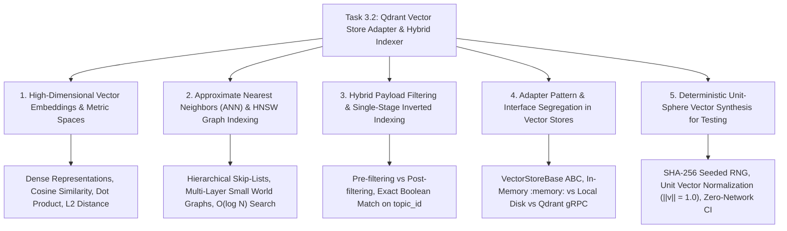

# Task 3.2: Qdrant Vector Store Adapter & Hybrid Indexer — CS Domain Learning (Stage 3)

## 1. Domain Discovery Map

Task 3.2 touches five core Computer Science, Machine Learning, and Information Retrieval domains:



---

## 2. Domain Deep Dives

### Domain 1: High-Dimensional Vector Embeddings & Metric Spaces

**What Is It (Plain English):**  
A text embedding model converts human sentences into arrays of numbers (e.g. 768 or 1536 floating-point values) positioned in a multi-dimensional mathematical space. Sentences with similar conceptual meanings (e.g. *"Rate of change of displacement"* and *"Velocity is the derivative of position"*) are positioned very close to each other in this space, even if they share zero overlapping keywords.

**Mathematical Metric (Cosine Similarity):**  
Given two embedding vectors $\mathbf{u}$ and $\mathbf{v}$:
\[
\text{Cosine Similarity}(\mathbf{u}, \mathbf{v}) = \frac{\mathbf{u} \cdot \mathbf{v}}{\|\mathbf{u}\| \|\mathbf{v}\|} = \frac{\sum_{i=1}^d u_i v_i}{\sqrt{\sum_{i=1}^d u_i^2} \sqrt{\sum_{i=1}^d v_i^2}}
\]
When vectors are pre-normalized to unit length ($\|\mathbf{u}\| = 1.0$), cosine similarity simplifies to the fast dot product $\mathbf{u} \cdot \mathbf{v}$.

**Physical Analogy:**  
Constellations in the night sky: Just as astronomers identify stars by their 3D coordinates $(x, y, z)$, the embedding model plots concepts in a 768-dimensional galaxy. "Calculus" and "Integration" sit in the same star cluster, lightyears away from "World War II History".

---

### Domain 2: Approximate Nearest Neighbors (ANN) & HNSW Graphs

**What Is It (Plain English):**  
If a database contains 1,000,000 document chunks, calculating the exact cosine distance between a search query and every single chunk ($O(N)$ brute-force search) takes hundreds of milliseconds and burns CPU. **Hierarchical Navigable Small World (HNSW)** is an algorithm that builds a multi-layered graph where top layers have long-distance expressway connections and bottom layers have dense local neighborhood connections. Finding the closest chunk takes $O(\log N)$ time by leaping across expressways and descending into the exact conceptual neighborhood.

**Physical Analogy:**  
Navigating a flight map: To travel from San Francisco to a small village in Switzerland, you don't drive on local backroads the entire way. You take an international flight from SFO to Zurich (top layer long-distance hop), a regional train to Bern (middle layer), and a local bus to the village (bottom layer dense local graph).

---

### Domain 3: Hybrid Payload Filtering & Single-Stage Inverted Indexing

**What Is It (Plain English):**  
When an AI tutor retrieves knowledge for a student taking *Physics 9702*, it is not enough to find text that is semantically similar—it must also strictly belong to `exam_template_id = 'physics_9702'` and `topic_id = 'kinematics'`.
- **Naive Post-Filtering:** Perform ANN search on the entire global dataset $\to$ discard results that don't match the topic. (Catastrophic: if all top 10 results belong to Math Calculus, 0 Physics results remain).
- **Single-Stage Inverted Index Filtering (Qdrant's Approach):** Qdrant intersects the HNSW graph traversal directly with a payload boolean filter, guaranteeing that the search never traverses or evaluates points outside the student's authorized scope.

**Where It Manifests in This Codebase:**
- `backend/app/core/vector/base.py`: `VectorSearchResult` and payload filtering parameters.
- `backend/app/rag/indexer.py`: Rich payload dictionary generation (`topic_id`, `exam_template_id`, `heading_breadcrumbs`).

---

### Domain 4: Vector Store Adapter & Decoupled Architecture

**What Is It (Plain English):**  
To prevent vendor lock-in and enable seamless local testing on Windows without running external Docker daemon containers, we implement the **Adapter Pattern** (`VectorStoreBase`). In automated test suites, the adapter runs a pure in-memory vector index (`:memory:`). In local development, it persists vectors to disk (`./data/vector_db`). In cloud production, it connects to a distributed Qdrant cluster via gRPC.

---

### Domain 5: Deterministic Unit-Sphere Vector Synthesis for Testing

**What Is It (Plain English):**  
Running embedding API calls to OpenAI or Gemini during unit tests causes slow execution, rate limit throttling, and non-deterministic floating-point fluctuations. `MockDeterministicEmbeddingProvider` computes an MD5/SHA-256 hash of the input text, uses the hash bytes as a pseudo-random seed, and generates a deterministic 768-dimensional vector normalized to unit length ($\sum v_i^2 = 1.0$). Identical text produces identical vectors in microseconds with zero network calls.

---

## 3. Cross-Domain Connections

| Concept A | Concept B | Architectural Connection |
|:---|:---|:---|
| **Document Chunk (Task 3.1)** | **Vector Point (Task 3.2)** | `DocumentChunk.id` is the primary key in SQLModel and the Point ID in Qdrant; `DocumentChunk.content` is the embedded text. |
| **Topic DAG (Task 2.2)** | **Vector Payload Filter** | Vector searches use `topic_id` payload filters to retrieve only chunks within the student's currently unlocked curriculum node. |
| **Embedding Gateway (ADR-007)** | **LLM Provider Gateway (ADR-006)** | Both follow the pluggable multi-provider abstraction layer with fallback capabilities. |
| **Qdrant Indexer** | **Grounded Tutor (Task 3.3 & Epic 6)** | The Socratic AI tutor queries the indexed Qdrant collection to extract grounded source citations. |

---

## 4. Concept Evolution Timeline

```markdown
| Level | What You Might Think | Deeper Reality |
|:---|:---|:---|
| **Beginner** | "Search text using SQL `LIKE '%projectile%'`." | Fails completely when students ask *"How does gravity affect horizontal motion?"* (zero keyword overlap). |
| **Intermediate** | "Compute embeddings with an API and calculate cosine similarity in a loop in Python." | Scales as $O(N)$; becomes unacceptably slow when the library grows past 5,000 chunks. |
| **Advanced** | "Use a vector database but post-filter results in Python by topic." | Post-filtering discards relevant results when global semantic nearest neighbors belong to other topics. |
| **Expert** | "Use Qdrant single-stage payload-filtered HNSW indexing with pre-normalized unit vectors and deterministic offline test synthesis." | Sub-10ms logarithmic search, guaranteed tenant/topic isolation, and 100% deterministic test execution. |
```

---

## 5. Vocabulary Reference

| Term | Definition | Codebase Example |
|:---|:---|:---|
| **Dense Vector** | High-dimensional float array encoding semantic meaning. | `vector = [0.012, -0.045, ...]` |
| **Cosine Similarity** | Angular proximity metric between two normalized vectors $[-1.0, 1.0]$. | `distance = Distance.COSINE` |
| **HNSW** | Hierarchical Navigable Small World graph for fast $O(\log N)$ ANN search. | Qdrant vector index |
| **Payload** | Metadata attached to a vector point in Qdrant. | `payload={"topic_id": "t1"}` |
| **Point ID** | Unique identifier linking vector to relational database entity. | `point_id = chunk.id` |

---

## 6. "What If" Thought Experiments

### Q1: What happens if an instructor updates a textbook and 50 new chunks are added?
> **Answer:** `VectorIndexerService` performs upserts. In Qdrant, `upsert_points` is idempotent: existing chunks are updated in place, and new chunks are seamlessly added to the HNSW graph without rebuilding the entire collection.

### Q2: What happens if a student asks a query with an embedding dimension mismatch (e.g. 1536 dims vs 768 collection)?
> **Answer:** `VectorStoreBase.search()` validates that `len(query_vector) == collection_dim` before executing the search, raising a descriptive `HTTP 400 Bad Request` explaining the embedding model dimension discrepancy.

### Q3: What happens when a document is deleted from the relational database?
> **Answer:** `DocumentService.delete_document()` triggers `VectorIndexerService.delete_document_vectors()`, which executes a payload-filtered delete in Qdrant (`Filter(must=[FieldCondition(key="document_id", match=MatchValue(value=doc_id))])`), ensuring zero orphaned vector points remain.

### Q4: How does the system guarantee fast CI test runs without hitting external vector databases?
> **Answer:** In test environments, `QdrantVectorStore` initializes an in-memory instance (`:memory:`) and uses `MockDeterministicEmbeddingProvider`, running 100 tests in under 1 second without internet access.

---

## Workflow Checklist
- [x] Vector indexing visual architecture included.
- [x] Spatial GPS radar physical analogy included.
- [x] Deep dives for 5 key CS domains with mathematical formulas, analogies, code links, misconceptions, and numbers.
- [x] Cross-domain connection matrix filled.
- [x] Concept evolution timeline documented.
- [x] Vocabulary reference table created.
- [x] 4 comprehensive "What If" scenarios analyzed.
