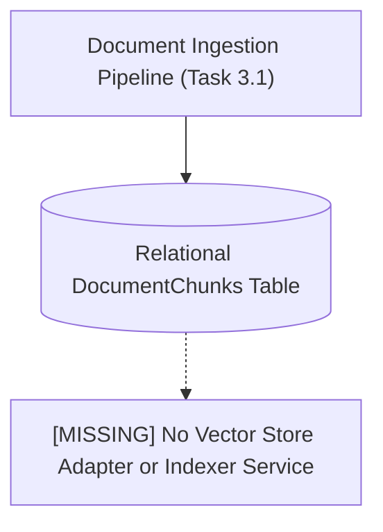
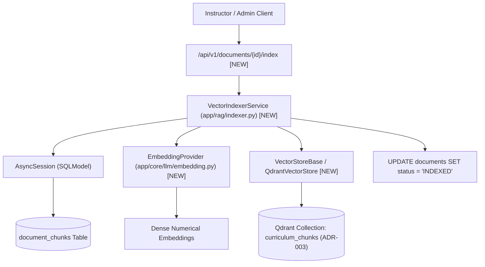
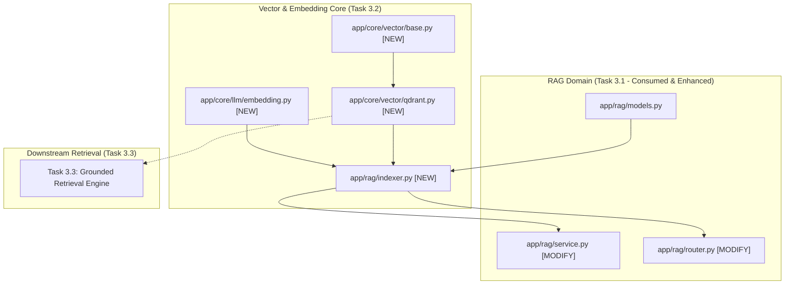

# Task 3.2: Qdrant Vector Store Adapter & Hybrid Indexer — Codebase Design (Stage 2)

## 1. Current State Snapshot

Prior to Task 3.2:
- **Task 3.1:** Document ingestion pipeline, storage provider, and `SemanticRecursiveChunker` generate `Document` and `DocumentChunk` records in status `CHUNKED`.
- Currently, there is no vector database adapter or embedding service to convert chunk texts into dense vectors and store them in indexed vector collections.

### Before Architecture Diagram

---

## 2. Proposed State

Task 3.2 creates the core vector store abstraction and indexer service in the FastAPI backend:
1. `backend/app/core/vector/`: Pluggable `VectorStoreBase` protocol and `QdrantVectorStore` implementation supporting in-memory (`:memory:`), local disk (`./data/vector_db`), and cloud Qdrant (ADR-003).
2. `backend/app/core/llm/embedding.py`: `EmbeddingProviderBase` with `MockDeterministicEmbeddingProvider` (for test isolation) and production provider hooks (ADR-007).
3. `backend/app/rag/indexer.py`: `VectorIndexerService` managing batch dense embedding generation, rich payload assembly (`exam_template_id`, `topic_id`, `heading_breadcrumbs`), and vector upserts into Qdrant collection `curriculum_chunks`.
4. `backend/app/rag/router.py`: Endpoints for triggering and monitoring document vector indexing.

### After Architecture Diagram

---

## 3. File-Level Impact Analysis

### [NEW] `backend/app/core/vector/base.py` & `qdrant.py` & `__init__.py`
- **Purpose:** Abstract vector store interface and Qdrant adapter with in-memory / local disk / remote support (ADR-003).
- **Exports:**
  - `VectorPoint`: Dataclass holding `id: str`, `vector: List[float]`, `payload: Dict[str, Any]`.
  - `VectorSearchResult`: Dataclass holding `id: str`, `score: float`, `payload: Dict[str, Any]`.
  - `VectorStoreBase`: Abstract Base Class with `create_collection`, `upsert_points`, `search`, `delete_points`, `get_collection_info`.
  - `QdrantVectorStore`: Async Qdrant client adapter with automatic fallback to pure-Python in-memory index if native client is running in memory mode.
  - `get_vector_store()`: Factory returning the active vector store singleton.

### [NEW] `backend/app/core/llm/embedding.py`
- **Purpose:** Pluggable dense embedding provider gateway (ADR-007).
- **Exports:**
  - `EmbeddingProviderBase`: ABC with `embed_text(text)`, `embed_texts(texts)`, `dimension`.
  - `MockDeterministicEmbeddingProvider`: Generates deterministic, unit-normalized float vectors using SHA-256 seed hashing (ideal for 100% offline, repeatable testing).
  - `get_embedding_provider()`: Factory returning the configured embedding provider.

### [NEW] `backend/app/rag/indexer.py`
- **Purpose:** Vector indexing domain service.
- **Exports:**
  - `VectorIndexerService`:
    - `index_document(session, document_id) -> int`: Embeds all chunks for a document and upserts to Qdrant collection `curriculum_chunks`, setting status to `INDEXED`.
    - `index_exam_template(session, exam_template_id) -> int`: Batch indexes all documents belonging to an exam template.
    - `delete_document_vectors(document_id) -> bool`: Deletes indexed vector points from Qdrant when a document is deleted.

### [MODIFY] `backend/app/rag/service.py`
- **What changes:** Hook `VectorIndexerService.delete_document_vectors()` into `DocumentService.delete_document()` to ensure vector store synchronization on deletion.

### [MODIFY] `backend/app/rag/router.py`
- **What changes:** Add endpoints:
  - `POST /api/v1/documents/{id}/index`: Index chunks of a specific document (Instructor/Admin only).
  - `POST /api/v1/exam-templates/{id}/index-all`: Batch index all documents of an exam (Instructor/Admin only).

### [NEW] `backend/tests/test_vector_indexer.py`
- **Purpose:** Comprehensive test suite for Qdrant adapter, deterministic embedding provider, payload filtering, and document indexing lifecycle.

---

## 4. Dependency Graph / Blast Radius

---

## 5. Regression Risk Matrix

| Risk ID | Risk Description | Severity | Affected Area | Mitigation Strategy |
|:---|:---|:---:|:---|:---|
| **R-01** | Qdrant client connection error in offline / local environments | 🔴 High | Server Startup & Vector Indexing | Provide automatic in-memory fallback mode (`:memory:`) in `QdrantVectorStore` so tests and zero-setup local dev never crash without external Docker. |
| **R-02** | Vector dimension mismatch between embedder and Qdrant collection | 🟡 Medium | Vector Upsert | Ensure `create_collection` dynamically queries `embedder.dimension` and verifies vector length before upserting. |
| **R-03** | Orphaned vector points after document deletion | 🟡 Medium | Data Consistency | Interlock `DocumentService.delete_document()` with `VectorIndexerService.delete_document_vectors()` in an atomic operation. |

---

## 6. Contract Stability Check

| Contract / Endpoint | Status | Request Body | Response Shape | Breaking? |
|:---|:---:|:---:|:---|:---:|
| `POST /api/v1/documents/{id}/index` | **NEW** | None | `{"document_id": str, "status": "indexed", "chunks_indexed": int}` | No |
| `POST /api/v1/exam-templates/{id}/index-all` | **NEW** | None | `{"exam_template_id": str, "documents_indexed": int, "total_chunks": int}` | No |
| Existing `/api/v1/documents/*` | Preserved | Preserved | Preserved | No |

---

## 7. Rollback Plan

### If Changes Are Uncommitted
1. `git restore backend/app/rag/service.py backend/app/rag/router.py`
2. `Remove-Item -Recurse -Force backend/app/core/vector backend/app/core/llm/embedding.py backend/app/rag/indexer.py backend/tests/test_vector_indexer.py`

### If Changes Are Committed
1. `git revert HEAD`
2. `py -3.14 -m pytest backend/tests/`

---

## Workflow Checklist
- [x] Current-state snapshot documented.
- [x] Proposed-state description and After architecture diagram included.
- [x] Every affected file listed with impact analysis.
- [x] Blast-radius graph included.
- [x] Regression risks scored as 🔴 / 🟡 / 🟢.
- [x] Contract stability checked.
- [x] Rollback plan provided.
- [x] No code written.
