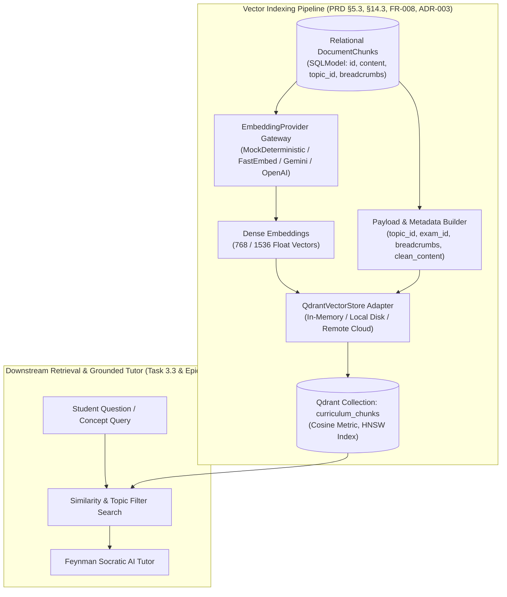
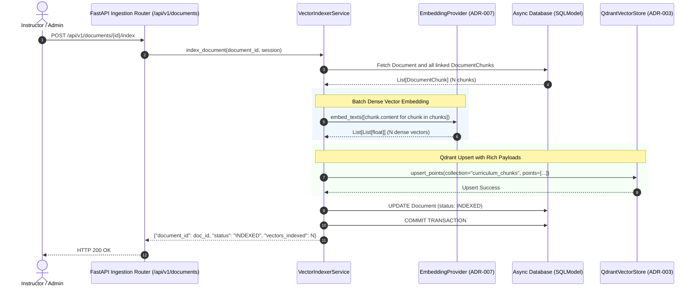

# Task 3.2: Qdrant Vector Store Adapter & Hybrid Indexer — Conceptual Understanding (Stage 1)

## 1. Visual Architecture

---

## 2. The Physical Analogy

The Vector Store Adapter and Indexer is like a **Planetary Spatial GPS Radar System**:
> In a traditional library, books are arranged on physical shelves by call number (*Relational DB*). But if you ask *"Find me all paragraphs in this building that discuss how gravity slows down a projectile,"* a librarian cannot instantly look at 100,000 pages at once. The **Embedding Engine** converts every paragraph's conceptual meaning into a precise set of multi-dimensional GPS coordinates in a high-dimensional space (*Dense Vector*). The **Qdrant Vector Store** is the high-speed spatial radar that maps these points. When a student asks a question, the radar plots the student's question coordinates and instantly identifies the 5 nearest conceptual points (*Cosine Similarity*), filtering out any points that don't belong to the student's active exam or topic.

---

## 3. Why & What

### Why Are We Doing This Task?
PRD Capability 3 (§5.3, §14.3, FR-005, FR-008) requires curriculum-grounded retrieval so the Socratic AI tutor can cite authoritative textbook excerpts. While Task 3.1 segmented raw textbooks into `DocumentChunk` records, relational databases cannot perform semantic vector similarity search across high-dimensional embeddings.
Task 3.2 implements the **Qdrant Vector Store Adapter** (ADR-003) and the **Vector Indexing Engine** that calculates dense embeddings for chunks and indexes them into Qdrant collections with filtering payloads.

### What Is the Concept?
1. **Vector Store Abstraction (`VectorStoreBase`):** A clean Python interface decoupling the application from specific vector database SDKs, allowing zero-setup in-memory testing (`:memory:`), local disk persistence (`./data/vector_db`), and cloud Qdrant.
2. **Pluggable Embedding Gateway (`EmbeddingProviderBase`):** Generates dense vector embeddings (e.g. 768 or 1536 float dimensions). Includes a deterministic mock embedder for lightning-fast test execution without network calls, with production adapters for FastEmbed, Google Gemini (`text-embedding-004`), and OpenAI (`text-embedding-3-small`).
3. **Payload-Enriched Vector Points:** Each vector point in Qdrant contains:
   - Vector: Dense numerical embedding array.
   - Point ID: UUID matching the `DocumentChunk.id`.
   - Payload: Structured JSON containing `document_id`, `exam_template_id`, `topic_id`, `page_number`, `heading_breadcrumbs`, `content`, and `clean_content`.
4. **Lifecycle Interlocking:** Once indexing completes, the relational `Document` status transitions from `CHUNKED` to `INDEXED`.

### What Breaks If We Skip It?
1. **No Semantic Search:** The AI tutor cannot find relevant textbook sections based on conceptual meaning, forcing fallback to naive keyword matching that misses synonyms and conceptual relationships.
2. **Broken Topic Scoping:** Without Qdrant payload indexing, vector search cannot be filtered by `topic_id` or `exam_template_id`, leading to cross-exam topic leakage.

---

## 4. Abstraction Level Map

| Level | What Lives Here | Current Project Implementation |
|:---|:---|:---|
| **Product / UX** | Indexing status badge, "Re-index Curriculum" button | Frontend Admin / Instructor Dashboard |
| **Application** | Batch vector indexing, Incremental re-indexing | `VectorIndexerService` |
| **Framework** | Vector store API endpoints, Async background triggers | `backend/app/rag/router.py` |
| **Domain** | Vector point assembly, Cosine distance search | `backend/app/core/vector/base.py`, `qdrant.py` |
| **Embedding** | Text-to-vector transformation, Normalization | `backend/app/core/llm/embedding.py` |
| **Storage / Engine** | Qdrant HNSW vector index, Payload inverted index | Qdrant Client (In-memory / Local disk / Remote) |

---

## 5. Mermaid Sequence Diagram

---

## 6. Data Flow Trace-Through

1. **Trigger:** An instructor uploads a document (which produces `DocumentChunk` records in status `CHUNKED`), or triggers batch re-indexing via `POST /api/v1/documents/{id}/index`.
2. **Chunk Loading:** `VectorIndexerService` loads all `DocumentChunk` rows associated with the document from SQLModel.
3. **Dense Embedding:** The `EmbeddingProvider` computes a high-dimensional vector for each chunk's enriched content (which includes the `[Context: Breadcrumbs]` header).
4. **Vector Point Assembly:** Each chunk is converted into a vector point where `id = chunk.id`, `vector = embedding`, and `payload = {document_id, exam_template_id, topic_id, page_number, heading_breadcrumbs, clean_content}`.
5. **Qdrant Persistence:** `QdrantVectorStore` creates the `curriculum_chunks` collection (with Cosine distance and HNSW index) if not already initialized, and upserts the batch of vector points.
6. **Relational State Update:** The document's status is updated to `INDEXED`.

---

## 7. Cognitive Model → Code Mapping

| Cognitive Concept | Mental Model | Code Implementation in This Project | Enforcement / Guardrail |
|:---|:---|:---|:---|
| **Vector Store** | "High-dimensional coordinate database" | `QdrantVectorStore` (`app/core/vector/qdrant.py`) | In-memory `:memory:` for testing, local disk for dev |
| **Embedder** | "Concept-to-number translator" | `EmbeddingProviderBase` (`app/core/llm/embedding.py`) | Deterministic mock for tests, Gemini/OpenAI for prod |
| **Vector Point** | "A single coordinate with metadata" | `VectorPoint` dataclass | UUID matches `DocumentChunk.id` |
| **Topic Scope** | "Restricting radar to active subject" | Qdrant payload filter (`topic_id`, `exam_template_id`) | Eliminates cross-exam hallucination |

---

## 8. Five Alternative Approaches Compared

| # | Approach | Pros | Cons | Why Option 1 Was Chosen |
|:---|:---|:---|:---|:---|
| **1** | **Qdrant with Pluggable Embeddings & Payload Filtering (Chosen)** | Native Rust speed, rich payload filtering, zero-setup in-memory testing, HNSW indexing | Requires adapter code | Directly satisfies ADR-003, PRD §5.3, FR-008 with zero external cloud dependencies for local dev |
| **2** | PostgreSQL `pgvector` | Same database as relational data | Requires compiled PostgreSQL extensions, slow on large datasets, breaks SQLite local dev | Disqualified: Breaks local SQLite Windows workflow |
| **3** | Pinecone Cloud | Managed cloud service | Requires paid API key, fails offline testing, fails zero-setup local dev | Disqualified: Requires cloud credentials |
| **4** | ChromaDB | Lightweight Python vector DB | Heavy C++ build dependencies (Chroma SQLite issues on Windows) | Disqualified: Frequent Windows compilation issues |
| **5** | Raw In-Memory Numpy Cosine Search | Simple math script | No persistence, $O(N)$ brute-force search scales poorly | Disqualified: Unsuitable for large curriculum corpuses |

---

## 9. Production Rationale & Disaster Scenarios

### Disaster 1: The Cross-Curriculum Leakage Disaster
> A student studying *AP Calculus BC* asks for help with derivatives. If the vector store does not support payload filtering on `exam_template_id` or `topic_id`, the search retrieves high-school algebra notes or physics mechanics chunks that mention the word "rate of change", confusing the student with irrelevant formulas. Qdrant payload filters strictly quarantine searches to the student's active exam.

### Disaster 2: The Network Outage Test Failure
> A developer runs automated CI tests for vector search. If the vector store or embedding model required live network connections to OpenAI or Pinecone, any rate limit, expired API key, or Wi-Fi drop would cause all CI tests to fail. The pluggable `QdrantVectorStore` (in-memory mode) and `MockDeterministicEmbeddingProvider` allow 100% offline, zero-network, deterministic automated test execution in milliseconds.

---

## Workflow Checklist
- [x] Vector indexing visual architecture included.
- [x] Spatial GPS radar physical analogy included.
- [x] Why/what/what-breaks explained thoroughly.
- [x] Abstraction level table filled with current project stack.
- [x] Sequence diagram for vector indexing included.
- [x] Data-flow trace-through completed step-by-step.
- [x] Cognitive model to code mapping table completed.
- [x] 5 alternatives compared.
- [x] 2 concrete disaster scenarios described.
