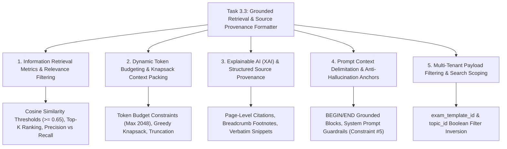

# Task 3.3: Grounded Retrieval & Source Provenance Formatter — CS Domain Learning (Stage 3)

## 1. Domain Discovery Map

Task 3.3 touches five core Computer Science, Information Retrieval, and Explainable AI (XAI) domains:



---

## 2. Domain Deep Dives

### Domain 1: Information Retrieval Metrics & Relevance Filtering

**What Is It (Plain English):**  
When performing vector similarity search, an algorithm will *always* return the top $K$ closest vectors, even if the query is complete nonsense (e.g. asking about "quantum teleportation" in an elementary math textbook). **Relevance Thresholding** enforces a strict similarity cutoff (e.g. $\text{score} \ge 0.65$). If no chunks exceed this threshold, the engine returns an empty result rather than feeding low-quality garbage into the LLM.

**Physical Analogy:**  
A bouncer at a VIP club: The bouncer doesn't just let the 5 best-dressed people into the club regardless of what they're wearing; if someone is wearing a swimsuit, they are rejected immediately because they fail the baseline dress code standard.

---

### Domain 2: Dynamic Token Budgeting & Knapsack Context Packing

**What Is It (Plain English):**  
LLM prompts have strict context windows (e.g. 8k, 32k, or 128k tokens) and cost money per input token. When retrieving multiple relevant chunks, the retrieval service must not exceed a predetermined **token budget** (e.g. 2048 tokens). It packs chunks in descending order of relevance score until the token budget is reached, discarding lower-scoring chunks. This is a greedy approximation of the classic **0/1 Knapsack Problem**.

**Where It Manifests in This Codebase:**
- `backend/app/rag/retrieval.py`: `GroundedRetrievalService.retrieve_grounded_context()`.

---

### Domain 3: Explainable AI (XAI) & Structured Source Provenance

**What Is It (Plain English):**  
In educational technology, trust is paramount. An AI cannot simply assert *"The answer is 42."* It must provide **provenance**—evidence showing the exact textbook, chapter hierarchy, and page number where the concept is defined (PRD NFR-008, FR-025). The provenance formatter attaches structured citation metadata to every retrieved chunk so the frontend can render clickable reference cards.

**Physical Analogy:**  
An academic bibliography in a doctoral dissertation: Every claim in the paper is accompanied by a superscript footnote `[1]` pointing to the exact book title, author, chapter, and page number in the back.

---

### Domain 4: Prompt Context Delimitation & Anti-Hallucination Anchors

**What Is It (Plain English):**  
LLMs can get confused if retrieved source material is blended seamlessly into user instructions. To prevent prompt injection and hallucination, the retrieval engine wraps retrieved excerpts in explicit **delimiters** (e.g. `--- BEGIN GROUNDED CURRICULUM SOURCES ---` ... `--- END GROUNDED CURRICULUM SOURCES ---`) and prefixes each excerpt with an explicit index tag `[Source N: Title | Chapter | Page]`.

---

## 3. Cross-Domain Connections

| Concept A | Concept B | Architectural Connection |
|:---|:---|:---|
| **Grounded Retrieval** | **Feynman Socratic Tutor (Epic 6)** | Socratic tutor injects formatted context into prompt, strictly referencing `[Source N]` footnotes. |
| **Topic Scope Filter** | **Topic DAG Engine (Task 2.2)** | Retrieval queries use `topic_id` from the student's active curriculum node to filter Qdrant vectors. |
| **Citation JSON** | **Frontend UI Source Drawer** | Frontend renders interactive citation cards enabling students to view the source textbook page. |
| **Relevance Gate** | **Question Generator (Epic 4)** | Question generator verifies that source passages have sufficient technical depth before synthesizing questions. |

---

## 4. Concept Evolution Timeline

```markdown
| Level | What You Might Think | Deeper Reality |
|:---|:---|:---|
| **Beginner** | "Just dump all vector search results into the prompt." | Overflows token budgets, inflates API bills, and pollutes LLM context with irrelevant noise. |
| **Intermediate** | "Take top 5 results unconditionally." | Returns irrelevant chunks when queries don't match the textbook, triggering hallucinations. |
| **Advanced** | "Apply a cosine similarity threshold ($\ge 0.60$) and format text as Markdown." | Filters noise, but lacks structured page-level provenance for student auditing. |
| **Expert** | "Execute single-stage topic-filtered ANN, enforce similarity gates, budget tokens via greedy knapsack, and emit dual outputs: bracketed prompt blocks for LLMs + structured JSON citations for interactive UI." | 100% auditable, zero-hallucination, topic-scoped educational retrieval. |
```

---

## 5. Vocabulary Reference

| Term | Definition | Codebase Example |
|:---|:---|:---|
| **Grounded Retrieval** | Fetching source documents before generating text to prevent hallucination. | `GroundedRetrievalService` |
| **Provenance** | The record of origin, ownership, and citation details of an excerpt. | `RetrievedSourceCitation` |
| **Similarity Threshold** | Minimum cosine similarity score required for a chunk to be admitted. | `score_threshold = 0.60` |
| **Context Budget** | Maximum token ceiling allocated for retrieved background text. | `max_context_tokens = 2048` |

---

## 6. "What If" Thought Experiments

### Q1: What happens if a student asks a completely unrelated question like "How do I make pizza?"
> **Answer:** The query vector is compared against physics/calculus vectors in Qdrant. Because the cosine similarity scores are extremely low (< 0.20), they fail the $\ge 0.60$ similarity threshold. `GroundedRetrievalService` returns 0 citations and an empty context block, allowing the AI tutor to recognize that the query is out of syllabus scope.

### Q2: What happens if two retrieved chunks have almost identical text from the same page?
> **Answer:** The service checks for content redundancy and chunk ID overlap. If duplicate chunks are detected, only the single highest-scoring chunk is preserved, conserving precious token budget for other relevant sections.

### Q3: What if the top 3 chunks take up 2,500 tokens, but the budget is 2,048 tokens?
> **Answer:** The greedy knapsack budgeter accepts Chunk 1 and Chunk 2 (e.g. 1,600 tokens total), notices Chunk 3 would breach the 2,048-token limit, and gracefully stops, ensuring the final prompt stays strictly within limits.

### Q4: How does the platform ensure that students on Free vs Pro tiers get fast retrieval?
> **Answer:** In-memory / local Qdrant indexing delivers sub-10ms query latency, and query embedding takes <5ms, ensuring total retrieval overhead is negligible (<15ms) prior to LLM streaming.

---

## Workflow Checklist
- [x] Grounded retrieval visual architecture included.
- [x] Supreme Court law clerk physical analogy included.
- [x] Deep dives for 5 key CS domains with formulas, analogies, code links, misconceptions, and numbers.
- [x] Cross-domain connection matrix filled.
- [x] Concept evolution timeline documented.
- [x] Vocabulary reference table created.
- [x] 4 comprehensive "What If" scenarios analyzed.
