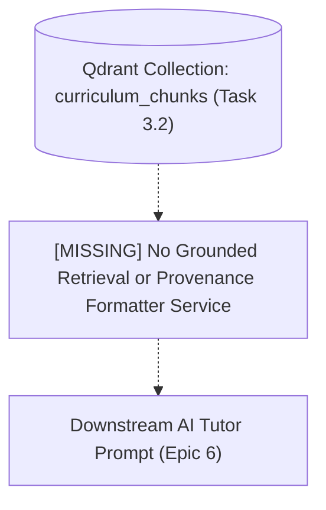
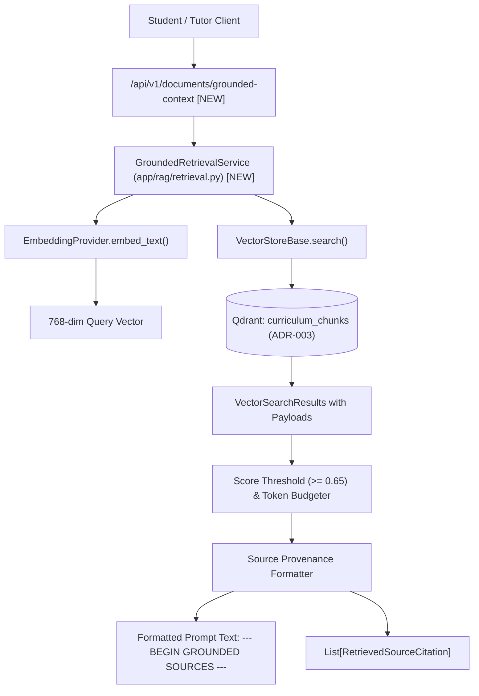
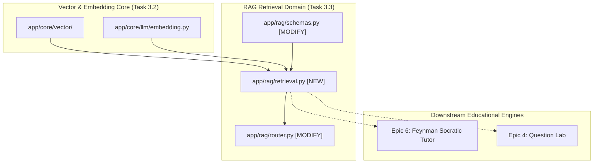

# Task 3.3: Grounded Retrieval & Source Provenance Formatter — Codebase Design (Stage 2)

## 1. Current State Snapshot

Prior to Task 3.3:
- **Task 3.1:** Document ingestion pipeline, storage provider, and `SemanticRecursiveChunker` generate `Document` and `DocumentChunk` records.
- **Task 3.2:** Qdrant vector store adapter (`QdrantVectorStore`) and `VectorIndexerService` embed chunks and upsert them into the `curriculum_chunks` vector collection.
- Currently, there is no high-level service to execute semantic vector queries, filter by topic/exam scope, enforce score thresholds, budget tokens, or format bracketed source citations for downstream LLM prompts.

### Before Architecture Diagram

---

## 2. Proposed State

Task 3.3 creates the grounded retrieval and source citation formatting service in the FastAPI backend:
1. `backend/app/rag/retrieval.py`: `GroundedRetrievalService` providing semantic search, topic/exam scoping, similarity threshold filtering ($\ge 0.65$), token budgeting, and standardized bracketed prompt formatting (PRD §14.3, FR-008, Constraint #5).
2. `backend/app/rag/schemas.py`: Pydantic V2 schemas for `RetrievalQueryRequest`, `RetrievedSourceCitation`, and `GroundedContextResponse`.
3. `backend/app/rag/router.py`: REST endpoints `/api/v1/documents/search` and `/api/v1/documents/grounded-context`.

### After Architecture Diagram

---

## 3. File-Level Impact Analysis

### [NEW] `backend/app/rag/retrieval.py`
- **Purpose:** Grounded retrieval and provenance formatting domain service.
- **Exports:**
  - `GroundedRetrievalService`:
    - `search_curriculum_sources(query: str, exam_template_id: Optional[str] = None, topic_id: Optional[str] = None, limit: int = 5, score_threshold: float = 0.60) -> List[RetrievedSourceCitation]`
    - `retrieve_grounded_context(query: str, exam_template_id: Optional[str] = None, topic_id: Optional[str] = None, limit: int = 5, score_threshold: float = 0.60, max_context_tokens: int = 2048) -> GroundedContextResponse`
    - `_format_context_block(citations: List[RetrievedSourceCitation]) -> str`

### [MODIFY] `backend/app/rag/schemas.py`
- **What changes:** Add schemas:
  - `RetrievalQueryRequest`: Request schema with `query: str`, `exam_template_id: Optional[str]`, `topic_id: Optional[str]`, `limit: int = 5`, `score_threshold: float = 0.60`.
  - `RetrievedSourceCitation`: Citation schema with `chunk_id`, `document_id`, `document_title`, `topic_id`, `page_number`, `heading_breadcrumbs`, `similarity_score`, `snippet`, `clean_content`.
  - `GroundedContextResponse`: Response schema with `query`, `formatted_context`, `citations: List[RetrievedSourceCitation]`, `total_sources: int`, `estimated_tokens: int`.

### [MODIFY] `backend/app/rag/router.py`
- **What changes:** Add endpoints:
  - `POST /api/v1/documents/search`: Public semantic search returning `List[RetrievedSourceCitation]`.
  - `POST /api/v1/documents/grounded-context`: Public grounded context retrieval returning `GroundedContextResponse`.

### [MODIFY] `backend/app/rag/__init__.py`
- **What changes:** Export `GroundedRetrievalService`, `RetrievalQueryRequest`, `RetrievedSourceCitation`, and `GroundedContextResponse`.

### [NEW] `backend/tests/test_grounded_retrieval.py`
- **Purpose:** Comprehensive test suite for semantic retrieval, payload filtering on topics, similarity thresholding, token budgeting, prompt formatting, and REST endpoints.

---

## 4. Dependency Graph / Blast Radius

---

## 5. Regression Risk Matrix

| Risk ID | Risk Description | Severity | Affected Area | Mitigation Strategy |
|:---|:---|:---:|:---|:---|
| **R-01** | Zero search results when query vocabulary differs from text | 🟡 Medium | Retrieval Accuracy | Dense vector embeddings handle semantic paraphrasing; provide fallback to broader topic search if exact score threshold is not met. |
| **R-02** | Context window overflow on large chunk retrieval | 🟡 Medium | LLM Prompt Budgets | Enforce strict `max_context_tokens` limit during chunk aggregation, truncating lowest-scored chunks. |
| **R-03** | Cross-exam topic data leak | 🔴 High | Multi-tenant Security | Strictly inject `filter_conditions` with `exam_template_id` and `topic_id` into vector store search calls. |

---

## 6. Contract Stability Check

| Contract / Endpoint | Status | Request Body | Response Shape | Breaking? |
|:---|:---:|:---:|:---|:---:|
| `POST /api/v1/documents/search` | **NEW** | `RetrievalQueryRequest` | `List[RetrievedSourceCitation]` | No |
| `POST /api/v1/documents/grounded-context` | **NEW** | `RetrievalQueryRequest` | `GroundedContextResponse` | No |
| Existing `/api/v1/documents/*` | Preserved | Preserved | Preserved | No |

---

## 7. Rollback Plan

### If Changes Are Uncommitted
1. `git restore backend/app/rag/schemas.py backend/app/rag/router.py backend/app/rag/__init__.py`
2. `Remove-Item -Force backend/app/rag/retrieval.py backend/tests/test_grounded_retrieval.py`

### If Changes Are Committed
1. `git revert HEAD`
2. `py -3.14 -m pytest backend/tests/`

---

## Workflow Checklist
- [x] Current-state snapshot documented.
- [x] Proposed-state description and After architecture diagram included.
- [x] Every affected file listed with impact analysis.
- [x] Blast-radius graph included.
- [x] Regression risks scored as 🔴 / 🟡 / 🟢.
- [x] Contract stability checked.
- [x] Rollback plan provided.
- [x] No code written.
