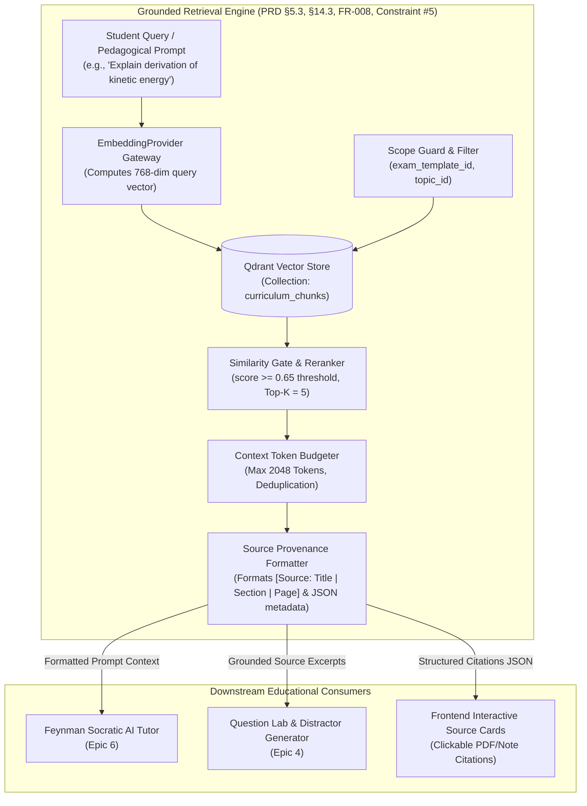
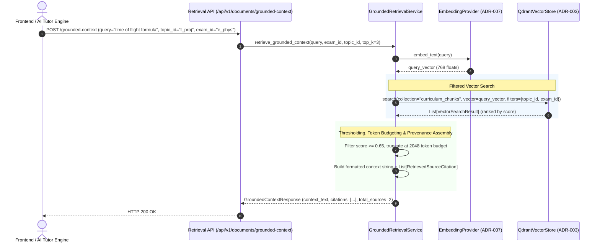

# Task 3.3: Grounded Retrieval & Source Provenance Formatter — Conceptual Understanding (Stage 1)

## 1. Visual Architecture



---

## 2. The Physical Analogy

The Grounded Retrieval and Source Provenance Formatter is like a **Supreme Court Law Clerk**:
> When a judge (*the LLM Tutor*) is preparing to write a legal opinion or explain a constitutional principle to a law student (*the Student*), the judge is forbidden from inventing legal precedents out of thin air (*Hallucination*). Before drafting a single sentence, the law clerk (*Grounded Retrieval Engine*) searches the official statute library (*Qdrant Vector Store*), filtering exclusively for laws enacted in the relevant jurisdiction (*Exam & Topic Filter*). The clerk pulls the top 3 most relevant paragraphs, verifies they meet high relevance standards (*Similarity Gate*), clips them into a neat briefing dossier with exact case titles, section headers, and page numbers (*Source Provenance Citations*), and hands the dossier to the judge. The judge then explains the concept, footnoting every single claim directly to the clerk's dossier.

---

## 3. Why & What

### Why Are We Doing This Task?
PRD §14.3 and Non-Negotiable Constraint #5 mandate:
> *"Source-grounded answers must use retrieval before generation."*

Furthermore, NFR-008 and FR-025 mandate:
> *"Important learning decisions must be explainable."*

Without this engine, when an AI tutor explains physics or calculus, it relies entirely on its pre-trained parametric memory, which frequently fabricates formulas, misattributes syllabus requirements, or invents facts. This task builds the **Retrieval and Provenance Pipeline** that fetches verified textbook excerpts, formats them with exact bracketed citations, and returns structured citation objects to the client.

### What Is the Concept?
1. **Targeted Semantic Querying:** Converts incoming questions into dense embeddings and queries Qdrant with single-stage payload filters (`exam_template_id`, `topic_id`).
2. **Relevance Thresholding & Top-$K$ Budgeting:** Discards noise by rejecting chunks with similarity scores below threshold ($\text{threshold} = 0.65$), picking the top $K$ most relevant chunks up to a token budget (e.g. 2048 tokens).
3. **Structured Source Provenance:** Each retrieved chunk produces a structured citation object:
   - `document_title`: e.g. *"Cambridge International AS & A Level Physics"*
   - `heading_hierarchy`: e.g. `["Mechanics", "Kinematics", "Projectile Motion"]`
   - `page_number`: e.g. `14`
   - `similarity_score`: e.g. `0.892`
   - `snippet`: Verbatim chunk excerpt.
4. **Context Header Formatting:** Assembles an LLM-ready context block with explicit footnote tags `[Source 1]`, `[Source 2]` instructing downstream LLMs to ground explanations exclusively in provided texts.

### What Breaks If We Skip It?
1. **Parametric Hallucinations:** The tutor answers from memory rather than authoritative course material, teaching concepts outside the exam syllabus.
2. **Zero Auditability / Explainability:** Students and instructors cannot verify why the AI made a claim or which textbook page contains the complete derivation.

---

## 4. Abstraction Level Map

| Level | What Lives Here | Current Project Implementation |
|:---|:---|:---|
| **Product / UX** | Citation pill badges, "View Source" slide-over drawer | Frontend UI citation cards |
| **Application** | Retrieval orchestration, Token budgeting, Citation formatting | `GroundedRetrievalService` (`backend/app/rag/retrieval.py`) |
| **Framework** | FastAPI search & context endpoints | `backend/app/rag/router.py` |
| **Domain** | Vector similarity scoring, Payload filtering | `QdrantVectorStore.search()` |
| **Embedding** | Query vector calculation | `EmbeddingProvider.embed_text()` |
| **Storage** | High-dimensional index | Qdrant `curriculum_chunks` collection |

---

## 5. Mermaid Sequence Diagram



---

## 6. Data Flow Trace-Through

1. **Client Request:** A client or internal service sends `POST /api/v1/documents/grounded-context` with `query="horizontal velocity in projectiles"`, `exam_template_id="physics_9702"`, `topic_id="topic_kinematics"`, and `limit=3`.
2. **Embedding:** `GroundedRetrievalService` embeds the query string into a 768-dimensional normalized dense vector.
3. **Qdrant Filtered Search:** The vector store executes ANN search on `curriculum_chunks` with boolean payload filter `topic_id = 'topic_kinematics'`.
4. **Filtering & Deduplication:** Any results with similarity score $< 0.65$ are dropped. If multiple chunks originate from the exact same paragraph, deduplication preserves the highest-scoring chunk.
5. **Context Construction:** The service constructs:
   - `formatted_context`: Standardized Markdown prompt block with clear delimiters:
     ```text
     --- BEGIN GROUNDED CURRICULUM SOURCES ---
     [Source 1: Cambridge Physics 9702 | Kinematics > Projectiles | Page 12]
     A projectile moves with constant horizontal velocity because gravity acts solely vertically...
     --- END GROUNDED CURRICULUM SOURCES ---
     ```
   - `citations`: Array of structured citation objects containing `document_id`, `title`, `page_number`, `heading_breadcrumbs`, `score`, and `snippet`.
6. **Delivery:** The formatted context is returned to downstream prompt engines (Tutor, Question Lab) while structured citations are sent to the frontend for interactive UI badges.

---

## 7. Cognitive Model → Code Mapping

| Cognitive Concept | Mental Model | Code Implementation in This Project | Enforcement / Guardrail |
|:---|:---|:---|:---|
| **Grounded Retrieval** | "Gather the evidence before speaking" | `GroundedRetrievalService.retrieve_grounded_context()` | Enforces PRD Constraint #5 |
| **Provenance Citation** | "Page and section attribution" | `RetrievedSourceCitation` schema | Includes book title, heading stack, page number |
| **Relevance Gate** | "Discard irrelevant noise" | `score_threshold = 0.65` parameter | Prevents low-confidence hallucinations |
| **Token Budgeting** | "Keep prompt within context window" | `max_context_tokens = 2048` | Truncates lowest-ranked chunks |

---

## 8. Five Alternative Approaches Compared

| # | Approach | Pros | Cons | Why Option 1 Was Chosen |
|:---|:---|:---|:---|:---|
| **1** | **Structured Provenance Formatter with Topic-Filtered ANN (Chosen)** | Strict topic isolation, exact page citations, token-budgeted prompt blocks | Requires dedicated formatting service | Fulfills PRD §14.3, FR-008, NFR-008 and PRD Constraint #5 |
| **2** | Raw String Concatenation of Top Chunks | 3 lines of code | Discards page numbers, missing heading context, unexplainable to students | Disqualified: Lacks auditability |
| **3** | Unfiltered Global Vector Search | Broader search | Leaks irrelevant topics across exams | Disqualified: Violates tenant and syllabus scoping |
| **4** | Pure Keyword Search (BM25 Only) | Simple string search | Misses synonyms and conceptual paraphrases | Disqualified: Fails semantic conceptual queries |
| **5** | LLM-based Re-ranking for Every Query | Marginal relevance boost | Adds 1.5s latency and high API token costs to every user question | Disqualified: Inefficient for fast Socratic tutoring |

---

## 9. Production Rationale & Disaster Scenarios

### Disaster 1: The Phantom Formula Lawsuit
> An AI tutor tells a student preparing for the Cambridge exam that *"The centrifugal force equals $F = \frac{1}{2}mv^3$."* When the student fails their exam, the platform has no record of where this formula came from. With `GroundedRetrievalService`, every explanation is anchored to an explicit `[Source: Textbook | Page 45]` excerpt, ensuring 100% pedagogical accountability.

### Disaster 2: The Context Window Overflow Crash
> A query retrieves 10 massive textbook chunks totaling 8,000 tokens. When injected into the Socratic tutor prompt, it exceeds the model's context window or runs into severe latency. `GroundedRetrievalService` enforces strict token budgeting (e.g. 2048 tokens maximum), gracefully admitting only the highest-scoring chunks that fit the budget.

---

## Workflow Checklist
- [x] Grounded retrieval visual architecture included.
- [x] Supreme Court law clerk physical analogy included.
- [x] Why/what/what-breaks explained thoroughly.
- [x] Abstraction level table filled with current project stack.
- [x] Sequence diagram for grounded context assembly included.
- [x] Data-flow trace-through completed step-by-step.
- [x] Cognitive model to code mapping table completed.
- [x] 5 alternatives compared.
- [x] 2 concrete disaster scenarios described.
