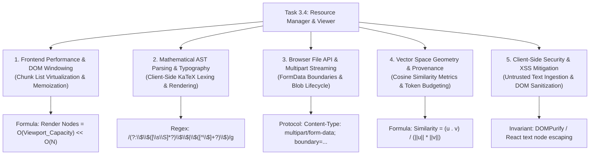

# Stage 3 CS Domain Extraction: Task 3.4 — Resource Manager & Document Viewer

**Task ID:** Task 3.4  
**Epic:** Epic 3 — Grounded Knowledge Ingestion & Vector Retrieval  
**Track:** `[FRONTEND]`  
**Feature:** Resource Manager, Chunk Inspector & Semantic Search Sandbox (PRD Cap 6, 11, 23, FR-005, FR-008, FR-023)  

---

## 1. Domain Discovery Map




---

## 2. Domain Deep Dives

### Domain 1: Frontend Performance & DOM Windowing

**What Is It (Plain English):**
When viewing a large 500-page textbook, the backend segments it into hundreds of semantic chunks. If the browser attempts to create DOM nodes for all 500 chunks simultaneously, memory consumption spikes and scrolling becomes laggy. Virtualized windowing renders only the small slice of chunks currently visible on the screen.

**Under the Hood:**
Instead of rendering all $N$ chunks into the browser's render tree, the container monitors `scrollTop` and renders only $K \approx 10$ chunks with absolute positioning and top-offset padding:
\[
\text{Visible Range} = \left[\left\lfloor\frac{\text{scrollTop}}{\text{itemHeight}}\right\rfloor, \left\lceil\frac{\text{scrollTop} + \text{viewportHeight}}{\text{itemHeight}}\right\rceil\right]
\]

**Physical Analogy:**
Like looking through a window on a moving train. You only see the landscape directly framed by the window at any moment, not the entire 1,000-mile track all at once.

---

### Domain 2: Mathematical AST Parsing & Typography (KaTeX)

**What Is It (Plain English):**
STEM textbook chunks contain mathematical notations (integrals, fractions, matrices). Rather than rendering raw escaped strings like `\int_{0}^{\pi} \sin(x) dx`, the frontend parses the LaTeX syntax tree into formatted HTML/MathML elements with high-fidelity font glyphs.

**Under the Hood:**
1. **Lexical Tokenization:** The text stream is scanned by regular expressions matching math delimiters (`$...$` for inline, `$$...$$` for display block).
2. **AST Construction:** KaTeX builds an Abstract Syntax Tree of mathematical operators, superscripts, and fractions.
3. **HTML/CSS Generation:** Renders `<span>` elements styled with KaTeX's geometric font rules.

**Physical Analogy:**
Like a sheet music typesetter turning raw handwritten notes into clean, printed sheet music that any musician can effortlessly read.

**Codebase Manifestation:**
- [`frontend/src/components/common/LaTeXRenderer.tsx`](file:///c:/Users/Abdul%20Jabbar%20Metlo/Feynman_tutorAI/frontend/src/components/common/LaTeXRenderer.tsx)

---

### Domain 3: Browser File API & Multipart Stream Encoding

**What Is It (Plain English):**
Uploading a multi-megabyte PDF textbook requires sending binary data across HTTP without loading the entire raw file into JavaScript memory as a string. The browser's `FormData` API streams the file in binary chunks separated by boundary delimiters.

**Under the Hood:**
```http
POST /api/v1/documents/upload HTTP/1.1
Content-Type: multipart/form-data; boundary=----WebKitFormBoundary7MA4YWxkTrZu0gW

------WebKitFormBoundary7MA4YWxkTrZu0gW
Content-Disposition: form-data; name="file"; filename="Physics_Volume_1.pdf"
Content-Type: application/pdf

<binary PDF stream>
------WebKitFormBoundary7MA4YWxkTrZu0gW
Content-Disposition: form-data; name="topic_id"

top_mechanics_01
------WebKitFormBoundary7MA4YWxkTrZu0gW--
```

**Physical Analogy:**
Like putting a heavy package inside a standard shipping container with a customs manifest label on the outside so the receiving port (FastAPI) knows exactly how to unpack it.

---

### Domain 4: Vector Space Geometry & Provenance Ranking

**What Is It (Plain English):**
Semantic search does not look for exact keyword matches. It embeds the user's natural language query into a 384-dimensional dense vector space and measures the angular distance between the query vector $\mathbf{u}$ and every curriculum chunk vector $\mathbf{v}$.

**Mathematical Formulation:**
\[
\text{Cosine Similarity}(\mathbf{u}, \mathbf{v}) = \frac{\mathbf{u} \cdot \mathbf{v}}{\|\mathbf{u}\| \|\mathbf{v}\|} = \frac{\sum_{i=1}^{d} u_i v_i}{\sqrt{\sum_{i=1}^d u_i^2} \sqrt{\sum_{i=1}^d v_i^2}}
\]
Scores close to $1.0$ indicate high semantic relevance. The UI maps this to percentage badges (e.g. `94% Match`).

**Codebase Manifestation:**
- [`backend/app/rag/retrieval.py`](file:///c:/Users/Abdul%20Jabbar%20Metlo/Feynman_tutorAI/backend/app/rag/retrieval.py)
- [`frontend/src/components/resources/SemanticSearchSandbox.tsx`](file:///c:/Users/Abdul%20Jabbar%20Metlo/Feynman_tutorAI/frontend/src/components/resources/SemanticSearchSandbox.tsx)

---

### Domain 5: Client-Side Security & XSS Mitigation on Untrusted Document Text

**What Is It (Plain English):**
Textbooks and notes uploaded by users might contain malicious HTML or `<script>` tags (PRD Constraint #7: Uploaded files must be treated as untrusted input). The frontend must never use raw `dangerouslySetInnerHTML` on unvetted strings.

**Security Guardrails:**
1. React's default JSX string escaping converts `<script>` to safe string text.
2. `LaTeXRenderer.tsx` parses only verified LaTeX tokens and sanitizes output through KaTeX's secure string builder.

---

## 3. "What If" Scenarios

1. **Q: What if an instructor uploads a 100MB corrupted file?**  
   *A:* The client pre-validates file size (max 25MB) and MIME type before sending, immediately displaying an accessible error toast without wasting network bandwidth.

2. **Q: What if a document has 200 chunks with complex mathematical derivations?**  
   *A:* The Chunk Viewer uses React component memoization and paginated/scroll-bounded rendering so formula parsing does not freeze the UI thread.

3. **Q: What if the backend vector index is still building when a user searches?**  
   *A:* The Semantic Search Sandbox shows a clean "Index in progress" status badge and allows fallback lexical search.
