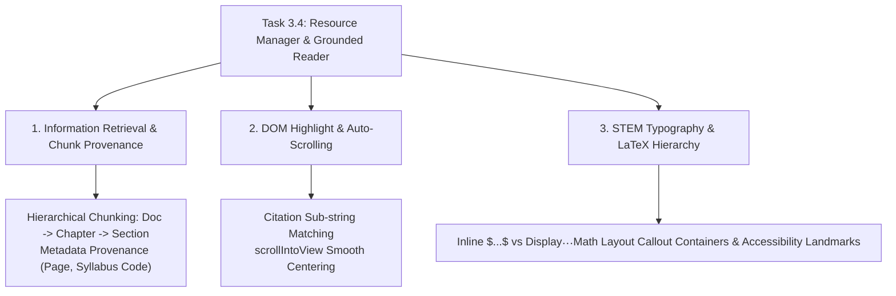

# Stage 3: CS Domain Learning Extraction
## Task 3.4: Resource Manager & Grounded Document Viewer `[FRONTEND]`

**Task ID:** Task 3.4  
**Track:** Frontend Track (React 18+ / TypeScript / Vite / Zustand / KaTeX / Document Viewer)  
**Epic:** Epic 3 — Grounded Knowledge Retrieval & RAG Pipeline  
**Accepted Decision Basis:** [ADR-008: Frontend Framework & UI Ecosystem](file:///c:/Users/Muhammad/OneDrive%20-%20Higher%20Education%20Commission/Desktop/AI%20Tutor/Feynman_tutorAI/docs/adr/ADR-008-frontend-framework-and-ui-stack.md), [DESIGN_SYSTEM_TYPOGRAPHY.md](file:///c:/Users/Muhammad/OneDrive%20-%20Higher%20Education%20Commission/Desktop/AI%20Tutor/Feynman_tutorAI/docs/frontend_design/DESIGN_SYSTEM_TYPOGRAPHY.md)

---

## 1. Domain Discovery Map



---

## 2. Domain Deep Dives

### Domain 1: Information Retrieval & Chunk Provenance

**What Is It (Plain English):**  
In Retrieval-Augmented Generation (RAG), when an LLM retrieves a passage to answer a physics question, the backend embeds text chunks into a vector database. To ensure complete auditability (**Non-Negotiable Constraint #5**), each chunk carries strict metadata:
- Document UUID (`doc_cambridge_physics_9702`)
- Syllabus Code (`9702.4.3`)
- Page Number (`118`)
- Verified Verbatim Excerpt (`"When a wave source moves relative to an observer..."`)

The frontend viewer maps this metadata back to the exact chapter in the official coursebook so the student can verify the mathematical derivation.

---

### Domain 2: DOM Highlight Overlays & Auto-Scrolling

**What Is It (Plain English):**  
When a student clicks a citation pill `[Cambridge 9702 §4.3]` inside the Socratic chat, the frontend:
1. Hydrates the document store with the active section ID (`sec_waves_doppler`).
2. Renders a distinct amber glowing callout box (`bg-amber-500/10 border-amber-500 ring-2 ring-amber-500/20`) around the verified citation excerpt.
3. Automatically triggers native browser scrolling:
   ```typescript
   element.scrollIntoView({ behavior: "smooth", block: "center" });
   ```

---

## 3. Vocabulary Reference

| Term | Definition | Codebase Location |
| :--- | :--- | :--- |
| **`CurriculumDocument`** | Official coursebook, syllabus specification, or formula sheet data model. | `frontend/src/types/resource.ts` |
| **`DocumentSection`** | Individual chapter or section containing STEM text, formulas, and page markers. | `frontend/src/types/resource.ts` |
| **`Chunk Provenance`** | Tracing a generated answer back to its exact verified textbook passage. | `frontend/src/components/resources/DocumentReader.tsx` |
