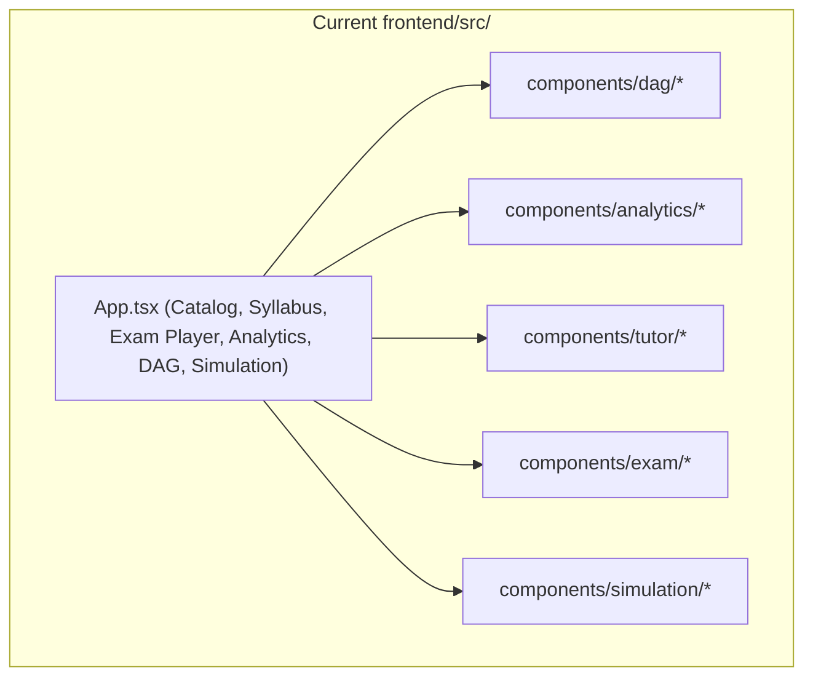
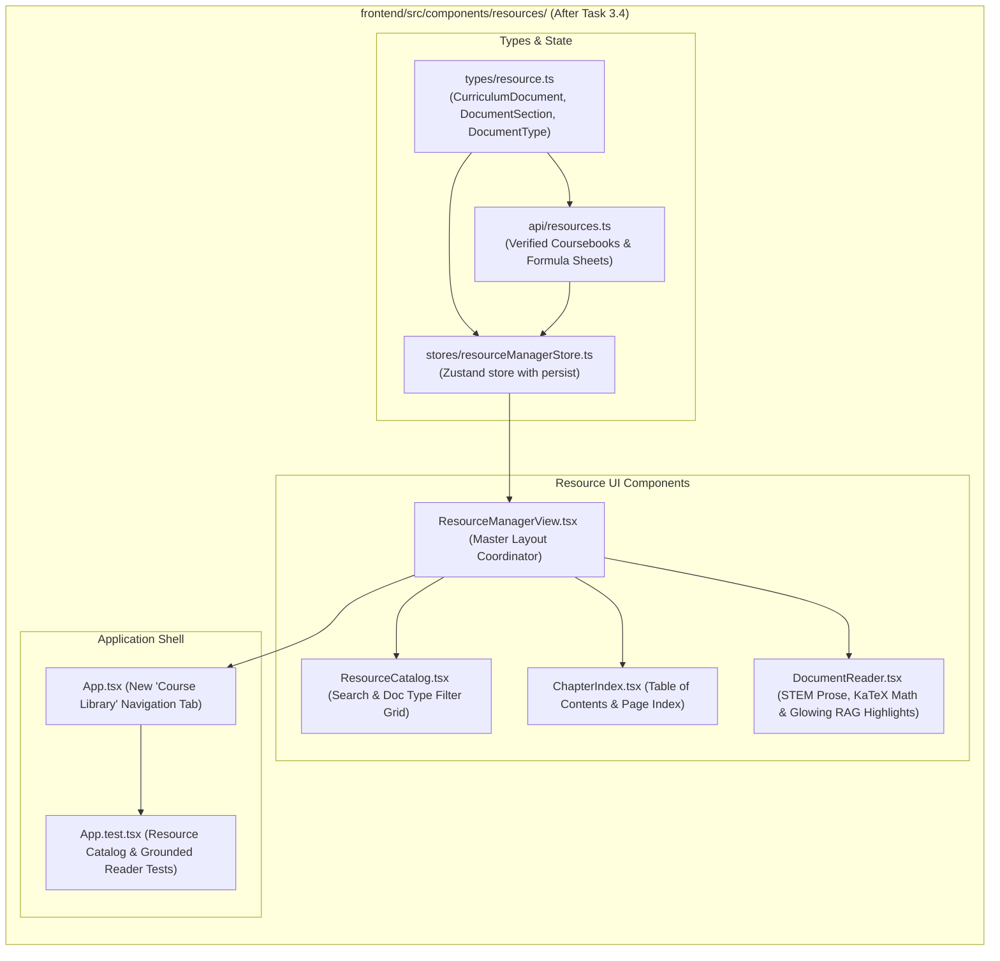

# Stage 2: Codebase Design Artifact
## Task 3.4: Resource Manager & Grounded Document Viewer `[FRONTEND]`

**Task ID:** Task 3.4  
**Track:** Frontend Track (React 18+ / TypeScript / Vite / Zustand / KaTeX / Document Viewer)  
**Epic:** Epic 3 — Grounded Knowledge Retrieval & RAG Pipeline  
**Accepted Decision Basis:** [ADR-008: Frontend Framework & UI Ecosystem](file:///c:/Users/Muhammad/OneDrive%20-%20Higher%20Education%20Commission/Desktop/AI%20Tutor/Feynman_tutorAI/docs/adr/ADR-008-frontend-framework-and-ui-stack.md), [DESIGN_SYSTEM_TYPOGRAPHY.md](file:///c:/Users/Muhammad/OneDrive%20-%20Higher%20Education%20Commission/Desktop/AI%20Tutor/Feynman_tutorAI/docs/frontend_design/DESIGN_SYSTEM_TYPOGRAPHY.md)

---

## 1. Current State Snapshot

Currently, `frontend/src/` features curriculum catalog, syllabus tree explorer, live exam player, analytics dashboard, misconception DAG visualizer, and exam simulation. There is no dedicated Resource Hub or Grounded Document Reader for inspecting verified textbook chapters and formula sheets with in-text citation highlights.



* **Verified Fact:** `frontend/` has passing Vitest suite (22 of 22 passed).
* **Verified Fact:** `frontend/` is 100% directory-isolated from `backend/`.

---

## 2. Proposed State

After Task 3.4 execution, `frontend/src/` will feature a **Resource Manager & Grounded Document Viewer** allowing students to browse official curriculum textbooks, formula sheets, and syllabus specifications, with deep-linked RAG highlight overlays.



---

## 3. File-Level Impact Analysis

All files are `[NEW]` or `[MODIFY]` strictly inside `frontend/` (0 touches to `backend/`).

### 3.1 Data Structures & State Management
#### [NEW] `frontend/src/types/resource.ts`
* **Purpose:** TypeScript types defining document models:
  - `DocumentType`: `'coursebook' | 'syllabus' | 'formula_sheet' | 'notes'`
  - `DocumentSection`: `{ id, sectionNumber, title, syllabusCode, pageNumber, content, keyFormulas, verifiedCitationSnippet }`
  - `CurriculumDocument`: `{ id, title, examBoard, type, author, edition, totalPages, sections }`
  - `ResourceState`: Zustand store interface.

#### [NEW] `frontend/src/stores/resourceManagerStore.ts`
* **Purpose:** Zustand store managing:
  - `documents: CurriculumDocument[]`
  - `activeDocumentId: string`
  - `activeSectionId: string`
  - `activeCitationSnippet: string | null`
  - `searchQuery: string`
  - `typeFilter: DocumentType | 'all'`
  - **Actions:** `setActiveDocument()`, `setActiveSection()`, `setCitationHighlight()`, `setSearchQuery()`, `setTypeFilter()`, `resetView()`.

#### [NEW] `frontend/src/api/resources.ts`
* **Purpose:** API client providing verified curriculum texts:
  - Cambridge International A-Level Physics (9702) Coursebook (Kinematics, Dynamics, Superposition, Doppler Effect).
  - Cambridge 9702 Official Physics Data & Formula Sheet.
  - AP Calculus BC Course & Exam Description.

---

### 3.2 UI Components
#### [NEW] `frontend/src/components/resources/ResourceCatalog.tsx`
* **Purpose:** Search bar, document type filter pills (*All, Coursebooks, Syllabus, Formula Sheets*), and document selection cards.

#### [NEW] `frontend/src/components/resources/ChapterIndex.tsx`
* **Purpose:** Left sidebar showing table of contents, sections, page numbers, and syllabus codes.

#### [NEW] `frontend/src/components/resources/DocumentReader.tsx`
* **Purpose:** Clean reader stage with KaTeX STEM math rendering, verified textbook prose, glowing RAG citation highlight callout, and **"Ask Socratic Tutor about this Section"** action.

#### [NEW] `frontend/src/components/resources/ResourceManagerView.tsx`
* **Purpose:** Master coordinator combining the catalog header, chapter sidebar, and document reader.

---

### 3.3 Root App & Tests
#### [MODIFY] `frontend/src/App.tsx`
* **Purpose:** Add **"Course Library"** tab to desktop header switcher and mobile nav.

#### [MODIFY] `frontend/src/App.test.tsx`
* **Purpose:** Vitest test suite verifying:
  - Course Library tab navigation.
  - Searching and filtering resources.
  - Selecting a chapter and viewing formatted KaTeX formulas.
  - Highlighting verified RAG citations.

---

## 4. Dependency Graph / Blast Radius

```mermaid
graph TD
    subgraph ResourceSubsystem ["frontend/src/components/resources/ (Isolated)"]
        Types[types/resource.ts] --> Store[stores/resourceManagerStore.ts]
        Types --> API[api/resources.ts]
        Store --> Catalog[ResourceCatalog.tsx]
        Store --> Index[ChapterIndex.tsx]
        Store --> Reader[DocumentReader.tsx]
        Catalog --> View[ResourceManagerView.tsx]
        Index --> View
        Reader --> View
        View --> App[App.tsx]
        App --> Tests[App.test.tsx]
    end

    subgraph BackendAPI ["backend/ (Directory Isolation)"]
        BackendRAG["/api/v1/documents/*"]
    end

    ResourceSubsystem -.->|Zero Cross-Track Impact (Isolated)| BackendAPI
```

---

## 5. Regression Risk Matrix

| Risk ID | Risk Description | Severity | Affected Area | Mitigation Strategy |
| :--- | :--- | :---: | :--- | :--- |
| **R-01** | Malformed LaTeX string in textbook chunks | 🟢 Low | `DocumentReader` | Wrapped by `<LaTeXRenderer />` with try/catch fallback. |
| **R-02** | LocalStorage state corruption | 🟢 Low | Store Hydration | Zustand `persist` middleware with fallback defaults. |

---

## 6. Rollback Plan

```powershell
git checkout -- frontend/src/
Remove-Item -Recurse -Force frontend/src/components/resources/
Remove-Item -Force frontend/src/stores/resourceManagerStore.ts
Remove-Item -Force frontend/src/types/resource.ts
Remove-Item -Force frontend/src/api/resources.ts
```
Estimated rollback time: < 1 minute.
