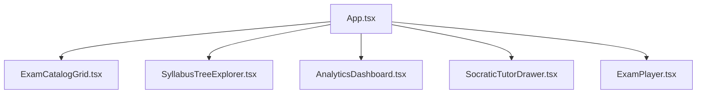
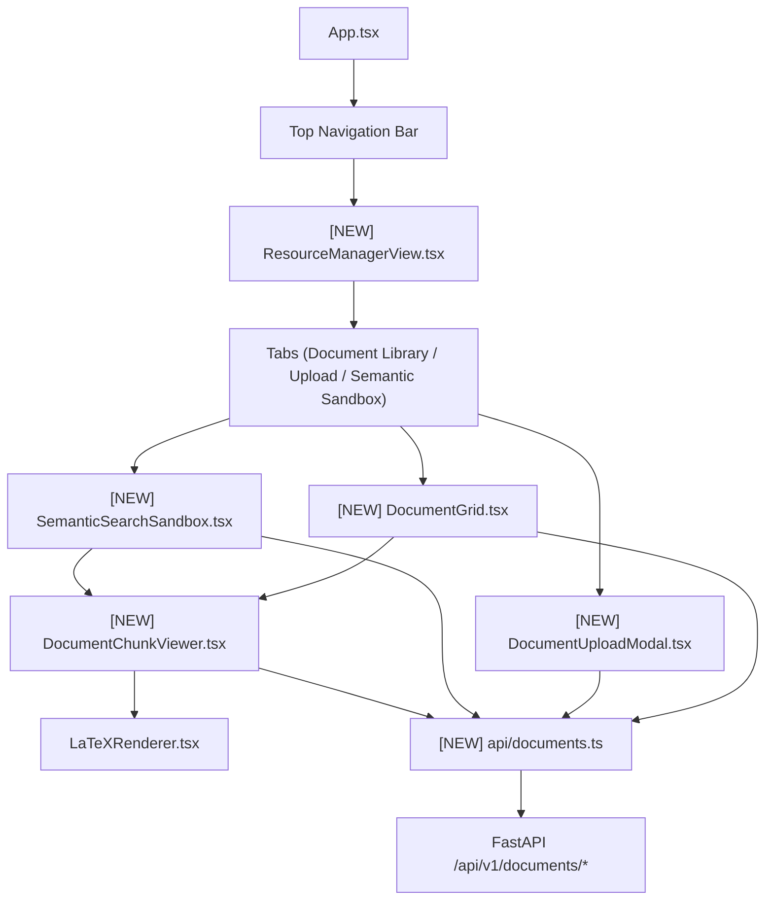
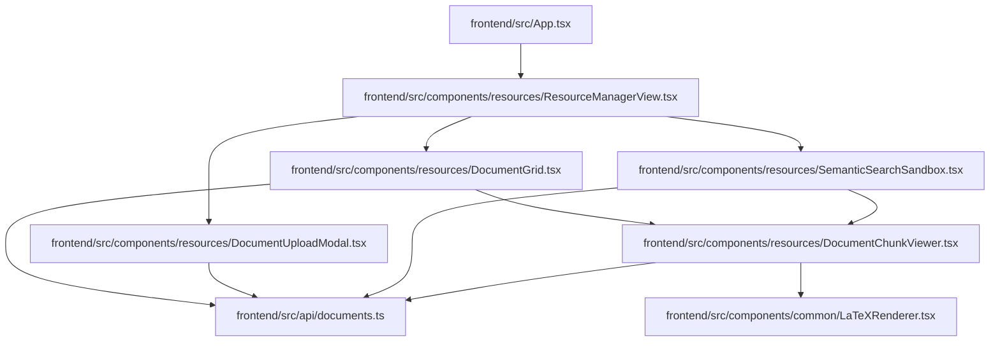

# Stage 2 Codebase Design: Task 3.4 — Resource Manager & Document Viewer

**Task ID:** Task 3.4  
**Epic:** Epic 3 — Grounded Knowledge Ingestion & Vector Retrieval  
**Track:** `[FRONTEND]`  
**Status:** DESIGNED (Awaiting User Review & Approval)  

---

## 1. Current State Snapshot



Currently, the frontend provides syllabus exploration, exam taking, analytics dashboards, and socratic tutoring. However, **curriculum source documents, vector embeddings, chunk breadcrumbs, and semantic search sandboxes** have no dedicated user interface.

---

## 2. Proposed State



---

## 3. File-Level Impact Analysis

### [NEW] `frontend/src/api/documents.ts`
- **Purpose:** Typed API client functions for document metadata, chunk retrieval, uploads, vector indexing, and semantic vector search.
- **Exports:** `listDocuments`, `getDocument`, `getDocumentChunks`, `uploadDocument`, `deleteDocument`, `indexDocument`, `searchCurriculumSources`, `retrieveGroundedContext`, and associated TypeScript interfaces (`DocumentResponse`, `DocumentChunkResponse`, `RetrievedSourceCitation`).
- **Consumers:** `DocumentGrid.tsx`, `DocumentUploadModal.tsx`, `DocumentChunkViewer.tsx`, `SemanticSearchSandbox.tsx`.

### [NEW] `frontend/src/components/resources/DocumentGrid.tsx`
- **Purpose:** Responsive grid view of curriculum source documents with topic tags, token metrics, indexing status badges, and action buttons (inspect chunks, index to Qdrant, delete).
- **Exports:** `DocumentGrid`.
- **Consumers:** `ResourceManagerView.tsx`.

### [NEW] `frontend/src/components/resources/DocumentUploadModal.tsx`
- **Purpose:** Modal with drag-and-drop file upload, file type & size validation (.pdf, .md, .txt), topic association selector, and upload progress status.
- **Exports:** `DocumentUploadModal`.
- **Consumers:** `ResourceManagerView.tsx`.

### [NEW] `frontend/src/components/resources/DocumentChunkViewer.tsx`
- **Purpose:** Slide-over drawer and modal inspecting segmented document chunks, heading breadcrumbs (`Section > Topic > Subheading`), token counts, and rendered KaTeX formulas.
- **Exports:** `DocumentChunkViewer`.
- **Consumers:** `DocumentGrid.tsx`, `SemanticSearchSandbox.tsx`.

### [NEW] `frontend/src/components/resources/SemanticSearchSandbox.tsx`
- **Purpose:** Interactive search sandbox for students and instructors to test semantic queries against Qdrant vectors with similarity score badges and clickable chunk citations.
- **Exports:** `SemanticSearchSandbox`.
- **Consumers:** `ResourceManagerView.tsx`.

### [NEW] `frontend/src/components/resources/ResourceManagerView.tsx`
- **Purpose:** Master container with header stats, tab navigation ("Document Library", "Upload New Source", "Semantic Search Sandbox"), and active document inspector state.
- **Exports:** `ResourceManagerView`.
- **Consumers:** `App.tsx`.

### [MODIFY] `frontend/src/App.tsx`
- **What changes:** Add navigation tab for "Curriculum Resources & Sources" and render `ResourceManagerView` when active.
- **Why:** Allow students and educators to navigate to the Resource Manager.

### [NEW] `frontend/src/components/resources/ResourceManager.test.tsx`
- **Purpose:** Vitest & React Testing Library test suite verifying document listing, upload interaction, chunk inspection, and semantic search queries.

---

## 4. Dependency Graph / Blast Radius



---

## 5. Regression Risk Matrix

| Risk ID | Risk Description | Severity | Affected Area | Mitigation Strategy |
|---|---|---|---|---|
| R-01 | Large Document Chunk Render Latency | 🟡 Medium | Chunk Inspector | Implement virtualized rendering or paginated chunk list to ensure fluid 60fps scrolling |
| R-02 | Broken LaTeX Formatting in Raw PDF text | 🟡 Medium | Document Viewer | Graceful fallback in `LaTeXRenderer.tsx` with error boundary |
| R-03 | File Upload Size Limit Exceeded | 🟢 Low | Upload Modal | Client-side file size pre-validation (max 25MB) with clear alert messages |
| R-04 | Unauthenticated Access to Admin Indexing | 🟡 Medium | Action Buttons | Conditional rendering based on `user.role === 'admin' \|\| user.role === 'instructor'` |

---

## 6. Contract Stability Check

| Contract | Target API Path | Method | Status | Breaking? |
|---|---|---|---|---|
| Document List | `/api/v1/documents` | `GET` | EXISTING | No |
| Document Chunks | `/api/v1/documents/{id}/chunks` | `GET` | EXISTING | No |
| Document Upload | `/api/v1/documents/upload` | `POST` | EXISTING | No |
| Vector Indexing | `/api/v1/documents/{id}/index` | `POST` | EXISTING | No |
| Semantic Search | `/api/v1/documents/search` | `POST` | EXISTING | No |

---

## 7. Performance, Security & Accessibility Impact

- **Bundle Optimization:** Zero new heavy external libraries; reuses existing `lucide-react`, `tailwindcss`, and `katex`.
- **Client Security:** File types strictly restricted to `.pdf`, `.md`, `.txt` prior to multipart upload.
- **Accessibility (a11y):** Keyboard navigable tabs, accessible file input labels, and ARIA modal dialogs.

---

## 8. Rollback Strategy

1. **Uncommitted Changes:**
   ```powershell
   git checkout -- .
   ```
2. **Committed Changes:**
   ```powershell
   git revert HEAD
   ```
   Estimated rollback time: ~1 minute.
