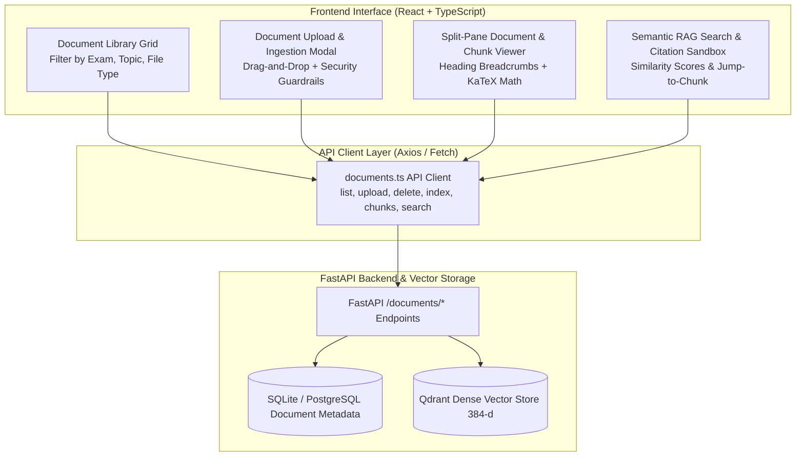
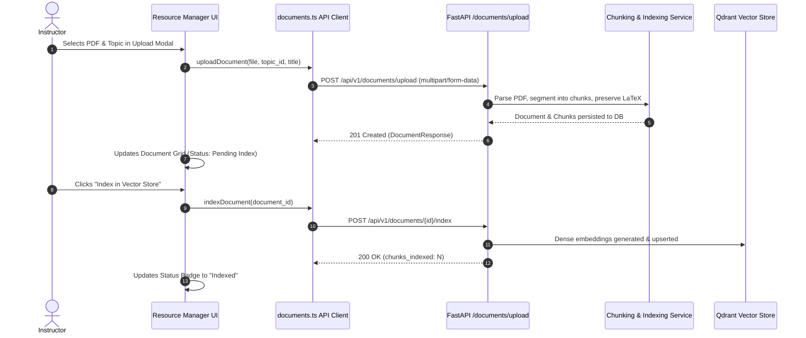

# Stage 1 Conceptual Understanding: Task 3.4 — Resource Manager & Document Viewer

**Task ID:** Task 3.4  
**Epic:** Epic 3 — Grounded Knowledge Ingestion & Vector Retrieval  
**Track:** `[FRONTEND]`  
**Feature:** Resource Manager, Chunk Inspector & Semantic Search Sandbox (PRD Cap 6, 11, 23, FR-005, FR-008, FR-023)  

---

## 1. Visual Architecture




---

## 2. The Physical Analogy: The University Rare Book Archive & Research Reading Room

Imagine a prestigious university library archive containing thousands of rare textbooks, research monographs, and manuscript scrolls:
1. **The Ingestion Desk (Document Upload):** A scholar brings a new physics manuscript. The archivist verifies its authenticity, logs its title, and tags it with the appropriate academic department (topic association).
2. **The Microfilm Segmenter (Semantic Chunking & KaTeX):** Rather than forcing researchers to unroll a 500-page scroll at once, the library indexes it into cataloged microfilm slides, each labeled with its exact chapter heading and preserving mathematical formulas in crisp high-definition.
3. **The Card Catalog Search Terminal (Semantic Vector Search):** A student walks in and asks the research terminal: *"Where does the text explain the derivation of Schrödinger's wave equation?"* The terminal doesn't just look for exact keyword matches—it understands the conceptual meaning, retrieving the 3 exact microfilm slides with 95% relevance scores.
4. **The Researcher's Reading Desk (Document Viewer):** The student clicks a search card, and the exact microfilm slide pops open in the reading room with the relevant paragraph and math derivation highlighted.

The **Resource Manager & Document Viewer** is this complete university archive system in the browser, empowering instructors to manage curriculum sources and students to search and inspect verified knowledge with full provenance (PRD FR-008).

---

## 3. Why & What

### Why are we doing this task?
Students and instructors need full transparency and interaction with the knowledge base that powers the AI Socratic Tutor and Question Generation engines (PRD §14.3, FR-008):
- **For Instructors/Admins:** A centralized dashboard to upload textbooks, notes, and syllabus PDFs, inspect chunk segmentation quality, and trigger vector indexing.
- **For Students:** An interactive reading interface with preserved KaTeX mathematical formatting and a semantic search sandbox to find exact source citations.
- **For AI Explainability (NFR-008, FR-025):** Grounds AI explanations in specific, clickable source documents with chunk breadcrumbs (`Subject > Topic > Subheading`).

### What is the concept?
The **Resource Manager & Document Viewer** is a rich React/TypeScript frontend feature consisting of:
1. **Document Library Grid & Filter Bar:** Visual catalog of curriculum sources with status badges (`pending`, `chunking`, `indexed`, `failed`), token counts, and topic tags.
2. **Upload Modal & Drag-and-Drop Zone:** Secure multipart file uploader with file-type validation (PDF, MD, TXT) and topic association.
3. **Chunk Inspector & Reader View:** Slide-over drawer or modal displaying segmented text chunks, heading breadcrumbs, and live KaTeX mathematical formulas.
4. **Semantic Vector Search Sandbox:** Real-time semantic query tester displaying cosine similarity scores ($0-100\%$) and source provenance links.

### What breaks if we skip it?
- **Black-Box RAG (Violates PRD NFR-008):** Students cannot inspect where the AI tutor derived its answers, eroding trust.
- **Instructor Ingestion Friction:** Instructors cannot verify if their uploaded curriculum PDFs were correctly chunked or if formulas were corrupted.
- **Math Formatting Degradation:** Unhandled LaTeX strings render as raw escaped characters (`\frac{a}{b}`) rather than formatted mathematical equations.

---

## 4. Abstraction Level Map

| Level | What Lives Here | Current Project Example |
|---|---|---|
| **Product / UX** | Document Grid, Upload Modal, Chunk Viewer, Semantic Search Sandbox | `ResourceManagerPage`, `DocumentGrid`, `ChunkViewer` |
| **Application** | Document API client, TanStack Query hooks, search state management | `frontend/src/api/documents.ts`, `useDocumentsQuery` |
| **Framework / UI** | React components, Tailwind CSS styling, Radix / Shadcn primitives | `Dialog`, `Badge`, `Button`, `Input`, `Tabs` |
| **Library** | `katex` for formula rendering, `lucide-react` for icons, `axios` for HTTP | `LaTeXRenderer.tsx`, `FileText`, `UploadCloud` |
| **Runtime** | Browser DOM event loop, File API (`FormData`, `FileReader`) | `input[type="file"]`, `URL.createObjectURL` |
| **Backend / API** | FastAPI `/documents/*` endpoints & Qdrant vector index | `backend/app/rag/router.py` |

---

## 5. Mermaid Diagrams

### 5.1 Document Upload & Indexing Sequence



### 5.2 Semantic Search & Provenance Flowchart

```mermaid
flowchart TD
    QueryInput([Student Types Query: "How does backprop work?"]) --> Debounce[Debounce 300ms]
    Debounce --> CallAPI["POST /api/v1/documents/search {query, topic_id}"]
    CallAPI --> VectorSearch[Qdrant Dense Cosine Distance Calculation]
    VectorSearch --> CitationsList[Return Top-K RetrievedSourceCitation]

    CitationsList --> RenderCards[Render Similarity Cards with Score Badges]
    RenderCards --> ClickCitation{User Clicks Citation Card}
    ClickCitation --> OpenChunkDrawer[Open Chunk Inspector Drawer]
    OpenChunkDrawer --> RenderMath[KaTeX Render Formula & Highlight Matched Passage]
```

---

## 6. Data Flow Trace-Through

1. **User Action:** Instructor navigates to `/resources` or clicks "View Sources" inside a Topic drawer.
2. **Library Fetch:** `listDocuments(exam_template_id, topic_id)` retrieves all documents and displays grid cards with token statistics.
3. **Upload Flow:** Instructor drags a `.pdf` file into the upload zone, selects target Topic, and clicks "Upload & Process".
4. **Multipart Post:** `FormData` is sent with JWT authentication headers to `POST /api/v1/documents/upload`.
5. **Inspection Flow:** Instructor/student clicks "Inspect Chunks" on a document card. The UI fetches `GET /api/v1/documents/{id}/chunks` and opens a slide-over modal rendering chunks with heading breadcrumbs and rendered KaTeX math equations.
6. **Semantic Search Flow:** Student tests a concept in the Search Sandbox. Real-time citations render with similarity percentages and clickable links to the underlying document chunk.

---

## 7. Cognitive Model → Code Mapping

| Cognitive Concept | Mental Model | Code Concept in This Project | Enforcement / Guardrail |
|---|---|---|---|
| **Curated Catalog** | "A tidy bookshelf organized by topic." | `DocumentGrid.tsx` with topic and type filter tabs | Clean separation of syllabus materials |
| **Safe Ingestion** | "A security scanner checking uploaded packages." | File validation & size guards | Rejects unsupported extensions or oversized payloads |
| **Mathematical Precision** | "Equations must look like textbook math, not raw code." | `LaTeXRenderer.tsx` with KaTeX integration | Mathematical formula preservation ($E=mc^2$) |
| **Source Provenance** | "Every AI answer must cite its book and page." | `RetrievedSourceCitation` with breadcrumbs | Guarantees transparent source traceability |

---

## 8. Language / Stack Context (React + TypeScript + Tailwind)

- **TypeScript Type Safety:** Types imported from `api/generated.ts` or `api/documents.ts` matching backend `DocumentResponse`, `DocumentChunkResponse`, and `RetrievedSourceCitation`.
- **KaTeX Formula Rendering:** Existing `LaTeXRenderer` component parsing both inline (`$...$`) and block (`$$...$$`) mathematical equations.
- **Radix / Shadcn UI Primitives:** `Dialog` for uploads, `Tabs` for filtering, `Badge` for status badges, and `ScrollArea` for chunk inspection.

---

## 9. Five Alternative Approaches

| # | Approach | Pros | Cons | Recommendation |
|---|---|---|---|---|
| 1 | **Raw PDF Embed (iframe / `<embed>`)** | Native browser PDF viewer | Cannot inspect semantic RAG chunks, cannot see embedding boundaries or token budgets | ❌ Reject (Inadequate for RAG) |
| 2 | **Plain Textarea Dump** | Extremely simple | Destroys document structure, ignores LaTeX math, poor UX | ❌ Reject (Poor Quality) |
| 3 | **Client-Side Heavy PDF.js Rendering** | In-browser canvas rendering | Heavy bundle size (5MB+), unnecessary since backend already segments and extracts text chunks | ❌ Reject (Bloated Bundle) |
| 4 | **Static Read-Only File List** | Fast to build | No interactive semantic search sandbox, no chunk inspection | ❌ Reject (Violates PRD FR-008) |
| 5 | **Split-Pane Chunk Inspector with KaTeX & Semantic Sandbox (Selected)** | Fast, lightweight, renders formatted math, provides chunk breadcrumbs and live RAG search | Requires custom component design | ✅ **Chosen Pattern** |

---

## 10. Production Rationale & Consequences

### Why This Is Standard
Modern production AI platforms (like ChatGPT Enterprise Knowledge, LangChain Hub, and NotebookLM) provide first-class source citation and chunk inspection tools. Letting educators verify chunk segmentation directly eliminates ingestion errors and builds student confidence in AI-generated answers.

### What Happens If We Skip This
1. **Broken Math Formulas:** Without KaTeX rendering in the resource viewer, complex formulas in STEM textbooks appear as unreadable broken strings (`\int_{0}^{\infty} \frac{x^2}{e^x - 1} dx`).
2. **Unverifiable Ingestion Failures:** Instructors cannot verify whether their uploaded PDFs were correctly tokenized or indexed, causing silent RAG retrieval failures in tutor sessions.
