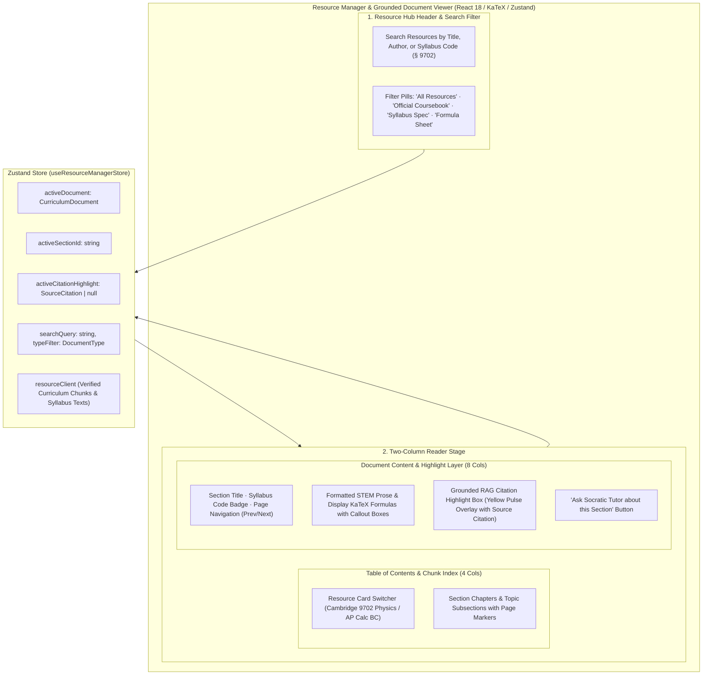
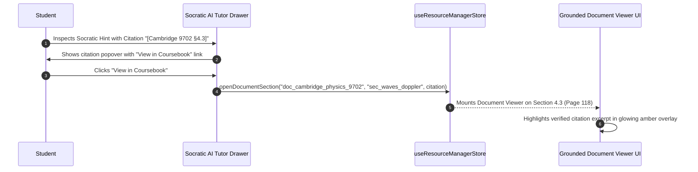

# Stage 1: Conceptual Understanding Artifact
## Task 3.4: Resource Manager & Grounded Document Viewer `[FRONTEND]`

**Task ID:** Task 3.4  
**Track:** Frontend Track (React 18+ / TypeScript / Vite / Zustand / KaTeX / Document Viewer)  
**Epic:** Epic 3 — Grounded Knowledge Retrieval & RAG Pipeline  
**Accepted Decision Basis:** [ADR-008: Frontend Framework & UI Ecosystem](file:///c:/Users/Muhammad/OneDrive%20-%20Higher%20Education%20Commission/Desktop/AI%20Tutor/Feynman_tutorAI/docs/adr/ADR-008-frontend-framework-and-ui-stack.md), [DESIGN_SYSTEM_TYPOGRAPHY.md](file:///c:/Users/Muhammad/OneDrive%20-%20Higher%20Education%20Commission/Desktop/AI%20Tutor/Feynman_tutorAI/docs/frontend_design/DESIGN_SYSTEM_TYPOGRAPHY.md)

---

## 1. Visual Architecture

---

## 2. The Physical Analogy

> Think of the **Resource Manager & Grounded Document Viewer** like an **Academic University Library & Microfilm Reader**.
> 1. In a prestigious STEM research library, a student does not rely on hearsay or guesswork. They walk up to the indexed catalog cabinets (**Resource Manager**), pull out the official textbook or formula binder (**Cambridge 9702 Coursebook**), and turn directly to the shelf location (**Chapter Table of Contents**).
> 2. When the Socratic Tutor provides a hint, it attaches an exact call-number slip (**RAG Citation: `[Cambridge 9702 §4.3, p. 118]`**).
> 3. Placing the document on the lighted microfilm reader immediately highlights the verbatim paragraph in luminous yellow, allowing the student to inspect the mathematical derivation directly at its verified origin.

---

## 3. Why & What

### Why are we doing this task?
1. **Source Grounding Verification (PRD §14.3, FR-005, FR-008, Constraint #5):** The system must guarantee that learning content is grounded in authoritative curriculum texts. Students must be able to inspect the exact pages and formulas cited by the Socratic Tutor.
2. **Curriculum Resource Hub:** Students need an accessible library of official syllabus specifications, coursebooks, and formula sheets organized by exam blueprint.
3. **Seamless Pedagogical Handoff:** Connecting a cited textbook excerpt directly to the Socratic AI Tutor for guided probing.

### What is the concept?
An interactive **Curriculum Resource Manager & Grounded Document Viewer** featuring:
- **Resource Catalog:** Filterable list of official coursebooks, syllabus specifications, and formula sheets.
- **Section & Chapter Explorer:** Fast jumping across topics with page numbers.
- **High-Fidelity Document Reader:** Clean typography with KaTeX LaTeX math formulas, structured callout boxes, and verified textbook excerpts.
- **Active RAG Highlight Overlay:** Automatic glowing highlight when navigating from a Socratic citation.
- **Ask Socratic Tutor Action:** One-click transfer of the active section into the AI Socratic Tutor drawer.

### What breaks if we skip this?
- Students cannot verify the source text behind AI Socratic hints.
- The platform lacks an official curriculum repository.

---

## 4. Abstraction Level Map

| Level | What Lives Here | Current Project Example | Touched by Task 3.4? |
| :--- | :--- | :--- | :---: |
| **Product / UX** | Resource Hub, Document Reader, Chapter Index, Highlight Overlays | New `Course Library` Tab in App shell | 🔵 **PRIMARY FOCUS** |
| **Application** | Resource Store, Document Search, Citation Deep-Linker | `src/stores/resourceManagerStore.ts`, `src/components/resources/` | 🔵 **PRIMARY FOCUS** |
| **Framework** | KaTeX Math formatting, Lucide icons, Tailwind typography | `DocumentReader.tsx`, `ResourceCatalog.tsx` | 🔵 **PRIMARY FOCUS** |
| **Library** | `zustand`, `lucide-react`, `katex`, `@/components/ui/card` | Core UI Primitives | 🔵 Used heavily |
| **Runtime** | Smooth scroll into view, URL hash syncing | DOM element targeting | 🔵 Native performance |
| **Infrastructure** | Backend Qdrant Vector Store & Chunk Ingestion Pipeline | `/api/v1/documents/*` | ⚪ Backend Contract |

---

## 5. Sequence Diagrams

### Diagram 1: Citation Provenance Deep-Linking Flow

---

## 6. Cognitive Model → Code Mapping

| Cognitive Stage | Mental Model | Code Concept in Feynman Frontend | Concrete Guardrail |
| :--- | :--- | :--- | :--- |
| **1. Resource Discovery** | "Where can I find the official formula sheet or textbook?" | `ResourceCatalog` component | Filter by `type: "textbook" \| "syllabus" \| "formula_sheet"` |
| **2. Table of Contents** | "I want to jump directly to Doppler effect in chapter 4." | `ChapterIndex` sidebar | Clickable section items with page numbers |
| **3. Grounded Reading** | "I want to read the exact derivation in LaTeX." | `DocumentReader` with KaTeX | High-contrast formatted math & prose |
| **4. Source Verification** | "Did the AI hallucinate or is this really in the book?" | `activeCitationHighlight` | Yellow glowing highlight matching RAG snippet |

---

## 7. Five Alternative Approaches Evaluated

| # | Approach | Pros | Cons | Verdict |
|:---|:---|:---|:---|:---|
| **1** | **Native Structured STEM Document Reader + KaTeX (Approved)** | 0KB extra bundle weight, instant load time, high-DPI crisp text & math rendering, full searchability | Text structured as JSON/Markdown | ✅ **RECOMMENDED (ADR-008)** |
| **2** | **Heavy PDF.js Canvas Embedding** | Native raw PDF rendering | Adds 2.5MB+ bundle weight, slow rendering, inaccessible text selection, blur on zoom | ❌ Excessively heavy |
| **3** | **`<iframe>` Embed of Static PDF** | Zero code complexity | No in-text highlight overlays, poor mobile support, cannot link from Socratic drawer | ❌ Lacks RAG integration |
| **4** | **Raw Markdown Reader Only** | Simple parsing | Lacks page numbers, official book layout, and syllabus metadata | ❌ Poor academic UX |
| **5** | **Modal Dialog Reader** | Isolated view | Obstructs student workflow, lacks sidebar chapter navigation | ❌ Clunky navigation |

---

## 8. Production Rationale & Disaster Scenarios

### Why This Is Standard:
Educational leaders like Wolfram MathWorld, MIT OpenCourseWare, and Brilliant provide structured, searchable STEM readers with interactive math and deep-linked section highlights.
