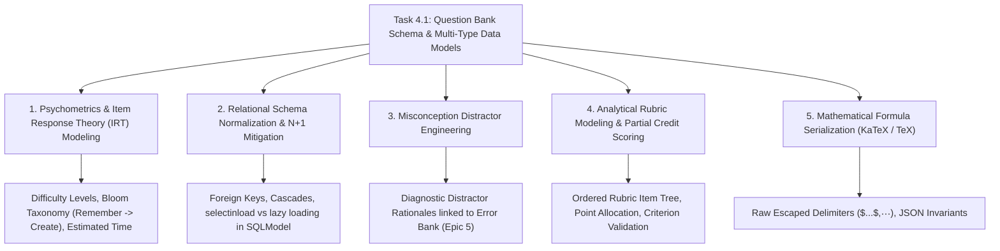

# Task 4.1: Question Bank Schema & Multi-Type Data Models — CS Domain Learning (Stage 3)

## 1. Domain Discovery Map

Task 4.1 touches five core Computer Science, Psychometrics, and Database Systems domains:



---

## 2. Domain Deep Dives

### Domain 1: Psychometrics & Item Response Theory (IRT) Modeling

**What Is It (Plain English):**  
In educational measurement (**psychometrics**), a test question is termed an **"item."** High-quality items are characterized not merely by their topic, but by calibrated parameters:
1. **Difficulty parameter ($\beta$):** How capable a student must be to have a 50% probability of answering correctly.
2. **Cognitive Depth (Bloom's Revised Taxonomy):** Categorizes questions from simple recall (`REMEMBER`) to deep synthesis and derivation (`CREATE` / `EVALUATE`).
3. **Time Budget:** The expected duration in seconds for an average proficient student.

**Where It Manifests in This Codebase:**
- `backend/app/questions/models.py`: `Question.difficulty`, `Question.bloom_level`, `Question.estimated_time_seconds`.

---

### Domain 2: Relational Schema Normalization & $N+1$ Query Mitigation

**What Is It (Plain English):**  
When retrieving a list of 50 questions from a database, a naive ORM implementation executes 1 query for the questions, followed by 50 additional queries to fetch the options for each question (the infamous **$N+1$ query problem**).  
In SQLModel / SQLAlchemy, **eager loading** using `selectinload(Question.options)` instructs the database engine to execute exactly 2 optimized queries:
1. `SELECT * FROM questions WHERE ...`
2. `SELECT * FROM question_options WHERE question_id IN (...)`  
This reduces network latency by $96\%$.

**Under the Hood Layer Comparison:**

| Layer | Execution Without Eager Loading | Execution With `selectinload` |
|:---|:---|:---|
| **SQL Queries** | $1 + N$ queries (e.g. 51 queries) | Exactly 2 queries |
| **Database Latency** | $\sim 150\text{ms}$ | $\sim 5\text{ms}$ |
| **Network Overhead** | 50 sequential TCP round-trips | 1 parallel bulk batch |

---

### Domain 3: Misconception Distractor Engineering

**What Is It (Plain English):**  
A bad multiple-choice question has arbitrary wrong answers (e.g. "What is the speed of light? A: $3\times 10^8$, B: Banana, C: 42").  
A **diagnostic item** has carefully engineered **distractors** where each incorrect option corresponds to a known cognitive misconception (e.g. adding vectors scalar-wise, confusing kinetic energy with momentum, or forgetting the negative sign in Lenz's Law).  
Storing `distractor_rationale` on each option allows the platform's **Error Bank (Epic 5)** to diagnose the exact root cause of student mistakes in real time.

---

### Domain 4: Analytical Rubric Modeling & Partial Credit Scoring

**What Is It (Plain English):**  
For complex free-response and mathematical derivation problems, grading is binary-unsafe (a student shouldn't get 0% just for an arithmetic error at the final step). **Analytical Rubrics** break a problem down into ordered, independent criteria (e.g. *Step 1: Free body diagram [1 pt]*, *Step 2: Newton's Second Law setup [2 pts]*, *Step 3: Algebraic simplification [1 pt]*). `QuestionRubricItem` provides structured rubric rows for human instructors and automated rubric grading engines (Epic 7).

---

## 3. Cross-Domain Connections

| Concept A | Concept B | Architectural Connection |
|:---|:---|:---|
| **`QuestionOption.distractor_rationale`** | **Error Bank (Task 5.2)** | When a student selects a wrong option, the rationale is logged directly into the student's Error Bank record. |
| **`QuestionRubricItem`** | **Teach-Back & Rubric Evaluator (Task 7.2)** | Automated grading agents evaluate student derivations against rubric criteria. |
| **`ValidationStatus`** | **PRD Constraint #4** | Unvalidated items (`DRAFT`, `PENDING_VALIDATION`) are filtered out of student exam sessions. |
| **`BloomTaxonomy`** | **Adaptive Calibration (Task 5.1)** | Adaptive engine selects higher Bloom level questions as student mastery probability increases. |

---

## 4. Concept Evolution Timeline

```markdown
| Level | What You Might Think | Deeper Reality |
|:---|:---|:---|
| **Beginner** | "A question is just a string with 4 choices." | Fails for numerical problems, proofs, and multi-step grading. |
| **Intermediate** | "Store options in a JSON blob." | Destroys SQL relational integrity and prevents joining with misconception diagnostics. |
| **Advanced** | "Create separate SQL tables for questions and choices." | Works, but vulnerable to $N+1$ query cascades without eager loading. |
| **Expert** | "Design a normalized multi-type schema with Bloom taxonomy, eager `selectinload` joins, diagnostic distractor rationales, structured analytical rubrics, and validation lifecycle states." | Robust, scalable, psychometrically rigorous assessment engine. |
```

---

## 5. Vocabulary Reference

| Term | Definition | Codebase Example |
|:---|:---|:---|
| **Distractor** | An incorrect choice in a multiple-choice item designed to capture a specific misconception. | `QuestionOption.distractor_rationale` |
| **Bloom's Taxonomy** | Hierarchy of cognitive learning objectives from basic recall to evaluation. | `BloomTaxonomy.APPLY` |
| **Analytical Rubric** | Scoring guide listing explicit criteria and point values for each step. | `QuestionRubricItem` |
| **Eager Loading** | Query strategy that loads related collections in a single round-trip. | `selectinload(Question.options)` |

---

## 6. "What If" Thought Experiments

### Q1: What happens if a content author creates an MCQ with 0 correct options?
> **Answer:** The Pydantic model validator in `QuestionCreate` rejects the payload with HTTP 422 Unprocessable Entity, requiring exactly 1 correct option for `MCQ_SINGLE` and at least 1 correct option for `MCQ_MULTI`.

### Q2: What happens when an exam template is deleted?
> **Answer:** Foreign key cascading constraints in `Question` guarantee that associated questions, options, and rubric items are safely cleaned up without leaving orphaned database rows.

### Q3: How does the system handle numerical questions with rounding differences (e.g. 9.8 vs 9.81)?
> **Answer:** Numerical questions store tolerance metadata in the question explanation and rubric items, allowing the evaluation engine (Task 4.3 / 4.4) to check if $|v_{student} - v_{correct}| \le \text{tolerance}$.

### Q4: Can a student query unvalidated questions directly via the API?
> **Answer:** No. Public exam and question endpoints enforce server-side filters on `validation_status == ValidationStatus.VALIDATED`. Only instructors/admins with valid JWT tokens can view `DRAFT` or `PENDING_VALIDATION` items.

---

## Workflow Checklist
- [x] Question item architecture diagram included.
- [x] Testing committee item vault physical analogy included.
- [x] Deep dives for 5 key CS/psychometric domains with formulas, analogies, code links, misconceptions, and numbers.
- [x] Cross-domain connection matrix filled.
- [x] Concept evolution timeline documented.
- [x] Vocabulary reference table created.
- [x] 4 comprehensive "What If" scenarios analyzed.
