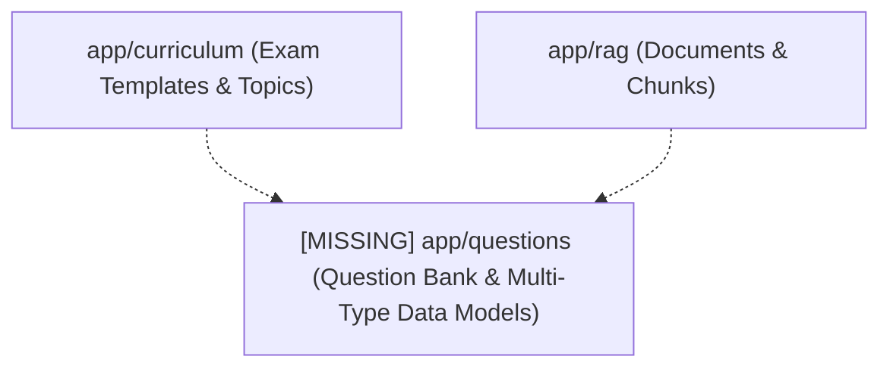
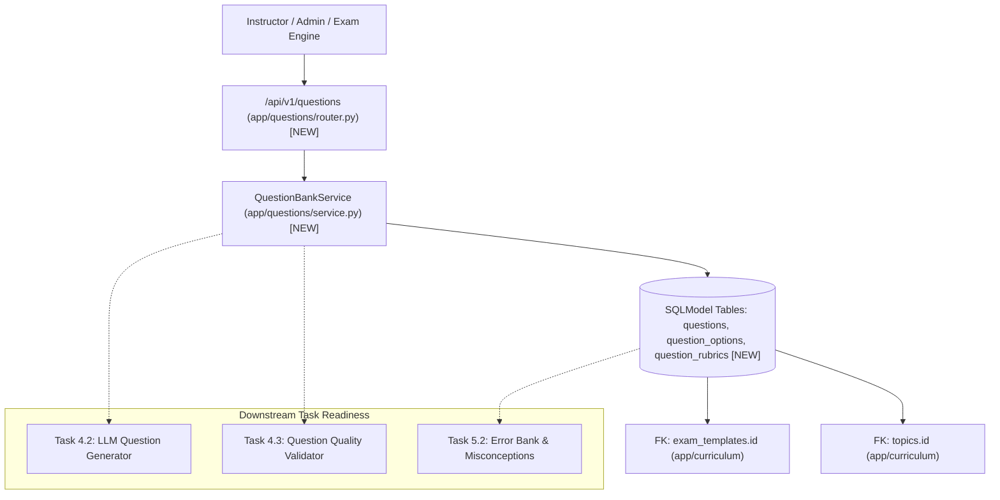
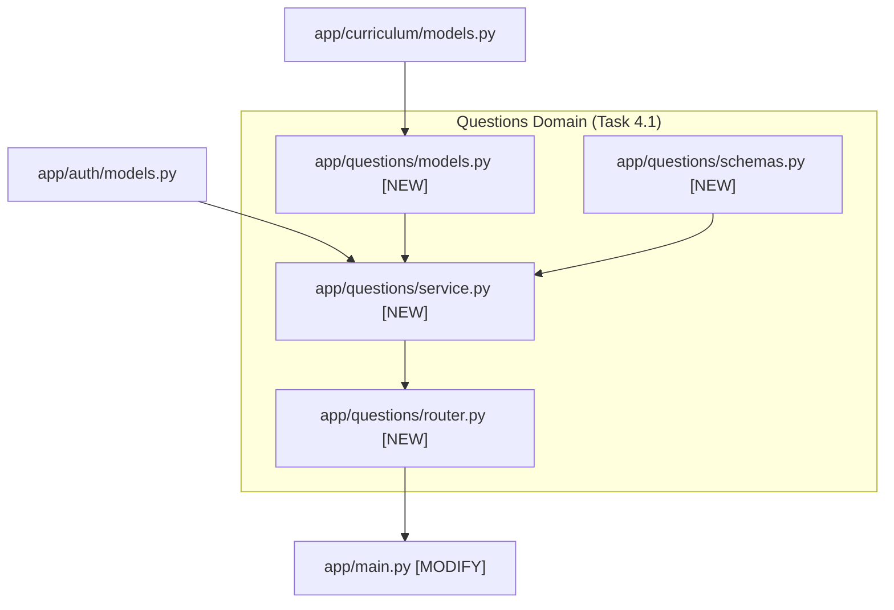

# Task 4.1: Question Bank Schema & Multi-Type Data Models — Codebase Design (Stage 2)

## 1. Current State Snapshot

Prior to Task 4.1:
- The backend has auth/RBAC (`app/auth`), learning state machine (`app/state`), exam templates and syllabus DAGs (`app/curriculum`), and RAG ingestion and retrieval (`app/rag`).
- There is currently no database schema, data models, or CRUD services for questions, options, rubrics, distractor rationales, or Bloom taxonomy tagging.

### Before Architecture Diagram

---

## 2. Proposed State

Task 4.1 introduces the complete Question Bank domain module in the FastAPI backend:
1. `backend/app/questions/models.py`: Normalized SQLModel tables `Question`, `QuestionOption`, and `QuestionRubricItem` with cascading foreign keys and relationships.
2. `backend/app/questions/schemas.py`: Pydantic V2 request/response validation schemas.
3. `backend/app/questions/service.py`: `QuestionBankService` providing atomic creation, eager loading via `selectinload`, topic filtering, and validation status transitions.
4. `backend/app/questions/router.py`: REST routes mounted under `/api/v1/questions`.
5. `backend/app/main.py`: Mounts `questions_router` into `/api/v1`.

### After Architecture Diagram

---

## 3. File-Level Impact Analysis

### [NEW] `backend/app/questions/models.py`
- **Purpose:** SQLModel database entities for question items, choices, and scoring rubrics.
- **Exports:**
  - `QuestionType` (Enum: `MCQ_SINGLE`, `MCQ_MULTI`, `NUMERICAL`, `FREE_RESPONSE`, `DERIVATION_STEP`)
  - `DifficultyLevel` (Enum: `EASY`, `MEDIUM`, `HARD`, `CHALLENGE`)
  - `BloomTaxonomy` (Enum: `REMEMBER`, `UNDERSTAND`, `APPLY`, `ANALYZE`, `EVALUATE`, `CREATE`)
  - `ValidationStatus` (Enum: `DRAFT`, `PENDING_VALIDATION`, `VALIDATED`, `REJECTED`, `FLAGGED`)
  - `Question` (SQLModel table `questions`)
  - `QuestionOption` (SQLModel table `question_options`)
  - `QuestionRubricItem` (SQLModel table `question_rubrics`)

### [NEW] `backend/app/questions/schemas.py`
- **Purpose:** Pydantic V2 schemas for question authoring, updates, and serialized responses.
- **Exports:**
  - `QuestionOptionCreate`, `QuestionOptionResponse`
  - `QuestionRubricItemCreate`, `QuestionRubricItemResponse`
  - `QuestionCreate`, `QuestionUpdate`, `QuestionResponse`, `QuestionDetailResponse`, `QuestionListResponse`

### [NEW] `backend/app/questions/service.py`
- **Purpose:** Domain service handling atomic transactions, relational joins, eager loading, and filtering.
- **Exports:**
  - `QuestionBankService`:
    - `create_question(session, data, author_id) -> Question`
    - `get_question(session, question_id) -> Optional[Question]`
    - `list_questions(session, exam_template_id, topic_id, question_type, difficulty, validation_status, limit, offset) -> Tuple[List[Question], int]`
    - `update_question(session, question_id, data) -> Optional[Question]`
    - `delete_question(session, question_id) -> bool`

### [NEW] `backend/app/questions/router.py`
- **Purpose:** REST API endpoints under `/api/v1/questions`.
- **Endpoints:**
  - `GET /api/v1/questions`: List questions with filters.
  - `GET /api/v1/questions/{id}`: Get question detail with options and rubric items.
  - `POST /api/v1/questions`: Create question with options/rubrics (Instructor/Admin only).
  - `PUT /api/v1/questions/{id}`: Update question (Instructor/Admin only).
  - `DELETE /api/v1/questions/{id}`: Delete question (Instructor/Admin only).

### [NEW] `backend/app/questions/__init__.py`
- **Purpose:** Package exports.

### [MODIFY] `backend/app/main.py`
- **What changes:** Import and register `questions_router` into `api_v1_router`.

### [NEW] `backend/tests/test_question_bank.py`
- **Purpose:** Comprehensive test suite for question models, relational integrity, distractor rationales, eager loading, and role protection.

---

## 4. Dependency Graph / Blast Radius

---

## 5. Regression Risk Matrix

| Risk ID | Risk Description | Severity | Affected Area | Mitigation Strategy |
|:---|:---|:---:|:---|:---|
| **R-01** | $N+1$ query cascades when loading options & rubrics | 🟡 Medium | Database Query Performance | Use `selectinload(Question.options)` and `selectinload(Question.rubric_items)` in SQLModel queries. |
| **R-02** | Invalid MCQ option structure (e.g. 0 correct answers) | 🟡 Medium | Question Solvability | Enforce Pydantic `@model_validator` in `QuestionCreate` ensuring `MCQ_SINGLE` has exactly 1 correct option. |
| **R-03** | Unauthorized question modification | 🔴 High | Content Security | Protect `POST`, `PUT`, `DELETE` routes with `require_role([UserRole.INSTRUCTOR, UserRole.ADMIN])`. |

---

## 6. Contract Stability Check

| Contract / Endpoint | Status | Request Body | Response Shape | Breaking? |
|:---|:---:|:---:|:---|:---:|
| `GET /api/v1/questions` | **NEW** | Query parameters | `QuestionListResponse` | No |
| `GET /api/v1/questions/{id}` | **NEW** | Path parameter | `QuestionDetailResponse` | No |
| `POST /api/v1/questions` | **NEW** | `QuestionCreate` | `QuestionDetailResponse` | No |
| `PUT /api/v1/questions/{id}` | **NEW** | `QuestionUpdate` | `QuestionDetailResponse` | No |
| `DELETE /api/v1/questions/{id}`| **NEW** | Path parameter | HTTP 204 No Content | No |

---

## 7. Rollback Plan

### If Changes Are Uncommitted
1. `git restore backend/app/main.py`
2. `Remove-Item -Recurse -Force backend/app/questions backend/tests/test_question_bank.py`

### If Changes Are Committed
1. `git revert HEAD`
2. `py -3.14 -m pytest backend/tests/`

---

## Workflow Checklist
- [x] Current-state snapshot documented.
- [x] Proposed-state description and After architecture diagram included.
- [x] Every affected file listed with impact analysis.
- [x] Blast-radius graph included.
- [x] Regression risks scored as 🔴 / 🟡 / 🟢.
- [x] Contract stability checked.
- [x] Rollback plan provided.
- [x] No code written.
