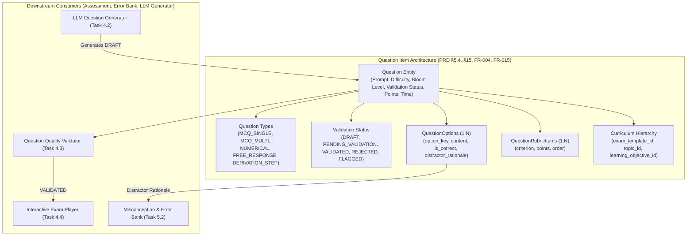
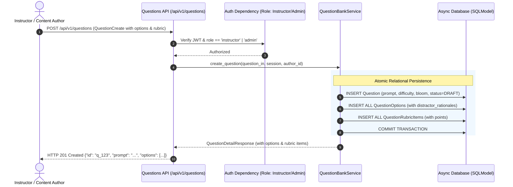

# Task 4.1: Question Bank Schema & Multi-Type Data Models — Conceptual Understanding (Stage 1)

## 1. Visual Architecture

---

## 2. The Physical Analogy

The Multi-Type Question Bank is like a **High-Security National Testing Committee Item Vault**:
> When a board of exam examiners (e.g. Cambridge or College Board) designs questions for an AP Physics or A-Level exam, an item is never just a simple question string and an answer key. Each question dossier (*`Question`*) specifies its cognitive depth (*Bloom's Taxonomy: Application vs Analysis*), target completion time, and difficulty parameter. For multiple-choice questions, every single incorrect option (*Distractor*) is specifically engineered with a detailed diagnostic rationale (*"If a student picks option B, they forgot to convert grams to kilograms"*). For free-response and multi-step derivations, the dossier contains an immutable, step-by-step scoring rubric (*`QuestionRubricItem`*). No question is ever delivered to a student until it has passed formal validation review (*`ValidationStatus.VALIDATED`*).

---

## 3. Why & What

### Why Are We Doing This Task?
Adaptive learning platforms cannot rely solely on basic multiple-choice questions. PRD §5.4, §15, and FR-004 require a rich **Question Lab & Dynamic Item Engine** supporting multiple assessment formats (Single-choice MCQ, Multi-choice MCQ, Numerical answers with tolerances, Free-Response with step-by-step rubrics, and Derivation steps).
PRD Non-Negotiable Constraint #4 mandates:
> *"Generated questions must be validated before student use."*

This task builds the normalized relational database schemas, taxonomy enumerations, and CRUD services that underpin all question generation, validation, exam simulation, and diagnostic misconception tracking.

### What Is the Concept?
1. **Multi-Type Question Modeling:** Flexible data structures supporting 5 distinct item formats:
   - `MCQ_SINGLE`: 1 correct option among 4 choices.
   - `MCQ_MULTI`: Multiple correct options (e.g. select all that apply).
   - `NUMERICAL`: Exact float answer with accepted percentage/absolute tolerance and unit.
   - `FREE_RESPONSE`: Open-ended analytical question graded against rubric items.
   - `DERIVATION_STEP`: Step-by-step mathematical proof verification.
2. **Pedagogical Distractor Rationales:** Each incorrect option in `QuestionOption` stores a `distractor_rationale` describing the exact student misconception (linking directly to Epic 5 Error Bank).
3. **Cognitive Depth & Metadata:** Tagged with Bloom's Taxonomy (`REMEMBER`, `UNDERSTAND`, `APPLY`, `ANALYZE`, `EVALUATE`, `CREATE`), difficulty (`EASY`, `MEDIUM`, `HARD`, `CHALLENGE`), and KaTeX mathematical equation support in prompt and explanations.
4. **Validation Lifecycle (Constraint #4):** Enforces lifecycle states (`DRAFT` $\to$ `PENDING_VALIDATION` $\to$ `VALIDATED` $\to$ `REJECTED`). Unvalidated questions are strictly blocked from student exam sessions.

### What Breaks If We Skip It?
1. **Shallow Assessment:** The platform is restricted to trivial trivia questions rather than rigorous STEM derivations and numerical problem-solving.
2. **Blind Student Failures:** Without distractor rationales, the platform cannot explain *why* a student picked a wrong answer or diagnose their underlying mathematical misconceptions.
3. **Unvalidated LLM Questions Reaching Students:** Without validation status states, hallucinated or unsolvable AI-generated questions could be shown to students, violating PRD Constraint #4.

---

## 4. Abstraction Level Map

| Level | What Lives Here | Current Project Implementation |
|:---|:---|:---|
| **Product / UX** | Item editor, Option cards, Rubric builder, Math preview | Frontend Question Lab & Exam Player |
| **Application** | Question lifecycle orchestration, Eager option loading | `QuestionBankService` (`backend/app/questions/service.py`) |
| **Framework** | FastAPI REST routes, Pydantic V2 validation schemas | `backend/app/questions/router.py`, `schemas.py` |
| **Domain** | Relational SQLModel tables, Enums | `backend/app/questions/models.py` |
| **Storage / DB** | Relational PostgreSQL/SQLite with Foreign Keys & Cascades | `questions`, `question_options`, `question_rubrics` tables |

---

## 5. Mermaid Sequence Diagram

---

## 6. Data Flow Trace-Through

1. **Question Creation:** An instructor or AI generation pipeline submits a question with prompt `Find the velocity v(t) given a(t) = -g`, `question_type: MCQ_SINGLE`, 4 options with distractor rationales, and an explanation.
2. **Validation & Tagging:** `QuestionBankService` validates that `MCQ_SINGLE` has exactly 1 correct option, validates point totals, and assigns `validation_status = DRAFT` or `PENDING_VALIDATION`.
3. **Database Insertion:** `Question`, `QuestionOption`, and `QuestionRubricItem` rows are inserted in a single atomic database transaction.
4. **Eager Loading & Delivery:** When clients call `GET /api/v1/questions/{id}`, the service executes an eager `selectinload` query to load options and rubrics in a single SQL round-trip, eliminating $N+1$ query cascades.
5. **Exam Consumption:** When an exam is assembled, only questions where `validation_status == VALIDATED` and `exam_template_id == active_exam` are queried.

---

## 7. Cognitive Model → Code Mapping

| Cognitive Concept | Mental Model | Code Implementation in This Project | Enforcement / Guardrail |
|:---|:---|:---|:---|
| **Question Item** | "The test problem" | `Question` SQLModel table | Includes Bloom taxonomy, points, KaTeX prompt |
| **Distractor Rationale** | "Why did the student pick this wrong answer?" | `QuestionOption.distractor_rationale` | Feeds Error Bank misconception diagnosis |
| **Scoring Rubric** | "Step-by-step grading criteria" | `QuestionRubricItem` table | Ordered criteria with point allocations |
| **Validation Gate** | "Quality seal before student delivery" | `ValidationStatus.VALIDATED` | Enforces PRD Constraint #4 |

---

## 8. Five Alternative Approaches Compared

| # | Approach | Pros | Cons | Why Option 1 Was Chosen |
|:---|:---|:---|:---|:---|
| **1** | **Normalized Relational Schema with Eager Loading (Chosen)** | Clean foreign keys, indexed queries, distractor rationales, step-by-step rubrics | Requires relational tables | Fulfills PRD §5.4, §15, FR-004, FR-015 with ACID integrity |
| **2** | Single JSON Column for Options & Rubrics | Single database table | Inefficient SQL queries, impossible to join with Error Bank, poor type safety | Disqualified: Degrades analytical querying |
| **3** | Unstructured Markdown Files | Simple text files | No relational constraints, slow search, unindexed | Disqualified: Unsuitable for production assessment engine |
| **4** | MCQ-Only Flat Database Table | Simple schema | Cannot support numerical, free-response, or derivation problems | Disqualified: Fails STEM curriculum requirements |
| **5** | Store Only Question Prompt, Generate Options at Runtime | Saves storage | Uncontrolled hallucinations, non-deterministic exams | Disqualified: Violates PRD Constraint #4 |

---

## 9. Production Rationale & Disaster Scenarios

### Disaster 1: The Multiple Correct Answers MCQ Disaster
> An AI-generated multiple-choice question on calculus derivatives accidentally marks two different options as correct, or marks zero options as correct. A student taking a timed exam becomes frustrated and loses points unfairly. `QuestionBankService` and `QuestionCreate` Pydantic schemas enforce strict validation invariants (e.g. `MCQ_SINGLE` must have exactly 1 correct option).

### Disaster 2: The Unvalidated AI Hallucination Leak
> An automated question generator creates a physics question with an impossible set of initial conditions (e.g. negative mass). If the question bypassed validation status gates and immediately went live, students would be presented with an unsolvable problem. The `ValidationStatus` state machine guarantees that new AI questions enter `DRAFT` or `PENDING_VALIDATION` and cannot be served to students until verified by Task 4.3.

---

## Workflow Checklist
- [x] Question item architecture diagram included.
- [x] Testing committee item vault physical analogy included.
- [x] Why/what/what-breaks explained thoroughly.
- [x] Abstraction level table filled with current project stack.
- [x] Sequence diagram for question creation included.
- [x] Data-flow trace-through completed step-by-step.
- [x] Cognitive model to code mapping table completed.
- [x] 5 alternatives compared.
- [x] 2 concrete disaster scenarios described.
