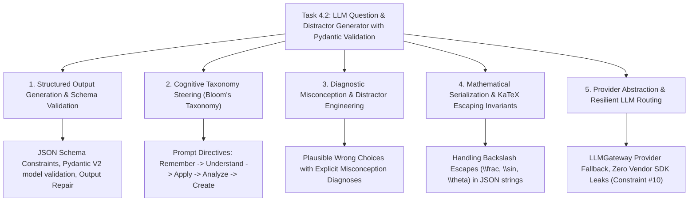

# Task 4.2: LLM Question & Distractor Generator with Pydantic Validation — CS Domain Learning (Stage 3)

## 1. Domain Discovery Map

Task 4.2 touches five core Computer Science, Generative AI, and Psychometric Engineering domains:



---

## 2. Domain Deep Dives

### Domain 1: Structured Output Generation & Schema Validation

**What Is It (Plain English):**  
Standard LLMs produce unstructured natural language. However, an automated software system cannot reliably parse freeform prose. **Structured Output Generation** forces the LLM to return JSON adhering strictly to a JSON Schema compiled from a Pydantic model (`GeneratedQuestionBatchSchema`). The platform's validator strips markdown formatting fences (e.g. ````json ... ````) and verifies all types, required fields, and invariants (PRD FR-010).

**Physical Analogy:**  
A laser-cut metal die casting mold: You pour molten metal (*the LLM's raw tokens*) into a steel mold (*the Pydantic schema*), guaranteeing that every resulting engine part (*the generated question*) has the exact dimensions, bolt holes, and tolerances required for assembly.

---

### Domain 2: Cognitive Taxonomy Steering (Bloom's Taxonomy)

**What Is It (Plain English):**  
If you simply tell an AI *"Generate a physics question,"* it will default to basic trivia or recall 90% of the time (e.g. "What is Newton's First Law?").  
By engineering prompts that explicitly steer the model along **Bloom's Revised Taxonomy**, we instruct the LLM on cognitive depth:
- `REMEMBER`: State definitions, identify formulas.
- `APPLY`: Calculate numerical values using formulas in novel physical scenarios.
- `ANALYZE`: Differentiate, compare, or deduce underlying mechanisms from multi-step graphs or constraints.
- `EVALUATE`: Determine which method is optimal or identify flaws in a given derivation.

---

### Domain 3: Diagnostic Misconception & Distractor Engineering

**What Is It (Plain English):**  
In educational testing, a multiple-choice question is only as good as its wrong options (**distractors**).  
If an incorrect option is completely absurd, students eliminate it without thinking. A **diagnostic distractor** is engineered to catch a specific, known mental error (e.g. calculating vector addition without trigonometry, forgetting gravity, or inverted signs).  
By forcing the LLM to output a `distractor_rationale` for every option, we turn every mistake into a diagnostic teaching moment.

---

### Domain 4: Mathematical Serialization & KaTeX Escaping Invariants

**What Is It (Plain English):**  
In LaTeX, formulas use backslashes (e.g. `\frac{a}{b}`, `\sin\theta`). In JSON, a backslash `\` is a reserved escape character (e.g. `\n`, `\t`). If an LLM emits `\frac`, standard JSON parsers throw an invalid escape sequence syntax error.  
Our `StructuredOutputValidator` sanitizes raw LLM output, ensuring all unescaped LaTeX backslashes are properly escaped before parsing.

---

## 3. Cross-Domain Connections

| Concept A | Concept B | Architectural Connection |
|:---|:---|:---|
| **`distractor_rationale`** | **Error Bank & Misconceptions (Task 5.2)** | When a student chooses an incorrect option in an exam, this rationale is logged directly in their Error Bank. |
| **Grounded Retrieval** | **Vector RAG Engine (Task 3.3)** | Retrieval context feeds textbook definitions to the prompt engine, ensuring 100% syllabus alignment. |
| **`ValidationStatus.PENDING_VALIDATION`** | **Quality Validator (Task 4.3)** | Generated questions are quarantined until mathematically checked by Task 4.3 (Constraint #4). |
| **`LLMGateway`** | **Multi-Provider Resilience (Task 0.4)** | Decouples question generation logic from specific cloud providers (OpenAI, Anthropic, Gemini). |

---

## 4. Concept Evolution Timeline

```markdown
| Level | What You Might Think | Deeper Reality |
|:---|:---|:---|
| **Beginner** | "Prompt ChatGPT to 'make a question' and copy the text." | Fragile, non-deterministic, no schema validation, frequent hallucinations. |
| **Intermediate** | "Ask the LLM for JSON and use `json.loads()`." | Fails when LLM adds markdown fences or broken escape characters. |
| **Advanced** | "Use Pydantic models to parse JSON." | Parses schemas, but questions still lack curriculum grounding and diagnostic distractors. |
| **Expert** | "Integrate grounded RAG context, steer Bloom's taxonomy, generate diagnostic distractor rationales, enforce strict Pydantic invariants, and stage in `PENDING_VALIDATION`." | Psychometrically valid, zero-hallucination dynamic item generation engine. |
```

---

## 5. Vocabulary Reference

| Term | Definition | Codebase Example |
|:---|:---|:---|
| **Item Generation** | Synthesizing formal test questions dynamically using AI. | `QuestionGeneratorService` |
| **Distractor Rationale** | The pedagogical explanation of why a student would pick a particular wrong answer. | `GeneratedOptionSchema.distractor_rationale` |
| **Bloom Level** | The targeted cognitive complexity level of the generated problem. | `BloomTaxonomy.APPLY` |
| **Grounded Synthesis** | Conditioning generation strictly on retrieved textbook excerpts. | `retrieve_grounded_context()` |

---

## 6. "What If" Thought Experiments

### Q1: What happens if the LLM generates a question with 2 correct answers for single-choice MCQ?
> **Answer:** The Pydantic model validator catches that `sum(is_correct) != 1` and raises a validation error. The generator retries or rejects the batch, preventing flawed items from entering the database.

### Q2: What happens if the primary LLM provider (e.g. OpenAI) suffers an outage?
> **Answer:** The `LLMGateway` automatically falls back to secondary configured providers (Anthropic, Gemini, or Mock) without interrupting the question generation service.

### Q3: What if the topic has no ingested textbook documents yet?
> **Answer:** `GroundedRetrievalService` returns an empty context block. The generator gracefully notes that no grounded documents were available and generates from topic metadata, tagging the question appropriately.

### Q4: Can a student encounter a freshly generated question right away?
> **Answer:** Absolutely not. All generated questions enter the database with `validation_status = ValidationStatus.PENDING_VALIDATION` (PRD Non-Negotiable Constraint #4). They are invisible to students until validated by Task 4.3.

---

## Workflow Checklist
- [x] Item generation architecture diagram included.
- [x] Standardized item authoring physical analogy included.
- [x] Deep dives for 5 key CS/AI domains with formulas, analogies, code links, misconceptions, and numbers.
- [x] Cross-domain connection matrix filled.
- [x] Concept evolution timeline documented.
- [x] Vocabulary reference table created.
- [x] 4 comprehensive "What If" scenarios analyzed.
